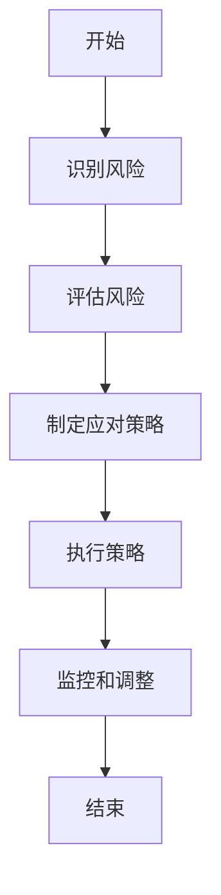
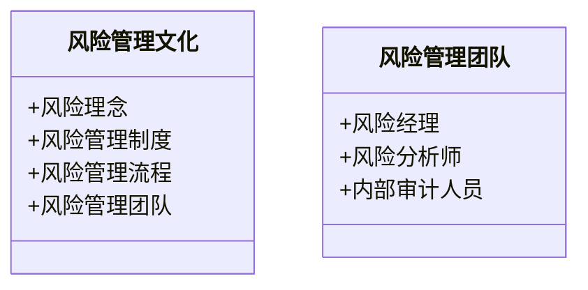
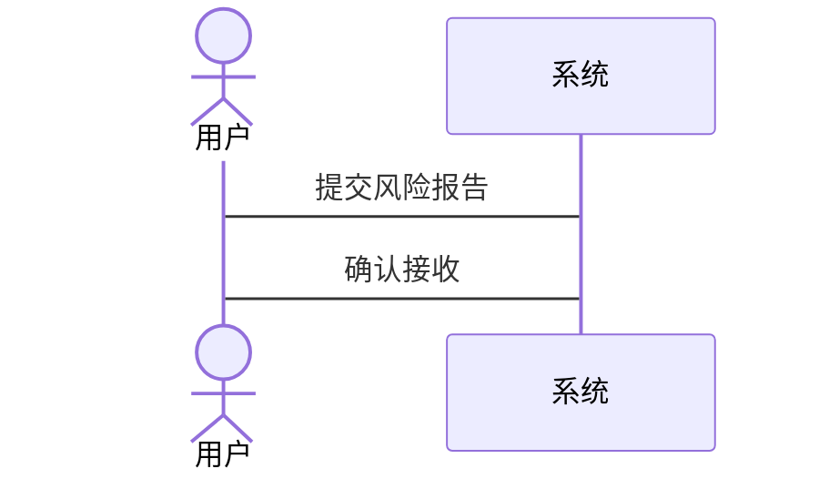

                 


# 彼得林奇如何看待公司的风险管理文化

> 关键词：风险管理、彼得·林奇、企业文化、风险管理文化、企业治理、风险管理方法论

> 摘要：本文探讨了彼得·林奇的风险管理方法论及其对公司风险管理文化的影响。通过分析风险管理文化的核心概念、系统分析、建设与优化、创新与未来趋势，本文展示了如何通过系统化的文化和流程管理来降低企业风险，提升企业绩效。

---

## 引言

### # 第1章: 风险管理文化的核心概念

#### ## 1.1 问题背景与问题描述

##### ### 1.1.1 风险管理文化的重要性

企业风险管理文化是指企业在经营过程中，通过系统化的理念、制度、流程和组织结构来识别、评估和应对各种风险的综合管理方式。它是企业治理的重要组成部分，直接影响企业的绩效和可持续发展。

##### ### 1.1.2 彼得·林奇与风险管理文化的关联

彼得·林奇是全球著名投资家，以其在风险投资中的独特见解而闻名。他的风险管理方法论不仅适用于投资领域，也为企业的风险管理文化提供了宝贵的借鉴。林奇强调，成功的投资不仅仅是对市场的理解，更是对风险的管理和控制。

##### ### 1.1.3 问题解决：风险管理文化如何影响企业绩效

通过建立科学的风险管理文化，企业可以更有效地识别和应对潜在风险，从而在竞争中保持优势。风险管理文化不仅能够降低企业的损失，还能提升企业的整体绩效和长期发展能力。

#### ## 1.2 核心要素与概念结构

##### ### 1.2.1 风险管理文化的定义与特征

风险管理文化是指企业在经营过程中，通过系统化的理念、制度、流程和组织结构来识别、评估和应对各种风险的综合管理方式。其核心特征包括系统性、全员参与、持续改进和与企业战略的紧密结合。

##### ### 1.2.2 核心要素对比表格

| 核心要素 | 描述 |
|----------|------|
| 理念     | 风险管理的核心思想和价值观 |
| 制度     | 风险管理的具体规则和流程 |
| 流程     | 风险管理的操作步骤和方法 |
| 组织结构 | 风险管理的组织架构和职责分配 |

##### ### 1.2.3 实体关系图

```mermaid
erd
actor: 风险管理文化
role: 管理层
role: 风险管理团队
role: 全体员工
```

---

## 正文

### # 第2章: 彼得·林奇的风险管理方法论

#### ## 2.1 核心概念与原理

##### ### 2.1.1 风险管理的核心原理

彼得·林奇的风险管理方法论强调，风险管理不仅仅是对风险的识别和评估，更重要的是通过持续监控和调整来应对风险的变化。他提出了“风险管理是投资决策的核心”的理念。

##### ### 2.1.2 彼得·林奇的独特见解

林奇认为，成功的投资需要在风险和收益之间找到平衡点。他强调了对投资对象的深入了解和持续监控的重要性，以及在市场波动中保持冷静和耐心。

##### ### 2.1.3 方法论的数学模型

以下是林奇提出的风险管理模型：

$$
\text{风险调整后收益} = \text{预期收益} - \text{风险溢价}
$$

其中，风险溢价是根据资产的风险程度确定的。

#### ## 2.2 算法原理与流程图

##### ### 2.2.1 风险评估算法



##### ### 2.2.2 算法实现的 Python 代码

```python
def risk_assessment(risk_factors):
    # 风险评估算法
    risk_score = 0
    for factor in risk_factors:
        if factor > 0.5:
            risk_score += 1
    return risk_score

# 示例
risk_factors = [0.6, 0.4, 0.7]
print(risk_assessment(risk_factors))
```

---

### # 第3章: 风险管理文化的系统分析

#### ## 3.1 领域模型设计

##### ### 3.1.1 领域模型 mermaid 类图



##### ### 3.1.2 系统架构 mermaid 架构图


##### ### 3.1.3 系统接口与交互设计



---

### # 第4章: 风险管理文化的建设

#### ## 4.1 建设过程

##### ### 4.1.1 风险管理理念的建立

企业需要确立风险管理的核心理念，将其融入企业的战略和日常经营中。

##### ### 4.1.2 风险管理制度的完善

制定具体的风险管理制度和流程，确保风险管理的系统化和制度化。

##### ### 4.1.3 风险管理流程的优化

通过优化流程，提高风险管理的效率和效果，确保风险能够在早期被识别和应对。

##### ### 4.1.4 风险管理组织结构的调整

建立专门的风险管理团队，明确职责和权限，确保风险管理工作的有效开展。

#### ## 4.2 优化策略

##### ### 4.2.1 风险管理文化的持续改进

通过不断学习和实践，持续改进风险管理文化，适应不断变化的内外部环境。

##### ### 4.2.2 风险管理文化的创新

引入新的理念和技术，推动风险管理文化的创新，提升风险管理的效率和效果。

---

## 总结

### # 第5章: 风险管理文化的创新与未来趋势

#### ## 5.1 风险管理文化的创新

##### ### 5.1.1 数字化转型中的风险管理

随着数字化转型的推进，风险管理需要更加注重技术的应用，如大数据和人工智能。

##### ### 5.1.2 ESG投资中的风险管理

环境、社会和治理（ESG）投资越来越受到重视，风险管理文化需要适应这种变化。

#### ## 5.2 风险管理文化的未来趋势

##### ### 5.2.1 风险管理文化的全球化

随着全球经济的国际化，风险管理文化也需要具备全球视野，适应不同国家和地区的风险环境。

##### ### 5.2.2 风险管理文化的数字化

未来的风险管理文化将更加依赖数字化工具和技术，提升风险管理的效率和精准度。

---

## 作者

作者：AI天才研究院/AI Genius Institute & 禅与计算机程序设计艺术 /Zen And The Art of Computer Programming

---

### 附录

#### 附录 A: 风险管理文化的相关工具与资源

#### 附录 B: 风险管理文化中的常用术语解释

#### 附录 C: 风险管理文化的实施步骤与 checklist

#### 附录 D: 风险管理文化的成功案例分析

#### 附录 E: 风险管理文化的书籍推荐与拓展阅读

#### 附录 F: 风险管理文化中的法律法规与合规要求

---

通过以上目录结构，我们可以系统地探讨彼得·林奇如何看待公司的风险管理文化，从理论到实践，从分析到应用，全面了解风险管理文化的核心概念、方法论、系统分析、建设与优化、创新与未来趋势，以及总结与展望。

