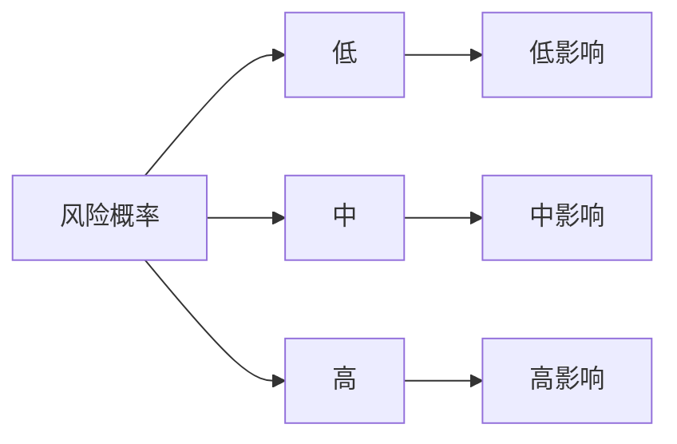

                 


# 彼得林奇如何看待公司的风险管理能力

## 关键词：风险管理能力、彼得林奇、投资理念、风险管理模型、VaR模型、风险评估、风险控制

## 摘要：  
本文深入探讨了彼得·林奇对公司的风险管理能力的看法，并结合风险管理的核心概念、算法原理、系统架构设计以及项目实战，全面分析了风险管理在公司运营中的重要性。通过详细的理论阐述和实际案例分析，文章旨在帮助读者理解如何从彼得·林奇的投资理念中汲取风险管理的智慧，并将其应用于实际的企业风险管理实践中。

---

## 第一章: 风险管理的基本概念与重要性

### 1.1 风险管理的定义与核心要素  
- **风险的定义**：风险是未来可能发生的损失或机会的不确定性。  
- **风险管理的核心要素**：识别、评估、应对、监控和沟通。  
- **风险管理在企业中的作用**：保障企业稳健运营、降低损失、提升决策质量。  


### 1.2 彼得·林奇与风险管理的联系  
- **彼得·林奇的背景介绍**：著名投资家，强调价值投资和风险控制。  
- **彼得·林奇的投资理念**：分散投资、长期持有、关注基本面。  
- **风险管理在彼得·林奇投资策略中的地位**：风险管理是投资成功的关键，通过分散投资降低风险。  

---

## 第二章: 风险管理能力的核心概念

### 2.1 风险管理能力的定义  
- **风险管理能力的内涵**：企业识别、评估和应对风险的能力。  
- **风险管理能力的外延**：包括组织结构、制度流程、技术工具等。  

### 2.2 风险管理的核心模型  
- **风险-收益模型**：通过分析风险与收益的平衡点，制定最优投资策略。  
- **风险矩阵模型**：根据风险概率和影响程度对风险进行分类。  



### 2.3 彼得·林奇的风险管理策略  
- **投资组合的风险分散**：通过投资多样化降低风险。  
- **风险与收益的平衡**：在可接受风险范围内追求最大收益。  
- **风险控制的具体措施**：定期评估投资组合，及时调整以应对市场变化。  

---

## 第三章: 风险管理能力的评估与分析

### 3.1 风险管理能力的评估指标  
- **风险识别能力**：能否准确识别潜在风险。  
- **风险应对能力**：应对风险的策略是否有效。  
- **风险监控能力**：是否持续监控风险并及时调整策略。  

### 3.2 风险管理能力的分析框架  
- **风险来源分析**：市场风险、信用风险、操作风险等。  
- **风险影响分析**：风险对企业财务、运营和声誉的影响。  
- **风险应对策略分析**：预防性措施、控制性措施、补救性措施。  

### 3.3 彼得·林奇对风险管理能力的评价标准  
- **投资组合的风险分散能力**：投资组合是否足够分散以降低风险。  
- **风险与收益的匹配度**：收益是否符合承担的风险水平。  
- **风险管理的可持续性**：风险管理策略是否长期有效。  

---

## 第四章: 风险管理能力的系统分析与架构设计

### 4.1 风险管理系统的总体架构  
- **系统目标**：建立一个高效的风险管理系统，支持企业全面风险管理。  
- **系统功能模块**：风险识别、风险评估、风险应对、风险监控。  
- **系统架构图**：  


### 4.2 风险管理系统的功能设计  
- **风险识别模块**：收集和分析潜在风险信息。  
- **风险评估模块**：量化风险的影响和概率。  
- **风险应对模块**：制定和实施风险应对策略。  

### 4.3 风险管理系统的接口设计  
- **数据输入接口**：接收市场数据、财务数据等。  
- **数据处理接口**：处理和分析数据，生成风险报告。  
- **数据输出接口**：输出风险评估结果和应对建议。  

### 4.4 风险管理系统的交互流程  
- **交互流程图**：  


---

## 第五章: 项目实战——基于VaR模型的风险管理应用

### 5.1 项目背景介绍  
- **项目目标**：通过VaR模型评估投资组合的风险。  
- **项目范围**：选择一组股票和债券，计算其VaR值。  

### 5.2 环境安装与工具准备  
- **环境要求**：Python 3.8及以上版本，安装numpy、pandas、scipy库。  

### 5.3 核心代码实现  

```python
import numpy as np
import pandas as pd
from scipy.stats import norm

# 模拟股票收益率
mu = 0.05
sigma = 0.2
n = 1000
returns = np.random.normal(mu, sigma, n)

# 计算VaR
alpha = 0.05
VaR_level = np.percentile(returns, alpha * 100)
VaR = -VaR_level * 100  # 转换为正数表示

print(f"VaR at {alpha} confidence level: ${VaR:.2f}")
```

### 5.4 代码应用解读与分析  
- **VaR模型**：通过计算特定置信水平下的损失，量化投资组合的风险。  
- **代码实现**：生成随机收益率，计算VaR值，并输出结果。  

### 5.5 实际案例分析  
- **案例解读**：假设一个投资组合的VaR值为-5%，意味着在95%的置信水平下，投资组合的最大潜在损失为5%。  

### 5.6 项目小结  
- **项目总结**：通过VaR模型可以有效量化投资组合的风险，帮助投资者制定更科学的风险管理策略。  

---

## 第六章: 最佳实践与小结

### 6.1 小结  
- 彼得·林奇的风险管理理念强调分散投资和风险控制，这为企业提供了宝贵的借鉴。  
- 通过系统的风险管理架构设计和工具应用，可以显著提升企业的风险管理能力。  

### 6.2 注意事项  
- 风险管理是一个动态过程，需要持续监控和调整。  
- 在实际应用中，应结合企业实际情况选择合适的风险管理模型和工具。  

### 6.3 拓展阅读  
- 建议阅读彼得·林奇的《投资之道》深入理解其投资理念。  
- 推荐学习其他风险管理模型，如CVaR（条件VaR）和蒙特卡洛模拟。  

---

## 作者：AI天才研究院/AI Genius Institute & 禅与计算机程序设计艺术 /Zen And The Art of Computer Programming

