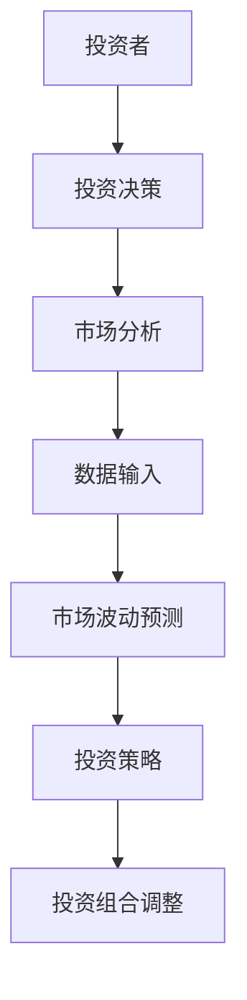
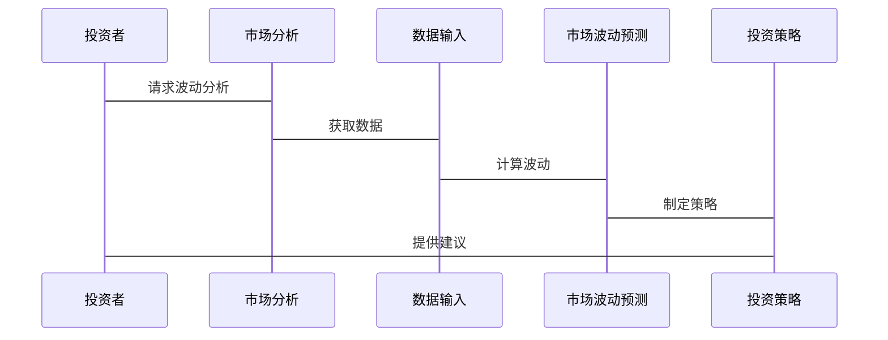

                 


```markdown
# 彼得林奇如何看待市场波动

> 关键词：市场波动、彼得林奇、投资策略、风险管理、价值投资、长期投资、投资者心理

> 摘要：本文将探讨彼得·林奇对市场波动的独特见解，分析他在波动中的投资策略，并结合实际案例，为投资者提供应对市场波动的有效方法。

---

## 第一部分: 彼得·林奇投资理念与市场波动概述

### 第1章: 彼得·林奇与市场波动的背景介绍

#### 1.1 彼得·林奇的生平与投资理念

##### 1.1.1 彼得·林奇的生平简介
彼得·林奇是全球著名的投资经理人，曾管理富达麦哲伦基金，创造了辉煌的投资业绩。他的投资理念强调长期价值和深入研究，反对短期波动的干扰。

##### 1.1.2 林奇的投资哲学与核心理念
林奇认为市场波动是投资机会的源泉，投资者应关注企业的基本面，而非市场的短期波动。他强调分散投资和长期持有，以降低风险并捕捉长期收益。

##### 1.1.3 林奇对市场波动的独特见解
林奇认为市场波动由投资者情绪和市场参与者行为驱动，而非市场 fundamentals。他主张在波动中寻找被低估的股票，利用波动创造收益。

#### 1.2 市场波动的定义与特征

##### 1.2.1 市场波动的定义
市场波动指市场价格的短期上下波动，通常由投资者情绪、市场流动性等因素引起。

##### 1.2.2 市场波动的主要特征
市场波动具有周期性、不一致性、不可预测性和非线性特征，常表现为市场泡沫和恐慌性抛售。

##### 1.2.3 市场波动与投资机会的关系
市场波动为投资者提供了以低价买入优质资产的机会，但需要识别真正的价值。

---

### 第2章: 市场波动的核心概念与分析框架

#### 2.1 市场波动的多维分析

##### 2.1.1 宏观经济因素对市场波动的影响
经济指标（如GDP增长率、利率）对市场波动有显著影响，需结合宏观经济分析。

##### 2.1.2 行业周期对市场波动的驱动
行业周期波动（如科技行业的繁荣与衰退）会影响市场波动，需关注行业趋势。

##### 2.1.3 公司基本面与市场波动的关系
公司基本面（如利润、营收增长）是市场波动的基础，但短期波动可能脱离基本面。

#### 2.2 市场波动的周期性分析

##### 2.2.1 市场波动的周期性特征
市场波动呈现周期性，通常经历恐慌-复苏-繁荣-衰退的循环。

##### 2.2.2 波动周期与投资机会的关联
在波动周期的不同阶段，投资者应采取不同的策略，如在恐慌阶段寻找价值。

##### 2.2.3 波动周期的预测与应对策略
通过技术分析和市场情绪指标预测波动周期，并制定相应的投资策略。

---

### 第3章: 彼得·林奇的市场波动分析方法

#### 3.1 林奇的市场波动分析框架

##### 3.1.1 基于基本面的波动分析
林奇强调基本面分析，认为短期波动不应影响长期投资决策。

##### 3.1.2 基于情绪的波动分析
市场情绪是波动的重要因素，投资者应警惕情绪驱动的决策。

##### 3.1.3 基于技术指标的波动分析
林奇虽不依赖技术指标，但认为技术分析可辅助判断短期趋势。

#### 3.2 林奇的市场波动预测模型

##### 3.2.1 基本面分析模型
通过分析公司基本面预测波动，识别低估股票。

##### 3.2.2 市场情绪指标
使用市场情绪指标（如恐慌指数）辅助判断波动程度。

##### 3.2.3 技术分析工具的结合使用
结合技术分析工具，如相对强弱指数（RSI），辅助判断市场趋势。

---

### 第4章: 应对市场波动的投资策略

#### 4.1 防御性投资策略

##### 4.1.1 防御性投资的核心理念
分散投资、选择防御性行业（如公用事业、消费品）以降低波动风险。

##### 4.1.2 防御性投资的实施步骤
选择稳定性高的行业和公司，保持投资组合的分散性。

##### 4.1.3 防御性投资的典型案例
如在2008年金融危机期间，林奇通过投资防御性股票避免重大损失。

#### 4.2 价值投资策略

##### 4.2.1 价值投资的基本原理
寻找市场价格低于内在价值的股票，长期持有以实现收益。

##### 4.2.2 价值投资在波动市场中的应用
波动市场中，价值投资策略更具优势，因市场波动可能导致价格低估。

##### 4.2.3 林奇的选股标准与方法
林奇注重公司基本面，寻找具有强大财务状况和良好管理的公司。

---

### 第5章: 市场波动中的投资机会

#### 5.1 波动市场中的投资机会识别

##### 5.1.1 市场波动与投资机会
波动市场中，投资者有机会以低价买入优质资产，实现超额收益。

##### 5.1.2 波动市场中的投资机会识别方法
通过基本面分析和市场情绪分析，识别被低估的股票。

---

### 第6章: 投资者心理与市场波动

#### 6.1 投资者心理对市场波动的影响
投资者心理波动（如贪婪和恐惧）是市场波动的重要因素，需理性应对。

#### 6.2 理性决策与非理性决策
投资者应避免情绪化决策，坚持长期投资策略。

---

### 第7章: 数学模型与市场波动

#### 7.1 市场波动的数学模型

##### 7.1.1 波动率的计算
波动率的计算公式为：
$$ \sigma = \sqrt{\frac{1}{n-1} \sum_{i=1}^{n} (x_i - \bar{x})^2} $$
其中，\( \sigma \) 为波动率，\( x_i \) 为资产价格，\( \bar{x} \) 为平均价格，\( n \) 为数据点数。

##### 7.1.2 相关系数的计算
使用皮尔逊相关系数衡量资产之间的相关性：
$$ r = \frac{\sum (x_i - \bar{x})(y_i - \bar{y})}{\sqrt{\sum (x_i - \bar{x})^2 \sum (y_i - \bar{y})^2}} $$
其中，\( r \) 为相关系数，\( x_i \) 和 \( y_i \) 为两资产价格。

---

### 第8章: 系统分析与架构设计方案

#### 8.1 问题场景介绍
市场波动的复杂性要求投资者采取系统化的分析方法，结合基本面和技术分析。

#### 8.2 系统功能设计
##### 8.2.1 领域模型
```mermaid
classDiagram
    class Market
    class Company
    class Investor
    class EconomicFactor
    class MarketMood
    Market <-- Company, Investor
    Market <-- EconomicFactor
    Market <-- MarketMood
```

##### 8.2.2 系统架构


##### 8.2.3 系统接口设计
- 数据接口：获取市场数据和经济指标。
- 用户接口：显示分析结果和投资建议。

##### 8.2.4 系统交互


---

### 第9章: 项目实战

#### 9.1 环境安装
需安装数据分析工具（如Python、Pandas、Matplotlib）和市场数据接口（如Yahoo Finance API）。

#### 9.2 核心实现源代码
```python
import pandas as pd
import numpy as np
import matplotlib.pyplot as plt

# 示例：计算波动率
def calculate_volatility(prices):
    returns = prices.pct_change().dropna()
    volatility = returns.std() * np.sqrt(252)  # 年化波动率
    return volatility

# 数据获取与分析
prices = pd.read_csv('market_data.csv')
volatility = calculate_volatility(prices['Adj Close'])
print(f"年化波动率: {volatility:.2%}")
```

#### 9.3 案例分析
以2008年金融危机为例，分析林奇如何通过价值投资和分散投资应对市场波动。

---

### 第10章: 总结与最佳实践

#### 10.1 最佳实践
- 保持长期视角，避免短期波动干扰。
- 分散投资，降低风险。
- 深入研究，选择优质资产。

#### 10.2 小结
彼得·林奇教会我们在波动中保持冷静，利用波动创造投资机会。

#### 10.3 注意事项
- 波动市场中，情绪化决策可能导致损失。
- 需结合宏观经济和行业趋势分析，制定策略。

#### 10.4 拓展阅读
推荐阅读彼得·林奇的书籍，如《彼得·林奇的成功投资》。

---

作者：AI天才研究院/AI Genius Institute & 禅与计算机程序设计艺术 /Zen And The Art of Computer Programming
```

