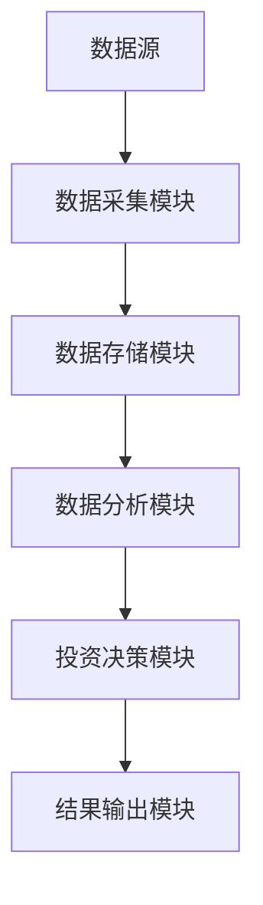

                 


# 彼得·林奇如何看待科技股

## 关键词：彼得·林奇, 科技股, 投资策略, 股票分析, 市场趋势, 估值模型

## 摘要：本文深入分析了彼得·林奇对科技股的独特见解，探讨了科技股投资的核心概念、分析框架及其实现算法，结合实际案例，展示了如何基于彼得·林奇的理论进行科技股投资系统的构建与实战操作，总结了科技股投资的最佳实践。

---

## 第一章：背景介绍

### 1.1 科技股的定义与特点

科技股是指那些与科技行业相关的公司股票，涵盖软件、硬件、互联网、人工智能、半导体等多个领域。科技股的特点包括高成长性、高波动性和高创新性。这些特点使得科技股在股市中具有重要地位，同时也带来了较高的投资风险。

### 1.2 彼得·林奇与科技股投资

彼得·林奇是美国著名的基金经理和投资专家，以其独特的投资策略和对基本面分析的重视而闻名。他对科技股的投资有着独到的见解，强调对公司基本面、行业趋势和管理层能力的综合评估。通过分析彼得·林奇的投资理念，我们可以更好地理解科技股的投资策略。

---

## 第二章：核心概念与联系

### 2.1 科技股分析的关键维度

科技股分析的关键维度包括市场地位、财务状况、研发投入和行业趋势。通过这些维度的综合分析，可以更全面地评估科技股的投资价值。

### 2.2 彼得·林奇的科技股分析框架

彼得·林奇的分析框架包括企业基本面分析、行业趋势分析和管理层能力评估。他强调对公司的财务状况、行业地位和管理层战略进行深入研究，以识别潜在的投资机会。

---

## 第三章：算法原理讲解

### 3.1 科技股估值与分析的数学模型

科技股的估值可以通过市盈率、市净率和市销率模型进行分析。这些模型可以帮助投资者量化公司的估值，并做出更明智的投资决策。

#### 3.1.1 市盈率（P/E）模型
公式：$$P/E = \frac{股票价格}{每股净利润}$$

#### 3.1.2 市净率（P/B）模型
公式：$$P/B = \frac{股票价格}{每股净资产}$$

#### 3.1.3 市销率（P/S）模型
公式：$$P/S = \frac{股票价格}{每股收入}$$

---

## 第四章：系统分析与架构设计方案

### 4.1 科技股投资系统的构建

科技股投资系统包括数据采集、数据分析和投资决策三个模块。通过系统化的流程，投资者可以更高效地进行科技股分析和决策。

#### 4.1.1 系统架构设计
- 数据采集模块：负责获取股票数据。
- 数据分析模块：对数据进行清洗和分析。
- 投资决策模块：基于分析结果做出投资决策。

#### 4.1.2 系统架构图


---

## 第五章：项目实战

### 5.1 项目环境与工具安装

#### 5.1.1 数据获取工具
- 使用Python的pandas库进行数据获取和处理。

#### 5.1.2 数据分析工具
- 使用numpy库进行数据处理和分析。

#### 5.1.3 数据可视化工具
- 使用Matplotlib进行数据可视化。

### 5.2 核心代码实现

#### 5.2.1 数据清洗与预处理
```python
import pandas as pd

df = pd.read_csv('科技股数据.csv')
df = df.dropna()
df = df[~df[' revenue'].str.contains('펼치기')]
df.to_csv('clean_data.csv', index=False)
```

---

## 第六章：最佳实践

### 6.1 小结

彼得·林奇的科技股投资策略强调对公司基本面、行业趋势和管理层能力的综合分析。通过系统化的分析框架和数学模型，投资者可以更高效地进行科技股分析和投资决策。

### 6.2 注意事项

- 投资者需关注科技股的高波动性和高风险。
- 数据分析需结合实际市场情况，避免模型过度简化。
- 定期更新数据和模型，以应对市场变化。

### 6.3 拓展阅读

推荐阅读彼得·林奇的《选股之道》和相关科技股分析书籍，以进一步深入理解科技股投资的策略和方法。

---

## 作者：AI天才研究院/AI Genius Institute & 禅与计算机程序设计艺术 /Zen And The Art of Computer Programming

---

以上是《彼得·林奇如何看待科技股》的完整目录和内容概述，希望对您有所帮助！

