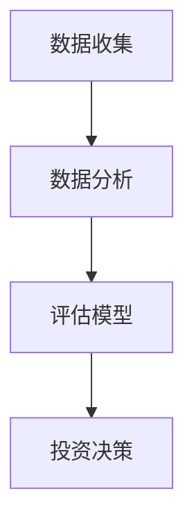
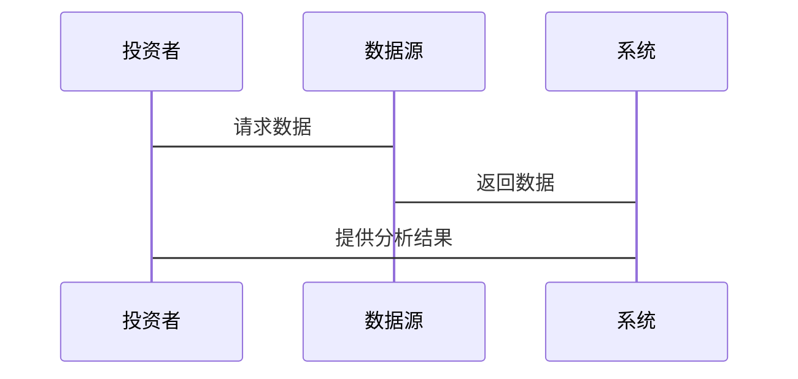

                 


# 彼得林奇如何看待股息

> 关键词：彼得林奇，股息，投资策略，股息率，风险管理，投资分析

> 摘要：本文从彼得林奇的投资理念出发，详细探讨了股息在投资中的重要性，分析了高股息率股票的评估方法和风险管理策略，结合实际案例，提出了系统的股息投资策略。

---

## 第一部分: 股息投资的背景与基础

### 第1章: 股息投资的基本概念

#### 1.1 股息投资的定义与特点

- **股息的定义**：股息是公司分配给股东的利润部分，通常以现金或股票形式发放。
- **股息投资的核心特点**：
  - 稳定性：股息收入通常较为稳定，尤其在经济低迷时提供保障。
  - 长期性：股息投资注重长期收益，而非短期波动。
  - 低风险：相比股票价格波动，股息收入更具可预测性。

- **股息与股票收益的关系**：股息是股票收益的重要组成部分，尤其在市场低迷时，股息收入能弥补资本损失。

#### 1.2 彼得·林奇与股息投资

- **彼得·林奇的背景介绍**：彼得·林奇是美国著名投资专家，以其长期投资策略和基本面分析闻名。
- **彼得·林奇的投资理念**：他强调选择具有稳定增长潜力的公司，注重公司的财务健康和管理团队。
- **股息在彼得·林奇投资体系中的地位**：股息是投资决策的重要考量，尤其是高股息率的股票，通常具有稳定的收益和较低的风险。

### 第2章: 股息投资的核心概念

#### 2.1 股息的本质与分类

- **股息的来源与分配**：公司利润分配给股东，通常在股东大会上决定。
- **股息的类型对比**：
  | 类型 | 特点 |
  |------|------|
  | 现金股息 | 最常见的股息形式，直接增加现金流。 |
  | 股票股息 | 以股票形式发放，增加股东持股数量。 |
  | 特殊股息 | 非常规分配，如出售资产所得。 |

- **股息率的计算公式**：股息率 = （每股股息 / 股票价格）× 100%。

#### 2.2 股息的价值评估

- **股息率与股价的关系**：股息率高通常意味着股价相对较低，反之则较高。
- **股息率的评估标准**：一般认为，股息率在3%-7%之间为合理，过高可能不可持续。
- **股息率与投资回报的数学模型**：
  - 总回报 = 股票价格变化 + 股息收入。
  - 例如：若股票价格从100元跌至90元，但股息收入为5元，则总回报为-5元。

### 第3章: 彼得·林奇的股息投资策略

#### 3.1 股息投资的核心策略

- **高股息率股票的选择标准**：
  - 公司财务健康，利润稳定。
  - 股息支付率合理，通常不超过公司净利润的60%。
  - 股票估值合理，市盈率和市净率处于合理区间。

#### 3.2 股息投资的风险管理

- **股息率与市场波动的关系**：市场波动会影响股息率，需关注宏观经济环境。
- **股息率与公司分红能力的评估**：公司盈利能力和现金流是分红能力的关键。
- **股息率投资的误区与注意事项**：
  - 过高的股息率可能不可持续。
  - 忽略股价波动，股息收入可能不足以弥补资本损失。

---

## 第二部分: 股息投资的系统分析与架构

### 第4章: 股息投资的系统分析

#### 4.1 股息投资的系统架构

- **股息投资的系统模型**：包括数据收集、分析、决策和监控四个模块。
- **股息率评估的系统流程**：数据收集 → 分析 → 评估 → 决策。
- **系统架构图（Mermaid）**：



#### 4.2 股息投资的系统实现

- **系统功能设计**：包括数据收集、分析、评估和监控功能。
- **系统接口设计**：与金融数据源和投资平台的接口对接。
- **系统交互流程（Mermaid）**：



### 第5章: 股息投资的项目实战

#### 5.1 股息投资的环境安装

- **投资工具的选择**：使用Excel或Python进行数据处理。
- **数据源的获取与处理**：通过金融数据库获取历史股息数据。
- **股息率计算的Python代码实现**：

```python
import pandas as pd

# 假设df是股票数据，包含'Close'和'Dividends'列
df['Dividends Rate'] = df['Dividends'] / df['Close'] * 100
```

#### 5.2 股息投资的核心实现

- **股息率的计算与分析**：使用Python对历史股息数据进行分析。
- **股息率的可视化展示**：使用Matplotlib绘制股息率变化图。
- **股息率的动态监控与预警**：设置预警指标，及时提醒投资决策。

### 第6章: 股息投资的最佳实践与小结

#### 6.1 股息投资的注意事项

- **股息率投资的常见误区**：只关注股息率，忽略股价波动。
- **股息率投资的纪律性要求**：定期评估和调整投资组合。
- **股息率投资的长期性与耐心管理**：股息投资需要长期持有，避免频繁交易。

#### 6.2 股息投资的拓展阅读

- **其他投资大师的股息投资观点**：如沃伦·巴菲特对股息投资的看法。
- **股息率与其他投资策略的结合**：如价值投资与股息投资的结合。

---

## 第三部分: 股息投资的总结与展望

### 6.3 股息投资的总结

- **核心内容回顾**：股息是稳定收益的重要来源，彼得·林奇的高股息率策略值得借鉴。
- **实践经验总结**：系统化的股息投资需要数据支持和模型分析，同时注重风险管理。

### 6.4 股息投资的未来展望

- **技术驱动的股息投资**：人工智能和大数据技术将为股息投资提供新的工具和方法。
- **全球化视角下的股息投资**：关注国际市场和跨国公司的股息机会。

---

## 作者：AI天才研究院/AI Genius Institute & 禅与计算机程序设计艺术 /Zen And The Art of Computer Programming

---

通过本文的分析，我们可以看到股息投资在彼得·林奇的投资体系中占据重要地位。股息不仅提供了稳定的收益，还能在市场波动中为投资者提供安全保障。然而，股息投资并非无风险，需要结合公司的财务状况、市场环境和投资目标进行综合评估。未来，随着技术的进步，股息投资将更加智能化和数据化，为投资者提供更多可能性。

