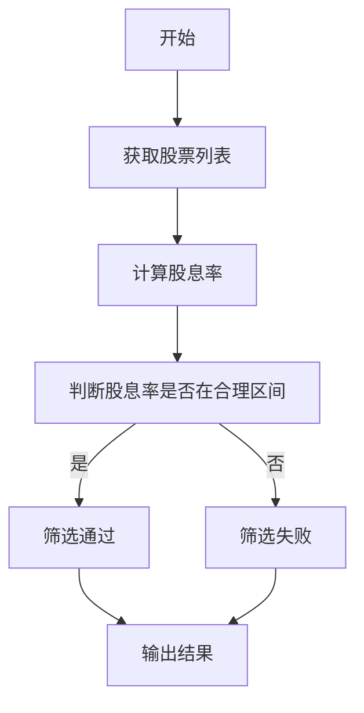
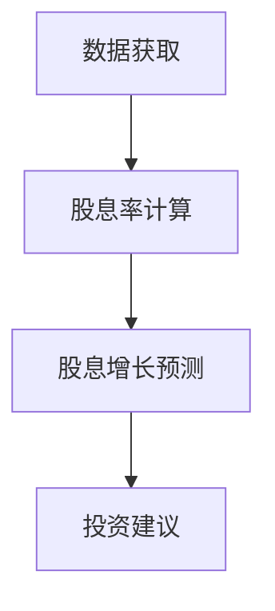
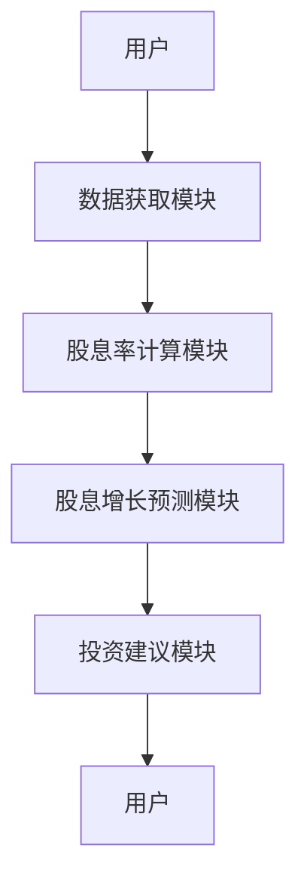

                 


好的，我将按照您的要求创作一篇关于《彼得·林奇如何看待股息投资》的技术博客文章。以下是完整的目录大纲和文章内容：

# 彼得·林奇如何看待股息投资

> 关键词：彼得·林奇，股息投资，股息率，股息增长，投资策略

> 摘要：本文深入探讨了彼得·林奇的股息投资理念，从股息投资的核心概念、数学模型、算法实现，到系统架构设计和项目实战，结合技术视角和投资策略，全面解析股息投资的逻辑与实践。

---

# 第一部分: 股息投资的背景与核心概念

## 第1章: 股息投资的基本概念

### 1.1 股息投资的定义与特点

#### 1.1.1 股息的定义与分类
股息是公司分配给股东的利润部分，通常以现金或股票形式发放。股息可以分为固定股息和变动股息，前者按固定金额分配，后者根据公司利润调整。

#### 1.1.2 股息投资的核心特点
- 稳定性：股息收入为投资者提供稳定的现金流。
- 风险较低：股息投资通常集中在成熟企业，风险相对较低。
- 长期收益：通过复利效应，股息再投资可实现长期收益。

#### 1.1.3 股息投资与资本增值的关系
股息投资不仅追求股息收入，还关注资本增值。通过持有优质股票，投资者可以在获得股息的同时，享受股价上涨的收益。

### 1.2 彼得·林奇的投资理念与方法

#### 1.2.1 彼得·林奇的背景与投资风格
彼得·林奇是美国著名投资经理，以管理麦哲伦基金而闻名。他的投资风格注重基本面分析和长期价值，尤其擅长通过股息率和股息增长筛选优质公司。

#### 1.2.2 林奇对股息投资的独特见解
林奇认为，股息率高的公司通常具有稳定的盈利能力和较强的分红能力。他更倾向于投资那些股息率合理且持续增长的公司。

#### 1.2.3 林奇的股息投资策略
- 筛选股息率合理的公司：通常选择股息率在2%-6%之间的股票。
- 重视股息增长：关注股息连续增长的公司，表明公司盈利稳定。
- 结合基本面分析：评估公司的财务状况、行业地位和成长潜力。

---

## 第2章: 股息投资的核心概念与数学模型

### 2.1 股息率的计算与分析

#### 2.1.1 股息率的定义与计算公式
股息率 = （股息/每股价格）× 100%

#### 2.1.2 股息率的行业对比与筛选方法
不同行业的股息率差异较大，例如公用事业和房地产行业的股息率通常较高。

#### 2.1.3 股息率与股票估值的关系
股息率高并不意味着股票被低估，需结合市盈率、市净率等指标综合评估。

### 2.2 股息增长模型的原理与应用

#### 2.2.1 股息增长模型的数学公式推导
股息增长模型假设股息以固定速率增长，公式为：
$$ D_0 \times (1+g)^n $$

#### 2.2.2 模型的假设条件与限制
- 股息增长率恒定。
- 股票的风险溢价不变。
- 公司盈利持续增长。

#### 2.2.3 股息增长模型在投资决策中的应用
用于预测未来股息收入，评估股票的内在价值。

---

## 第3章: 股息投资的算法与系统分析

### 3.1 股息率筛选算法

#### 3.1.1 算法目标与输入参数
目标：筛选股息率合理的股票。
参数：股息率范围、行业限制、财务指标等。

#### 3.1.2 算法步骤与流程图（Mermaid）



#### 3.1.3 Python实现代码示例

```python
import pandas as pd

def filter_dividend_stocks(stock_data, min_dividend, max_dividend):
    return stock_data[(stock_data['股息率'] >= min_dividend) & 
                      (stock_data['股息率'] <= max_dividend)]

# 示例数据
data = {
    '股票': ['A', 'B', 'C'],
    '股息率': [3%, 2%, 4%]
}
stock_data = pd.DataFrame(data)

# 筛选股息率在2%-4%之间的股票
result = filter_dividend_stocks(stock_data, 2, 4)
print(result)
```

### 3.2 股息增长模型的数学实现

#### 3.2.1 模型公式与变量定义
$$ V = \frac{D_1}{r - g} $$
其中，\( D_1 \) 是下一期股息，\( r \) 是折现率，\( g \) 是股息增长率。

#### 3.2.2 模型的参数估计与优化
通过历史数据回归分析，估算股息增长率和折现率。

#### 3.2.3 模型的验证与评估
使用历史数据验证模型预测的准确性，评估模型的稳健性。

---

## 第4章: 股息投资的系统架构设计

### 4.1 系统功能设计

#### 4.1.1 系统目标与用户需求
目标：构建一个股息投资分析系统，帮助投资者筛选和评估股息投资标的。
需求：用户希望系统能提供股息率筛选、股息增长预测和投资建议功能。

#### 4.1.2 系统功能模块划分
- 数据获取模块：获取股票数据。
- 股息率计算模块：计算股息率。
- 股息增长预测模块：预测未来股息增长。
- 投资建议模块：根据分析结果给出建议。

#### 4.1.3 功能模块之间的交互关系（Mermaid）



### 4.2 系统架构设计

#### 4.2.1 系统架构的分层设计
- 数据层：存储股票数据。
- 业务逻辑层：实现股息率和股息增长的计算。
- 用户界面层：展示分析结果。

#### 4.2.2 系统组件的交互关系（Mermaid）



#### 4.2.3 系统接口设计与数据流分析
- 输入：股票代码、时间范围。
- 输出：股息率、股息增长预测、投资建议。

---

## 第5章: 项目实战与最佳实践

### 5.1 项目实战

#### 5.1.1 环境安装
安装Python和相关库（Pandas、NumPy）。

#### 5.1.2 核心代码实现

```python
import pandas as pd
import numpy as np

def calculate_dividend_growth(stock_data):
    return stock_data['股息率'].pct_change().mean()

# 示例数据
data = {
    '股票': ['A', 'B', 'C'],
    '股息率': [3, 2, 4]
}
stock_data = pd.DataFrame(data)

# 计算股息增长率
growth = calculate_dividend_growth(stock_data)
print(growth)
```

#### 5.1.3 实际案例分析
以具体股票为例，分析其股息率和股息增长情况，评估投资价值。

### 5.2 最佳实践与注意事项

#### 5.2.1 投资分散化
避免将所有资金投入单一股票，分散投资以降低风险。

#### 5.2.2 定期复投
将收到的股息再投资，利用复利效应增加收益。

#### 5.2.3 关注公司基本面
股息投资不仅仅是股息率，还需关注公司的财务状况和行业前景。

### 5.3 小结与展望

总结股息投资的核心理念和算法实现，展望未来可能的发展方向，如结合人工智能进行股息预测。

---

# 作者信息

作者：AI天才研究院/AI Genius Institute & 禅与计算机程序设计艺术 /Zen And The Art of Computer Programming

---

以上是完整的文章目录和内容。如需进一步调整或补充，请随时告知！

