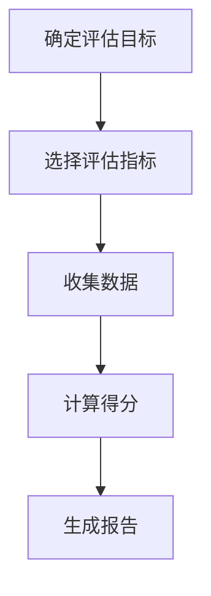
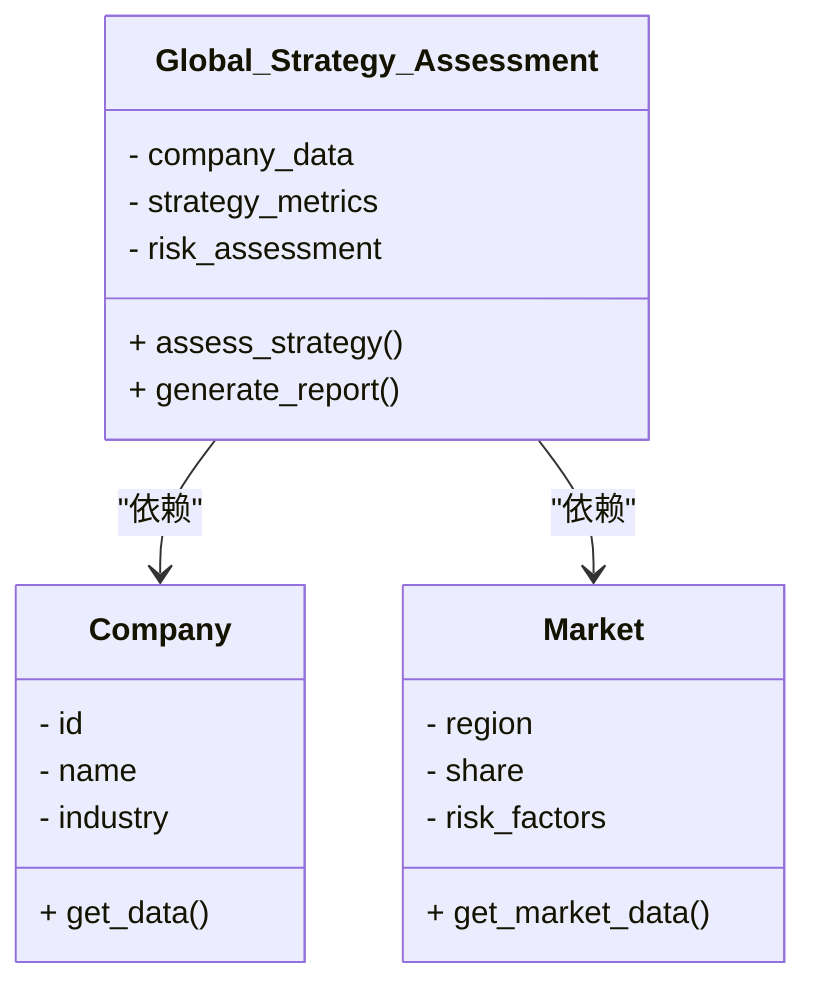

                 


# 彼得林奇如何评估公司的全球化战略执行力

## 关键词：
彼得·林奇, 全球化战略, 战略执行力, 公司评估, 投资分析, 系统设计

## 摘要：
本文详细探讨了彼得·林奇如何评估公司的全球化战略执行力。通过分析全球化战略的核心要素、评估方法和系统设计，结合实际案例，展示如何从投资分析的角度来衡量公司的全球化战略执行能力。文章内容涵盖全球化战略的背景介绍、核心概念、评估指标、系统架构设计和项目实战，为读者提供全面的视角和实用的工具。

---

## 第一部分: 全球化战略执行力的背景与核心概念

### 第1章: 全球化战略执行力的背景介绍

#### 1.1 全球化战略的定义与重要性
##### 1.1.1 全球化战略的定义
全球化战略是指企业在全球范围内配置资源、拓展市场、优化供应链和管理跨国业务的整体规划。其核心在于通过跨国运营实现规模经济、市场覆盖和竞争优势。

##### 1.1.2 全球化战略在现代企业中的重要性
在全球化背景下，企业通过跨国经营可以：
1. 拓展市场，降低市场风险。
2. 利用全球资源优化配置降低成本。
3. 提升品牌影响力和竞争力。
4. 应对全球经济波动和区域风险。

##### 1.1.3 彼得·林奇的分析方法与投资哲学
彼得·林奇以基本面分析著称，他强调通过深入研究公司的财务数据、管理层能力和市场地位来评估其投资价值。他的方法适用于全球化战略评估，重点关注公司全球化执行的效率和效果。

---

#### 1.2 问题背景与问题描述
##### 1.2.1 全球化战略执行中的主要问题
1. **市场进入策略不当**：未能准确把握目标市场的特点。
2. **资源配置不合理**：全球资源整合能力不足。
3. **风险管理不足**：忽视跨国经营中的政治、经济和文化风险。

##### 1.2.2 企业在全球化战略中的挑战与机遇
- **挑战**：跨国竞争、法律法规差异、文化冲突。
- **机遇**：市场规模扩大、成本降低、技术创新。

##### 1.2.3 彼得·林奇的投资视角与问题解决思路
林奇认为，全球化战略的执行能力是公司长期增长的关键。他关注公司管理层的全球化视野、执行力和应对风险的能力。

---

#### 1.3 全球化战略执行力的核心要素
##### 1.3.1 战略目标的设定与分解
全球化战略目标应包括市场扩展、成本优化、品牌建设等方面，并分解为可执行的子目标。

##### 1.3.2 资源分配与组织结构
公司需要建立全球化的组织架构，明确各部门职责，确保资源高效配置。

##### 1.3.3 风险管理与应对策略
制定全面的全球化风险管理框架，包括政治、经济和操作风险。

---

## 第2章: 全球化战略执行力的核心概念与联系

### 2.1 核心概念原理
##### 2.1.1 全球化战略的执行要素
- **市场进入策略**：直接投资、合资合作、特许经营。
- **供应链管理**：全球化采购、本地化生产。
- **品牌建设**：全球统一品牌策略。

##### 2.1.2 彼得·林奇的公司分析框架
林奇的分析框架包括：
1. 财务状况：ROE、净利润率、现金流。
2. 管理层能力：经验、决策能力。
3. 行业地位：市场占有率、竞争优势。

##### 2.1.3 战略执行力的衡量标准
- **目标实现度**：全球化目标达成情况。
- **效率提升**：成本降低、运营效率提高。
- **风险控制**：风险事件数量和影响程度。

---

### 2.2 核心概念对比表格
##### 2.2.1 全球化战略与本地化战略的对比
| 战略类型 | 全球化战略 | 本地化战略 |
|----------|------------|------------|
| 资源配置 | 全球化配置 | 本地化配置 |
| 市场覆盖 | 全球市场 | 单一市场 |
| 管理复杂度 | 高 | 低 |

##### 2.2.2 不同行业全球化战略的异同
| 行业 | 制药 | 汽车 | 零售 |
|------|------|------|------|
| 全球化程度 | 高 | 高 | 中 |
| 关键挑战 | 政策监管 | 供应链 | 文化差异 |

##### 2.2.3 彼得·林奇分析法与其他投资分析方法的对比
| 方法 | 基本面分析 | 技术分析 | 行为分析 |
|------|------------|------------|------------|
| 核心 | 财务数据 | 市场趋势 | 交易心理 |
| 适用性 | 全球化战略评估 | 短期交易 | 投资者心理 |

---

### 2.3 ER实体关系图
```mermaid
erDiagram
    customer[客户] {
        code : string
        name : string
        region : string
    }
    company[公司] {
        id : int
        name : string
        industry : string
    }
    global_strategy[全球化战略] {
        id : int
        company_id : int
        target_market : string
        execution_status : string
    }
    risk_management[风险管理] {
        id : int
        global_strategy_id : int
        risk_type : string
        mitigation_plan : string
    }
    customer --> company : "属于"
    company --> global_strategy : "实施"
    global_strategy --> risk_management : "包含"
```

---

## 第3章: 全球化战略执行力的评估方法

### 3.1 评估指标与关键绩效指标
##### 3.1.1 全球化战略执行的核心指标
- **市场扩展指标**：新市场数量、市场份额。
- **成本优化指标**：单位成本降低率。
- **风险管理指标**：风险事件数量、损失金额。

##### 3.1.2 彼得·林奇的公司分析指标
- **财务指标**：ROE、净利润率、现金流。
- **管理指标**：管理层稳定性、决策效率。

##### 3.1.3 指标权重与优先级排序
通过层次分析法（AHP）确定指标权重，优先级排序为：财务指标（40%）、市场指标（30%）、风险管理指标（20%）、管理指标（10%）。

---

### 3.2 评估模型与流程
##### 3.2.1 全球化战略执行力评估模型


##### 3.2.2 全球化战略执行力评估流程
1. **确定评估目标**：明确评估的目的和范围。
2. **选择评估指标**：根据目标选择关键指标。
3. **收集数据**：通过财务报表、市场报告获取数据。
4. **计算得分**：使用加权评分法计算总分。
5. **生成报告**：撰写评估报告并提出改进建议。

---

## 第4章: 全球化战略执行力的系统分析与架构设计

### 4.1 系统分析与设计
##### 4.1.1 问题场景介绍
某跨国公司希望优化其全球化战略执行能力，需要一个系统化的评估框架。

##### 4.1.2 系统功能设计


##### 4.1.3 系统架构设计


---

## 第5章: 项目实战与案例分析

### 5.1 项目实战
##### 5.1.1 环境安装
安装Python和相关库（Pandas、NumPy）。

##### 5.1.2 核心代码实现
```python
import pandas as pd
import numpy as np

def assess_global_strategy(company_data, market_data):
    # 计算财务指标
    roe = company_data['net_profit'] / company_data['equity']
    # 计算市场份额
    market_share = market_data['revenue'] / market_data['total_revenue']
    # 综合评分
    score = np.mean([roe, market_share])
    return score

# 示例数据
company_data = {'equity': 1000, 'net_profit': 200}
market_data = {'revenue': 500, 'total_revenue': 1000}
score = assess_global_strategy(company_data, market_data)
print(f"全球化战略执行评分为：{score}")
```

---

## 第6章: 总结与最佳实践

### 6.1 小结
全球化战略的执行能力是企业长期发展的关键。通过彼得·林奇的分析框架，结合系统的评估方法，企业可以有效提升其全球化战略执行力。

### 6.2 注意事项
- 确保数据的准确性和完整性。
- 定期更新评估指标和模型。
- 结合企业实际，灵活调整评估方法。

### 6.3 未来展望
随着全球化的深入，全球化战略的评估将更加复杂，需要结合人工智能和大数据技术，构建智能化的评估系统。

### 6.4 拓展阅读
推荐阅读彼得·林奇的《击败市场的投资方法》和迈克尔·波特的《竞争优势》。

---

作者：AI天才研究院/AI Genius Institute & 禅与计算机程序设计艺术 /Zen And The Art of Computer Programming

