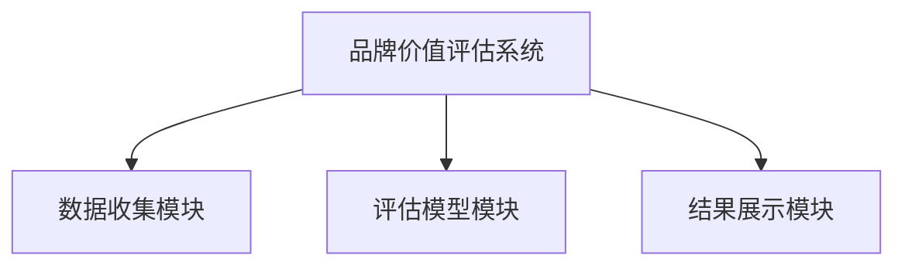

                 


# 彼得林奇如何评估公司的品牌价值

> 关键词：品牌价值，彼得·林奇，投资评估，品牌评估方法，企业价值

> 摘要：本文深入探讨了彼得·林奇如何评估公司的品牌价值，从品牌价值的重要性、核心概念、评估方法到系统架构和项目实战，全面解析了品牌价值评估的理论与实践。通过具体的数学模型和实际案例分析，帮助读者理解如何将品牌价值转化为企业竞争优势。

---

## 第一部分: 品牌价值评估的核心概念

### 第1章: 品德·林奇的品牌价值评估方法

#### 1.1 品牌价值的重要性
- **品牌价值的定义与内涵**：品牌价值是指品牌为企业带来的超额利润能力，反映了品牌在市场中的地位和消费者心中的认知。
- **品牌价值与企业绩效的关系**：品牌价值直接影响企业的市场份额、客户忠诚度和长期盈利能力。
- **品牌价值评估的意义**：准确评估品牌价值有助于企业制定战略决策，优化资源配置。

#### 1.2 彼得·林奇的品牌价值评估方法
- **彼得·林奇的背景与投资理念**：彼得·林奇是富达投资的传奇经理人，以其独特的品牌价值评估方法闻名。
- **品牌价值评估的核心原则**：关注品牌的市场地位、盈利能力、成长潜力和竞争优势。
- **品牌价值评估的步骤与流程**：
  1. 收集市场数据和财务数据。
  2. 分析品牌的核心竞争力。
  3. 评估品牌的市场影响力和潜在价值。
  4. 综合各项指标得出品牌价值。

#### 1.3 品牌价值评估的边界与外延
- **品牌价值与其他资产的关系**：品牌价值是企业无形资产的重要组成部分，与有形资产共同影响企业价值。
- **品牌价值评估的局限性**：品牌价值受市场环境和消费者偏好的影响，具有一定的波动性和不确定性。
- **品牌价值的动态变化**：品牌价值会随着市场变化、竞争态势和企业战略调整而变化。

---

## 第2章: 品牌价值评估的核心要素

### 2.1 品牌价值的核心属性
- **品牌知名度**：品牌在目标市场中的普及程度和认知度。
- **品牌忠诚度**：消费者对品牌的偏好程度和忠诚度。
- **品牌认知度**：消费者对品牌的记忆和理解程度。
- **品牌联想**：消费者对品牌的情感和形象的联想。

### 2.2 品牌价值评估的关键指标
- **市场占有率**：品牌在市场中的份额占比。
- **品牌溢价能力**：品牌产品相对于竞争对手的溢价能力。
- **品牌寿命**：品牌的长期持续发展能力。
- **品牌影响力**：品牌在市场中的影响力和号召力。

### 2.3 品牌价值与财务指标的关系
- **品牌价值对净利润的影响**：品牌溢价能力直接影响企业的净利润。
- **品牌价值对股价的影响**：强大的品牌价值会提升企业的股价。
- **品牌价值对市场扩展的影响**：品牌影响力决定企业的市场扩展能力。

---

## 第3章: 品牌价值评估的数学模型与公式

### 3.1 品牌价值评估的加权评分法
- **加权评分法的定义**：根据品牌的核心要素进行评分，并根据权重计算总品牌价值。
- **加权评分法的公式**
  $$ \text{品牌价值} = \sum (\text{权重}_i \times \text{评分}_i) $$

### 3.2 品牌价值评估的层次分析法
- **层次分析法的定义**：通过构建层次结构，对品牌价值的影响因素进行分析和评估。
- **层次分析法的步骤**：
  1. 构建层次结构。
  2. 建立判断矩阵。
  3. 计算权重。
  4. 综合评估品牌价值。
- **层次分析法的数学公式**
  $$ A = \lambda_{\text{max}} \cdot A_{\text{norm}} $$

### 3.3 品牌价值评估的案例分析
- **案例一：可口可乐的品牌价值评估**：通过加权评分法评估可口可乐的品牌价值。
- **案例二：苹果的品牌价值评估**：分析苹果品牌的核心竞争力和市场影响力。
- **案例三：谷歌的品牌价值评估**：探讨技术品牌的技术优势和全球影响力。

---

## 第4章: 品牌价值评估的系统架构与实现

### 4.1 系统分析与设计
- **系统目标与范围**：开发一个基于彼得·林奇方法的品牌价值评估系统。
- **系统功能模块设计**：
  - 数据收集模块：收集市场数据和财务数据。
  - 评估模型模块：实现加权评分法和层次分析法。
  - 结果展示模块：输出品牌价值评估结果。
- **系统架构图（Mermaid）**



### 4.2 系统实现
- **环境安装**：安装Python和相关库（如numpy、pandas）。
- **核心代码实现**：实现加权评分法和层次分析法的Python代码。

```python
import numpy as np

def calculate_brand_value(scores, weights):
    brand_value = np.dot(scores, weights)
    return brand_value

scores = [8, 7, 9, 6]
weights = [0.4, 0.3, 0.2, 0.1]
brand_value = calculate_brand_value(scores, weights)
print(f"品牌价值: {brand_value}")
```

---

## 第5章: 项目实战与案例分析

### 5.1 环境安装
- 安装必要的Python库：`pip install numpy pandas`

### 5.2 核心代码实现
- **案例分析：可口可乐品牌价值评估**

```python
import numpy as np

def calculate_brand_value(scores, weights):
    brand_value = np.dot(scores, weights)
    return brand_value

scores = [9, 8, 7, 8]
weights = [0.3, 0.25, 0.3, 0.15]
brand_value = calculate_brand_value(scores, weights)
print(f"可口可乐品牌价值: {brand_value}")
```

### 5.3 代码解读与分析
- **代码功能**：实现加权评分法，计算品牌价值。
- **案例分析**：通过实际数据计算可口可乐的品牌价值，并与行业标准对比。

### 5.4 实际案例分析
- **可口可乐与百事可乐对比分析**：比较两家公司的品牌价值和市场表现。

---

## 第6章: 最佳实践与总结

### 6.1 小结
- 品牌价值评估是企业战略决策的重要工具。
- 彼得·林奇的方法提供了一套科学的评估体系。

### 6.2 注意事项
- 数据来源的准确性和完整性。
- 模型的适用性和可调整性。
- 市场环境的变化对品牌价值的影响。

### 6.3 拓展阅读
- 推荐阅读彼得·林奇的《彼得·林奇的成功投资》。
- 学习更多品牌价值评估的方法和工具。

---

## 作者：AI天才研究院 & 禅与计算机程序设计艺术

感谢您的阅读！希望本文对您理解彼得·林奇的品牌价值评估方法有所帮助。

