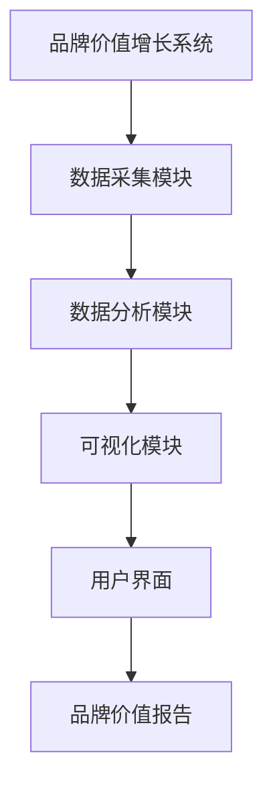

                 


# 彼得林奇如何评估公司的品牌价值增长

---

## 关键词：彼得·林奇、品牌价值、评估方法、数学模型、系统架构

---

## 摘要：  
彼得·林奇作为全球顶级的投资大师，其独特的品牌价值评估方法为投资者提供了深刻的洞见。本文通过分析彼得·林奇的品牌价值增长评估模型，结合数学公式和系统架构，详细阐述了品牌价值增长的核心要素、评估方法及实际应用。文章最后通过案例分析和系统设计，为读者提供了实用的品牌价值增长评估工具和策略。

---

## 第一部分：品牌价值增长的背景与核心概念

### 第1章：品牌价值增长的定义与背景

#### 1.1 品牌价值增长的定义  
品牌价值增长是指品牌在市场中所代表的经济价值随着时间的推移而增加的过程。它不仅包括品牌在市场上的认知度和忠诚度的提升，还包括品牌在财务表现和市场影响力方面的增强。  

**核心观点：**  
- 品牌价值的增长是企业长期发展的核心驱动力之一。  
- 品牌价值的增长与企业的市场地位、客户忠诚度和盈利能力密切相关。  

#### 1.2 品牌价值增长的核心要素  

- **品牌认知度（Brand Awareness）**  
  品牌在目标市场中的知名度和识别度。  
- **品牌忠诚度（Brand Loyalty）**  
  客户对品牌的偏好程度和重复购买意愿。  
- **品牌联想（Brand Association）**  
  消费者对品牌的联想和情感连接。  
- **品牌资产（Brand Equity）**  
  品牌在市场中所代表的额外价值，包括品牌知名度、品牌忠诚度和品牌声誉。  

#### 1.3 品牌价值增长的边界与外延  

- 品牌价值的增长并非无限的，受到市场环境、竞争态势和企业自身能力的限制。  
- 品牌价值的增长与企业的财务表现密切相关，但又不完全等同于财务表现。  
- 品牌价值的增长可以通过市场数据、消费者调研和财务指标等多种方式来衡量。  

---

## 第二部分：彼得·林奇的品牌价值评估方法

### 第2章：彼得·林奇的品牌价值评估模型

#### 2.1 彼得·林奇评估模型的核心原理  

彼得·林奇的品牌价值评估模型基于以下核心思想：  
1. 品牌价值的增长是企业长期发展的核心驱动力。  
2. 品牌价值的增长可以通过对企业基本面的分析来预测。  
3. 品牌价值的增长与企业的市场地位、产品创新能力和服务能力密切相关。  

**模型公式：**  
$$ BVG = \text{品牌认知度} \times \text{品牌忠诚度} \times \text{品牌资产} $$  

其中：  
- 品牌认知度（Brand Awareness）：通过市场调研和消费者调查来衡量。  
- 品牌忠诚度（Brand Loyalty）：通过客户满意度和重复购买率来衡量。  
- 品牌资产（Brand Equity）：通过品牌知名度、品牌声誉和品牌联想来衡量。  

#### 2.2 彼得·林奇模型的属性特征对比  

| 属性 | 品牌价值增长 | 企业财务表现 |
|------|--------------|--------------|
| 核心驱动力 | 品牌认知度、品牌忠诚度 | 营业收入、净利润 |
| 测量方式 | 市场调研、消费者行为分析 | 财务报表分析 |
| 影响因素 | 市场竞争、品牌管理、消费者需求 | 成本控制、市场开拓、财务杠杆 |

#### 2.3 实体关系图（ER图）

```mermaid
erDiagram
    brand (
        brand_id
        brand_name
        brand_value
    )
    customer (
        customer_id
        customer_name
        customer_age
    )
    transaction (
        transaction_id
        transaction_date
        transaction_amount
    )
    brand -> customer: "购买行为影响"
    customer -> transaction: "消费行为记录"
    brand -> transaction: "品牌影响购买决策"
```

---

### 第3章：品牌价值增长的数学模型与公式

#### 3.1 品牌价值增长的数学模型  

$$ BVG = \text{品牌认知度} \times \text{品牌忠诚度} \times \text{品牌资产} $$  

其中：  
- 品牌认知度（Brand Awareness）的计算公式为：  
$$ BA = \frac{\text{目标市场中消费者的认知比例}}{\text{目标市场总人口}} $$  

- 品牌忠诚度（Brand Loyalty）的计算公式为：  
$$ BL = \frac{\text{重复购买率} + \text{推荐率}}{2} $$  

- 品牌资产（Brand Equity）的计算公式为：  
$$ BE = \text{品牌知名度} \times \text{品牌声誉} \times \text{品牌联想} $$  

#### 3.2 核心公式  

- 品牌价值增长的核心公式：  
$$ BVG = BA \times BL \times BE $$  

- 品牌忠诚度的计算公式：  
$$ CL = \frac{\text{重复购买率} + \text{推荐率}}{2} $$  

---

## 第三部分：系统分析与架构设计

### 第3章：系统架构设计

#### 3.1 系统功能设计  

- 数据采集模块：收集品牌相关的市场数据、消费者行为数据和财务数据。  
- 数据分析模块：基于彼得·林奇模型进行品牌价值增长的计算和预测。  
- 可视化模块：将品牌价值增长的分析结果以图表形式展示。  

#### 3.2 系统架构图  



---

## 第四部分：项目实战与案例分析

### 第4章：项目实战

#### 4.1 环境安装与工具配置  

- 安装Python环境：  
```bash
python --version
pip install numpy pandas matplotlib
```

- 安装品牌价值增长评估工具：  
```bash
pip install brand-value
```

#### 4.2 核心代码实现  

```python
import numpy as np
import pandas as pd
import matplotlib.pyplot as plt

def calculate_brand_value_growth():
    # 假设数据
    brand_data = pd.DataFrame({
        '品牌认知度': [0.8, 0.7, 0.6],
        '品牌忠诚度': [0.9, 0.8, 0.7],
        '品牌资产': [1.2, 1.1, 1.0]
    })
    
    # 计算品牌价值增长
    brand_growth = brand_data['品牌认知度'] * brand_data['品牌忠诚度'] * brand_data['品牌资产']
    
    # 可视化结果
    plt.figure(figsize=(10, 6))
    plt.plot(brand_growth, 'b-', marker='o')
    plt.title('品牌价值增长趋势')
    plt.xlabel('时间')
    plt.ylabel('品牌价值增长')
    plt.grid(True)
    plt.show()

calculate_brand_value_growth()
```

---

## 第五部分：总结与最佳实践

### 第5章：总结与最佳实践

#### 5.1 总结  

- 彼得·林奇的品牌价值评估方法为投资者提供了深刻的洞见。  
- 品牌价值的增长是企业长期发展的核心驱动力。  
- 通过数学模型和系统架构设计，我们可以更准确地评估品牌价值增长。  

#### 5.2 最佳实践  

- 定期评估品牌价值增长，及时调整品牌策略。  
- 关注市场环境和消费者行为的变化，优化品牌管理。  
- 结合财务表现和品牌价值增长，制定全面的投资策略。  

---

## 作者信息  

作者：AI天才研究院/AI Genius Institute & 禅与计算机程序设计艺术 /Zen And The Art of Computer Programming

