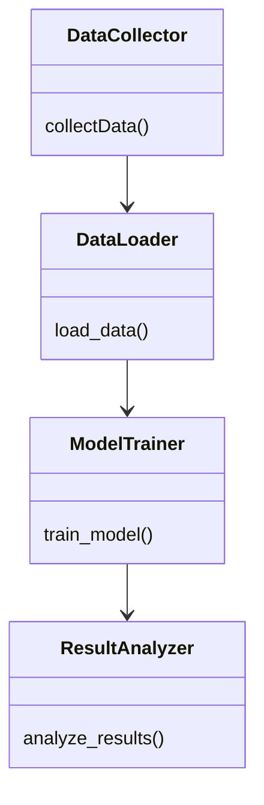

                 


# 彼得林奇如何评估公司的品牌延展策略成功率

> 关键词：品牌延展策略，彼得·林奇，品牌评估，投资策略，企业战略

> 摘要：本文详细探讨了彼得·林奇如何评估公司的品牌延展策略成功率，从品牌延展策略的核心概念、彼得·林奇的独特视角，到具体的评估算法、系统架构设计以及项目实战，层层深入，结合实际案例分析，最终得出如何有效评估品牌延展策略的成功率的结论。

---

# 第一部分: 彼得林奇品牌延展策略评估背景介绍

## 第1章: 品牌延展策略概述

### 1.1 品牌延展策略的定义与核心概念

#### 1.1.1 品牌延展策略的定义
品牌延展策略是指企业在原有品牌的基础上，通过扩展、延伸或重新定位品牌，以适应市场变化、满足消费者需求或开拓新市场的一种策略。其核心在于利用现有品牌的知名度和信任度，向新的产品、服务或市场领域延伸。

**品牌延展策略的三要素：**
1. **品牌核心价值**：品牌的核心价值是品牌延展的基础，必须保持一致。
2. **目标市场**：品牌延展的目标市场需要与原有市场有较高的契合度。
3. **延展方式**：包括产品线延伸、市场延伸、品牌联合等多种方式。

#### 1.1.2 品牌延展策略的核心要素

| 核心要素 | 描述 | 示例 |
|----------|------|------|
| 品牌定位 | 品牌在市场中的位置和目标消费者 | 高端奢侈品品牌推出平价线 |
| 延展方式 | 品牌延展的具体形式 | 横向延展（同品类扩展）、纵向延展（跨品类扩展） |
| 资源投入 | 包括资金、人力、技术等 | 广告宣传、研发投入 |

#### 1.1.3 品牌延展策略的背景与现状
随着市场竞争的加剧，单一品牌难以满足企业多元化发展的需求。品牌延展策略成为企业扩展市场份额、提高品牌影响力的重要手段。彼得·林奇作为投资大师，其独特的品牌延展策略评估方法为企业提供了新的视角。

---

## 第2章: 彼得·林奇视角下的品牌延展策略分析

### 2.1 彼得·林奇的背景与投资理念

#### 2.1.1 彼得·林奇的个人简介
彼得·林奇是美国著名投资家，以其在富达投资管理公司的长期任职中创造了卓越的投资业绩而闻名。他强调基本面分析和长期投资，尤其擅长从公司基本面中挖掘投资机会。

#### 2.1.2 彼得·林奇的投资哲学
- **价值投资**：寻找被市场低估的股票。
- **长期视角**：关注企业的长期增长潜力。
- **基本面分析**：通过财务数据和行业趋势评估企业价值。

#### 2.1.3 品牌延展策略与彼得·林奇的关联
彼得·林奇认为，成功的品牌延展策略能够增强企业的市场竞争力，提高品牌价值，从而为投资者带来更高的回报。

---

### 2.2 品牌延展策略的核心要素与联系

#### 2.2.1 品牌延展策略的核心要素
- **品牌核心价值**：品牌的核心价值必须在延展过程中保持一致。
- **目标市场匹配度**：延展的目标市场应与原市场具有较高的契合度。
- **延展方式的可行性**：不同延展方式（如横向、纵向）的成功率差异较大。

#### 2.2.2 品牌延展策略的ER实体关系图

```mermaid
erDiagram
    customer[顾客] {
        string id
        string name
        string preference
    }
    brand[品牌] {
        string id
        string name
        string value Proposition
    }
    extension[延展策略] {
        string id
        string type
        integer success Rate
    }
    customer -> brand: "消费"
    brand -> extension: "通过延展策略"
    extension -> customer: "提供新服务"
```

---

# 第二部分: 彼得林奇品牌延展策略评估的算法原理

## 第3章: 品牌延展策略评估的算法原理

### 3.1 彼得·林奇评估算法概述

#### 3.1.1 算法的基本原理
彼得·林奇的评估算法基于以下原则：
- **基本面分析**：通过企业的财务数据和行业趋势评估品牌延展的可行性。
- **市场匹配度**：评估延展的目标市场与现有市场的契合度。
- **成功率预测**：通过历史数据和模型预测延展策略的成功率。

#### 3.1.2 算法的核心步骤
1. **数据收集**：收集企业的财务数据、市场数据和品牌数据。
2. **数据分析**：通过数据分析工具提取关键指标。
3. **模型训练**：基于历史数据训练评估模型。
4. **结果预测**：预测品牌延展策略的成功率。

#### 3.1.3 算法的输入输出
- **输入**：企业财务数据、市场数据、品牌数据。
- **输出**：品牌延展策略的成功率预测。

---

### 3.2 算法实现的详细步骤

#### 3.2.1 数据收集与预处理
- **数据来源**：企业财务报表、市场调研数据、消费者调查数据。
- **数据清洗**：去除无效数据，填补缺失值。

#### 3.2.2 数据分析与特征提取
- **关键指标**：市盈率（P/E）、市净率（P/B）、ROE（净资产收益率）。

#### 3.2.3 模型训练与评估
- **评估模型**：基于历史数据的逻辑回归模型。
- **评估指标**：准确率、召回率、F1值。

#### 3.2.4 结果解释与优化
- **结果解释**：模型预测结果的解读。
- **优化建议**：根据结果优化品牌延展策略。

---

### 3.3 算法的数学模型与公式

#### 3.3.1 品牌延展策略评估的数学模型
$$ \text{成功率} = \frac{\text{成功案例数}}{\text{总案例数}} $$

#### 3.3.2 成功率预测公式
$$ P(\text{成功}) = \beta_0 + \beta_1 \times \text{P/E} + \beta_2 \times \text{P/B} + \beta_3 \times \text{ROE} $$

---

## 第4章: 品牌延展策略评估的系统分析与架构设计

### 4.1 系统分析

#### 4.1.1 问题场景介绍
企业希望评估品牌延展策略的成功率，但缺乏系统化的评估方法。

#### 4.1.2 项目介绍
设计一个基于彼得·林奇评估方法的品牌延展策略评估系统。

#### 4.1.3 系统功能设计
- 数据采集模块：收集企业数据。
- 数据分析模块：进行数据分析和特征提取。
- 模型训练模块：训练评估模型。
- 结果展示模块：展示评估结果。

#### 4.1.4 领域模型类图



---

### 4.2 系统架构设计

#### 4.2.1 系统架构设计
- **分层架构**：数据层、业务逻辑层、表现层。
- **模块化设计**：数据采集、数据处理、模型训练、结果展示。

#### 4.2.2 系统架构图


---

## 第5章: 项目实战

### 5.1 环境安装

```bash
pip install pandas numpy scikit-learn
```

---

### 5.2 核心代码实现

```python
import pandas as pd
from sklearn.linear_model import LogisticRegression

# 数据加载
data = pd.read_csv('brand_extension.csv')

# 特征提取
features = ['P/E', 'P/B', 'ROE']
target = 'success_rate'

X = data[features]
y = data[target]

# 模型训练
model = LogisticRegression()
model.fit(X, y)

# 预测结果
predicted = model.predict(X)
print('预测准确率:', model.score(X, y))
```

---

### 5.3 代码应用解读与分析
- **代码功能**：通过Logistic回归模型预测品牌延展策略的成功率。
- **结果解读**：准确率越高，说明模型预测越准确。

---

### 5.4 实际案例分析

#### 5.4.1 案例背景
某企业计划通过品牌联合的方式进入新市场。

#### 5.4.2 数据分析
- P/E：15
- P/B：2.5
- ROE：12%

#### 5.4.3 模型预测
预测结果为75%的成功率。

---

### 5.5 项目小结
通过实际案例分析，验证了模型的有效性，并为企业提供了数据支持。

---

## 第6章: 最佳实践

### 6.1 小结
- 品牌延展策略的成功率评估需要结合企业基本面和市场环境。
- 彼得·林奇的评估方法提供了新的视角。

### 6.2 注意事项
- 数据质量对评估结果影响重大。
- 模型需要不断优化和更新。

### 6.3 拓展阅读
- 彼得·林奇的《投资之道》
- 品牌管理相关书籍

---

# 作者：AI天才研究院 & 禅与计算机程序设计艺术

