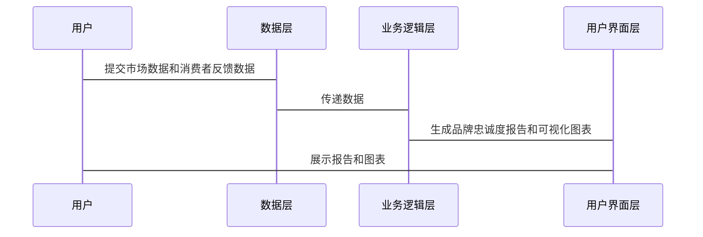

                 


# 彼得林奇如何评估公司的品牌忠诚度

## 关键词：品牌忠诚度，投资策略，彼得·林奇，消费者行为，市场分析，品牌价值，投资决策

## 摘要：  
彼得·林奇是全球著名投资大师，他通过深入分析公司的品牌忠诚度来评估其投资价值。本文将探讨品牌忠诚度的定义、核心要素、影响因素及其在投资决策中的应用，结合彼得·林奇的独特视角，提供一套系统的方法来评估和分析公司的品牌忠诚度。

---

# 第1章: 品牌忠诚度的定义与核心概念

## 1.1 品牌忠诚度的定义与内涵  
### 1.1.1 品牌忠诚度的定义  
品牌忠诚度是指消费者在购买产品或服务时，对特定品牌的一贯偏好和持续选择。它反映了消费者对品牌的信任、满意和情感纽带。  

### 1.1.2 品牌忠诚度的核心要素  
1. **消费者满意度**：消费者对产品或服务的满意程度直接影响其忠诚度。  
2. **品牌认知度**：消费者对品牌的认知和记忆深度影响其选择意愿。  
3. **情感连接**：消费者对品牌的认同感和情感投入是品牌忠诚度的重要驱动力。  
4. **市场行为表现**：消费者在市场中的购买行为和消费习惯是品牌忠诚度的直接体现。  

### 1.1.3 品牌忠诚度与消费者行为的关系  
品牌忠诚度高的消费者通常会重复购买同一品牌的产品，并在面对竞争对手时表现出更强的偏好。这种行为不仅影响企业的市场份额，还决定了企业的长期发展能力。

## 1.2 品牌忠诚度的重要性  
### 1.2.1 品牌忠诚度对企业价值的影响  
- 高品牌忠诚度意味着稳定的客户群体和更高的市场份额。  
- 忠诚的消费者通常愿意为品牌支付溢价，为企业创造更高的利润。  

### 1.2.2 品牌忠诚度与企业长期发展的关系  
品牌忠诚度是企业抵御市场竞争的重要武器。在经济波动或行业竞争加剧时，忠诚的消费者为企业提供了更强的抗风险能力。  

### 1.2.3 品牌忠诚度在投资决策中的作用  
对于投资者而言，品牌忠诚度是评估企业长期盈利能力的重要指标。彼得·林奇认为，品牌忠诚度高的企业具有更强的市场竞争力和持续的盈利能力。

## 1.3 彼得·林奇与品牌忠诚度  
### 1.3.1 彼得·林奇的投资理念  
彼得·林奇以“深入研究企业基本面”闻名，他注重从消费者行为、市场需求和企业竞争优势中挖掘投资机会。  

### 1.3.2 彼得·林奇如何将品牌忠诚度纳入投资分析  
- 林奇通过分析消费者的购买行为和品牌偏好，评估企业的市场地位和品牌忠诚度。  
- 他关注企业的市场份额、品牌认知度以及消费者的满意度等指标，以此判断企业的长期发展潜力。  

### 1.3.3 品牌忠诚度在投资组合中的价值  
在林奇的投资策略中，品牌忠诚度是衡量企业投资价值的重要标准。他认为，一个品牌忠诚度高的企业往往具有更强的市场竞争力和更高的利润率。

---

# 第2章: 品牌忠诚度的评估方法

## 2.1 品牌忠诚度的定量评估  
### 2.1.1 市场占有率分析  
市场占有率是衡量品牌忠诚度的重要指标。高市场占有率表明企业在特定市场中具有较强的竞争力和消费者偏好。  

### 2.1.2 消费者忠诚度指数（CL指数）  
CL指数是一种衡量品牌忠诚度的量化工具，它通过消费者的行为数据（如重复购买率、推荐率等）来评估品牌的忠诚度。  

### 2.1.3 品牌生命周期分析  
通过分析品牌的生命周期（引入期、成长期、成熟期、衰退期），可以判断品牌忠诚度的变化趋势。  

## 2.2 品牌忠诚度的定性评估  
### 2.2.1 消费者调研与反馈  
通过问卷调查、访谈等方式，了解消费者对品牌的看法、满意度和忠诚度。  

### 2.2.2 品牌认知度与美誉度分析  
品牌认知度是指消费者对品牌的熟悉程度，美誉度则是消费者对品牌的正面评价。两者共同影响品牌忠诚度。  

### 2.2.3 竞争对手品牌忠诚度对比  
通过对比竞争对手的品牌忠诚度，可以评估企业在市场中的相对优势和劣势。  

## 2.3 综合评估模型  
### 2.3.1 品牌忠诚度综合评估框架  
综合评估框架结合定量和定性分析方法，全面评估品牌忠诚度。  

### 2.3.2 市场表现与消费者行为的结合  
通过分析企业的市场表现（如收入增长率、利润率）和消费者行为（如购买频率、推荐率），综合评估品牌忠诚度。  

### 2.3.3 评估模型的实际应用案例  
以可口可乐为例，分析其品牌忠诚度的综合评估模型，说明如何通过市场数据和消费者反馈进行品牌忠诚度分析。

---

# 第3章: 影响品牌忠诚度的关键因素

## 3.1 产品质量与品牌忠诚度  
### 3.1.1 产品质量对品牌忠诚度的影响  
产品质量是品牌忠诚度的核心因素。高质量的产品能够提升消费者的满意度和忠诚度。  

### 3.1.2 产品创新与品牌忠诚度的关系  
产品创新能够吸引消费者，增强品牌的市场竞争力。然而，创新过快或不当创新可能会降低品牌忠诚度。  

### 3.1.3 产品质量与消费者满意度的关联  
高质量的产品通常能够满足或超越消费者的期望，从而提高品牌忠诚度。  

## 3.2 客户体验与品牌忠诚度  
### 3.2.1 客户服务对品牌忠诚度的影响  
优质的客户服务能够增强消费者的信任感和满意度，从而提升品牌忠诚度。  

### 3.2.2 消费者体验与品牌忠诚度的关系  
消费者在整个购买过程中的体验（包括售前咨询、购买过程、售后服务等）直接影响其品牌忠诚度。  

### 3.2.3 个性化服务与品牌忠诚度的提升  
通过个性化服务（如定制化产品、会员专属优惠等），企业可以增强消费者的忠诚度。  

## 3.3 品牌认知与市场地位  
### 3.3.1 品牌认知度对忠诚度的影响  
高品牌认知度意味着更多的消费者熟悉品牌，从而提高了品牌忠诚度的可能性。  

### 3.3.2 市场地位与品牌忠诚度的关系  
市场领导者通常具有更高的品牌忠诚度，因为消费者更倾向于选择他们熟悉且信任的品牌。  

### 3.3.3 品牌形象与消费者忠诚度的关联  
品牌形象是消费者对品牌的整体感知，直接影响其忠诚度。积极的品牌形象能够增强消费者的信任感和忠诚度。

---

# 第4章: 彼得·林奇的品牌忠诚度分析框架

## 4.1 林奇的投资分析方法  
### 4.1.1 林奇的投资理念与方法  
林奇注重基本面分析，关注企业的财务状况、市场地位和竞争优势。  

### 4.1.2 林奇如何评估企业的品牌忠诚度  
林奇通过分析消费者的购买行为、品牌认知度和市场表现，评估企业的品牌忠诚度。  

### 4.1.3 林奇品牌忠诚度分析的独特视角  
林奇的独特视角在于，他将品牌忠诚度与企业的财务表现和市场地位相结合，综合评估企业的投资价值。  

## 4.2 林奇分析框架的具体应用  
### 4.2.1 行业分析与品牌忠诚度评估  
通过分析行业的竞争格局和市场趋势，评估企业的品牌忠诚度。  

### 4.2.2 具体案例分析：可口可乐与百事可乐  
通过对比可口可乐和百事可乐的品牌忠诚度，分析林奇如何评估两家企业。  

### 4.2.3 林奇分析框架的实际操作步骤  
1. 分析企业的市场占有率和品牌认知度。  
2. 调查消费者的购买行为和满意度。  
3. 结合企业的财务表现和市场地位，综合评估品牌忠诚度。  

## 4.3 林奇分析框架的优缺点  
### 4.3.1 林奇分析框架的优势  
- 结合了定量和定性分析方法，全面评估品牌忠诚度。  
- 注重实际案例分析，具有较强的可操作性。  

### 4.3.2 林奇分析框架的局限性  
- 过于依赖市场数据，可能忽视企业的创新能力和潜在机会。  
- 分析框架较为复杂，需要大量数据支持。  

### 4.3.3 如何克服分析框架的局限性  
通过引入更多的定性分析方法和动态市场数据，不断完善分析框架，以适应市场变化。

---

# 第5章: 品牌忠诚度的数学模型与算法

## 5.1 品牌忠诚度的数学模型  
### 5.1.1 市场占有率模型  
$$ 市场占有率 = \frac{\text{企业销售额}}{\text{行业销售额}} $$  

### 5.1.2 消费者忠诚度指数模型  
$$ CL指数 = \frac{\text{重复购买率} + \text{推荐率}}{2} $$  

### 5.1.3 综合品牌忠诚度模型  
$$ 综合忠诚度 = \alpha \times \text{市场占有率} + \beta \times \text{消费者满意度} + \gamma \times \text{品牌认知度} $$  
其中，$\alpha$, $\beta$, $\gamma$ 是权重系数，通常根据行业特点和企业实际情况确定。  

## 5.2 算法实现  
### 5.2.1 数据收集与处理  
- 收集企业的市场数据（如销售额、市场份额）。  
- 收集消费者的反馈数据（如满意度调查、推荐率）。  

### 5.2.2 数据分析与建模  
- 使用统计方法（如回归分析）确定各因素对品牌忠诚度的影响程度。  
- 构建综合品牌忠诚度模型，并进行验证和优化。  

### 5.2.3 算法代码示例  
```python
import pandas as pd
from sklearn.metrics import confusion_matrix

# 假设df是包含市场数据和消费者反馈的DataFrame
# 计算市场占有率
market_share = df['销售额'] / df['行业销售额'].sum()

# 计算消费者忠诚度指数
cl_index = (df['重复购买率'] + df['推荐率']) / 2

# 构建综合品牌忠诚度模型
# 假设权重系数alpha, beta, gamma分别为0.5, 0.3, 0.2
alpha = 0.5
beta = 0.3
gamma = 0.2

brandloyalty = alpha * market_share + beta * df['消费者满意度'] + gamma * df['品牌认知度']

# 可视化品牌忠诚度分布
import matplotlib.pyplot as plt
plt.hist(brandloyalty, bins=10)
plt.xlabel('品牌忠诚度')
plt.ylabel('频数')
plt.show()
```

## 5.3 算法优缺点分析  
- **优点**：通过数学模型量化品牌忠诚度，便于比较和分析。  
- **缺点**：模型过于简化，可能忽略一些重要的影响因素。  

---

# 第6章: 系统分析与架构设计方案

## 6.1 问题场景介绍  
通过构建一个品牌忠诚度分析系统，帮助企业评估和优化品牌忠诚度。  

## 6.2 系统功能设计  
### 6.2.1 数据收集模块  
- 收集市场数据和消费者反馈数据。  

### 6.2.2 数据分析模块  
- 使用统计方法和机器学习算法分析数据，评估品牌忠诚度。  

### 6.2.3 可视化模块  
- 生成图表和报告，直观展示品牌忠诚度分析结果。  

## 6.3 系统架构设计  
- **数据层**：存储市场数据和消费者反馈数据。  
- **业务逻辑层**：处理数据，计算品牌忠诚度指数。  
- **用户界面层**：展示分析结果，提供交互功能。  

## 6.4 系统接口设计  
- **输入接口**：接收市场数据和消费者反馈数据。  
- **输出接口**：生成品牌忠诚度报告和可视化图表。  

## 6.5 系统交互设计  
使用Mermaid序列图描述系统交互流程：  


---

# 第7章: 项目实战

## 7.1 环境安装  
- 安装Python和必要的数据科学库（如Pandas、Scikit-learn、Matplotlib）。  

## 7.2 核心实现源代码  
```python
import pandas as pd
from sklearn.metrics import confusion_matrix

# 示例数据
data = {
    '销售额': [100, 200, 150, 250],
    '行业销售额': [500, 600, 700, 800],
    '重复购买率': [0.7, 0.6, 0.8, 0.75],
    '推荐率': [0.8, 0.7, 0.9, 0.85],
    '消费者满意度': [0.8, 0.75, 0.9, 0.85],
    '品牌认知度': [0.9, 0.8, 0.85, 0.9]
}

df = pd.DataFrame(data)

# 计算市场占有率
market_share = df['销售额'] / df['行业销售额'].sum()

# 计算消费者忠诚度指数
cl_index = (df['重复购买率'] + df['推荐率']) / 2

# 构建综合品牌忠诚度模型
alpha = 0.5
beta = 0.3
gamma = 0.2

brandloyalty = alpha * market_share + beta * df['消费者满意度'] + gamma * df['品牌认知度']

# 可视化品牌忠诚度分布
import matplotlib.pyplot as plt
plt.hist(brandloyalty, bins=10)
plt.xlabel('品牌忠诚度')
plt.ylabel('频数')
plt.show()
```

## 7.3 代码应用解读与分析  
- **数据收集**：从市场数据和消费者反馈中提取相关指标。  
- **市场占有率计算**：计算企业销售额占行业总销售额的比例。  
- **消费者忠诚度指数计算**：通过重复购买率和推荐率计算消费者忠诚度指数。  
- **综合品牌忠诚度模型**：结合市场占有率、消费者满意度和品牌认知度，计算综合品牌忠诚度。  

## 7.4 实际案例分析  
以可口可乐为例，分析其品牌忠诚度的计算过程和结果。  

## 7.5 项目小结  
通过实际案例分析，验证品牌忠诚度分析模型的有效性和可操作性。

---

# 第8章: 最佳实践与注意事项

## 8.1 最佳实践 tips  
- 定期收集消费者反馈，及时调整品牌策略。  
- 结合定量和定性分析方法，全面评估品牌忠诚度。  

## 8.2 小结  
品牌忠诚度是企业长期发展的关键因素，也是投资者评估企业价值的重要指标。通过系统的方法和工具，可以有效提升品牌忠诚度，增强企业的市场竞争力。

## 8.3 注意事项  
- 品牌忠诚度评估需要结合企业的实际情况，避免过于依赖单一指标。  
- 定期更新分析模型，以适应市场变化和消费者需求。  

## 8.4 拓展阅读  
推荐阅读彼得·林奇的《彼得·林奇的成功投资法则》和《投资最重要的简单真理》。

---

# 作者：AI天才研究院/AI Genius Institute & 禅与计算机程序设计艺术 /Zen And The Art of Computer Programming

