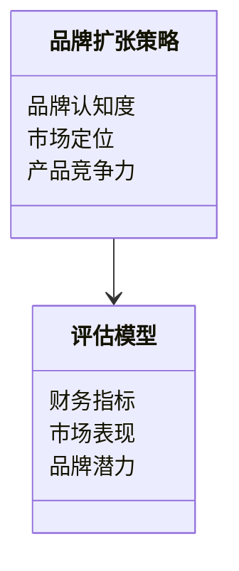

                 

# 彼得林奇如何评估公司的品牌扩张策略

> 关键词：彼得林奇，品牌扩张，投资策略，公司评估，SWOT分析，财务指标

> 摘要：本文深入探讨了彼得林奇如何评估公司的品牌扩张策略。通过分析品牌扩张的核心概念、评估模型、系统设计以及实际案例，本文详细解读了彼得林奇的投资理念和方法。内容涵盖品牌扩张的定义与重要性、核心要素、评估模型的数学公式、系统架构设计、项目实战案例以及最佳实践。

---

# 第一部分: 彼得林奇品牌扩张策略的背景与基础

## 第1章: 品牌扩张的定义与重要性

### 1.1 品牌扩张的核心概念
#### 1.1.1 品牌扩张的定义
品牌扩张是指企业在现有品牌的基础上，通过推出新产品、进入新市场或扩展业务范围，以提升品牌影响力和市场占有率的过程。

#### 1.1.2 品牌扩张的重要性
品牌扩张可以帮助企业扩大市场份额、增强品牌认知度、提高盈利能力，并为公司创造长期价值。

#### 1.1.3 品牌扩张的边界与外延
品牌扩张的边界包括市场容量、企业资源和竞争环境。外延则包括多元化、国际化和产品线扩展。

### 1.2 彼得林奇的分析方法
#### 1.2.1 彼得林奇的投资理念
彼得林奇以基本面分析和长期投资著称，注重公司基本面和管理团队的能力。

#### 1.2.2 彼得林奇的公司分析框架
彼得林奇的分析框架包括财务指标、市场定位、竞争优势和管理层能力。

#### 1.2.3 彼得林奇的品牌扩张评估标准
彼得林奇关注品牌扩张的可持续性、财务健康和市场潜力。

---

## 第2章: 品牌扩张的核心要素

### 2.1 品牌扩张的关键因素
#### 2.1.1 品牌认知度
品牌认知度是品牌扩张的基础，直接影响消费者的购买决策。

#### 2.1.2 市场定位
准确的市场定位可以帮助企业在竞争中占据优势地位。

#### 2.1.3 产品竞争力
产品竞争力是品牌扩张的核心，决定了品牌的市场表现和盈利能力。

### 2.2 品牌扩张的驱动因素
#### 2.2.1 市场需求
市场需求是品牌扩张的根本动力，决定了品牌扩张的方向和潜力。

#### 2.2.2 竞争环境
竞争环境影响品牌扩张的策略和风险，需要综合考虑行业趋势和竞争对手的动向。

#### 2.2.3 公司资源
公司资源是品牌扩张的物质基础，包括资金、技术和人力资源。

---

## 第3章: 彼得林奇的评估模型

### 3.1 评估模型的核心原理
#### 3.1.1 基于财务指标的评估
通过分析企业的财务指标，如收入增长率、利润率和资产负债率，评估品牌扩张的可行性。

#### 3.1.2 基于市场表现的评估
通过分析市场份额、品牌忠诚度和消费者满意度，评估品牌扩张的市场表现。

#### 3.1.3 基于品牌潜力的评估
通过分析品牌延伸的潜力、目标市场和竞争优势，评估品牌扩张的长期价值。

### 3.2 评估模型的数学公式
#### 3.2.1 市盈率模型
$$ P/E = \frac{Market\ Price}{Earnings\ Per\ Share} $$

#### 3.2.2 市净率模型
$$ P/B = \frac{Market\ Price}{Book\ Value\ Per\ Share} $$

### 3.3 案例分析
#### 3.3.1 可口可乐的品牌扩张策略
可口可乐通过多元化产品线和国际化市场扩展，成功实现了品牌扩张。

#### 3.3.2 迪士尼的品牌扩张实践
迪士尼通过动画电影、主题公园和衍生产品，成功实现了品牌价值的提升。

---

# 第二部分: 品牌扩张策略的系统分析与架构设计

## 第4章: 系统分析与功能设计

### 4.1 问题场景介绍
#### 4.1.1 品牌扩张中的常见问题
包括市场需求波动、竞争压力和资源分配问题。

#### 4.1.2 品牌扩张的系统目标
通过系统化的方法，优化品牌扩张策略，提升品牌价值和市场竞争力。

### 4.2 领域模型设计

---

## 第5章: 系统架构设计

### 5.1 系统架构设计

