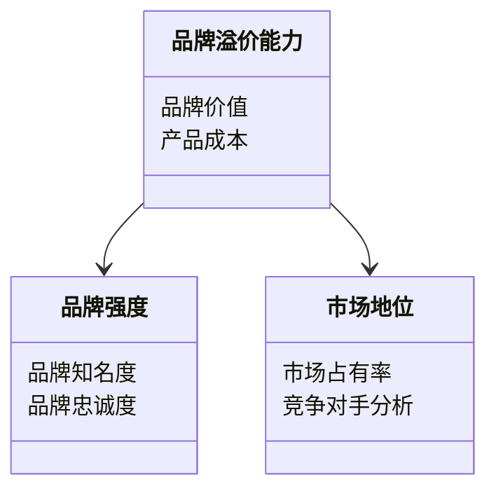

                 


# 彼得林奇如何评估公司的品牌溢价能力

> 关键词：品牌溢价能力，彼得林奇，品牌评估，投资分析，企业价值

> 摘要：品牌溢价能力是企业在市场竞争中获取超额利润的关键因素之一。本文以彼得林奇的投资理念为基础，详细探讨品牌溢价能力的核心概念、评估方法、系统架构以及实际应用。通过理论与实践相结合的方式，帮助读者理解如何通过品牌溢价能力的评估，实现企业价值的最大化。

---

## 第1章: 品牌溢价能力的定义与背景

### 1.1 品牌溢价能力的定义与内涵

#### 1.1.1 品牌溢价能力的定义
品牌溢价能力是指企业在市场中，通过品牌建设与管理，使其产品或服务能够以高于同类产品或服务的价格出售，并获得额外利润的能力。这种能力反映了品牌在市场中的独特价值和竞争力。

#### 1.1.2 品牌溢价能力的核心要素
- **品牌知名度**：品牌在市场中的认知度越高，消费者愿意为品牌支付的价格溢价能力越强。
- **品牌忠诚度**：消费者对品牌的偏好程度直接影响其愿意支付的价格。
- **品牌关联性**：品牌与消费者情感或价值观的关联程度，影响其溢价能力。
- **品牌独特性**：品牌的差异化程度越高，其溢价能力越强。

#### 1.1.3 品牌溢价能力与企业价值的关系
品牌溢价能力是企业价值的重要组成部分。通过提升品牌溢价能力，企业可以实现更高的利润率，从而增加企业整体价值。

### 1.2 彼得林奇与品牌溢价能力研究

#### 1.2.1 彼得林奇的背景与投资理念
彼得·林奇是全球著名投资专家，以其对公司的深入研究和独特投资理念闻名。他认为，企业的品牌溢价能力是评估公司长期价值的重要指标之一。

#### 1.2.2 彼得林奇对品牌溢价能力的研究方法
彼得林奇通过分析企业的品牌知名度、市场地位、消费者认知度等多方面因素，评估其品牌溢价能力。

#### 1.2.3 品牌溢价能力在投资决策中的重要性
品牌溢价能力是企业长期盈利能力的体现。投资者通过评估品牌溢价能力，可以判断企业的市场竞争力和未来发展前景。

### 1.3 品牌溢价能力的背景与现状

#### 1.3.1 当前市场环境下的品牌溢价能力
在当前激烈的市场竞争中，品牌溢价能力是企业差异化竞争的核心。

#### 1.3.2 品牌溢价能力的行业差异
不同行业中的品牌溢价能力差异显著。例如，奢侈品行业的品牌溢价能力通常较高，而制造业则相对较低。

#### 1.3.3 品牌溢价能力的未来发展趋势
随着消费者对品牌认知的不断变化，品牌溢价能力将更加依赖于品牌创新和数字化营销。

---

## 第2章: 品牌溢价能力的核心概念与联系

### 2.1 品牌溢价能力的核心概念

#### 2.1.1 品牌溢价能力的构成要素
- **品牌价值**：品牌在市场中的价值。
- **品牌强度**：品牌在市场中的竞争力。
- **品牌忠诚度**：消费者对品牌的忠诚程度。

#### 2.1.2 品牌溢价能力的数学模型
品牌溢价能力可以通过以下公式计算：
$$ \text{品牌溢价能力} = \frac{\text{品牌价值}}{\text{产品成本}} $$

#### 2.1.3 品牌溢价能力与企业竞争力的关系
品牌溢价能力是企业竞争力的直接体现。通过提升品牌溢价能力，企业可以实现更高的市场占有率和利润。

### 2.2 品牌溢价能力的核心概念对比

#### 2.2.1 品牌溢价能力与品牌价值的对比
- 品牌溢价能力：衡量品牌在市场中的定价能力。
- 品牌价值：衡量品牌在市场中的整体价值。

#### 2.2.2 品牌溢价能力与品牌忠诚度的对比
- 品牌溢价能力：与价格相关。
- 品牌忠诚度：与消费者行为相关。

#### 2.2.3 品牌溢价能力与品牌生命周期的对比
- 品牌溢价能力：与品牌生命周期的阶段相关。
- 品牌生命周期：品牌从创建到衰退的全过程。

### 2.3 品牌溢价能力的ER实体关系图

```mermaid
erDiagram
    customer[顾客]
    product[产品]
    brand[品牌]
    market[市场]
    value[价值]
    customer -|> value : 顾客感知价值
    product -|> value : 产品附加价值
    brand -|> value : 品牌溢价能力
    market -|> brand : 市场品牌影响力
```

---

## 第3章: 品牌溢价能力的评估方法

### 3.1 彼得林奇的品牌溢价能力评估框架

#### 3.1.1 品牌强度分析
品牌强度是品牌溢价能力的核心因素之一。通过分析品牌在市场中的竞争力，可以评估其强度。

#### 3.1.2 市场地位评估
市场地位是品牌溢价能力的重要指标。通过分析品牌在市场中的占有率和竞争对手情况，可以评估其市场地位。

#### 3.1.3 消费者认知度分析
消费者认知度是品牌溢价能力的关键因素。通过分析消费者对品牌的认知程度，可以评估其认知度。

### 3.2 品牌溢价能力的定量评估方法

#### 3.2.1 品牌溢价能力的数学模型
$$ \text{品牌溢价能力} = \frac{\text{品牌价值}}{\text{产品成本}} $$

#### 3.2.2 品牌溢价能力的公式推导
通过分析品牌价值和产品成本的关系，可以推导出品牌溢价能力的公式。

#### 3.2.3 品牌溢价能力的实例分析
以苹果公司为例，分析其品牌溢价能力。

---

## 第4章: 品牌溢价能力的系统分析与架构设计

### 4.1 系统功能设计

#### 4.1.1 领域模型
通过领域模型分析品牌溢价能力的各个要素及其关系。



#### 4.1.2 系统架构设计
通过系统架构设计，展示品牌溢价能力的评估过程。

```mermaid
containerDiagram
    container 品牌溢价能力评估系统 {
        component 品牌价值计算模块
        component 产品成本计算模块
        component 品牌强度分析模块
        component 市场地位分析模块
    }
```

---

## 第5章: 品牌溢价能力的项目实战

### 5.1 环境安装与配置

#### 5.1.1 系统环境要求
- 操作系统：Windows/Mac/Linux
- 开发工具：Python/Java/JavaScript
- 数据库：MySQL/PostgreSQL

#### 5.1.2 品牌溢价能力评估系统安装
通过安装必要的软件和工具，配置品牌溢价能力评估系统。

### 5.2 核心功能实现

#### 5.2.1 品牌价值计算模块
```python
def calculate_brand_value(brand_name):
    # 计算品牌价值的逻辑
    return brand_value
```

#### 5.2.2 产品成本计算模块
```python
def calculate_product_cost(product_name):
    # 计算产品成本的逻辑
    return product_cost
```

#### 5.2.3 品牌强度分析模块
```python
def analyze_brand_strength(brand_name):
    # 分析品牌强度的逻辑
    return brand_strength
```

### 5.3 实际案例分析

#### 5.3.1 苹果公司品牌溢价能力分析
通过具体案例分析苹果公司的品牌溢价能力。

#### 5.3.2 可口可乐公司品牌溢价能力分析
通过具体案例分析可口可乐公司的品牌溢价能力。

---

## 第6章: 品牌溢价能力的总结与展望

### 6.1 总结
通过本文的分析，品牌溢价能力是企业在市场竞争中获取超额利润的关键因素。通过彼得林奇的投资理念，可以有效评估品牌溢价能力，实现企业价值的最大化。

### 6.2 未来展望
未来，随着市场环境的变化，品牌溢价能力的评估将更加依赖于数据驱动的分析和数字化营销。

---

## 作者：AI天才研究院/AI Genius Institute & 禅与计算机程序设计艺术/Zen And The Art of Computer Programming

