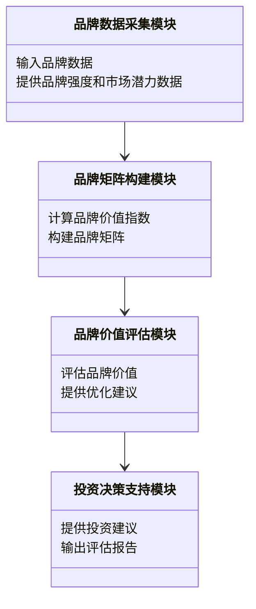

                 


# 彼得林奇如何评估公司的品牌矩阵管理

## 关键词：
- 彼得·林奇
- 品牌矩阵
- 品牌管理
- 投资评估
- 数学模型

## 摘要：
本文深入探讨了彼得·林奇的品牌矩阵管理方法，分析其在企业品牌管理和投资评估中的应用价值。通过详细阐述品牌矩阵管理的核心概念、算法原理、系统架构设计及项目实战，本文为读者提供了从理论到实践的全面指导。通过实际案例分析和最佳实践分享，本文旨在帮助读者理解如何利用品牌矩阵管理优化企业价值和投资决策。

---

# 第一部分: 品牌矩阵管理的背景与核心概念

## 第1章: 品牌矩阵管理的起源与核心概念

### 1.1 品牌矩阵管理的起源
#### 1.1.1 品牌管理的演变历程
品牌管理是企业战略的核心组成部分，从早期的单一品牌推广到如今的多品牌矩阵管理，经历了多个阶段。随着市场竞争的加剧，企业开始意识到品牌矩阵管理的重要性，特别是在评估企业价值和制定投资策略时。

#### 1.1.2 品牌矩阵管理的概念提出
品牌矩阵管理是一种通过构建品牌矩阵来评估品牌价值和企业潜力的方法。它结合了品牌强度、市场占有率、增长率等多个维度的指标，帮助企业更好地优化品牌组合。

#### 1.1.3 彼得·林奇的贡献与影响
彼得·林奇是著名的投资经理人，他在品牌矩阵管理领域提出了独特的方法，强调通过品牌矩阵的动态调整来优化投资组合。他的方法不仅影响了投资领域，也为企业的品牌管理提供了新的思路。

### 1.2 品牌矩阵管理的核心概念
#### 1.2.1 品牌矩阵的定义与特征
品牌矩阵是一个二维矩阵，横轴代表品牌强度，纵轴代表市场潜力。每个品牌的位置由其品牌强度和市场潜力的综合指数决定。

#### 1.2.2 品牌矩阵管理的三大要素
- 品牌强度：包括品牌知名度、忠诚度和美誉度。
- 市场潜力：包括市场规模、增长率和竞争环境。
- 品牌价值：通过品牌强度和市场潜力的综合指数计算得出。

#### 1.2.3 品牌矩阵与企业价值的关系
品牌矩阵通过量化品牌价值和市场潜力，帮助企业优化品牌组合，从而实现企业价值的最大化。

### 1.3 品牌矩阵管理的重要性
#### 1.3.1 品牌矩阵管理对企业战略的意义
品牌矩阵管理帮助企业明确品牌定位，优化资源配置，提升品牌竞争力。

#### 1.3.2 品牌矩阵管理对投资决策的影响
通过品牌矩阵管理，投资者可以更准确地评估企业的品牌价值，从而做出更明智的投资决策。

#### 1.3.3 品牌矩阵管理的实践价值
品牌矩阵管理在企业并购、品牌推广和市场进入战略中具有重要的指导作用。

### 1.4 彼得·林奇的品牌矩阵管理方法
#### 1.4.1 彼得·林奇的投资理念
彼得·林奇主张通过深入分析企业的品牌矩阵，找到具有长期增长潜力的品牌进行投资。

#### 1.4.2 品牌矩阵管理的核心思想
品牌矩阵管理的核心思想是通过量化品牌价值和市场潜力，优化品牌组合，实现企业价值的最大化。

#### 1.4.3 彼得·林奇方法的独特性
彼得·林奇的方法注重动态调整品牌矩阵，根据市场变化及时优化品牌组合，以应对竞争环境的变化。

### 1.5 本章小结
本章详细介绍了品牌矩阵管理的起源、核心概念以及彼得·林奇的独特方法，为后续的分析奠定了基础。

---

# 第二部分: 品牌矩阵管理的核心原理与方法

## 第2章: 品牌矩阵管理的核心原理

### 2.1 品牌矩阵管理的理论基础
#### 2.1.1 品牌价值的量化方法
品牌价值可以通过品牌强度和市场潜力的乘积来计算，即：
$$ V = \text{品牌强度} \times \text{市场潜力} $$

#### 2.1.2 品牌矩阵的构建逻辑
品牌矩阵的构建需要考虑品牌强度和市场潜力两个维度，通过权重分配计算综合指数。

#### 2.1.3 品牌矩阵管理的数学模型
品牌价值指数计算公式：
$$ V = \sum_{i=1}^{n} w_i \cdot v_i $$
其中，\( w_i \) 是第 \( i \) 个维度的权重，\( v_i \) 是第 \( i \) 个维度的值。

### 2.2 品牌矩阵管理的算法原理
#### 2.2.1 品牌价值评估的算法流程
1. 数据采集：收集品牌强度和市场潜力数据。
2. 权重分配：根据行业特点分配各维度的权重。
3. 综合指数计算：计算品牌价值指数。
4. 品牌矩阵构建：根据综合指数绘制品牌矩阵。

#### 2.2.2 品牌矩阵的动态调整机制
根据市场变化和品牌表现，定期调整品牌矩阵，优化品牌组合。

#### 2.2.3 品牌矩阵管理的优化算法
通过机器学习算法优化品牌矩阵的权重分配，提高评估的准确性。

### 2.3 品牌矩阵管理的数学模型
#### 2.3.1 品牌价值指数的计算公式
$$ V = \sum_{i=1}^{n} w_i \cdot v_i $$

#### 2.3.2 品牌矩阵的权重分配模型
权重分配可以根据行业特点和品牌战略进行调整。

#### 2.3.3 品牌矩阵管理的优化方程
通过非线性优化算法，寻找最优品牌组合。

### 2.4 本章小结
本章详细讲解了品牌矩阵管理的理论基础和算法原理，为实际应用提供了理论支持。

---

# 第三部分: 品牌矩阵管理的系统架构与实现

## 第3章: 品牌矩阵管理的系统架构设计

### 3.1 系统功能模块划分
#### 3.1.1 品牌数据采集模块
负责收集品牌强度和市场潜力数据。

#### 3.1.2 品牌矩阵构建模块
根据数据计算品牌价值指数，构建品牌矩阵。

#### 3.1.3 品牌价值评估模块
评估品牌价值，提供优化建议。

#### 3.1.4 投资决策支持模块
根据品牌矩阵评估结果，提供投资决策支持。

### 3.2 系统架构设计
#### 3.2.1 分层架构设计
系统分为数据层、计算层和应用层，确保功能分离和模块化设计。

#### 3.2.2 模块之间的交互关系
数据采集模块向计算模块提供数据，计算模块向应用模块输出评估结果。

#### 3.2.3 系统的可扩展性设计
系统采用模块化设计，方便后续功能扩展和优化。

### 3.3 系统功能设计
#### 3.3.1 领域模型设计
使用Mermaid类图展示系统功能模块之间的关系。



### 3.4 本章小结
本章详细描述了品牌矩阵管理系统的架构设计和功能模块划分，为实际开发提供了指导。

---

# 第四部分: 项目实战

## 第4章: 项目实战与案例分析

### 4.1 项目背景与目标
以某公司为例，通过品牌矩阵管理优化其品牌组合。

### 4.2 项目实施步骤
#### 4.2.1 数据采集与处理
收集品牌强度和市场潜力数据，进行数据清洗和预处理。

#### 4.2.2 品牌矩阵构建
使用Python代码计算品牌价值指数，构建品牌矩阵。

#### 4.2.3 投资决策支持
根据品牌矩阵评估结果，制定投资策略。

### 4.3 核心代码实现
#### 4.3.1 数据处理代码
```python
import pandas as pd

# 数据采集
data = pd.read_csv('brand_data.csv')

# 数据清洗
data.dropna(inplace=True)
data['品牌强度'] = data['品牌强度'].astype(float)
data['市场潜力'] = data['市场潜力'].astype(float)
```

#### 4.3.2 品牌矩阵构建代码
```python
def calculate_brand_value(brand_data):
    brand_data['品牌价值指数'] = brand_data['品牌强度'] * brand_data['市场潜力']
    return brand_data

result = calculate_brand_value(data)
```

#### 4.3.3 投资决策支持代码
```python
def generate_recommendation(brand_data):
    best_brands = brand_data.nlargest(5, '品牌价值指数')
    return best_brands

recommendation = generate_recommendation(result)
print(recommendation)
```

### 4.4 案例分析与结果解读
通过对某公司的品牌矩阵分析，得出优化品牌组合的结论，并提供投资建议。

### 4.5 项目小结
本章通过实际案例展示了品牌矩阵管理的实施过程，验证了其在实际中的应用价值。

---

# 第五部分: 最佳实践与总结

## 第5章: 最佳实践与总结

### 5.1 最佳实践 tips
- 定期更新品牌矩阵，适应市场变化。
- 根据行业特点调整权重分配。
- 结合市场反馈优化品牌组合。

### 5.2 小结
品牌矩阵管理是一种有效的品牌评估和优化方法，通过彼得·林奇的方法，可以帮助企业和投资者更好地进行品牌管理和投资决策。

### 5.3 注意事项
- 数据质量直接影响评估结果，需确保数据的准确性和完整性。
- 权重分配应根据行业特点和品牌战略进行调整。
- 品牌矩阵管理需要结合市场环境动态调整。

### 5.4 拓展阅读
- 《彼得·林奇的投资哲学》
- 《品牌矩阵管理的理论与实践》
- 《企业品牌组合优化策略》

---

# 结语

通过本文的深入探讨，读者可以全面了解彼得·林奇的品牌矩阵管理方法，并将其应用于实际的企业管理和投资决策中。希望本文能为读者提供有价值的指导和启发。

---

# 作者：AI天才研究院 & 禅与计算机程序设计艺术

