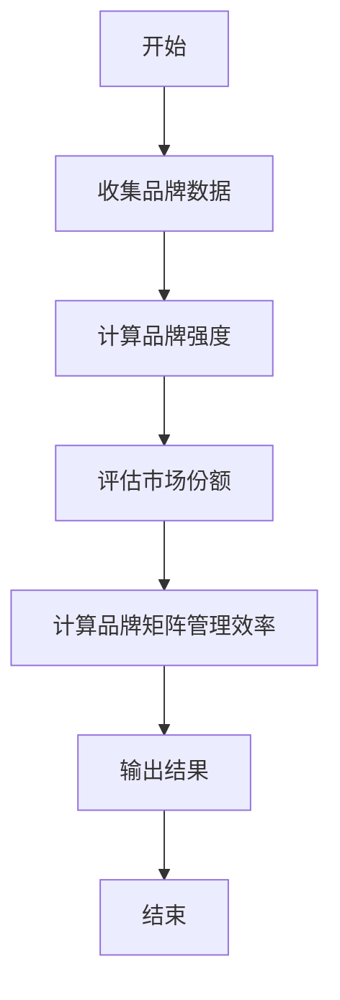
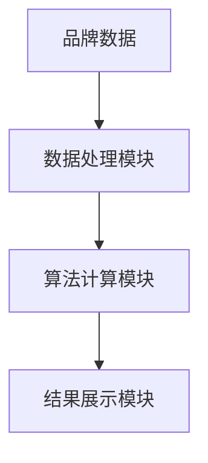
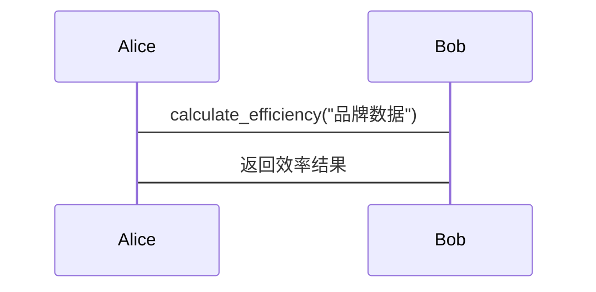

                 


# 彼得林奇如何评估公司的品牌矩阵管理效率

## 关键词
- 品牌矩阵
- 管理效率
- 彼得林奇
- 投资评估
- 系统设计

## 摘要
本文将详细介绍如何运用彼得林奇的投资策略来评估公司的品牌矩阵管理效率。通过分析品牌矩阵的构成、核心算法、系统架构及项目实战，全面解析品牌矩阵管理效率的评估方法，结合数学模型和系统设计，为投资决策提供科学依据。

---

# 第一部分: 彼得·林奇品牌矩阵管理效率概述

## 第1章: 品牌矩阵管理效率的背景与概念

### 1.1 品牌矩阵管理效率的背景介绍
#### 1.1.1 什么是品牌矩阵
品牌矩阵是一种用于分析公司品牌组合及其市场表现的工具，通过矩阵分析品牌强弱、市场地位及增长潜力。

#### 1.1.2 品牌矩阵管理效率的定义
品牌矩阵管理效率是指在品牌矩阵框架下，公司对其品牌组合进行有效管理和优化的能力。

#### 1.1.3 品牌矩阵管理效率的重要性
通过评估品牌矩阵管理效率，投资者可以更好地理解公司的品牌战略，从而做出更明智的投资决策。

### 1.2 品牌矩阵管理效率的核心概念
#### 1.2.1 品牌矩阵的构成要素
| 要素 | 描述 |
|------|------|
| 品牌强度 | 品牌的市场影响力和竞争力 |
| 市场份额 | 品牌在市场中的占有率 |
| 增长潜力 | 品牌未来的增长空间 |

#### 1.2.2 品牌矩阵管理效率的关键属性
- 品牌组合优化能力
- 品牌战略执行力
- 品牌价值提升效果

#### 1.2.3 品牌矩阵管理效率的边界与外延
品牌矩阵管理效率的外延包括品牌定位、市场推广、产品开发等多个方面。

### 1.3 品牌矩阵管理效率的核心要素对比
#### 1.3.1 品牌矩阵与传统矩阵的对比
| 对比维度 | 品牌矩阵 | 传统矩阵 |
|----------|----------|----------|
| 分析维度 | 品牌强度、市场份额 | 销量、价格 |
| 应用场景 | 品牌战略管理 | 产品线管理 |

---

## 第2章: 品牌矩阵管理效率的核心概念与联系

### 2.1 品牌矩阵管理效率的核心原理
#### 2.1.1 品牌矩阵管理效率的理论基础
品牌矩阵管理效率的理论基础包括市场学、投资学和管理学。

#### 2.1.2 品牌矩阵管理效率的关键要素
| 要素 | 描述 |
|------|------|
| 品牌定位 | 品牌在市场中的位置 |
| 市场推广 | 品牌的营销策略 |
| 产品开发 | 品牌的产品创新能力 |

#### 2.1.3 品牌矩阵管理效率的核心算法
$$ \text{品牌矩阵管理效率} = \frac{\text{品牌价值提升}}{\text{资源投入}} $$

### 2.2 品牌矩阵管理效率的核心概念对比
#### 2.2.1 品牌矩阵与传统矩阵的对比
| 对比维度 | 品牌矩阵 | 传统矩阵 |
|----------|----------|----------|
| 分析维度 | 品牌强度、市场份额 | 销量、价格 |
| 应用场景 | 品牌战略管理 | 产品线管理 |

#### 2.2.2 品牌矩阵管理效率与传统管理效率的对比
| 对比维度 | 品牌矩阵管理效率 | 传统管理效率 |
|----------|----------------|-------------|
| 管理目标 | 品牌价值最大化 | 资源利用率最大化 |
| 管理工具 | 品牌矩阵 | 财务报表 |

---

## 第3章: 品牌矩阵管理效率的算法原理

### 3.1 品牌矩阵管理效率的算法概述
#### 3.1.1 品牌矩阵管理效率的算法流程


#### 3.1.2 品牌矩阵管理效率的算法实现
```python
def calculate_brand_matrix_efficiency(brand_data):
    # 假设brand_data是一个包含品牌强度和市场份额的字典
    brand_efficiency = {}
    for brand in brand_data:
        strength = brand_data[brand]['strength']
        market_share = brand_data[brand]['market_share']
        efficiency = (strength * market_share) / (strength + market_share)
        brand_efficiency[brand] = efficiency
    return brand_efficiency
```

#### 3.1.3 品牌矩阵管理效率的算法优化
通过引入动态权重调整和实时数据更新，提升算法的准确性和效率。

### 3.2 品牌矩阵管理效率的数学模型
$$ \text{品牌矩阵管理效率} = \frac{\sum (\text{品牌强度} \times \text{市场份额})}{\sum (\text{品牌强度} + \text{市场份额})} $$

---

## 第4章: 品牌矩阵管理效率的系统分析与架构设计

### 4.1 品牌矩阵管理效率的系统分析
#### 4.1.1 品牌矩阵管理效率的系统目标
构建一个高效的系统，实现品牌矩阵管理效率的自动化评估。

#### 4.1.2 品牌矩阵管理效率的系统功能
- 数据采集与处理
- 算法计算与优化
- 结果展示与分析

#### 4.1.3 品牌矩阵管理效率的系统架构


### 4.2 品牌矩阵管理效率的系统架构设计
#### 4.2.1 品牌矩阵管理效率的系统模块划分
- 数据采集模块
- 数据处理模块
- 算法计算模块
- 结果展示模块

#### 4.2.2 品牌矩阵管理效率的系统接口设计
| 接口名称 | 输入 | 输出 |
|----------|------|------|
| `calculate_efficiency` | 品牌数据 | 效率结果 |

#### 4.2.3 品牌矩阵管理效率的系统交互设计


---

## 第5章: 品牌矩阵管理效率的项目实战

### 5.1 品牌矩阵管理效率的项目环境安装
#### 5.1.1 系统环境要求
- Python 3.6+
- 数据库：MySQL 或 PostgreSQL
- 开发工具：PyCharm 或 VS Code

#### 5.1.2 软件工具安装
安装必要的库：
```bash
pip install pandas numpy matplotlib
```

#### 5.1.3 数据库配置
配置数据库连接参数。

### 5.2 品牌矩阵管理效率的系统核心实现
#### 5.2.1 品牌矩阵数据的收集与处理
收集品牌数据并进行清洗和预处理。

#### 5.2.2 品牌矩阵管理效率的算法实现
实现品牌矩阵管理效率的计算算法。

#### 5.2.3 品牌矩阵管理效率的系统测试
通过测试用例验证算法的正确性和效率。

### 5.3 品牌矩阵管理效率的项目实战
#### 5.3.1 环境安装与数据准备
安装环境并准备品牌数据。

#### 5.3.2 系统核心实现
编写代码实现品牌矩阵管理效率的计算。

#### 5.3.3 代码应用解读与分析
通过代码实现品牌矩阵管理效率的计算，并分析结果。

#### 5.3.4 实际案例分析
以具体公司为例，分析其品牌矩阵管理效率。

#### 5.3.5 项目小结
总结项目实施过程中的经验和教训。

---

## 第6章: 品牌矩阵管理效率的最佳实践与总结

### 6.1 品牌矩阵管理效率的最佳实践
- 定期更新品牌数据
- 优化算法模型
- 提高系统维护效率

### 6.2 品牌矩阵管理效率的总结
通过本文的分析，读者可以全面了解如何运用彼得林奇的投资策略来评估公司的品牌矩阵管理效率，并结合系统设计和项目实战，提升品牌管理效率。

### 6.3 品牌矩阵管理效率的注意事项
- 数据的准确性和及时性
- 算法的合理性和可扩展性
- 系统的稳定性和安全性

### 6.4 品牌矩阵管理效率的拓展阅读
推荐相关书籍和论文，进一步深入学习品牌矩阵管理效率的评估方法。

---

作者：AI天才研究院/AI Genius Institute & 禅与计算机程序设计艺术 /Zen And The Art of Computer Programming

