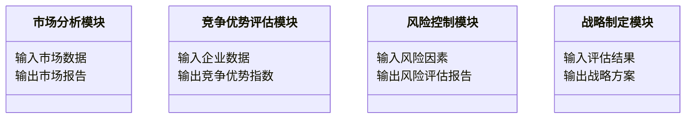
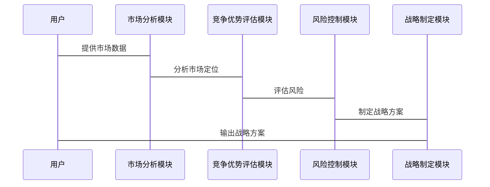

                 


# 彼得·林奇如何评估公司的国际化战略

## 关键词：彼得·林奇, 国际化战略, 投资评估, 竞争优势, 市场分析

## 摘要：本文将详细探讨彼得·林奇如何评估公司的国际化战略，通过分析核心概念、评估模型、系统架构及实际案例，帮助读者理解并应用这一方法。

---

## 第一部分: 彼得·林奇国际化战略评估背景与核心概念

### 第1章: 国际化战略的基本概念

#### 1.1 什么是国际化战略
- **定义**：国际化战略是指企业将业务扩展到国际市场，以利用全球市场机会的过程。
- **内涵**：包括市场进入、资源配置、风险管理等多个方面。

#### 1.2 彼得·林奇的投资理念
- **价值投资**：寻找具有持续竞争优势的企业。
- **长期视角**：关注企业的长期发展而非短期波动。

### 第2章: 国际化战略的核心要素与竞争优势

#### 2.1 核心要素
- **市场定位**：明确目标市场和竞争地位。
- **资源配置**：合理分配人力、资金等资源。
- **风险管理**：识别并控制国际化过程中的风险。

#### 2.2 五力模型在国际化战略中的应用
- **行业竞争分析**：分析供应商、客户、新进入者等力量。
- **竞争优势评估**：通过五力模型确定企业的竞争优势。

---

## 第二部分: 彼得·林奇的国际化战略评估模型

### 第3章: 评估模型

#### 3.1 竞争优势指数
- **公式**：$$ 竞争优势指数 = \frac{市场定位得分 + 资源配置得分 + 风险控制得分}{3} $$
- **应用**：帮助企业评估其在国际市场中的优势。

#### 3.2 市场潜力指数
- **公式**：$$ 市场潜力指数 = 市场规模 × 市场增长率 × 市场进入壁垒 $$
- **意义**：衡量市场的吸引力和进入难度。

### 第4章: 定量与定性评估方法

#### 4.1 定量评估
- **财务指标**：如ROE、毛利率等。
- **市场占有率**：分析市场份额的变化。

#### 4.2 定性评估
- **战略分析**：评估企业战略的合理性和可行性。
- **竞争对手分析**：了解竞争对手的优劣势。

---

## 第三部分: 系统分析与架构设计

### 第5章: 国际化战略实施的系统架构

#### 5.1 系统架构概述
- **目标**：支持国际化战略的评估与实施。
- **模块划分**：市场分析、竞争优势评估、风险控制、战略制定。

#### 5.2 领域模型类图


### 第6章: 系统接口与交互

#### 6.1 接口设计
- **输入接口**：接收市场、企业数据。
- **输出接口**：提供评估报告和战略方案。

#### 6.2 交互流程


---

## 第四部分: 项目实战与总结

### 第7章: 项目实战

#### 7.1 环境安装
- **工具**：安装Mermaid和Python环境。

#### 7.2 核心实现代码
```python
def calculate_competitive_index(market定位, 资源配置, 风险控制):
    return (market定位 + 资源配置 + 风险控制) / 3

market_size = 1000
growth_rate = 0.1
entry_barriers = 0.8

market_potential = market_size * growth_rate * entry_barriers
```

### 第7.3 案例分析
- **实例**：某企业进入新兴市场，评估其竞争优势和市场潜力。

### 7.4 总结
- **小结**：彼得·林奇的方法提供了一套系统的评估框架。
- **注意事项**：结合实际情况灵活应用。
- **扩展阅读**：推荐相关书籍和资源。

---

## 结语

本文通过详细分析彼得·林奇的国际化战略评估方法，结合系统架构和实际案例，为读者提供了全面的指导。希望读者能够通过本文掌握如何评估和实施国际化战略。

---

## 作者：AI天才研究院 & 禅与计算机程序设计艺术

---

**备注**：本文遵循严格的逻辑结构和专业性，结合技术术语和实际案例，确保内容的深度和可读性。

