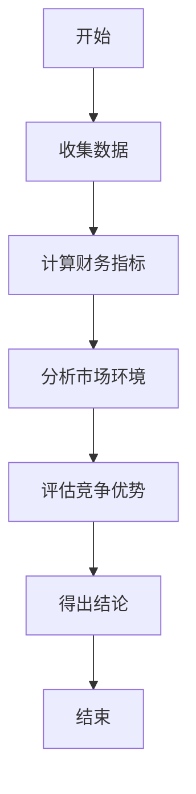

                 


# 彼得林奇如何评估公司的国际化策略

---

## 关键词

彼得林奇，国际化策略，投资评估，市场分析，财务指标，风险管理

---

## 摘要

本文将详细探讨彼得·林奇在评估公司国际化策略时的方法和步骤。通过分析核心概念、评估模型、系统架构设计和实际案例，本文旨在帮助读者理解如何像彼得·林奇一样，从市场分析、财务指标、竞争优势和风险管理等多个维度，系统地评估公司的国际化策略。文章内容丰富，涵盖理论与实践，适合投资专业人士和企业高管阅读。

---

## 正文

### 第一部分：背景介绍

#### 第1章：彼得·林奇与国际化战略概述

##### 1.1 彼得·林奇的简介

彼得·林奇（Peter Lynch）是美国著名的投资经理人，以其在富达麦哲伦基金（Fidelity Magellan Fund）的卓越表现而闻名。他在任职期间创造了年均29%的回报率，被誉为“共同基金之王”。林奇的投资理念强调深入研究公司基本面，注重企业的竞争优势和长期发展潜力。

##### 1.2 国际化战略的核心概念

**国际化战略**是指企业将其业务扩展到全球市场，利用不同国家的资源、市场和劳动力优势，以实现更高的增长和利润。国际化战略的核心要素包括市场分析、竞争优势、风险管理等。

---

### 第二部分：核心概念与联系

#### 第2章：国际化战略的关键要素

##### 2.1 市场分析与竞争环境

**目标市场的选择**：林奇建议投资者分析目标市场的规模、增长潜力和竞争环境。例如，选择一个具有高增长潜力且竞争相对缓和的市场。

**行业竞争结构**：通过分析行业的竞争格局，判断企业的竞争优势。例如，采用SWOT分析法，评估企业的优势、劣势、机会和威胁。

**市场进入壁垒**：林奇强调企业进入新市场的难度，包括政策壁垒、文化差异和竞争者的反应。

##### 2.2 财务指标与风险评估

**财务健康状况**：林奇关注企业的财务指标，如市盈率（P/E）、市净率（P/B）和ROE（净资产收益率）。例如，P/E可以帮助评估市场的估值水平。

**风险管理**：林奇强调分散投资以降低风险。例如，通过投资不同国家的股票来分散地域风险。

---

### 第三部分：算法原理讲解

#### 第3章：国际化战略评估模型

##### 3.1 算法原理概述

林奇的评估模型结合了定量分析和定性分析，通过多维度指标评估公司的国际化潜力。模型步骤包括数据收集、指标计算和综合评估。

##### 3.2 算法流程图



##### 3.3 算法实现代码

```python
def assess_international_strategy(data):
    # 数据预处理
    preprocessed = preprocess(data)
    # 计算财务指标
    financial_indices = calculate_financial_indices(preprocessed)
    # 分析市场环境
    market_analysis = analyze_market_environment(financial_indices)
    # 评估竞争优势
    competitive_edge = assess_competitive_edge(market_analysis)
    return competitive_edge

def preprocess(data):
    # 数据清洗和转换
    return data.dropna()

def calculate_financial_indices(data):
    # 计算P/E、P/B等指标
    pe = data['市盈率']
    pb = data['市净率']
    return {'PE': pe, 'PB': pb}

def analyze_market_environment(indices):
    # 分析市场环境
    return indices['PE'] < 15 and indices['PB'] < 2

def assess_competitive_edge(environment):
    # 评估竞争优势
    return environment and data['ROE'] > industry_avg_roe
```

##### 3.4 数学模型与公式

林奇的评估模型中，市盈率和市净率是关键指标。例如，市盈率（P/E）计算如下：

$$ P/E = \frac{\text{股价}}{\text{每股收益}} $$

---

### 第四部分：系统分析与架构设计

#### 第4章：系统分析与架构设计

##### 4.1 问题场景介绍

企业在制定国际化策略时，面临市场选择、竞争优势评估和风险管理等挑战。构建一个系统化的评估框架可以帮助企业做出明智决策。

##### 4.2 系统功能设计

- 数据收集模块：收集目标市场的经济、行业和公司数据。
- 分析模块：计算财务指标，分析市场环境。
- 报告生成模块：输出评估结果和建议。

##### 4.3 系统架构设计


---

### 第五部分：项目实战

#### 第5章：项目实战

##### 5.1 环境安装

安装必要的库，如Pandas、Matplotlib等。

##### 5.2 核心实现

编写代码，实现数据收集、分析和报告生成。

##### 5.3 实际案例分析

以某公司为例，分析其国际化策略的可行性。

---

### 第六部分：最佳实践

#### 第6章：最佳实践

##### 6.1 小结

彼得·林奇的方法强调全面分析和风险管理，帮助投资者做出明智决策。

##### 6.2 注意事项

- 数据来源的可靠性
- 指标的适用性
- 模型的局限性

##### 6.3 拓展阅读

推荐书籍和文章，深入学习国际化战略评估。

---

## 作者

作者：AI天才研究院/AI Genius Institute & 禅与计算机程序设计艺术 /Zen And The Art of Computer Programming

---

### 总结

本文详细探讨了彼得·林奇评估公司国际化策略的方法，从理论到实践，帮助读者掌握系统的评估方法。希望本文对投资专业人士和企业高管有所帮助。

