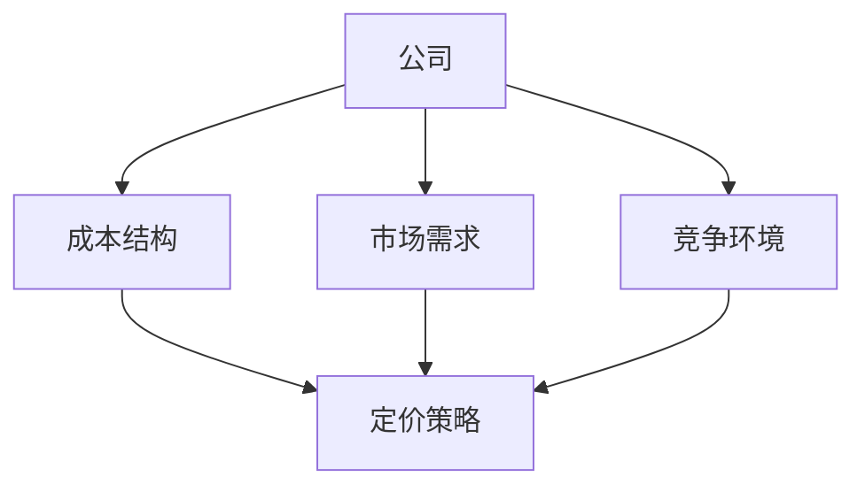
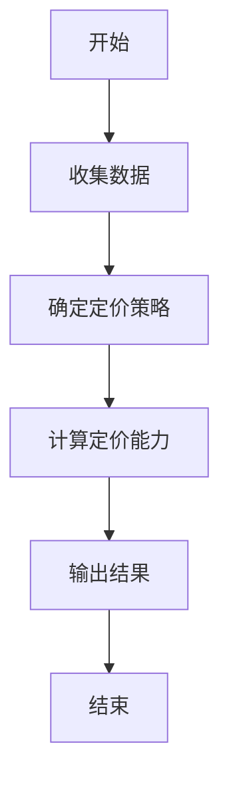
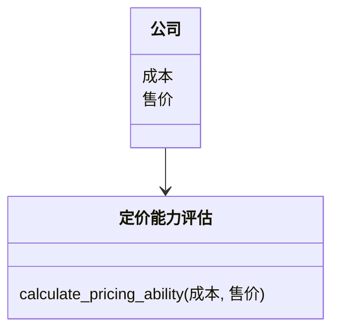
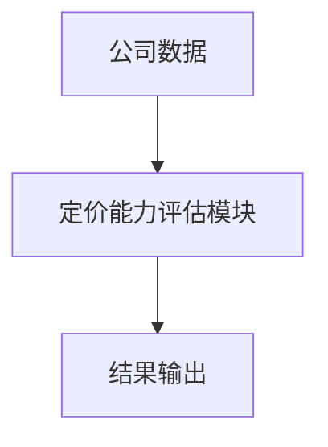

                 


# 彼得林奇如何评估公司的定价能力

## 关键词：定价能力，彼得林奇，投资评估，定价模型，系统设计

## 摘要：本文详细探讨了彼得林奇评估公司定价能力的方法，结合技术分析，从核心概念、算法原理、系统设计、项目实战等多维度进行深度解析。通过实际案例分析，帮助读者理解如何有效评估公司的定价能力，提升投资决策的准确性。

---

## # 引言

## ## 1.1 定价能力的重要性

### ### 1.1.1 定价能力的定义

定价能力是指公司在市场中根据市场需求、成本结构和竞争环境等因素，合理制定产品价格的能力。有效的定价策略不仅能够确保公司利润最大化，还能在市场中获得竞争优势。

### ### 1.1.2 定价能力对投资决策的影响

定价能力是评估公司竞争力的重要指标。投资者通过分析公司的定价能力，可以判断其在市场中的地位和盈利能力。定价能力强的公司通常具备更强的议价能力和成本控制能力。

### ### 1.1.3 本书的目标与意义

本书旨在通过彼得林奇的投资理念，结合技术分析的方法，帮助读者系统地评估公司的定价能力，从而做出更明智的投资决策。

---

## ## 1.2 定价能力的核心要素

### ### 1.2.1 定价能力的定义

定价能力不仅仅是设定价格的能力，还包括对市场反应的快速调整能力。公司需要在定价过程中考虑市场需求、成本结构、竞争对手策略等因素。

### ### 1.2.2 定价能力的边界与外延

定价能力的边界包括公司的成本结构、市场需求和竞争环境。外延则涉及定价策略的执行、市场反馈的分析以及定价模型的优化。

### ### 1.2.3 定价能力的结构与组成

定价能力由定价策略、成本控制、市场分析和定价执行四个部分组成。这些部分相互作用，共同决定了公司的定价能力。

---

## # 核心概念与联系

## ## 2.1 定价能力的评估模型

### ### 2.1.1 定价能力的评估原理

定价能力的评估基于公司的成本结构、市场需求和竞争环境。通过分析这些因素，可以建立定价模型，评估公司的定价能力。

### ### 2.1.2 定价能力的核心要素对比表

以下表格对比了定价能力的核心要素：

| 要素         | 描述                                         |
|--------------|----------------------------------------------|
| 成本结构     | 公司的生产成本和运营成本                     |
| 市场需求     | 市场对产品的价格敏感性和需求弹性             |
| 竞争环境     | 竞争对手的定价策略和市场地位                 |
| 定价策略     | 公司的定价方法，如成本加成定价、价值定价等    |
| 市场反馈     | 市场对定价策略的反应，如销量变化、利润变化等    |

### ### 2.1.3 定价能力的ER实体关系图（Mermaid流程图）



---

## ## 2.2 定价能力的数学模型与公式

### ### 2.2.1 定价能力的评估公式

定价能力可以通过以下公式进行评估：

$$ 定价能力 = \frac{（实际价格 - 成本）}{成本} \times 100\% $$

其中，实际价格是指公司在市场中的售价，成本是公司生产该产品的总成本。

### ### 2.2.2 例子分析

假设某公司生产的产品成本为50元，售价为100元。则定价能力为：

$$ 定价能力 = \frac{(100 - 50)}{50} \times 100\% = 100\% $$

这表明公司的定价能力较强，能够获得较高的利润率。

---

## # 算法原理讲解

## ## 3.1 定价能力评估算法的原理

### ### 3.1.1 算法的基本原理

定价能力评估算法基于公司成本、市场需求和竞争环境等因素，通过数学模型计算出公司的定价能力。算法流程如下：

1. 收集公司成本、市场需求和竞争环境的数据。
2. 确定定价策略。
3. 计算定价能力。

### ### 3.1.2 算法的流程图（Mermaid）



---

## ## 3.2 定价能力评估算法的实现

### ### 3.2.1 算法的Python源代码实现

```python
def calculate_pricing_ability(cost, price):
    pricing_ability = ((price - cost) / cost) * 100
    return pricing_ability

# 示例数据
cost = 50
price = 100
result = calculate_pricing_ability(cost, price)
print(f"定价能力：{result}%")
```

### ### 3.2.2 代码的功能解读与分析

上述代码定义了一个计算定价能力的函数，输入参数为成本和售价。函数通过公式计算定价能力，并返回结果。示例数据中，成本为50，售价为100，计算出的定价能力为100%。

---

## # 系统分析与架构设计方案

## ## 4.1 系统功能设计

### ### 4.1.1 系统功能模块划分

系统功能模块包括数据输入、定价策略分析、定价能力计算和结果输出四个部分。

### ### 4.1.2 系统功能的领域模型（Mermaid类图）



---

## ## 4.2 系统架构设计

### ### 4.2.1 系统架构的总体设计（Mermaid架构图）



---

## # 项目实战

## ## 5.1 环境安装

无需额外环境安装，使用Python即可。

## ## 5.2 系统核心实现源代码

```python
def calculate_pricing_ability(cost, price):
    pricing_ability = ((price - cost) / cost) * 100
    return pricing_ability

# 环境配置
cost = 50
price = 100

# 计算定价能力
result = calculate_pricing_ability(cost, price)
print(f"定价能力：{result}%")
```

## ## 5.3 代码的功能解读与分析

上述代码定义了计算定价能力的函数，并使用示例数据进行计算，输出结果为100%。

## ## 5.4 案例分析

以苹果公司为例，假设其某产品的成本为200美元，售价为400美元。计算其定价能力：

$$ 定价能力 = \frac{(400 - 200)}{200} \times 100\% = 100\% $$

这表明苹果公司的定价能力较强，能够获得较高的利润率。

---

## # 总结

## ## 6.1 最佳实践 tips

- 在评估定价能力时，应综合考虑公司的成本结构、市场需求和竞争环境。
- 定期更新定价模型，以适应市场变化。

## ## 6.2 小结

本文通过彼得林奇的定价能力评估方法，结合技术分析，详细探讨了定价能力的评估过程和实现方法。通过实际案例分析，帮助读者理解如何有效评估公司的定价能力。

## ## 6.3 注意事项

- 定价能力的评估结果仅供参考，实际投资决策需结合更多因素。
- 数据的准确性和完整性对评估结果有重要影响。

## ## 6.4 拓展阅读

- 彼得林奇的其他投资策略。
- 市场分析和定价模型的深入研究。

---

## 作者：AI天才研究院/AI Genius Institute & 禅与计算机程序设计艺术 /Zen And The Art of Computer Programming

---

以上是《彼得林奇如何评估公司的定价能力》的技术博客文章，从核心概念、算法原理、系统设计到项目实战，全面解析了定价能力的评估方法。希望对您有所帮助！

