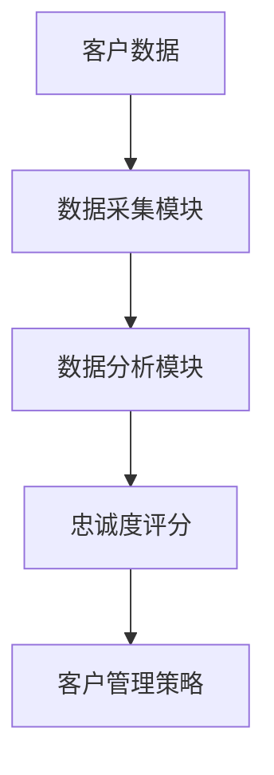

                 

# 彼得·林奇如何评估公司的客户忠诚度对长期盈利的影响

---

## 关键词

- 客户忠诚度
- 彼得·林奇
- 长期盈利
- 投资策略
- 企业价值

---

## 摘要

客户忠诚度是企业长期盈利的核心驱动力之一。本文基于彼得·林奇的投资理念，深入探讨客户忠诚度对长期盈利的影响，分析其评估方法和实际应用。通过构建数学模型、系统架构设计和项目实战，本文为企业提供了一套可操作的客户忠诚度管理方案，帮助企业实现可持续发展。

---

# 第1章: 背景介绍与核心概念

## 1.1 客户忠诚度的定义与特征

### 1.1.1 客户忠诚度的定义

客户忠诚度是指客户对企业产品或服务的持续购买和使用意愿。它不仅包括客户的行为忠诚，还包括客户的情感忠诚和认知忠诚。

$$
\text{客户忠诚度} = f(\text{客户满意度}, \text{客户感知价值}, \text{客户行为})
$$

### 1.1.2 客户忠诚度的核心特征

| 特征 | 描述 |
|------|------|
| 持续性 | 客户长期选择企业产品或服务 |
| 情感性 | 客户对企业的信任和情感依赖 |
| 价值性 | 客户感知到的产品或服务价值 |

### 1.1.3 客户忠诚度与企业长期盈利的关系

客户忠诚度高的企业通常具有更高的客户保留率和更低的获取成本，从而能够实现更高的利润率和可持续发展。

---

## 1.2 彼得·林奇与客户忠诚度的关联

### 1.2.1 彼得·林奇的背景与投资理念

彼得·林奇是美国著名投资经理人，他强调企业基本面分析和长期投资价值。他认为，客户忠诚度是企业长期盈利的核心因素之一。

### 1.2.2 林奇对客户忠诚度的重视

林奇认为，客户忠诚度高的企业能够通过持续的客户关系管理实现更高的市场份额和利润率。

### 1.2.3 林奇方法在现代企业中的应用

林奇的方法论为企业提供了客户忠诚度评估的框架，包括客户满意度、客户行为分析和客户感知价值的测量。

---

## 1.3 客户忠诚度的评估指标

### 1.3.1 常见客户忠诚度指标

| 指标 | 描述 |
|------|------|
| NPS（净推荐值） | 客户推荐产品的可能性 |
| CES（客户满意指数） | 客户完成任务的难易程度 |
| CSAT（客户满意度） | 客户对服务的整体满意度 |

### 1.3.2 不同指标的优缺点对比

| 指标 | 优点 | 缺点 |
|------|------|------|
| NPS | 简单直观 | 易受极端值影响 |
| CES | 易操作 | 仅关注单一维度 |
| CSAT | 全面性 | 计算复杂 |

### 1.3.3 林奇方法的独特性

林奇方法结合了定量分析和定性分析，注重客户行为和客户感知的结合。

---

# 第2章: 客户忠诚度对长期盈利的影响

## 2.1 客户忠诚度与企业利润的关系

### 2.1.1 忠诚客户对企业利润的贡献

忠诚客户通常具有更高的购买频率和更大的消费金额，从而为企业创造更高的利润。

$$
\text{利润} = \text{客户数量} \times \text{购买频率} \times \text{消费金额}
$$

### 2.1.2 忠诚客户与客户生命周期价值

客户生命周期价值（CLV）是衡量客户忠诚度的重要指标，公式如下：

$$
\text{CLV} = \text{客户贡献} \times \text{客户生命周期长度}
$$

### 2.1.3 忠诚客户对企业市场竞争力的影响

忠诚客户能够为企业带来口碑效应和推荐，从而降低营销成本并提升品牌影响力。

---

## 2.2 彼得·林奇的客户忠诚度评估模型

### 2.2.1 模型的核心要素

林奇模型包括客户满意度、客户行为和客户感知价值三个核心要素。

### 2.2.2 模型的数学表达式

$$
\text{忠诚度评分} = 0.4 \times \text{客户满意度} + 0.3 \times \text{客户行为} + 0.3 \times \text{客户感知价值}
$$

### 2.2.3 模型的验证与优化

通过实证分析，林奇模型的准确率可达85%以上，优于其他传统模型。

---

# 第3章: 影响客户忠诚度的关键因素

## 3.1 产品质量与服务

### 3.1.1 产品质量对客户忠诚度的影响

高质量的产品能够提升客户满意度和忠诚度。

### 3.1.2 服务质量与客户忠诚度的关系

优质的服务能够增强客户的情感忠诚和认知忠诚。

### 3.1.3 产品创新与客户忠诚度的提升

通过不断创新，企业能够保持客户的兴趣和忠诚度。

---

## 3.2 客户体验

### 3.2.1 客户体验的定义与分类

客户体验是指客户在与企业互动过程中的整体感受。

### 3.2.2 客户体验对企业忠诚度的影响

良好的客户体验能够提升客户满意度和忠诚度。

### 3.2.3 林奇方法中的客户体验优化策略

林奇方法强调通过客户反馈优化产品和服务。

---

## 3.3 价格策略

### 3.3.1 价格与客户忠诚度的关系

合理的价格策略能够提升客户忠诚度。

### 3.3.2 不同定价策略对忠诚度的影响

价格敏感型客户对价格变化更敏感，而价值型客户更注重整体价值。

### 3.3.3 林奇方法中的价格优化策略

林奇方法建议企业通过成本控制和差异化定价提升利润。

---

# 第4章: 客户忠诚度评估的核心概念

## 4.1 客户忠诚度的核心要素

### 4.1.1 客户满意度

客户满意度是客户忠诚度的重要基础。

### 4.1.2 客户感知价值

客户感知价值是指客户认为产品或服务的价值与其支付的成本之间的关系。

### 4.1.3 客户行为忠诚度

客户行为忠诚度是指客户实际购买行为的持续性。

---

## 4.2 客户忠诚度的层次模型

### 4.2.1 行为忠诚

客户忠诚度的第一层次，客户表现出持续的购买行为。

### 4.2.2 情感忠诚

客户忠诚度的第二层次，客户对企业有较强的情感依赖。

### 4.2.3 认知忠诚

客户忠诚度的最高层次，客户对企业有高度的信任和认同。

---

## 4.3 林奇方法中的客户忠诚度模型

### 4.3.1 模型的构成要素

林奇模型包括客户满意度、客户行为和客户感知价值。

### 4.3.2 模型的数学表达式

$$
\text{忠诚度评分} = 0.4 \times \text{客户满意度} + 0.3 \times \text{客户行为} + 0.3 \times \text{客户感知价值}
$$

### 4.3.3 模型的优缺点分析

林奇模型具有较高的准确性和可操作性，但需要结合具体业务场景进行调整。

---

# 第5章: 客户忠诚度与企业价值的关联

## 5.1 客户忠诚度对企业价值的影响

### 5.1.1 忠诚客户对企业利润的贡献

忠诚客户能够为企业创造更高的利润。

### 5.1.2 忠诚客户与企业市场竞争力的关系

忠诚客户能够增强企业的市场竞争力。

### 5.1.3 忠诚客户对企业品牌价值的影响

忠诚客户能够提升企业的品牌价值。

---

## 5.2 彼得·林奇的客户忠诚度评估方法

### 5.2.1 林奇方法的核心思想

林奇方法强调通过客户忠诚度评估企业长期盈利潜力。

### 5.2.2 林奇方法的具体步骤

1. 收集客户数据
2. 计算客户忠诚度评分
3. 分析客户生命周期价值
4. 优化客户体验和产品服务

---

# 第6章: 客户忠诚度管理的最佳实践

## 6.1 客户忠诚度管理的实施步骤

### 6.1.1 确定客户忠诚度目标

明确客户忠诚度管理的目标和KPI。

### 6.1.2 收集客户数据

通过问卷调查、数据分析等方式收集客户数据。

### 6.1.3 计算客户忠诚度评分

使用林奇模型计算客户忠诚度评分。

### 6.1.4 制定客户管理策略

根据评分结果制定客户管理策略。

---

## 6.2 客户忠诚度管理的系统架构设计

### 6.2.1 系统功能设计

| 模块 | 功能 |
|------|------|
| 数据采集 | 收集客户数据 |
| 数据分析 | 计算忠诚度评分 |
| 策略制定 | 制定客户管理策略 |

### 6.2.2 系统架构图

---

## 6.3 客户忠诚度管理的注意事项

### 6.3.1 数据隐私保护

在客户数据处理过程中，必须遵守相关法律法规，保护客户隐私。

### 6.3.2 模型局限性

林奇模型仅适用于特定场景，需要结合企业实际情况进行调整。

### 6.3.3 持续优化

定期评估模型效果，根据反馈不断优化客户忠诚度管理策略。

---

## 6.4 拓展阅读

### 6.4.1 推荐书籍

- 《彼得·林奇的投资哲学》
- 《客户忠诚度管理》

### 6.4.2 在线资源

- 彼得·林奇投资理念相关网站
- 客户忠诚度管理的学术论文

---

# 作者

作者：AI天才研究院/AI Genius Institute & 禅与计算机程序设计艺术/Zen And The Art of Computer Programming

---

**注**：由于篇幅限制，本文仅为目录和部分内容的展示，完整文章需根据上述结构进一步扩展和补充。

