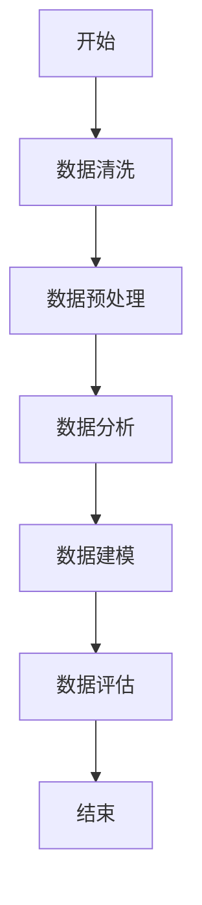
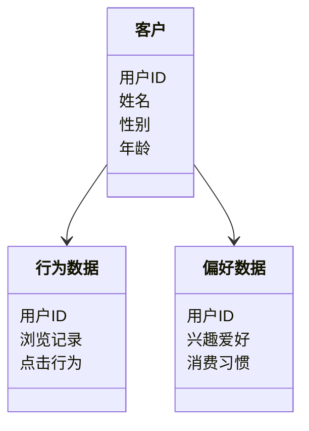
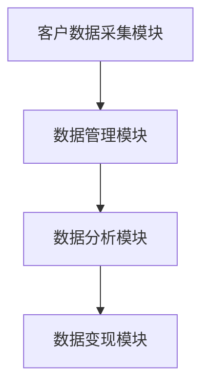

                 


# 彼得林奇如何评估公司的客户数据变现能力

## 关键词：客户数据、数据变现、数据评估、彼得林奇、数据价值

## 摘要：  
本文深入分析了彼得·林奇如何评估公司的客户数据变现能力。通过详细讲解客户数据的重要性、数据价值的评估方法、数据清洗与预处理、数据分析与建模、数据价值评估的算法实现、系统架构设计以及实战案例，本文为读者提供了全面的视角来理解如何有效利用客户数据进行商业变现。  

---

## 第1章：客户数据变现的背景与重要性

### 1.1 数据资产的崛起  
#### 1.1.1 数据资产的定义与特征  
数据资产是指企业通过各种渠道收集和管理的、能够为企业创造价值的数据资源。数据资产具有以下特征：  
- **可衡量性**：数据资产的价值可以通过量化指标进行评估。  
- **可操作性**：数据资产可以通过分析和挖掘，为企业决策提供支持。  
- **可扩展性**：数据资产可以通过共享和复用，为企业创造更多的价值。  

#### 1.1.2 数据资产在企业中的价值  
数据资产是企业的核心竞争力之一。通过分析客户数据，企业可以更好地理解客户需求，优化产品和服务，提升客户满意度，从而实现更高的收益。  

#### 1.1.3 数据驱动的商业革命  
随着大数据技术的发展，数据已经成为企业决策的重要依据。通过数据驱动的商业革命，企业可以实现从传统经验驱动向数据驱动的转型，从而在市场竞争中占据优势。  

### 1.2 客户数据的重要性  
#### 1.2.1 客户数据的来源与类型  
客户数据的来源包括线上和线下两种渠道：  
- **线上渠道**：通过网站、移动应用、社交媒体等渠道收集客户数据。  
- **线下渠道**：通过门店、电话、邮件等方式收集客户数据。  

客户数据的类型包括：  
- **基本信息**：姓名、性别、年龄、联系方式等。  
- **行为数据**：用户的浏览记录、购买记录、点击行为等。  
- **偏好数据**：用户的兴趣爱好、消费习惯等。  

#### 1.2.2 客户数据在企业决策中的作用  
客户数据可以帮助企业进行精准营销、客户画像构建、风险评估等。例如，通过分析客户的购买记录，企业可以预测客户的未来购买行为，从而制定精准的营销策略。  

#### 1.2.3 数据变现的商业价值  
数据变现可以通过数据销售、数据产品开发、数据服务等方式实现。例如，企业可以通过分析客户的地理位置数据，为商家提供精准的营销服务。  

### 1.3 数据变现的挑战与机遇  
#### 1.3.1 数据变现的挑战  
- **数据隐私**：客户数据的隐私保护是数据变现的主要挑战之一。  
- **数据质量**：低质量的数据难以为企业创造价值。  
- **技术门槛**：数据处理和分析需要较高的技术门槛。  

#### 1.3.2 数据变现的机遇  
- **技术进步**：大数据技术的发展为数据变现提供了技术支持。  
- **市场需求**：越来越多的企业意识到数据的价值，市场需求不断增长。  
- **商业模式创新**：数据变现的商业模式不断创新，为企业提供了更多可能性。  

---

## 第2章：客户数据价值的评估方法

### 2.1 客户数据分类与属性分析  
#### 2.1.1 数据分类标准  
数据分类标准可以根据数据的来源、类型、用途等进行分类。例如，可以根据数据的用途将客户数据分为营销数据、风控数据、产品优化数据等。  

#### 2.1.2 数据属性特征对比表  
以下是一些常见客户数据属性的特征对比表：  

| 数据属性 | 特征描述 | 示例 |  
|----------|----------|------|  
| 基本信息 | 包括姓名、性别、年龄等 | 用户ID：123，性别：男，年龄：25岁 |  
| 行为数据 | 包括浏览记录、点击行为等 | 用户ID：123，浏览记录：商品A，商品B |  
| 偏好数据 | 包括兴趣爱好、消费习惯等 | 用户ID：123，偏好：电子产品，价格区间：1000-2000元 |  

#### 2.1.3 数据分类的ER实体关系图  
以下是一个简单的ER实体关系图：  

```mermaid
er
    entity 客户 {
        key 用户ID
        attribute 姓名, 性别, 年龄
    }
    entity 行为数据 {
        key 用户ID
        attribute 浏览记录, 点击行为
    }
    entity 偏好数据 {
        key 用户ID
        attribute 兴趣爱好, 消费习惯
    }
    relationship 用户-行为数据 {
        用户 -> 行为数据
    }
    relationship 用户-偏好数据 {
        用户 -> 偏好数据
    }
```

---

### 2.2 数据价值评估模型  
#### 2.2.1 数据价值评估的核心要素  
数据价值评估的核心要素包括：  
- 数据的准确性  
- 数据的完整性  
- 数据的及时性  
- 数据的关联性  

#### 2.2.2 数据价值评估的数学模型  
以下是一个简单的数据价值评估模型：  

$$ \text{数据价值} = \alpha \times \text{准确性} + \beta \times \text{完整性} + \gamma \times \text{及时性} + \delta \times \text{关联性} $$  

其中，$\alpha$、$\beta$、$\gamma$、$\delta$ 是权重系数，具体数值可以根据实际情况调整。  

#### 2.2.3 数据价值评估的流程图  
以下是一个数据价值评估的流程图：  



---

### 2.3 数据变现模式分析  
#### 2.3.1 数据变现的主要模式  
数据变现的主要模式包括：  
- 数据销售：将客户数据出售给第三方。  
- 数据产品：开发基于客户数据的产品，例如个性化推荐系统。  
- 数据服务：提供基于客户数据的分析服务，例如市场分析报告。  

#### 2.3.2 不同模式的优劣势对比  
以下是一个简单的优劣势对比表：  

| 模式 | 优势 | 劣势 |  
|------|------|------|  
| 数据销售 | 收入快 | 数据隐私风险高 |  
| 数据产品 | 附加值高 | 开发成本高 |  
| 数据服务 | 持续收入 | 依赖客户需求 |  

#### 2.3.3 数据变现的成功案例  
例如，某电商平台通过分析客户的购买记录和浏览行为，开发了一个个性化推荐系统，从而提高了客户的购买转化率，实现了数据变现。  

---

## 第3章：客户数据价值的评估方法与工具

### 3.1 数据清洗与预处理  
#### 3.1.1 数据清洗的必要性  
数据清洗是为了消除数据中的噪声和不一致之处，确保数据的准确性和一致性。  

#### 3.1.2 数据预处理的步骤  
数据预处理的步骤包括：  
1. 数据清洗：去除重复数据、填充缺失值、删除异常值。  
2. 数据转换：对数据进行标准化、归一化处理。  
3. 数据集成：将多个数据源的数据进行集成。  

#### 3.1.3 数据清洗的工具与方法  
常用的数据清洗工具包括：  
- **Python**：使用Pandas库进行数据清洗。  
- **SQL**：使用SQL进行数据清洗。  

---

### 3.2 数据分析与建模  
#### 3.2.1 数据分析的核心步骤  
数据分析的核心步骤包括：  
1. 数据可视化：通过图表展示数据的分布和趋势。  
2. 数据探索：发现数据中的规律和趋势。  
3. 数据建模：基于数据建立数学模型。  

#### 3.2.2 数据建模的流程  
数据建模的流程包括：  
1. 确定目标：明确建模的目标。  
2. 数据准备：选择合适的算法和数据集。  
3. 模型训练：使用训练数据训练模型。  
4. 模型评估：评估模型的性能。  
5. 模型优化：优化模型的参数。  

#### 3.2.3 常用的数据分析工具  
常用的数据分析工具包括：  
- **Python**：使用NumPy、Pandas、Matplotlib库进行数据分析。  
- **R语言**：用于统计分析和数据可视化。  
- **Tableau**：用于数据可视化。  

---

### 3.3 数据价值评估的算法实现  
#### 3.3.1 数据价值评估的算法原理  
数据价值评估的算法原理包括：  
- **聚类分析**：通过聚类分析发现数据的相似性。  
- **回归分析**：通过回归分析预测数据的趋势。  
- **分类分析**：通过分类分析对数据进行分类。  

#### 3.3.2 数据价值评估的Python代码实现  
以下是一个简单的数据价值评估的Python代码示例：  

```python
import pandas as pd
from sklearn.cluster import KMeans

# 数据清洗
data = pd.read_csv('customer_data.csv')
data.dropna(inplace=True)

# 数据预处理
data['age'] = data['age'].fillna(data['age'].mean())

# 数据建模
model = KMeans(n_clusters=3)
model.fit(data[['age', 'income']])

# 数据评估
labels = model.labels_
print(labels)
```

#### 3.3.3 数据价值评估的数学模型与公式  
以下是一个简单的数据价值评估的数学模型：  

$$ \text{客户价值} = \alpha \times \text{收入} + \beta \times \text{忠诚度} $$  

其中，$\alpha$ 和 $\beta$ 是权重系数。  

---

## 第4章：客户数据价值的系统分析与架构设计

### 4.1 问题场景分析  
#### 4.1.1 数据变现的业务场景  
数据变现的业务场景包括：  
- 精准营销：基于客户数据进行精准营销。  
- 产品优化：基于客户数据优化产品设计。  
- 风险控制：基于客户数据进行风险评估。  

#### 4.1.2 数据变现的系统目标  
数据变现的系统目标包括：  
- 实现客户数据的高效采集和管理。  
- 提供客户数据的分析和建模功能。  
- 支持数据变现的多种模式。  

#### 4.1.3 系统功能设计  
系统功能设计包括：  
- 数据采集模块：负责采集客户数据。  
- 数据管理模块：负责数据的存储和管理。  
- 数据分析模块：负责数据的分析和建模。  
- 数据变现模块：负责数据的变现。  

#### 4.1.4 领域模型mermaid类图  
以下是一个简单的领域模型mermaid类图：  



#### 4.1.5 系统架构设计mermaid架构图  
以下是一个简单的系统架构设计mermaid架构图：  



---

## 第5章：项目实战：基于客户数据的精准营销系统

### 5.1 项目介绍  
本项目旨在通过分析客户数据，构建一个精准营销系统，帮助企业实现数据变现。  

### 5.2 环境安装  
- **Python**：安装Python 3.8及以上版本。  
- **Pandas**：安装Pandas库（`pip install pandas`）。  
- **Matplotlib**：安装Matplotlib库（`pip install matplotlib`）。  

### 5.3 核心代码实现  
以下是一个简单的客户数据分析代码示例：  

```python
import pandas as pd
import matplotlib.pyplot as plt

# 数据加载
data = pd.read_csv('customer_data.csv')

# 数据可视化
data['age'].hist(bins=10)
plt.show()

# 数据分析
print(data.describe())
```

### 5.4 代码应用解读与分析  
上述代码实现了客户数据的加载和可视化。通过数据可视化，可以发现客户的年龄分布情况。  

### 5.5 实际案例分析  
以下是一个实际案例分析：  
某电商平台通过分析客户的购买记录和浏览行为，发现某些客户具有较高的购买意愿。因此，该平台为这些客户提供了个性化的推荐服务，从而提高了客户的购买转化率。  

### 5.6 项目小结  
本项目通过分析客户数据，构建了一个精准营销系统，帮助企业实现了数据变现。  

---

## 第6章：法律合规与数据隐私保护

### 6.1 数据隐私与合规性问题  
数据隐私和合规性问题是数据变现的主要挑战之一。企业需要遵守相关法律法规，保护客户的隐私权。  

### 6.2 数据隐私保护的最佳实践  
数据隐私保护的最佳实践包括：  
- 数据加密：对敏感数据进行加密处理。  
- 访问控制：限制数据的访问权限。  
- 数据匿名化：对数据进行匿名化处理。  

---

## 第7章：总结与展望

### 7.1 本章总结  
本文详细分析了彼得·林奇如何评估公司的客户数据变现能力。通过数据清洗、数据分析、数据建模等方法，企业可以有效利用客户数据进行商业变现。  

### 7.2 未来展望  
随着大数据技术的不断发展，客户数据的变现能力将越来越重要。未来，企业需要更加注重数据隐私保护，探索更多数据变现的模式。  

---

## 作者：AI天才研究院/AI Genius Institute & 禅与计算机程序设计艺术 /Zen And The Art of Computer Programming

