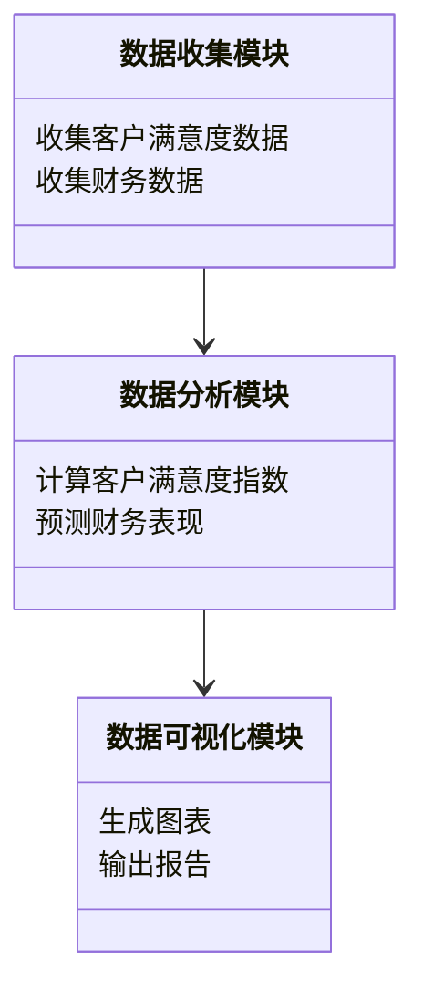

                 


# 彼得林奇如何评估公司的客户满意度与财务表现关系

## 关键词：客户满意度，财务表现，投资分析，彼得·林奇方法，数据分析，企业风险管理

## 摘要：  
彼得·林奇作为投资界的核心人物，以其独特的分析方法闻名。本文将详细探讨客户满意度与财务表现之间的关系，并结合彼得·林奇的策略，分析如何通过客户满意度预测财务表现，评估企业投资价值。

---

## 第一部分: 客户满意度与财务表现的背景与核心概念

### 第1章: 客户满意度与财务表现的背景介绍

#### 1.1 什么是客户满意度

- **定义**：客户满意度是衡量客户对企业产品或服务满意程度的指标，通常通过调查或数据分析得出。
- **衡量指标**：包括客户净推荐值（NPS）、客户满意度指数（CSI）等。
- **核心要素**：产品质量、服务质量、响应速度等。

#### 1.2 什么是财务表现

- **定义**：财务表现是企业在一定时期内的财务状况和经营成果的综合体现。
- **关键指标**：包括净利润、营业收入、利润率、资产负债率等。
- **核心要素**：收入、成本、利润、现金流等。

#### 1.3 客户满意度与财务表现的关系

- **问题背景**：客户满意度直接影响客户忠诚度和收入，进而影响财务表现。
- **问题描述**：分析客户满意度与财务表现之间的量化关系。
- **关系模型**：客户满意度高→收入增长→财务表现改善。

### 第2章: 客户满意度与财务表现的核心概念与联系

#### 2.1 核心概念原理

- **客户满意度**：通过层次分析法（AHP）量化，确定各因素的权重。
- **财务表现**：通过关键指标分析，构建财务健康度模型。

#### 2.2 核心概念对比分析

- **属性特征对比**：客户满意度定性，财务表现定量；客户满意度影响收入，财务表现反映整体盈利能力。
- **关联性分析**：通过回归分析确定客户满意度对财务表现的影响程度。

#### 2.3 实体关系图（ER图）

```mermaid
erDiagram
    customer [
    客户
    ] {
        id : int
        name : string
        satisfaction_score : int
    }
    company [
    公司
    ] {
        id : int
        revenue : float
        profit : float
    }
    customer_satisfaction [
    客户满意度
    ] {
        id : int
        score : int
        company_id : int
    }
    revenue_prediction [
    收入预测
    ] {
        id : int
        predicted_revenue : float
        company_id : int
    }
    customer_satisfaction --> company
    revenue_prediction --> company
```

---

## 第二部分: 客户满意度与财务表现的量化分析

### 第3章: 客户满意度与财务表现的量化模型

#### 3.1 客户满意度的量化方法

- **客户满意度指数（CSI）计算公式**：
  $$ CSI = \frac{\sum (\text{权重} \times \text{评分})}{\sum \text{权重}} $$

- **层次分析法（AHP）**：用于确定客户满意度各因素的权重。

#### 3.2 财务表现的量化模型

- **财务表现预测模型**：
  $$ \text{财务表现} = \beta_0 + \beta_1 \times \text{客户满意度} + \epsilon $$

  其中，$\beta_1$表示客户满意度对财务表现的影响系数。

#### 3.3 客户满意度与财务表现的关联性分析

- **回归分析**：通过线性回归确定客户满意度与财务表现的关系。

---

## 第三部分: 客户满意度与财务表现的系统分析与架构设计

### 第4章: 系统分析与架构设计方案

#### 4.1 问题场景介绍

- **数据来源**：客户调查数据、财务报表数据。
- **目标**：构建客户满意度与财务表现的分析系统。

#### 4.2 系统功能设计



#### 4.3 系统架构设计


#### 4.4 系统接口设计

- **输入接口**：客户满意度数据接口。
- **输出接口**：财务表现预测结果接口。

#### 4.5 系统交互设计

```mermaid
sequenceDiagram
    客户满意度数据 --> 数据收集模块
    数据收集模块 --> 数据分析模块
    数据分析模块 --> 数据可视化模块
    数据可视化模块 --> 输出报告
```

---

## 第四部分: 项目实战

### 第5章: 项目实战

#### 5.1 环境安装

- **工具**：Python、Pandas、Scikit-learn。
- **数据源**：客户满意度调查数据和财务报表数据。

#### 5.2 核心实现

```python
import pandas as pd
from sklearn.linear_model import LinearRegression

# 数据加载
data = pd.read_csv('customer_satisfaction.csv')

# 特征工程
data['客户满意度'] = data['客户满意度'].astype('float')
X = data[['客户满意度']]
y = data['净利润']

# 模型训练
model = LinearRegression()
model.fit(X, y)

# 预测
predicted_profit = model.predict(X)
```

#### 5.3 代码解读

- **数据加载**：读取CSV文件中的客户满意度数据。
- **特征工程**：将客户满意度转换为数值型，并提取净利润作为目标变量。
- **模型训练**：使用线性回归模型训练客户满意度与净利润的关系。
- **预测**：利用训练好的模型预测净利润。

#### 5.4 案例分析

- **选择公司**：假设我们选择一家零售公司，分析其客户满意度与财务表现的关系。
- **数据清洗**：处理缺失值和异常值。
- **模型训练**：应用线性回归模型，计算系数$\beta_1$，确定客户满意度对净利润的影响程度。

#### 5.5 项目小结

- **结论**：客户满意度与净利润呈正相关关系。
- **结果解读**：客户满意度每提高1分，净利润预计增加$R^2$值。

---

## 第五部分: 最佳实践与小结

### 第6章: 最佳实践

#### 6.1 小结

- 客户满意度是影响财务表现的重要因素。
- 通过数据分析和模型构建，可以量化两者的关系。

#### 6.2 注意事项

- 数据质量：确保数据准确性和完整性。
- 模型选择：根据数据特点选择合适的分析方法。

#### 6.3 拓展阅读

- 推荐阅读彼得·林奇的《选股的艺术》。

---

## 作者：AI天才研究院/AI Genius Institute & 禅与计算机程序设计艺术 /Zen And The Art of Computer Programming

---

通过以上分析，我们可以清晰地看到客户满意度与财务表现之间的关系，并能够利用数据分析工具量化这种关系，从而为投资决策提供科学依据。

