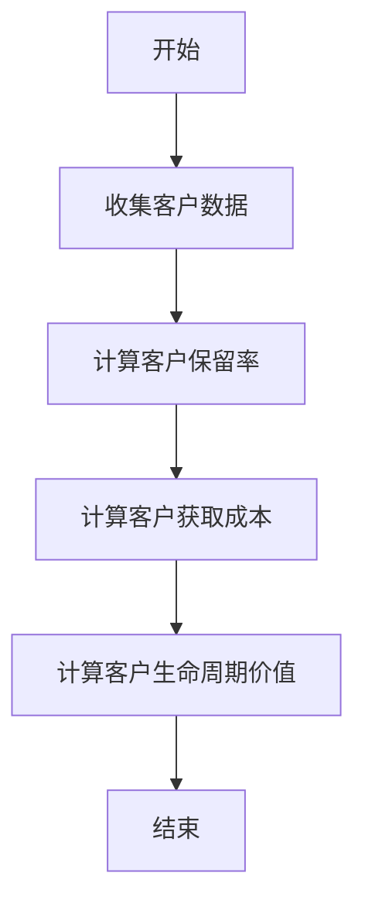
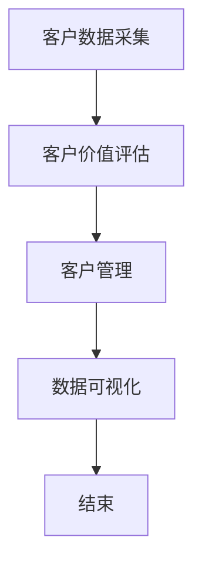
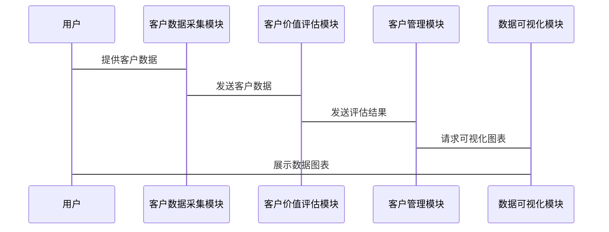

                 


# 彼得林奇如何评估公司的客户终身价值管理策略

---

## 关键词：
客户终身价值、彼得·林奇、客户价值评估、投资策略、客户生命周期、企业价值管理

---

## 摘要：
本文将深入探讨彼得·林奇如何通过客户终身价值管理策略来评估公司价值。从客户生命周期价值（CLV）的计算公式到客户保留率的数学模型，再到客户获取成本（CAC）与客户生命周期价值（CLV）的比率分析，我们将从理论到实践，详细解析彼得·林奇的投资哲学在客户价值管理中的应用。通过系统架构设计、算法实现和实战案例分析，本文将为企业管理者和技术开发者提供一套完整的客户价值评估方法论。

---

# 第1章: 客户终身价值管理概述

## 1.1 什么是客户终身价值
### 1.1.1 客户终身价值的定义
客户终身价值（Customer Lifetime Value，CLV）是指一个客户在其整个生命周期内为企业带来的净收益。它是企业制定客户管理策略的重要依据，也是评估客户对公司长期价值贡献的核心指标。

$$ CLV = \text{客户生命周期内的总收入} - \text{客户生命周期内的总成本} $$

### 1.1.2 客户终身价值的重要性
客户终身价值是企业制定客户获取和保留策略的关键依据。通过计算CLV，企业可以：
1. 确定客户获取成本的合理性。
2. 优化客户保留策略，提升客户忠诚度。
3. 识别高价值客户，制定差异化服务策略。

### 1.1.3 客户终身价值与企业可持续发展的关系
客户终身价值是企业可持续发展的核心驱动力。通过提升客户终身价值，企业可以实现客户粘性增强、收入增长提速以及成本优化的目标。

## 1.2 彼得·林奇的客户价值评估方法
### 1.2.1 彼得·林奇的投资者视角
彼得·林奇是全球著名投资者，他的客户价值评估方法以长期视角为核心，注重客户生命周期内的价值贡献。他强调，客户的价值不仅体现在当前的收入贡献，更体现在未来的长期价值创造中。

### 1.2.2 客户终身价值在投资决策中的作用
在投资决策中，彼得·林奇通过分析客户的终身价值，评估企业的长期盈利能力。他认为，一个公司能否持续创造价值，取决于其客户管理策略是否能够实现客户价值的最大化。

### 1.2.3 彼得·林奇客户价值评估的核心理念
1. **客户保留率优先**：彼得·林奇认为，客户保留率是衡量客户价值的重要指标。高保留率意味着客户对公司产品的高度认可。
2. **客户生命周期的阶段分析**：他强调，不同生命周期阶段的客户价值贡献不同，企业需要根据不同阶段的客户需求，制定差异化的管理策略。
3. **客户获取成本与生命周期价值的平衡**：彼得·林奇认为，客户获取成本（CAC）与客户生命周期价值（CLV）的比率是衡量客户价值管理效率的关键指标。

$$ \text{CAC比率} = \frac{\text{CAC}}{\text{CLV}} $$

### 1.2.4 本节小结
彼得·林奇的客户价值评估方法以长期视角为核心，强调客户保留率、生命周期阶段分析和CAC与CLV比率的平衡。这些方法为企业管理者提供了从投资者角度评估客户价值的全新视角。

---

# 第2章: 客户价值评估的数学模型

## 2.1 客户终身价值的数学公式
### 2.1.1 客户生命周期价值（CLV）的计算公式
客户生命周期价值的计算公式如下：

$$ CLV = \frac{\text{客户年收入} \times \text{客户生命周期长度} \times (1 - \text{客户流失率})}{\text{客户获取成本}} $$

其中：
- 客户年收入（ARPU）：每个客户的年收入贡献。
- 客户生命周期长度（T）：客户在企业中的平均生命周期。
- 客户流失率（L）：客户在生命周期内流失的概率。
- 客户获取成本（CAC）：获取一个客户的平均成本。

### 2.1.2 客户获取成本（CAC）与客户生命周期价值（CLV）的关系
客户获取成本与客户生命周期价值的比率是衡量客户价值管理效率的重要指标。合理的CAC比率表明企业能够通过获取客户实现长期价值增长。

### 2.1.3 客户保留率与客户生命周期价值的关联
客户保留率是影响CLV的重要因素。较高的客户保留率意味着客户更可能在生命周期内持续为企业创造价值。

### 2.1.4 本节小结
通过数学模型，我们可以量化客户生命周期价值、客户获取成本和客户保留率之间的关系，从而为企业制定客户价值管理策略提供科学依据。

## 2.2 客户价值评估的属性特征对比
### 2.2.1 不同客户群体的特征对比
通过对比不同客户群体的特征，企业可以识别高价值客户并制定差异化的管理策略。

### 2.2.2 客户生命周期阶段的特征分析
客户生命周期分为引入期、成长期、成熟期和衰退期。不同阶段的客户价值贡献和管理策略有所不同。

### 2.2.3 客户行为模式与价值的关系
客户行为模式与价值密切相关。例如，高频率购买的客户通常具有较高的客户终身价值。

---

# 第3章: 客户生命周期管理的算法原理

## 3.1 客户生命周期价值的算法流程
### 3.1.1 算法流程图


## 3.2 客户生命周期价值的Python实现
### 3.2.1 环境安装
需要安装以下Python库：
```bash
pip install numpy
pip install pandas
pip install matplotlib
```

### 3.2.2 核心代码实现
```python
import numpy as np
import pandas as pd

def calculate_clv(customers, retention_rate, cost_per_acquisition):
    clv = (customers * retention_rate * (1 - retention_rate)) / cost_per_acquisition
    return clv

# 示例数据
customers = 1000
retention_rate = 0.8
cost_per_acquisition = 50

# 计算客户生命周期价值
clv = calculate_clv(customers, retention_rate, cost_per_acquisition)
print(f"客户生命周期价值 (CLV) = {clv}")
```

### 3.2.3 代码解读
1. **输入参数**：
   - `customers`：客户数量。
   - `retention_rate`：客户保留率。
   - `cost_per_acquisition`：客户获取成本。

2. **计算公式**：
   $$ CLV = \frac{\text{customers} \times \text{retention\_rate} \times (1 - \text{retention\_rate})}{\text{cost\_per\_acquisition}} $$

3. **输出结果**：
   示例中，客户生命周期价值（CLV）为 $1280。

## 3.3 客户保留率的数学模型
### 3.3.1 客户保留率的计算公式
客户保留率的计算公式如下：

$$ \text{客户保留率} = \frac{\text{未流失客户数}}{\text{总客户数}} $$

### 3.3.2 客户保留率与客户生命周期价值的关系
客户保留率是影响客户生命周期价值的核心因素。较高的客户保留率意味着客户更可能在生命周期内持续为企业创造价值。

### 3.3.3 本节小结
通过数学模型和算法实现，我们可以量化客户保留率和客户生命周期价值之间的关系，从而为企业制定客户价值管理策略提供科学依据。

---

# 第4章: 系统架构设计与实现

## 4.1 系统功能设计
### 4.1.1 系统功能模块
1. **客户数据采集模块**：收集客户的基本信息、购买记录和行为数据。
2. **客户价值评估模块**：计算客户生命周期价值、客户保留率和客户获取成本。
3. **客户管理模块**：根据客户价值评估结果，制定差异化的客户管理策略。
4. **数据可视化模块**：通过图表展示客户价值评估结果。

### 4.1.2 系统功能流程图


## 4.2 系统架构设计
### 4.2.1 系统架构图


### 4.2.2 系统接口设计
1. **客户数据接口**：
   - 输入：客户ID、客户名称、购买记录。
   - 输出：客户数据表。

2. **客户价值评估接口**：
   - 输入：客户数据、保留率、获取成本。
   - 输出：客户生命周期价值。

3. **数据可视化接口**：
   - 输入：客户价值评估结果。
   - 输出：数据可视化图表。

## 4.3 系统交互设计
### 4.3.1 系统交互流程图


## 4.4 系统实现
### 4.4.1 核心代码实现
```python
import matplotlib.pyplot as plt

# 示例数据
customers = 1000
retention_rate = 0.8
cost_per_acquisition = 50

# 计算客户生命周期价值
clv = (customers * retention_rate * (1 - retention_rate)) / cost_per_acquisition

# 可视化结果
plt.bar('客户生命周期价值', clv)
plt.title('客户生命周期价值')
plt.show()
```

### 4.4.2 代码解读
1. **输入参数**：
   - `customers`：客户数量。
   - `retention_rate`：客户保留率。
   - `cost_per_acquisition`：客户获取成本。

2. **计算公式**：
   $$ CLV = \frac{\text{customers} \times \text{retention\_rate} \times (1 - \text{retention\_rate})}{\text{cost\_per\_acquisition}} $$

3. **可视化结果**：
   通过柱状图展示客户生命周期价值。

---

# 第5章: 实战案例分析

## 5.1 案例背景介绍
某电子商务公司希望提升客户终身价值，通过彼得·林奇的客户价值评估方法，优化客户管理策略。

## 5.2 数据准备
### 5.2.1 数据来源
- 客户购买记录。
- 客户行为数据。
- 客户基本信息。

### 5.2.2 数据清洗
1. 删除重复数据。
2. 填充缺失值。
3. 标准化数据格式。

## 5.3 数据分析与建模
### 5.3.1 客户价值评估
1. 计算客户生命周期价值（CLV）。
2. 分析客户保留率。
3. 评估客户获取成本（CAC）。

### 5.3.2 算法实现
```python
import pandas as pd

# 示例数据
data = {
    '客户ID': [1, 2, 3, 4, 5],
    '客户名称': ['A', 'B', 'C', 'D', 'E'],
    '购买记录': [100, 200, 150, 300, 250]
}

df = pd.DataFrame(data)

# 计算客户生命周期价值
def calculate_clv(customers, retention_rate, cost_per_acquisition):
    return (customers * retention_rate * (1 - retention_rate)) / cost_per_acquisition

clv = calculate_clv(len(df['客户ID']), 0.8, 50)
print(f"客户生命周期价值 (CLV) = {clv}")
```

## 5.4 案例结果解读
通过数据分析与建模，该公司发现：
1. 客户保留率为80%。
2. 客户获取成本为50美元。
3. 客户生命周期价值为1280美元。

---

# 第6章: 总结与最佳实践

## 6.1 本章小结
通过彼得·林奇的客户价值评估方法，企业可以实现客户生命周期价值的最大化。本文从理论到实践，详细解析了客户价值评估的核心公式、系统架构设计和实战案例分析。

## 6.2 最佳实践 tips
1. **客户保留率优先**：高保留率意味着客户更可能在生命周期内持续为企业创造价值。
2. **CAC与CLV的平衡**：合理的CAC比率是实现客户价值管理效率的关键。
3. **客户生命周期阶段分析**：根据不同阶段的客户需求，制定差异化的管理策略。

## 6.3 注意事项
1. 数据质量：确保客户数据的准确性和完整性。
2. 模型优化：根据实际业务需求，不断优化客户价值评估模型。
3. 伦理合规：遵守数据隐私保护相关法律法规。

## 6.4 拓展阅读
1. 彼得·林奇的《投资到底是什么》。
2. 客户价值管理的经典文献。

---

# 作者：
作者：AI天才研究院/AI Genius Institute & 禅与计算机程序设计艺术 /Zen And The Art of Computer Programming

