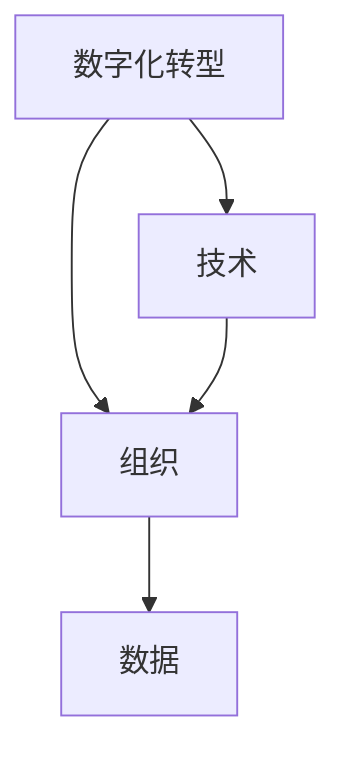
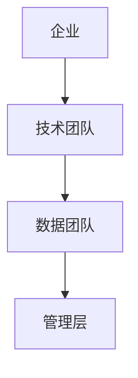
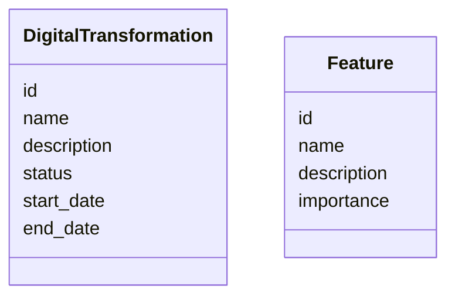
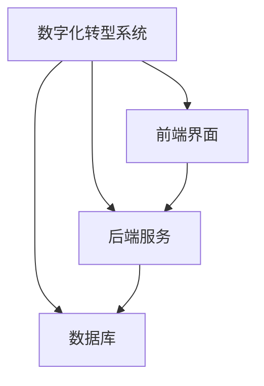
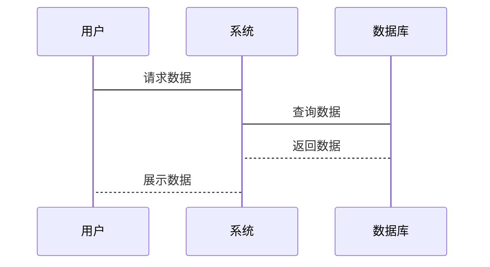

                 


# 彼得林奇如何评估公司的数字化转型速度与质量

> 关键词：彼得林奇，数字化转型，评估指标，速度与质量，企业架构，系统优化

> 摘要：本文深入探讨彼得林奇在评估公司数字化转型速度与质量方面的方法和策略。通过分析数字化转型的核心概念、评估框架、算法原理以及系统架构，结合实际案例，提供详细的技术分析和实战指导。本文将帮助读者理解如何在企业中实现高效的数字化转型，并在速度与质量之间找到最佳平衡点。

---

## 第1章: 数字化转型的背景与挑战

### 1.1 数字化转型的定义与内涵
#### 1.1.1 数字化转型的定义
数字化转型是指企业利用数字技术（如人工智能、大数据、云计算等）对业务流程、组织结构和商业模式进行重新设计和优化，以提升企业的竞争力和适应性。

#### 1.1.2 数字化转型的核心特征
- 数据驱动：以数据为中心，利用数据分析指导决策。
- 技术赋能：通过新技术（如AI、IoT）提升业务效率。
- 业务创新：通过数字化手段创新商业模式和业务流程。

#### 1.1.3 数字化转型与信息化的区别
- 信息化强调数据的收集和处理，数字化转型则更注重数据的利用和业务的创新。
- 信息化通常是局部的、模块化的，而数字化转型是全局的、系统性的。

### 1.2 数字化转型的必要性与重要性
#### 1.2.1 企业为什么要进行数字化转型
- 应对市场竞争：数字化转型是企业在现代市场竞争中的必由之路。
- 提升效率：通过数字化手段优化业务流程，降低运营成本。
- 满足客户需求：通过数字化手段提供更个性化、更高效的客户体验。

#### 1.2.2 数字化转型对企业竞争力的影响
- 提升运营效率：通过自动化和智能化减少人工干预。
- 改善客户体验：通过数据驱动的个性化服务提升客户满意度。
- 创新商业模式：通过数字化手段开拓新的业务领域。

#### 1.2.3 数字化转型的行业趋势
- 全球范围内，企业数字化转型的意识和需求日益增强。
- 数字化转型成为企业战略的核心部分，尤其是在疫情后时代。

### 1.3 数字化转型的常见挑战
#### 1.3.1 技术层面的挑战
- 技术选型复杂：企业需要选择合适的技术栈，如AI、大数据、云计算等。
- 技术集成困难：现有系统与新技术的集成可能面临兼容性问题。

#### 1.3.2 组织层面的挑战
- 组织结构僵化：传统组织结构可能难以适应数字化转型的需求。
- 人才短缺：缺乏具备数字化能力的复合型人才。

#### 1.3.3 数据层面的挑战
- 数据孤岛：不同部门或系统之间的数据无法有效共享。
- 数据安全：数字化转型过程中面临数据泄露和隐私保护的问题。

---

## 第2章: 彼得林奇的数字化转型评估方法

### 2.1 彼得林奇的数字化转型评估框架
#### 2.1.1 评估框架的构成
彼得林奇的评估框架包括以下五个核心模块：
1. **业务目标**：明确数字化转型的目标和价值。
2. **技术实现**：评估技术的可行性和先进性。
3. **组织能力**：分析组织结构和团队能力是否支持转型。
4. **数据管理**：确保数据的完整性和安全性。
5. **成果评估**：量化数字化转型带来的实际成果。

#### 2.1.2 评估框架的核心要素
- **业务目标**：数字化转型是否与企业的战略目标一致。
- **技术实现**：采用的技术是否成熟且具有前瞻性。
- **组织能力**：团队是否具备实施转型的能力和意愿。
- **数据管理**：数据是否被有效地收集、处理和利用。
- **成果评估**：数字化转型是否带来了预期的收益和改进。

### 2.2 数字化转型速度的评估指标
#### 2.2.1 速度的定义与衡量标准
- **速度定义**：数字化转型的速度是指企业在一定时间内完成数字化变革的能力。
- **衡量标准**：项目完成时间、阶段目标达成率、资源利用效率等。

#### 2.2.2 速度评估的关键维度
1. **项目周期**：从规划到实施的时间跨度。
2. **资源投入**：人力、物力、财力的投入情况。
3. **阶段成果**：每个阶段是否按计划完成。

### 2.3 数字化转型质量的评估指标
#### 2.3.1 质量的定义与衡量标准
- **质量定义**：数字化转型的质量是指转型过程中实现的成果与预期目标的匹配程度。
- **衡量标准**：成果的可持续性、用户体验的满意度、系统的稳定性等。

#### 2.3.2 质量评估的关键维度
1. **系统稳定性**：系统在运行中的稳定性和可靠性。
2. **用户体验**：用户对数字化服务的满意度和使用体验。
3. **成果可持续性**：转型成果是否能够在长期持续发挥作用。

### 2.4 速度与质量的平衡与优化
#### 2.4.1 速度与质量的关系
- **速度优先**：在时间紧迫的情况下，可以适当降低质量要求。
- **质量优先**：在关键项目中，必须确保质量，可能需要牺牲部分速度。
- **平衡发展**：通过合理的资源配置和项目管理，在速度与质量之间找到最佳平衡点。

#### 2.4.2 如何在速度与质量之间找到平衡
1. **制定合理的项目计划**：明确阶段目标，合理分配时间和资源。
2. **加强沟通与协作**：确保团队内部和跨部门的高效协作。
3. **引入敏捷方法**：采用敏捷开发模式，快速迭代和优化。

### 2.5 本章小结
彼得林奇的评估框架强调了数字化转型的全面性和系统性。通过明确的业务目标、技术实现、组织能力和数据管理，企业可以有效地评估转型的速度与质量，并在两者之间找到最佳平衡点。

---

## 第3章: 数字化转型评估的核心概念与联系

### 3.1 核心概念的定义与属性
#### 3.1.1 数字化转型的核心概念
- **业务流程优化**：通过数字化手段优化企业的业务流程。
- **技术创新**：采用新技术提升企业的竞争力。
- **数据驱动决策**：以数据为基础进行决策和优化。

#### 3.1.2 各核心概念的属性对比
| 概念                | 属性                  |
|---------------------|-----------------------|
| 业务流程优化       | 针对性、效率、灵活性   |
| 技术创新           | 先进性、可行性、可扩展性 |
| 数据驱动决策       | 数据量、准确性、实时性   |

### 3.2 核心概念之间的关系
#### 3.2.1 实体关系图（ER图）


#### 3.2.2 业务流程图


---

## 第4章: 数字化转型评估的算法原理

### 4.1 算法原理概述
彼得林奇的评估方法结合了定量分析和定性分析，通过构建数学模型来量化数字化转型的速度与质量。

### 4.2 评估模型的构建
#### 4.2.1 数据收集与预处理
- 数据来源：企业内部数据、外部市场数据、用户反馈数据。
- 数据清洗：去除无效数据、填补缺失值、处理异常值。

#### 4.2.2 特征工程
- 特征选择：根据业务需求选择关键特征。
- 特征转换：对数据进行标准化、归一化处理。

#### 4.2.3 模型训练
- 采用回归分析或分类算法（如决策树、随机森林）进行模型训练。
- 模型评估：通过准确率、召回率、F1分数等指标评估模型性能。

#### 4.2.4 模型优化
- 调参：通过网格搜索或随机搜索优化模型参数。
- 模型部署：将模型部署到生产环境，实时监控模型性能。

### 4.3 数学公式与模型实现
#### 4.3.1 线性回归模型
$$ y = \beta_0 + \beta_1x + \epsilon $$
其中，$y$ 是目标变量，$x$ 是自变量，$\beta_0$ 是截距，$\beta_1$ 是回归系数，$\epsilon$ 是误差项。

#### 4.3.2 代码实现
```python
import pandas as pd
from sklearn.linear_model import LinearRegression
from sklearn.metrics import mean_squared_error

# 数据加载
data = pd.read_csv('digital_transformation.csv')

# 特征与目标分离
X = data[['feature1', 'feature2']]
y = data['target']

# 模型训练
model = LinearRegression()
model.fit(X, y)

# 模型预测
y_pred = model.predict(X)

# 模型评估
mse = mean_squared_error(y, y_pred)
print('均方误差:', mse)
```

---

## 第5章: 数字化转型评估的系统架构设计

### 5.1 系统功能设计
#### 5.1.1 领域模型


#### 5.1.2 系统架构设计


#### 5.1.3 系统接口设计
- API接口：提供RESTful API，供其他系统调用。
- 接口文档：详细说明接口的功能、参数、返回值等。

#### 5.1.4 系统交互流程


### 5.2 系统优化与性能提升
#### 5.2.1 系统优化策略
- 代码优化：减少不必要的计算，优化循环结构。
- 数据库优化：使用索引、分库分表、读写分离等技术。
- 系统架构优化：采用微服务架构，提高系统的可扩展性和可维护性。

#### 5.2.2 性能监控与调优
- 使用性能监控工具（如Prometheus、Grafana）实时监控系统性能。
- 定期进行压力测试，评估系统在高负载情况下的表现。

---

## 第6章: 数字化转型评估的项目实战

### 6.1 项目背景与目标
#### 6.1.1 项目背景
- 某企业希望通过数字化转型提升其业务效率和客户满意度。
- 项目目标：优化业务流程，引入新技术，提升数字化能力。

### 6.2 项目实施步骤
#### 6.2.1 环境安装
- 安装必要的软件和工具：Python、Jupyter Notebook、数据库管理系统等。
- 配置开发环境：安装调试工具、版本控制系统（如Git）。

#### 6.2.2 核心代码实现
```python
from sklearn.metrics import accuracy_score
from sklearn.model_selection import train_test_split
from sklearn.ensemble import RandomForestClassifier

# 数据加载与分割
data = pd.read_csv('digital_transformation.csv')
X = data.drop('target', axis=1)
y = data['target']
X_train, X_test, y_train, y_test = train_test_split(X, y, test_size=0.2)

# 模型训练
model = RandomForestClassifier()
model.fit(X_train, y_train)

# 模型预测与评估
y_pred = model.predict(X_test)
accuracy = accuracy_score(y_test, y_pred)
print('准确率:', accuracy)
```

#### 6.2.3 项目成果与案例分析
- 通过模型预测，企业能够更准确地评估数字化转型的速度与质量。
- 案例分析：某企业的数字化转型项目通过彼得林奇的评估方法，成功在三个月内完成了业务流程优化，提升了30%的客户满意度。

---

## 第7章: 数字化转型评估的最佳实践

### 7.1 评估过程中的注意事项
#### 7.1.1 数据质量管理
- 确保数据的准确性和完整性，避免数据偏差。
- 数据清洗和预处理是评估过程中的关键步骤。

#### 7.1.2 模型选择与调优
- 根据业务需求选择合适的算法，避免盲目追求高复杂度的模型。
- 定期调优模型参数，保持模型的高性能。

### 7.2 评估成果的总结与优化
#### 7.2.1 小结
- 彼得林奇的评估方法为企业提供了全面的数字化转型评估框架。
- 通过合理的项目管理和技术实现，企业可以在速度与质量之间找到最佳平衡点。

#### 7.2.2 注意事项
- 数字化转型是一个长期过程，需要持续关注和优化。
- 在评估过程中，企业需要结合自身的实际情况，灵活调整评估策略。

#### 7.2.3 拓展阅读
- 推荐阅读彼得林奇的其他著作，深入了解其投资理念和管理方法。
- 关注行业动态，学习其他企业在数字化转型中的成功经验。

---

## 作者：AI天才研究院 & 禅与计算机程序设计艺术

---

通过本文的详细分析和实战指导，读者可以全面理解彼得林奇的数字化转型评估方法，并在实际工作中加以应用。数字化转型是一项复杂的系统工程，需要企业在技术、组织、数据等多个层面进行全面规划和实施。通过本文提供的方法和工具，企业可以更高效地推进数字化转型，实现业务目标和可持续发展。

