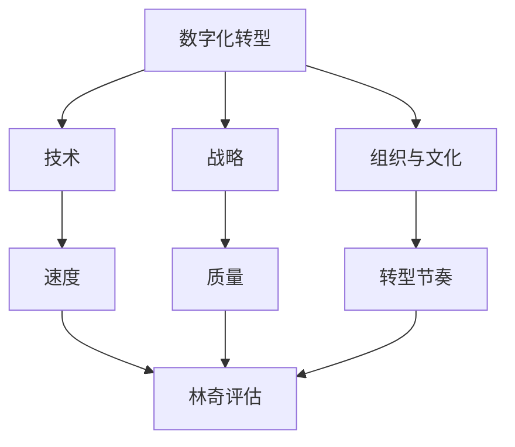
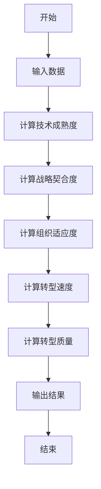
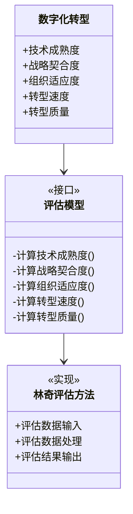
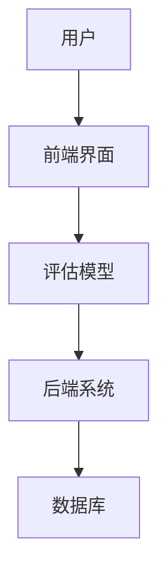

                 


# 彼得林奇如何评估公司的数字化转型速度与质量平衡

> 关键词：彼得·林奇，数字化转型，速度与质量平衡，投资评估，系统架构

> 摘要：本文探讨了彼得·林奇的投资理念在公司数字化转型中的应用，重点分析如何在数字化转型中平衡速度与质量，并通过系统架构设计和实际案例，详细阐述了林奇评估方法在数字化转型中的实践。

---

# 第一部分: 数字化转型的背景与核心概念

## 第1章: 数字化转型的背景与问题背景

### 1.1 数字化转型的定义与核心概念

#### 1.1.1 数字化转型的定义
数字化转型是指企业利用数字技术（如人工智能、大数据、云计算等）重新设计业务流程、商业模式和客户体验，以实现业务创新和效率提升的过程。其核心在于将传统业务模式与数字技术深度融合，构建新的竞争优势。

#### 1.1.2 数字化转型的核心要素
- **技术维度**：包括云计算、大数据、人工智能等技术的引入与应用。
- **战略维度**：企业需要制定清晰的数字化战略，明确转型目标和路径。
- **组织与文化维度**：组织结构和文化需要适应数字化要求，培养创新和协作能力。

#### 1.1.3 数字化转型的背景与趋势
随着技术的进步和市场竞争的加剧，数字化转型已成为企业生存和发展的必经之路。企业需要在数字化转型中找到速度与质量的平衡点，既要快速响应市场变化，又要确保转型的稳健性。

---

### 1.2 彼得·林奇的评估方法与投资理念

#### 1.2.1 彼得·林奇的投资哲学
彼得·林奇是著名的投资专家，他的投资理念强调基本面分析、长期投资和风险管理。他认为，成功的投资需要对企业的内在价值有深刻的理解，并关注企业的成长潜力和管理层能力。

#### 1.2.2 林奇的选股标准与评估体系
林奇的选股标准包括：
1. **企业基本面**：关注企业的财务状况、盈利能力和发展潜力。
2. **管理层能力**：管理层的能力和决策对企业转型至关重要。
3. **行业地位**：企业在行业中的地位和竞争优势。

#### 1.2.3 林奇方法在数字化转型中的应用
林奇的评估方法可以应用于数字化转型的评估中。企业需要评估其数字化转型的内在价值、成长潜力和管理层能力，以确保转型的顺利进行。

---

### 1.3 数字化转型中的速度与质量平衡

#### 1.3.1 数字化转型的双重目标
数字化转型需要在速度和质量之间找到平衡。速度意味着快速响应市场变化和客户需求，而质量则强调转型的稳健性和可持续性。

#### 1.3.2 速度与质量的矛盾与统一
速度与质量之间存在矛盾：追求速度可能导致质量下降，而追求质量可能会影响速度。因此，企业需要通过科学的评估方法，找到两者的最佳平衡点。

#### 1.3.3 林奇方法对转型节奏的启示
林奇的评估方法强调对企业的全面分析，这为数字化转型的节奏控制提供了启示。企业需要在转型过程中，定期评估转型的进展和效果，确保速度与质量的平衡。

---

## 第2章: 数字化转型的核心概念与联系

### 2.1 数字化转型的维度分析

#### 2.1.1 技术维度
技术是数字化转型的基础。企业需要引入先进的数字技术（如人工智能、大数据等），并确保技术的先进性和稳定性。

#### 2.1.2 战略维度
战略是数字化转型的方向。企业需要制定清晰的数字化战略，明确转型的目标和路径，并确保战略的可行性和可持续性。

#### 2.1.3 组织与文化维度
组织结构和文化是数字化转型的关键。企业需要构建适应数字化要求的组织结构，培养创新文化和协作能力。

---

### 2.2 核心概念的属性特征对比

#### 2.2.1 速度与质量的对比分析
| 属性 | 速度 | 质量 |
|------|------|------|
| 定义 | 转型的快慢 | 转型的优劣 |
| 重点 | 短期效果 | 长期效果 |
| 挑战 | 快速响应可能影响质量 | 质量控制可能影响速度 |

#### 2.2.2 技术与管理的对比分析
| 属性 | 技术 | 管理 |
|------|------|------|
| 核心 | 数字化工具和方法 | 企业组织和文化 |
| 作用 | 支持转型 | 保障转型 |
| 挑战 | 技术选型和实施 | 管理变革和文化重塑 |

#### 2.2.3 数字化与传统的对比分析
| 属性 | 数字化 | 传统 |
|------|------|------|
| 模式 | 数字化驱动 | 传统业务驱动 |
| 技术 | 高度依赖数字技术 | 依赖传统技术 |
| 挑战 | 数字化转型的不确定性和复杂性 | 传统模式的稳定性和可预测性 |

---

### 2.3 ER实体关系图架构



---

## 第3章: 数字化转型的算法原理

### 3.1 评估模型的设计

#### 3.1.1 构建指标体系
为了平衡速度与质量，我们需要构建一个综合指标体系，包括以下几个方面：
1. **技术成熟度**：评估技术的先进性和稳定性。
2. **战略契合度**：评估战略与企业目标的契合程度。
3. **组织适应度**：评估组织结构和文化的适应性。
4. **转型速度**：评估转型的快慢程度。
5. **转型质量**：评估转型的效果和可持续性。

#### 3.1.2 评估框架的设计
评估框架包括以下几个步骤：
1. **数据收集**：收集企业的技术、战略、组织等方面的数据。
2. **指标计算**：根据指标体系，计算各项指标的得分。
3. **综合评估**：根据各项指标的得分，综合评估转型的速度与质量。

#### 3.1.3 算法的实现步骤
1. 数据预处理：清洗和标准化数据。
2. 指标计算：使用加权平均法计算各项指标的得分。
3. 综合评估：根据权重分配，计算综合得分，并生成评估报告。

---

### 3.2 评估模型的数学模型

$$
\text{转型质量} = \frac{\text{技术成熟度} \times \text{战略契合度} \times \text{组织适应度}}{\text{转型速度}}
$$

其中：
- 技术成熟度：取值范围为1-5，分数越高，技术越成熟。
- 战略契合度：取值范围为1-5，分数越高，战略越契合。
- 组织适应度：取值范围为1-5，分数越高，组织越适应。
- 转型速度：取值范围为1-5，分数越低，转型越快。

---

### 3.3 算法流程图



---

## 第4章: 系统分析与架构设计

### 4.1 问题场景介绍

#### 4.1.1 企业数字化转型的常见问题
企业在数字化转型中可能面临以下问题：
1. 技术选型不当，导致转型失败。
2. 战略规划不合理，导致资源浪费。
3. 组织结构不适应数字化要求，导致协作困难。

#### 4.1.2 林奇评估方法的应用场景
林奇评估方法适用于企业数字化转型的各个阶段，特别是在评估转型的速度与质量时，可以提供科学的决策依据。

#### 4.1.3 系统设计的目标与范围
系统设计的目标是构建一个数字化转型评估系统，帮助企业在转型中平衡速度与质量。系统设计的范围包括技术实现、功能设计和架构设计。

---

### 4.2 系统功能设计

#### 4.2.1 领域模型设计



---

### 4.3 系统架构设计

#### 4.3.1 系统架构图



---

## 第5章: 项目实战

### 5.1 环境安装

#### 5.1.1 系统环境要求
- 操作系统：Windows 10 或更高版本，或 macOS 10.15 或更高版本。
- 开发工具：Visual Studio 2022 或更高版本，或 IntelliJ IDEA 2022 或更高版本。
- 数据库：MySQL 8.0 或更高版本。

#### 5.1.2 第三方依赖安装
```bash
pip install numpy
pip install pandas
pip install matplotlib
```

---

### 5.2 系统核心实现源代码

#### 5.2.1 评估模型实现
```python
import numpy as np
import pandas as pd

class DigitalTransformationAssessment:
    def __init__(self):
        self.weights = {
            '技术成熟度': 0.3,
            '战略契合度': 0.3,
            '组织适应度': 0.2,
            '转型速度': 0.2
        }
        
    def compute_technology_maturity(self, data):
        return np.mean(data['技术成熟度'])
    
    def compute_strategy_alignment(self, data):
        return np.mean(data['战略契合度'])
    
    def compute_organization_adaptability(self, data):
        return np.mean(data['组织适应度'])
    
    def compute_transformation_speed(self, data):
        return np.mean(data['转型速度'])
    
    def compute_quality(self, data):
        maturity = self.compute_technology_maturity(data)
        alignment = self.compute_strategy_alignment(data)
        adaptability = self.compute_organization_adaptability(data)
        speed = self.compute_transformation_speed(data)
        
        quality = (maturity * alignment * adaptability) / speed
        return quality
```

#### 5.2.2 代码应用解读与分析
上述代码定义了一个数字化转型评估类，包括技术成熟度、战略契合度、组织适应度和转型速度的计算方法，以及转型质量的综合评估方法。代码通过加权平均的方法，计算各项指标的得分，并最终得出转型质量的综合得分。

---

### 5.3 实际案例分析

#### 5.3.1 案例背景
某零售企业计划进行数字化转型，目标是通过引入人工智能技术，优化供应链管理，提升客户体验。企业在转型中需要平衡技术实施的速度与质量。

#### 5.3.2 数据输入与处理
```python
data = {
    '技术成熟度': [4, 3, 5, 4],
    '战略契合度': [5, 4, 3, 4],
    '组织适应度': [3, 4, 4, 5],
    '转型速度': [3, 4, 5, 2]
}

df = pd.DataFrame(data)
```

#### 5.3.3 评估结果输出
```python
assess = DigitalTransformationAssessment()
quality = assess.compute_quality(df)
print(f"转型质量得分：{quality}")
```

---

## 第6章: 最佳实践、小结、注意事项与拓展阅读

### 6.1 最佳实践
- 在数字化转型中，企业需要注重技术、战略和组织的综合评估，确保转型的稳健性。
- 林奇评估方法可以作为数字化转型评估的重要参考，帮助企业平衡速度与质量。

### 6.2 小结
本文通过分析彼得·林奇的投资理念，探讨了其在数字化转型中的应用。通过构建综合评估模型，帮助企业平衡转型的速度与质量，确保数字化转型的顺利进行。

### 6.3 注意事项
- 数字化转型需要长期投入，企业需要做好充分的准备。
- 林奇评估方法只是一个工具，企业需要根据自身实际情况进行调整。

### 6.4 拓展阅读
- 彼得·林奇的《投资之道》
- 数字化转型相关的学术论文和行业报告

---

# 作者：AI天才研究院/AI Genius Institute & 禅与计算机程序设计艺术 /Zen And The Art of Computer Programming

