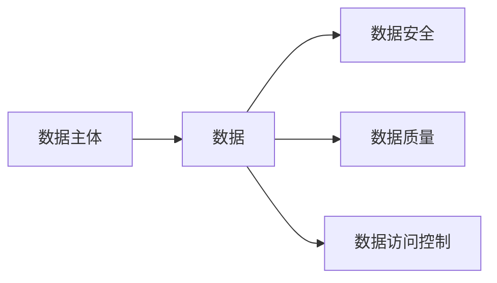
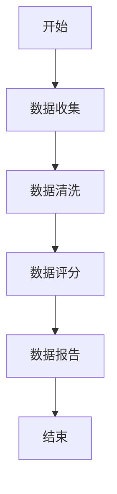
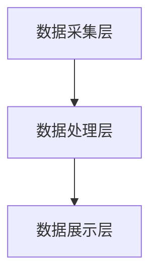
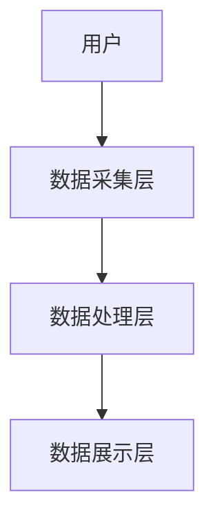

                 


# 彼得林奇如何评估公司的数据治理能力

## 关键词：数据治理，彼得·林奇，企业评估，数据安全，数据质量

## 摘要：  
本文通过分析彼得·林奇的评估方法，探讨如何将这些方法应用于公司的数据治理能力评估。文章从数据治理的核心概念、算法原理、系统架构到项目实战，全面解析了数据治理的评估过程，并结合实际案例进行了详细分析。通过本文，读者可以了解如何从数据安全、数据质量、数据访问控制等多个维度，评估公司的数据治理能力，从而提升企业的整体竞争力。

---

# 第一部分: 数据治理与彼得·林奇的评估方法基础

## 第1章: 数据治理与彼得·林奇评估方法的背景介绍

### 1.1 数据治理的重要性  
数据治理是企业管理和利用数据的核心能力，直接影响企业的决策效率、数据安全和合规性。随着数字化转型的推进，数据成为企业的核心资产，数据治理的重要性日益凸显。

#### 1.1.1 数据在企业中的核心地位  
数据是企业决策的依据，也是业务创新的基础。有效的数据治理能够确保数据的准确性、完整性和一致性，为企业提供可靠的信息支持。

#### 1.1.2 数据治理的基本概念  
数据治理是指通过制定政策、流程和工具，确保数据的正确使用、存储和管理。它涵盖了数据的全生命周期管理，包括数据的生成、存储、处理、分析和应用。

#### 1.1.3 数据治理的必要性与挑战  
数据治理的必要性体现在保障数据安全、提升数据质量、降低数据风险等方面。然而，数据治理也面临数据分散、管理复杂、合规性要求高等挑战。

### 1.2 彼得·林奇的评估方法  
彼得·林奇是著名的投资经理，他的投资理念强调对企业基本面的深入分析。将这种方法应用于数据治理能力的评估，可以帮助企业发现数据管理中的潜在问题。

#### 1.2.1 彼得·林奇的背景与投资理念  
彼得·林奇以其价值投资理念闻名，他注重分析企业的财务状况、管理团队和市场竞争力。他的方法强调对企业基本面的全面了解。

#### 1.2.2 数据治理能力与企业价值的关系  
数据治理能力是企业核心竞争力的重要组成部分。良好的数据治理能够提升企业的决策效率、降低数据风险，从而为企业创造更大的价值。

#### 1.2.3 彼得·林奇评估方法的核心要素  
彼得·林奇的评估方法注重对企业基本面的分析，包括财务状况、管理团队和市场竞争力。将其应用于数据治理能力评估，需要关注数据的准确性、数据的利用效率和数据的安全性。

### 1.3 数据治理能力的定义与外延  
数据治理能力是指企业在数据全生命周期中，能够有效管理和利用数据的能力。它不仅包括数据的存储和处理，还包括数据的安全、合规和应用。

#### 1.3.1 数据治理能力的定义  
数据治理能力是指企业在数据全生命周期中，通过制定政策、流程和工具，确保数据的准确、完整、安全和合规的能力。

#### 1.3.2 数据治理能力的核心要素  
数据治理能力的核心要素包括数据安全、数据质量、数据访问控制和数据生命周期管理。

#### 1.3.3 数据治理能力的边界与外延  
数据治理能力的边界在于数据的全生命周期管理，外延则包括数据的利用效率和数据的创新能力。

## 第2章: 数据治理的核心概念与联系

### 2.1 数据治理的核心概念  
数据治理涉及多个核心概念，包括数据安全、数据质量、数据访问控制等。

#### 2.1.1 数据安全  
数据安全是指保护数据不被未经授权的访问、泄露或篡改。数据安全是数据治理的基础，确保数据的机密性和完整性。

#### 2.1.2 数据质量  
数据质量是指数据的准确性、完整性和一致性。高质量的数据是企业决策的基础，数据质量直接影响企业的业务效率和决策能力。

#### 2.1.3 数据访问控制  
数据访问控制是指通过权限管理，确保只有授权的用户才能访问特定的数据。数据访问控制是数据安全的重要组成部分，防止数据泄露和滥用。

### 2.2 核心概念的联系  
数据治理的核心概念之间存在密切的联系，可以通过实体关系图来展示。

#### 2.2.1 数据治理的实体关系图  


### 2.3 数据治理的核心原理  
数据治理的核心原理包括数据的全生命周期管理、数据的安全性和数据的质量控制。

#### 2.3.1 数据治理的原理  
数据治理的原理包括数据的全生命周期管理、数据的安全性和数据的质量控制。通过这些原理，企业可以有效管理和利用数据。

#### 2.3.2 数据治理的属性特征对比表  
| 属性 | 数据安全 | 数据质量 | 数据访问控制 |
|------|----------|----------|---------------|
| 定义 | 保护数据不被未经授权的访问、泄露或篡改 | 数据的准确性、完整性和一致性 | 通过权限管理，确保只有授权的用户才能访问特定的数据 |
| 重要性 | 数据安全是数据治理的基础 | 数据质量直接影响企业的业务效率和决策能力 | 数据访问控制是数据安全的重要组成部分，防止数据泄露和滥用 |

## 第3章: 数据治理能力评估的算法原理

### 3.1 数据治理评估算法概述  
数据治理能力评估算法是通过一定的数学模型，量化企业数据治理能力的工具。

#### 3.1.1 算法的基本原理  
数据治理能力评估算法的基本原理包括数据的收集、清洗、评分和报告。通过这些步骤，算法可以量化企业的数据治理能力。

#### 3.1.2 算法的核心思想  
数据治理能力评估算法的核心思想是通过量化数据的安全性、质量和利用效率，评估企业的数据治理能力。

#### 3.1.3 算法的输入与输出  
算法的输入包括企业的数据安全状况、数据质量和数据访问控制情况。算法的输出是企业数据治理能力的评分和报告。

### 3.2 数据治理评估算法的实现  
数据治理评估算法的实现需要通过数据的收集、清洗、评分和报告四个步骤。

#### 3.2.1 算法的流程图  


#### 3.2.2 数据治理评估算法的数学模型  
数据治理能力评分公式：  
$$ \text{数据治理能力评分} = \frac{\text{数据安全评分} + \text{数据质量评分} + \text{数据访问控制评分}}{3} $$

### 3.3 数据治理评估的数学模型  
数据治理能力的评分公式：  
$$ \text{数据治理能力评分} = \frac{\text{数据安全评分} + \text{数据质量评分} + \text{数据访问控制评分}}{3} $$

---

# 第二部分: 数据治理能力评估的系统架构与项目实战

## 第4章: 数据治理能力评估的系统架构设计

### 4.1 项目介绍  
数据治理能力评估系统是一个帮助企业量化数据治理能力的工具。通过系统的数据收集、清洗和评分，企业可以了解自身数据治理能力的现状。

#### 4.1.1 系统功能设计  
数据治理能力评估系统的功能包括数据收集、数据清洗、数据评分和数据报告。

#### 4.1.2 系统架构设计  
数据治理能力评估系统的架构包括数据采集层、数据处理层和数据展示层。

### 4.2 系统架构设计  
数据治理能力评估系统的架构设计可以通过mermaid图展示。

#### 4.2.1 系统架构图  


### 4.3 系统接口设计  
数据治理能力评估系统需要与企业的数据源进行接口对接，包括数据库、文件系统和API接口。

#### 4.3.1 数据接口设计  
数据接口设计需要考虑数据源的类型和格式，确保数据的准确采集和处理。

### 4.4 系统交互设计  
数据治理能力评估系统的交互设计包括用户界面、数据输入和数据输出。

#### 4.4.1 系统交互图  


## 第5章: 数据治理能力评估的项目实战

### 5.1 项目环境配置  
数据治理能力评估项目需要安装必要的工具和环境，包括Python、数据分析工具和数据库。

#### 5.1.1 环境安装  
安装Python、Jupyter Notebook和Pandas等工具。

### 5.2 核心代码实现  
数据治理能力评估的核心代码包括数据的收集、清洗和评分。

#### 5.2.1 数据收集代码  
```python
import pandas as pd

def collect_data():
    data = pd.read_csv('data.csv')
    return data

data = collect_data()
print(data.head())
```

#### 5.2.2 数据清洗代码  
```python
def clean_data(data):
    data.dropna(inplace=True)
    data['date'] = pd.to_datetime(data['date'])
    return data

clean_data(data)
```

#### 5.2.3 数据评分代码  
```python
def calculate_scores(data):
    security_score = data['security'].mean()
    quality_score = data['quality'].mean()
    access_score = data['access'].mean()
    return security_score, quality_score, access_score

scores = calculate_scores(data)
print(scores)
```

### 5.3 项目小结  
通过项目实战，读者可以了解数据治理能力评估的具体实现过程，包括数据的收集、清洗和评分。

---

## 第6章: 数据治理能力评估的最佳实践

### 6.1 关键点总结  
数据治理能力评估的关键点包括数据的收集、清洗、评分和报告。

#### 6.1.1 数据治理能力评估的关键点  
数据治理能力评估的关键点包括数据的收集、清洗、评分和报告。这些步骤是评估数据治理能力的基础。

### 6.2 小结  
通过本文的分析，读者可以了解如何从数据安全、数据质量和数据访问控制等多个维度，评估公司的数据治理能力。

### 6.3 注意事项  
数据治理能力评估需要注意数据的准确性和完整性，避免数据偏差和错误。

### 6.4 拓展阅读  
读者可以进一步阅读《数据治理：方法与实践》和《企业数据管理：理论与应用》等书籍，深入了解数据治理的相关知识。

---

## 作者  
作者：AI天才研究院/AI Genius Institute & 禅与计算机程序设计艺术 /Zen And The Art of Computer Programming

