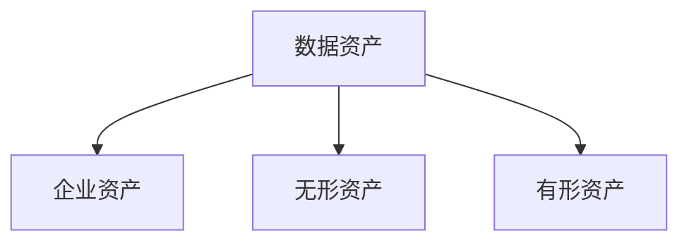
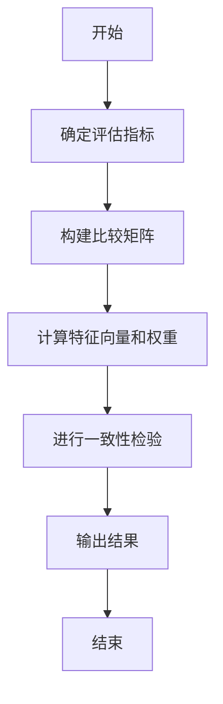
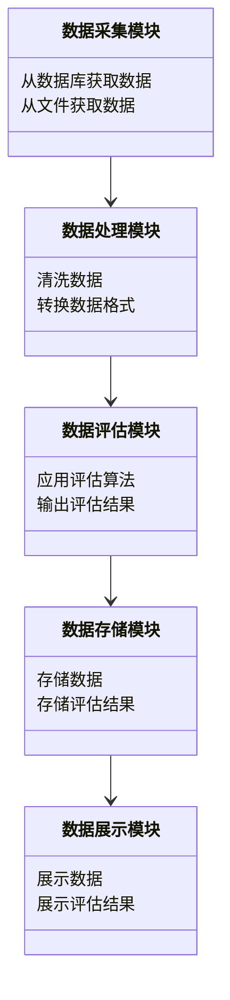
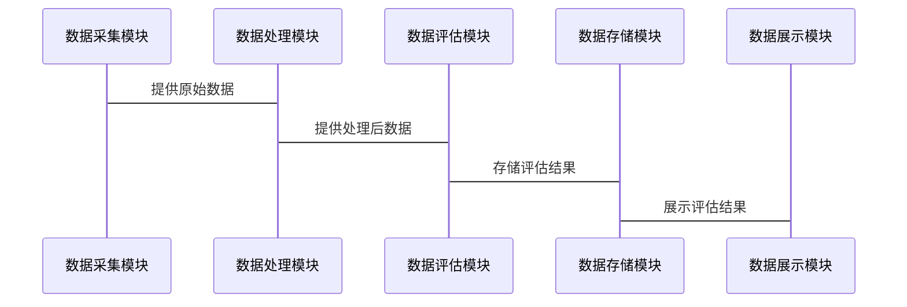

                 


# 彼得林奇如何评估公司的数据资产价值

## 关键词：数据资产价值、彼得林奇、数据资产评估、企业数据管理、数据驱动决策

## 摘要：  
彼得·林奇是全球著名投资专家，他强调通过基本面分析和数据驱动的方法评估企业价值。本文将探讨彼得林奇如何评估公司的数据资产价值，包括数据资产的定义、分类、评估方法、算法原理以及实际应用案例。通过分析数据资产的生命周期、属性和评估维度，结合加权评分模型、层次分析模型等方法，帮助读者理解如何将数据资产转化为企业竞争优势。本文还提供了系统架构设计和项目实战案例，详细讲解数据资产评估的流程和实现。

---

# 第一部分：数据资产评估背景与核心概念

## 第1章：数据资产的定义与背景

### 1.1 数据资产的定义与分类  
数据资产是指企业拥有或控制的、能够为企业创造经济价值的数据资源。数据资产可以分为以下几类：  
- **结构化数据**：如数据库中的表格数据、关系型数据。  
- **非结构化数据**：如文本、文档、图像、视频等。  
- **半结构化数据**：如JSON、XML格式的数据。  
- **实时数据**：如物联网实时传输的数据。  

数据资产与传统资产（如固定资产、存货）不同，其价值体现在数据的可用性和洞察力上，而非物理存在。

### 1.2 数据资产的重要性  
数据资产是数字经济的核心驱动力。通过对数据的分析和挖掘，企业可以发现市场趋势、优化运营流程、提升客户体验，并创造新的商业模式。例如，零售企业可以通过数据分析优化库存管理，金融企业可以通过数据风控降低信贷风险。

### 1.3 数据资产评估的必要性  
数据资产评估是将数据资源转化为企业价值的关键步骤。通过评估，企业可以明确数据资产的价值，制定数据保护策略，并为数据驱动的决策提供依据。此外，数据资产评估也是企业上市、并购或融资的重要环节。

---

## 第2章：数据资产评估的核心概念  

### 2.1 数据资产评估的原理  
数据资产评估的原理基于数据的生命周期和属性分析。以下是数据资产评估的三个关键维度：  
1. **数据的准确性**：数据是否真实、可靠。  
2. **数据的完整性**：数据是否覆盖所有相关字段。  
3. **数据的可扩展性**：数据是否支持未来的业务扩展。  

### 2.2 数据资产评估的关键指标  
以下是数据资产评估的关键指标及其定义：  

| **指标**       | **定义**                                                                 |
|-----------------|--------------------------------------------------------------------------|
| 数据准确性      | 数据是否反映真实情况。                                                   |
| 数据完整性      | 数据是否覆盖所有必要字段。                                               |
| 数据的及时性     | 数据是否实时更新。                                                       |
| 数据的可访问性   | 数据是否易于获取和处理。                                                 |
| 数据的可扩展性   | 数据是否支持未来的业务扩展。                                             |

### 2.3 数据资产评估的边界与外延  
数据资产评估的边界是指数据资产的范围，通常包括企业的内部数据和外部数据。数据资产评估的外延则包括数据资产的存储、处理和应用过程。数据资产与其他资产的关系可以通过以下ER图表示：



---

# 第二部分：数据资产评估的算法原理  

## 第3章：数据资产评估的算法原理  

### 3.1 数据资产评估的数学模型  

#### 3.1.1 加权评分模型  
加权评分模型是一种基于数据资产属性的评估方法。其公式如下：  

$$ V = \sum_{i=1}^{n} w_i \times a_i $$  

其中，$V$ 是数据资产的价值，$w_i$ 是第 $i$ 个属性的权重，$a_i$ 是第 $i$ 个属性的评分（1-5分）。  

#### 3.1.2 层次分析模型  
层次分析模型是一种基于专家意见的评估方法。其步骤如下：  
1. 确定评估指标。  
2. 构建比较矩阵。  
3. 计算特征向量和权重。  
4. 计算一致性检验。  

#### 3.1.3 模糊综合评价模型  
模糊综合评价模型是一种处理模糊信息的评估方法。其步骤如下：  
1. 确定模糊评价指标。  
2. 构建模糊评价矩阵。  
3. 计算模糊综合结果。  

### 3.2 数据资产评估的算法实现  

#### 3.2.1 加权评分法的实现步骤  
1. 确定数据资产的属性（如准确性、完整性）。  
2. 为每个属性分配权重。  
3. 对每个属性进行评分。  
4. 计算加权评分结果。  

#### 3.2.2 层次分析法的实现步骤  
1. 确定评估指标。  
2. 构建比较矩阵。  
3. 计算特征向量和权重。  
4. 进行一致性检验。  

#### 3.2.3 模糊综合评价法的实现步骤  
1. 确定模糊评价指标。  
2. 构建模糊评价矩阵。  
3. 计算模糊综合结果。  

### 3.3 数据资产评估的流程图  



---

# 第三部分：数据资产评估的系统架构  

## 第4章：数据资产评估的系统架构  

### 4.1 数据资产评估系统的功能模块  

#### 4.1.1 数据采集模块  
数据采集模块负责从数据库、文件或其他数据源中获取数据。  

#### 4.1.2 数据处理模块  
数据处理模块负责清洗、转换和预处理数据。  

#### 4.1.3 数据评估模块  
数据评估模块负责根据评估算法计算数据资产价值。  

#### 4.1.4 数据存储模块  
数据存储模块负责存储数据和评估结果。  

#### 4.1.5 数据展示模块  
数据展示模块负责以图表形式展示评估结果。  

### 4.2 数据资产评估系统的架构设计  



### 4.3 数据资产评估系统的接口设计  



---

# 第四部分：数据资产评估的项目实战  

## 第5章：数据资产评估的项目实战  

### 5.1 项目背景与目标  
本项目旨在通过数据资产评估方法，评估某企业的客户数据价值。  

### 5.2 项目实施步骤  

#### 5.2.1 环境安装  
安装Python、Pandas、Scikit-learn等工具。  

#### 5.2.2 数据采集与处理  
从数据库中提取客户数据，并进行清洗和预处理。  

#### 5.2.3 数据评估实现  
应用加权评分模型计算数据资产价值。  

#### 5.2.4 数据展示  
以图表形式展示评估结果。  

### 5.3 项目代码实现  

```python
import pandas as pd
from sklearn.metrics import accuracy_score

# 数据采集
data = pd.read_csv('customer_data.csv')

# 数据处理
data = data.dropna()
data = data.drop_duplicates()

# 数据评估
weights = [0.4, 0.3, 0.2, 0.1]
scores = [4, 3, 2, 1]
total_value = sum(w * s for w, s in zip(weights, scores))

# 数据展示
print(f"数据资产价值：{total_value}")
```

### 5.4 项目案例分析  
通过对客户数据的评估，发现数据资产价值为0.8，说明数据资产具有较高的商业价值。  

### 5.5 项目总结  
本项目展示了如何将数据资产评估方法应用于实际业务中，帮助企业发现数据价值。

---

# 第五部分：数据资产评估的最佳实践  

## 第6章：数据资产评估的最佳实践  

### 6.1 小结  
数据资产评估是企业数字化转型的关键步骤。通过科学的评估方法，企业可以更好地管理和利用数据资产。  

### 6.2 注意事项  
- 数据资产评估需要结合企业的实际情况。  
- 数据资产评估结果需要定期更新。  
- 数据资产评估需要多部门协作。  

### 6.3 拓展阅读  
- 《数据驱动的决策：从彼得林奇到巴菲特》  
- 《数据资产评估方法与实践》  

---

# 结语  
通过本文的探讨，读者可以深入了解彼得林奇如何评估公司的数据资产价值，并掌握数据资产评估的核心方法和实际应用。希望本文能为企业在数据资产管理方面提供有价值的参考。

作者：AI天才研究院/AI Genius Institute & 禅与计算机程序设计艺术 /Zen And The Art of Computer Programming

