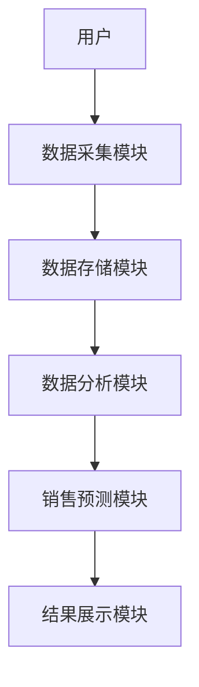

                 


```markdown
# 彼得林奇如何评估公司的社交媒体影响力转化为销售的能力

## 关键词：
彼得·林奇，社交媒体影响力，销售能力，数据驱动，营销策略

## 摘要：
本文详细探讨了彼得·林奇在评估公司社交媒体影响力并将其转化为销售能力方面的方法和策略。通过分析社交媒体的核心概念、数学模型、系统架构以及实际案例，本文为读者提供了从理论到实践的全面指南，帮助公司有效利用社交媒体提升销售业绩。

---

# 第一部分: 社交媒体影响力评估与销售转化的背景与核心概念

## 第1章: 社交媒体在现代商业中的作用
### 1.1 互联网时代的社交媒体革命
#### 1.1.1 从传统媒体到社交媒体的演变
#### 1.1.2 社交媒体在现代商业中的重要性
#### 1.1.3 彼得·林奇的社交媒体营销理念

## 第2章: 彼得·林奇的营销哲学与社交媒体应用
### 2.1 彼得·林奇的营销理念概述
#### 2.1.1 用户价值为核心
#### 2.1.2 社交媒体的互动性与传播性
#### 2.1.3 数据驱动的营销策略

## 第3章: 社交媒体影响力评估的核心概念
### 3.1 社交媒体影响力定义
#### 3.1.1 用户参与度
#### 3.1.2 内容传播力
#### 3.1.3 品牌忠诚度

## 第4章: 影响力转化为销售能力的关键要素
### 4.1 社交媒体与销售的关联性
#### 4.1.1 社交媒体如何影响购买决策
#### 4.1.2 用户行为分析
#### 4.1.3 数据驱动的销售预测

---

# 第二部分: 社交媒体影响力评估的数学模型与算法原理

## 第5章: 社交媒体影响力评估的数学模型
### 5.1 影响力指数的计算公式
#### 5.1.1 $$影响力指数 = \frac{用户参与度 + 内容传播力}{品牌忠诚度}$$
### 5.2 用户参与度的量化
#### 5.2.1 点赞、评论、分享的权重分配
### 5.3 内容传播力的算法
#### 5.3.1 病毒式传播模型

## 第6章: 基于数据的销售预测算法
### 6.1 数据驱动的销售预测模型
#### 6.1.1 线性回归模型
#### 6.1.2 $$预测销量 = \beta_0 + \beta_1 \times 影响力指数$$
### 6.2 算法实现
#### 6.2.1 使用Python的机器学习库进行预测

---

# 第三部分: 系统分析与架构设计

## 第7章: 系统分析与需求定义
### 7.1 问题场景介绍
#### 7.1.1 社交媒体数据监测系统
#### 7.1.2 销售预测与优化系统
### 7.2 系统功能设计
#### 7.2.1 数据采集模块
#### 7.2.2 数据分析模块
#### 7.2.3 销售预测模块

## 第8章: 系统架构设计
### 8.1 系统架构图
#### 8.1.1 使用mermaid绘制系统架构图


## 第9章: 系统接口设计
### 9.1 数据接口设计
#### 9.1.1 RESTful API接口
#### 9.1.2 数据格式与传输协议

---

# 第四部分: 项目实战与最佳实践

## 第10章: 项目实战
### 10.1 环境安装与工具配置
#### 10.1.1 安装Python和相关库
#### 10.1.2 配置社交媒体API
### 10.2 核心代码实现
#### 10.2.1 数据采集代码
#### 10.2.2 数据分析代码
#### 10.2.3 销售预测代码
### 10.3 实际案例分析
#### 10.3.1 成功案例解读
#### 10.3.2 失败案例分析
### 10.4 项目小结
#### 10.4.1 项目总结与经验教训

## 第11章: 最佳实践与注意事项
### 11.1 小结
#### 11.1.1 核心概念回顾
#### 11.1.2 算法原理总结
### 11.2 注意事项
#### 11.2.1 数据隐私问题
#### 11.2.2 算法选择与调优
### 11.3 拓展阅读
#### 11.3.1 推荐书籍与资源
#### 11.3.2 进一步学习方向

---

# 作者

作者：AI天才研究院/AI Genius Institute & 禅与计算机程序设计艺术 /Zen And The Art of Computer Programming
```

