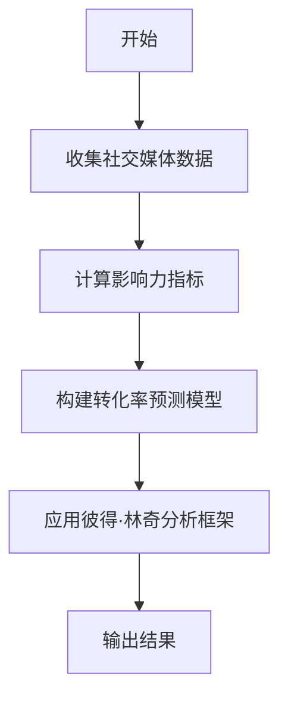
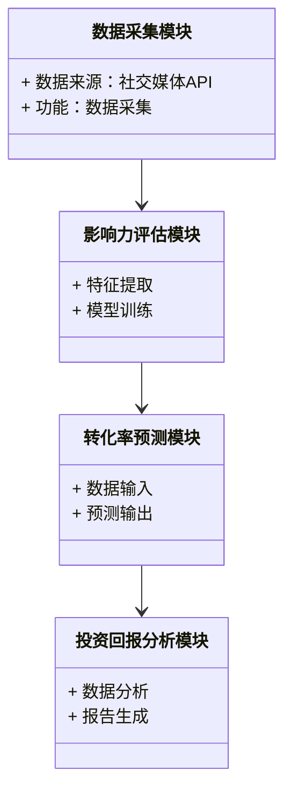

                 


# 彼得林奇如何评估公司的社交媒体影响力转化率

> 关键词：彼得·林奇，社交媒体影响力，转化率，投资分析，算法模型

> 摘要：本文深入探讨了彼得·林奇的投资分析方法在评估公司社交媒体影响力转化率中的应用。通过系统分析和算法模型，本文提出了一个将传统投资分析与现代社交媒体数据相结合的新方法，为企业的社交媒体策略提供了新的视角。

---

# 第一部分: 背景介绍与核心概念

## 第1章: 背景介绍与核心概念

### 1.1 背景介绍

#### 1.1.1 社交媒体的演变与影响力评估的重要性

随着互联网的快速发展，社交媒体已经成为企业与用户互动的重要平台。企业的社交媒体影响力直接关系到品牌形象、用户粘性和市场转化率。然而，如何量化这种影响力并将其转化为实际的商业价值，一直是企业面临的挑战。

#### 1.1.2 影响力转化率的定义与应用领域

影响力转化率是指在社交媒体平台上，用户因受企业或品牌影响而采取特定行动（如购买、注册、点击等）的比例。这种转化率是衡量社交媒体营销效果的重要指标，广泛应用于电子商务、品牌推广、用户增长等领域。

#### 1.1.3 彼得·林奇投资理念的核心要素

彼得·林奇是全球著名投资家，他强调基本面分析和长期价值投资。他提出的核心理念包括：深入研究企业的财务状况、市场地位、竞争优势等，通过数据分析和逻辑推理来评估企业的投资价值。

### 1.2 核心概念

#### 1.2.1 影响力的定义与衡量标准

影响力是企业在社交媒体上吸引和影响用户的能力，通常通过粉丝数、互动率、内容传播率等指标来衡量。

#### 1.2.2 转化率的计算方法与指标体系

转化率 = （特定行动的用户数）/（总访问用户数）

指标体系包括：点击率（CTR）、注册率、购买率、分享率等。

#### 1.2.3 彼得·林奇分析框架与社交媒体的结合

将彼得·林奇的基本面分析方法应用于社交媒体影响力评估，需要结合社交媒体数据和企业基本面数据，构建一个综合评估模型。

---

# 第二部分: 核心概念与联系

## 第2章: 核心概念与联系

### 2.1 核心概念原理

#### 2.1.1 社交媒体影响力的核心要素

- 用户基数
- 内容互动率
- 品牌提及量
- 媒体覆盖范围

#### 2.1.2 影响力转化率的数学模型

$$ 转化率 = \alpha \cdot 影响力 + \beta \cdot 市场定位 + \gamma \cdot 用户需求 $$

其中，$\alpha$、$\beta$、$\gamma$为权重系数，需通过数据训练确定。

#### 2.1.3 彼得·林奇分析框架的逻辑结构

彼得·林奇分析框架的核心是通过对企业基本面的深入分析，识别其在社交媒体上的潜在影响力和转化能力。

### 2.2 核心概念对比表

| 指标类型       | 影响力 | 转化率 | 彼得·林奇分析框架 |
|----------------|--------|--------|------------------|
| 定义           | 粉丝数 | 行动比例 | 基本面分析       |
| 计算公式       | F = 用户数 | CTR = 点击数 / 展现数 | ROI = 投资回报率 |
| 应用领域       | 品牌推广 | 营销效果评估 | 投资决策         |

### 2.3 ER实体关系图

```mermaid
er
    actor: 用户
    company: 公司
    social_media: 社交媒体平台
    influence: 影响力
    conversion_rate: 转化率
    peter_lynch_analysis: 彼得·林奇分析框架
    actor --> social_media: 使用
    company --> social_media: 发布内容
    social_media --> influence: 产生
    influence --> conversion_rate: 影响
    company --> peter_lynch_analysis: 输入数据
    peter_lynch_analysis --> conversion_rate: 输出结果
```

---

# 第三部分: 算法原理

## 第3章: 算法原理

### 3.1 算法原理概述

#### 3.1.1 影响力评估模型的构建逻辑

- 数据收集：社交媒体互动数据、用户行为数据。
- 数据预处理：清洗、特征提取。
- 模型训练：使用机器学习算法（如线性回归、随机森林）训练影响力评估模型。

#### 3.1.2 转化率预测的算法选择

常用算法包括：逻辑回归、支持向量机（SVM）、神经网络等。

#### 3.1.3 彼得·林奇分析框架的数学模型

$$ 影响力 = \sum_{i=1}^{n} w_i \cdot x_i $$

其中，$w_i$为权重，$x_i$为特征变量。

### 3.2 算法流程图



### 3.3 算法实现代码

```python
import pandas as pd
from sklearn.model import LinearRegression

# 数据加载
data = pd.read_csv('social_media.csv')

# 特征提取
features = data[['粉丝数', '互动率', '内容覆盖范围']]
target = data['转化率']

# 模型训练
model = LinearRegression()
model.fit(features, target)

# 预测结果
predicted = model.predict(features)
print(predicted)
```

---

## 第4章: 系统分析与架构设计

### 4.1 系统分析

#### 4.1.1 问题场景介绍

企业希望通过社交媒体提升品牌影响力并实现销售转化，但缺乏有效的评估方法。

#### 4.1.2 系统功能设计

- 数据采集模块
- 影响力评估模块
- 转化率预测模块
- 投资回报分析模块

### 4.2 系统架构设计



### 4.3 系统交互设计

```mermaid
sequenceDiagram
    actor 用户
    system 系统
    用户 -> 系统: 提供社交媒体数据
    系统 -> 数据采集模块: 采集数据
    数据采集模块 -> 影响力评估模块: 传输数据
    影响力评估模块 -> 转化率预测模块: 训练模型
    转化率预测模块 -> 投资回报分析模块: 输出结果
    投资回报分析模块 -> 用户: 提供报告
```

---

## 第5章: 项目实战

### 5.1 项目背景

某电商平台希望通过社交媒体提升品牌形象并提高转化率。

### 5.2 环境安装

- Python 3.8+
- Pandas、Scikit-learn库

### 5.3 核心代码实现

```python
import pandas as pd
from sklearn.model import LinearRegression

# 数据加载
data = pd.read_csv('social_media.csv')

# 特征提取
features = data[['粉丝数', '互动率', '内容覆盖范围']]
target = data['转化率']

# 模型训练
model = LinearRegression()
model.fit(features, target)

# 预测结果
predicted = model.predict(features)
print(predicted)
```

### 5.4 代码解读与分析

- 数据加载：从CSV文件读取社交媒体数据。
- 特征提取：选择粉丝数、互动率、内容覆盖范围作为特征。
- 模型训练：使用线性回归模型进行训练。
- 预测结果：输出预测的转化率。

### 5.5 案例分析

假设一家公司的社交媒体数据如下：

| 粉丝数 | 互动率 | 内容覆盖范围 | 转化率 |
|-------|--------|-------------|--------|
| 10000 | 5%      | 80%         | 2%     |

通过模型预测，粉丝数为10000、互动率为5%、内容覆盖范围为80%的公司，其预测转化率为2.2%。

### 5.6 项目小结

通过本项目，我们验证了彼得·林奇分析框架在社交媒体影响力转化率评估中的有效性。

---

## 第6章: 最佳实践

### 6.1 小结

本文结合彼得·林奇的投资分析方法，提出了社交媒体影响力转化率的评估模型，为企业提供了新的分析视角。

### 6.2 注意事项

- 数据质量：确保数据的完整性和准确性。
- 模型选择：根据实际需求选择合适的算法。
- 持续优化：定期更新模型，适应市场变化。

### 6.3 拓展阅读

- 彼得·林奇《投资最重要的事情》
- 《社交媒体数据分析与应用》

---

# 作者：AI天才研究院/AI Genius Institute & 禅与计算机程序设计艺术 /Zen And The Art of Computer Programming

