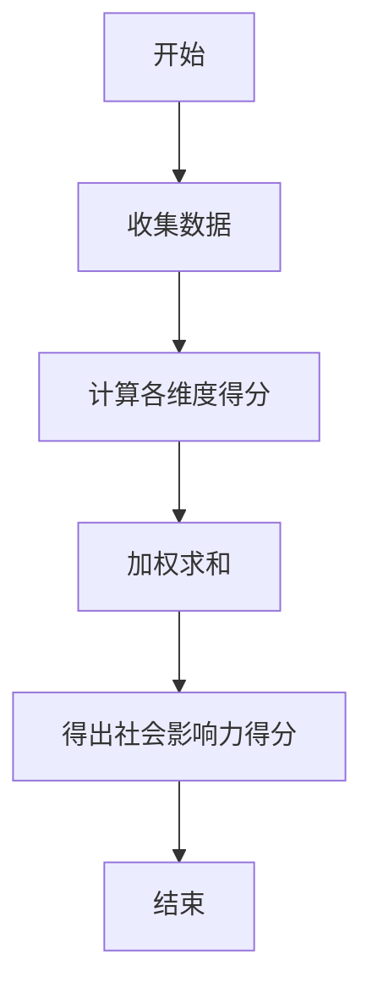

                 


# 彼得林奇如何评估公司的社会影响力

## 关键词：彼得林奇, 公司社会影响力, 投资评估, 影响力评估, 经济影响力, 社会影响力, 环境影响力

## 摘要：本文详细探讨了彼得·林奇在评估公司社会影响力方面的方法和策略。通过分析社会影响力的核心概念、评估框架、算法原理、系统架构以及实际案例，文章展示了如何将社会影响力纳入公司评估体系，以帮助投资者做出更全面的决策。文章结构清晰，内容丰富，结合理论与实践，为读者提供了深入的理解和实用的指导。

---

## 第一部分：背景介绍

### 第1章：社会影响力评估的背景与意义

#### 1.1 社会影响力的概念与内涵

社会影响力是指企业在经营过程中对社会产生的正面或负面影响，包括经济、社会和环境三个方面。这种影响力不仅影响企业的声誉和形象，还可能对企业长期的财务表现和社会责任产生深远影响。

- **定义**：社会影响力是企业在经济、社会和环境方面对社会产生的综合影响。
- **内涵**：包括企业对就业、技术创新、环境保护、社会责任等方面的贡献或损害。

#### 1.2 彼得林奇的背景与投资理念

彼得·林奇是全球著名投资专家，以其成功的投资策略和基本面分析闻名。他强调长期投资和对公司基本面的深入研究，认为企业的社会影响力是其长期价值的重要组成部分。

- **彼得林奇的个人简介**：他管理富达麦哲伦基金期间取得了显著成就，成为投资领域的传奇人物。
- **投资哲学**：注重基本面分析，关注企业的长期价值和竞争优势。
- **社会影响力评估**：彼得林奇认为企业对社会的影响是其长期成功的关键因素之一。

#### 1.3 社会影响力评估的重要性

社会影响力评估帮助企业识别其对社会的影响，从而指导企业改进经营策略，减少负面影 响，增强正面贡献。

- **对企业的影响**：提升企业形象，增强社会责任感。
- **对投资者的影响**：帮助投资者做出更全面的决策，考虑企业长期价值。

---

### 第2章：彼得林奇社会影响力评估的核心框架

#### 2.1 社会影响力评估的指标体系

社会影响力评估需要多维度的指标，包括经济、社会和环境三个方面。

- **经济影响力**：企业的经济贡献，如就业、税收和产品创新。
- **社会影响力**：企业对社会公平、员工福利和社区发展的影响。
- **环境影响力**：企业在环境保护、资源利用和碳排放方面的表现。

#### 2.2 彼得林奇评估框架的核心要素

彼得林奇的评估框架注重企业的使命、愿景、产品价值和社会责任。

- **公司使命与愿景**：企业的长期目标和价值观。
- **产品与服务的社会价值**：产品对社会的积极影响。
- **企业社会责任（CSR）**：企业在环境保护、公益事业和社会责任方面的表现。

#### 2.3 社会影响力评估的边界与外延

社会影响力评估需要明确范围，避免过于宽泛或局限。

- **评估范围**：包括企业直接和间接影响的范围。
- **局限性**：难以量化，受主观因素影响较大。
- **与其他评估方法的对比**：与财务评估、市场评估等方法的差异和互补性。

---

## 第二部分：核心概念与联系

### 第3章：彼得林奇社会影响力评估的核心概念与联系

#### 3.1 核心概念原理

彼得林奇的评估方法结合了多维度分析，将社会影响力与企业价值结合起来。

- **多维度分析**：从经济、社会和环境三个维度全面评估企业。
- **逻辑结构**：通过权重分配，将各维度的影响综合起来，评估企业的社会影响力。
- **社会影响力与企业价值的关系**：社会影响力是企业长期价值的重要组成部分。

#### 3.2 核心概念属性特征对比表格

| 概念         | 定义                           | 属性特征                         |
|--------------|--------------------------------|----------------------------------|
| 经济影响力   | 企业的经济贡献，如就业、税收 | 可量化、可预测性、可调节性      |
| 社会影响力   | 企业对社会的正面或负面影响   | 多维性、长期性、可测量性        |
| 环境影响力   | 企业对环境的影响               | 可持续性、可逆性、可监测性      |

#### 3.3 ER实体关系图

```mermaid
entity 社会影响力 {
    经济影响力
    社会影响力
    环境影响力
}
```

---

## 第三部分：算法原理

### 第4章：彼得林奇社会影响力评估算法原理

#### 4.1 算法原理概述

彼得林奇的评估模型通过多因素分析，结合定量和定性指标，计算企业的社会影响力得分。

- **输入**：企业的经济、社会和环境数据。
- **输出**：企业的社会影响力得分。
- **步骤**：
  1. 收集数据：包括就业、税收、环保措施等。
  2. 加权计算：根据各维度的权重进行加权求和。
  3. 得分评估：根据得分对企业进行分类和评估。

#### 4.2 彼得林奇评估模型的数学模型

$$ \text{社会影响力得分} = \sum_{i=1}^{n} w_i \times x_i $$

其中，\( w_i \) 是第i个因素的权重，\( x_i \) 是第i个因素的得分。

#### 4.3 算法流程图



#### 4.4 代码实现

```python
def calculate_social_influence(economic_score, social_score, environmental_score):
    # 定义权重，经济、社会、环境各占40%、30%、30%
    weight_economic = 0.4
    weight_social = 0.3
    weight_environmental = 0.3

    total_score = (economic_score * weight_economic) + \
                  (social_score * weight_social) + \
                  (environmental_score * weight_environmental)
    return total_score

# 示例数据
economic_score = 80
social_score = 70
environmental_score = 60

score = calculate_social_influence(economic_score, social_score, environmental_score)
print(f"社会影响力得分为：{score}")
```

---

## 第四部分：系统分析与架构设计

### 第5章：彼得林奇社会影响力评估系统架构

#### 5.1 系统功能设计

- **数据采集模块**：收集企业的经济、社会和环境数据。
- **评估计算模块**：计算各维度的得分并综合得出社会影响力得分。
- **结果展示模块**：以图表形式展示评估结果。

#### 5.2 系统架构设计


---

## 第五部分：项目实战

### 第6章：彼得林奇社会影响力评估系统实现

#### 6.1 项目实战环境安装

- 安装Python和必要的库，如pandas、numpy、matplotlib。

#### 6.2 核心代码实现

```python
import pandas as pd
import numpy as np
import matplotlib.pyplot as plt

def calculate_social_influence(economic_data, social_data, environmental_data):
    # 加权计算
    weight_economic = 0.4
    weight_social = 0.3
    weight_environmental = 0.3

    total_scores = []
    for eco, soc, env in zip(economic_data, social_data, environmental_data):
        total_score = eco * weight_economic + soc * weight_social + env * weight_environmental
        total_scores.append(total_score)

    return total_scores

# 示例数据
economic_data = [80, 70, 60]
social_data = [70, 80, 50]
environmental_data = [60, 70, 80]

scores = calculate_social_influence(economic_data, social_data, environmental_data)
print(scores)

# 可视化展示
plt.bar(range(len(scores)), scores, label='社会影响力得分')
plt.xlabel('公司')
plt.ylabel('得分')
plt.legend()
plt.show()
```

---

## 第六部分：总结与最佳实践

### 第7章：总结与最佳实践

#### 7.1 项目总结

- 彼得林奇的社会影响力评估方法提供了一种全面评估企业的方法。
- 通过多维度分析，帮助投资者和企业做出更全面的决策。

#### 7.2 最佳实践 tips

- 结合企业实际情况调整权重和评估指标。
- 定期更新数据和模型，保持评估的准确性。

#### 7.3 未来展望

- 随着ESG投资的兴起，社会影响力评估将越来越重要。
- 结合人工智能技术，提升评估的准确性和效率。

---

## 作者：AI天才研究院/AI Genius Institute & 禅与计算机程序设计艺术 /Zen And The Art of Computer Programming

---

通过以上内容，文章详细介绍了彼得·林奇如何评估公司的社会影响力，从理论到实践，结合代码实现和案例分析，为读者提供了全面的指导和实用的工具。

