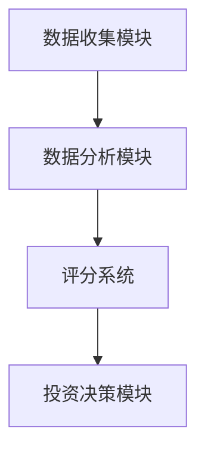

                 


# 彼得林奇如何评估公司的社会影响力

## 关键词：彼得林奇，社会影响力，投资评估，企业价值，长期价值

## 摘要：  
彼得·林奇是全球著名投资专家，他在评估公司价值时，不仅关注财务指标，还非常重视公司的社会影响力。社会影响力是指公司在社会中创造的正面价值，包括企业治理、社会责任、品牌影响力等方面。本文将从理论和实践两个方面，详细分析彼得·林奇如何通过社会影响力评估公司价值，并结合实际案例，探讨这种评估方法对投资决策的指导意义。

---

# 第一部分：引言

## 第1章：彼得·林奇的投资理念与社会影响力评估

### 1.1 彼得·林奇与社会影响力投资

#### 1.1.1 彼得·林奇的投资者背景  
彼得·林奇是全球最著名的职业基金经理之一，曾管理富达麦哲伦基金，创造了长期稳定的超额回报。他的投资理念强调深入研究企业基本面，关注公司的长期价值。

#### 1.1.2 社会影响力投资的定义与意义  
社会影响力投资是指投资者在选择投资标的时，不仅关注财务回报，还关注企业在社会中创造的正面价值。这种投资方式越来越受到关注，尤其是在当前社会和经济环境下。

#### 1.1.3 社会影响力投资的核心理念  
彼得·林奇认为，公司的社会影响力是其长期价值的重要组成部分。一个公司在社会中创造的价值越大，其长期发展的潜力也越大。

---

## 1.2 社会影响力评估的重要性

#### 1.2.1 投资决策中的社会因素  
公司在社会中的影响力直接影响其市场地位、品牌价值和客户忠诚度。

#### 1.2.2 社会影响力对长期投资价值的影响  
社会影响力是公司长期价值的核心驱动力之一。一个公司在社会中具有强大的影响力，往往能够获得更高的市场份额和客户忠诚度。

#### 1.2.3 彼得·林奇对社会影响力的独特见解  
彼得·林奇强调，社会影响力是一个公司能否长期生存和发展的关键因素。他通过分析公司在社会中的影响力，来评估其长期投资价值。

---

# 第二部分：社会影响力评估的核心概念

## 第2章：社会影响力评估的背景与框架

### 2.1 社会影响力评估的背景

#### 2.1.1 当前社会与经济环境的变化  
随着全球化和数字化的发展，社会影响力已成为企业竞争力的重要组成部分。

#### 2.1.2 投资者对社会价值的关注  
越来越多的投资者开始关注企业在社会中创造的价值，尤其是年轻一代投资者，他们更倾向于选择具有社会责任感的企业。

#### 2.1.3 社会影响力投资的全球发展趋势  
全球范围内，社会影响力投资的规模和影响力都在快速增长。

### 2.2 社会影响力评估的框架

#### 2.2.1 社会影响力评估的基本维度  
社会影响力评估可以从以下几个维度进行：企业治理、社会责任、品牌影响力、产品与服务的社会价值等。

#### 2.2.2 彼得·林奇评估框架的核心要素  
彼得·林奇的评估框架包括以下几个核心要素：  
1. 企业的社会影响力是否与其商业模式密切相关。  
2. 企业在社会中的影响力是否能够为公司带来长期的竞争优势。  
3. 企业的社会影响力是否能够为股东创造长期价值。

#### 2.2.3 社会影响力评估的边界与外延  
社会影响力评估需要明确其边界，避免过度扩展或遗漏重要因素。

---

# 第三部分：社会影响力评估的理论基础

## 第3章：社会影响力评估的理论与模型

### 3.1 社会影响力评估的核心原理

#### 3.1.1 社会影响力与企业价值的关系  
社会影响力是企业价值的重要组成部分，它直接影响企业的市场地位和客户忠诚度。

#### 3.1.2 社会影响力评估的逻辑模型  
社会影响力评估的逻辑模型包括以下几个步骤：  
1. 确定评估维度。  
2. 收集相关数据。  
3. 分析数据并得出结论。  
4. 将结论应用于投资决策。

#### 3.1.3 彼得·林奇的评估方法与理论依据  
彼得·林奇通过分析公司在社会中的影响力，结合其财务表现，来评估其长期投资价值。

### 3.2 社会影响力评估的数学模型

#### 3.2.1 社会影响力指数的构建  
社会影响力指数可以通过以下几个步骤构建：  
1. 确定评估维度。  
2. 给每个维度分配权重。  
3. 计算每个维度的得分。  
4. 根据权重计算总得分。  

公式：$$社会影响力指数 = \sum_{i=1}^{n} (权重_i \times 得分_i)$$  

#### 3.2.2 社会影响力对投资回报的影响公式  
$$投资回报 = \alpha \times 社会影响力指数 + \beta \times 财务指标$$  

其中，$\alpha$ 和 $\beta$ 是回归系数。

---

# 第四部分：社会影响力评估的具体方法

## 第4章：社会影响力评估的核心指标

### 4.1 企业治理与社会责任

#### 4.1.1 企业治理结构的评估  
评估公司的治理结构，包括董事会的构成、管理层的透明度等。

#### 4.1.2 社会责任履行情况  
评估公司在社会责任方面的表现，包括环境保护、员工福利、社区贡献等。

#### 4.1.3 企业道德与合规性  
评估公司的道德水平和合规性，包括是否遵守法律法规、是否存在道德风险等。

### 4.2 品牌影响力与市场地位

#### 4.2.1 品牌影响力评估方法  
通过市场调研、消费者调查等方式，评估公司在市场中的品牌影响力。

#### 4.2.2 市场地位与社会影响力的关系  
市场地位是社会影响力的重要体现，强大的市场地位往往意味着公司在社会中有较高的影响力。

#### 4.2.3 品牌声誉的长期影响  
品牌声誉的长期影响是社会影响力评估的重要组成部分，它直接影响公司的市场地位和客户忠诚度。

### 4.3 产品与服务的社会价值

#### 4.3.1 产品对社会的积极影响  
评估公司在产品设计和服务中对社会的积极影响，包括是否解决社会问题、是否提高生活质量等。

#### 4.3.2 产品对社会的潜在风险  
评估公司在产品设计和服务中对社会的潜在风险，包括是否对环境造成污染、是否引发社会问题等。

#### 4.3.3 社会价值对市场需求的影响  
社会价值对市场需求的影响是社会影响力评估的重要组成部分，它直接影响公司的市场表现。

---

# 第五部分：社会影响力评估的系统架构

## 第5章：社会影响力评估的系统架构

### 5.1 系统功能设计

#### 5.1.1 数据收集模块  
数据收集模块负责收集与社会影响力相关的数据，包括企业治理、社会责任、品牌影响力等。

#### 5.1.2 数据分析模块  
数据分析模块负责对收集到的数据进行分析，计算社会影响力指数。

#### 5.1.3 评分系统  
评分系统根据社会影响力指数，对公司在社会影响力方面进行评分。

### 5.2 系统架构设计

#### 5.2.1 系统架构图  
以下是系统架构设计的 Mermaid 图：



#### 5.2.2 系统接口设计  
系统接口设计包括数据输入接口、数据分析接口和评分输出接口。

#### 5.2.3 系统交互设计  
系统交互设计包括用户与系统的交互流程，包括数据输入、数据处理和结果输出。

---

# 第六部分：项目实战

## 第6章：社会影响力评估的项目实战

### 6.1 项目背景与介绍

#### 6.1.1 项目背景  
以某公司为例，分析其社会影响力，评估其投资价值。

### 6.2 系统核心实现

#### 6.2.1 环境安装  
需要安装的数据分析工具和相关库。

#### 6.2.2 核心代码实现  
以下是核心代码实现：

```python
import pandas as pd
import numpy as np

# 数据收集模块
def collect_data(company):
    # 收集公司治理数据
    governance_data = collect_governance(company)
    # 收集社会责任数据
    csr_data = collect_csr(company)
    # 收集品牌影响力数据
    brand_data = collect_brand(company)
    return pd.DataFrame({
        '治理数据': governance_data,
        '社会责任数据': csr_data,
        '品牌影响力数据': brand_data
    })

# 数据分析模块
def calculate_social_impact_index(df):
    # 确定各维度的权重
    weights = {'治理数据': 0.3, '社会责任数据': 0.4, '品牌影响力数据': 0.3}
    # 计算各维度的得分
    scores = df.apply(lambda x: x * weights[x.name])
    # 计算社会影响力指数
    social_impact_index = scores.mean()
    return social_impact_index

# 评分系统
def score_company(social_impact_index):
    if social_impact_index >= 0.8:
        return '高'
    elif social_impact_index >= 0.6:
        return '中'
    else:
        return '低'
```

#### 6.2.3 代码应用解读与分析  
通过对代码的解读与分析，展示如何利用社会影响力指数评估公司的投资价值。

### 6.3 实际案例分析

#### 6.3.1 案例分析  
以苹果公司为例，分析其社会影响力，评估其投资价值。

#### 6.3.2 案例分析结果  
通过分析，得出苹果公司在社会影响力方面具有较高的投资价值。

### 6.4 项目小结  
总结项目实施过程中的经验和教训，提出改进建议。

---

# 第七部分：总结与展望

## 第7章：总结与展望

### 7.1 总结  
通过本文的分析与实践，我们可以得出结论：社会影响力是公司长期价值的重要组成部分。彼得·林奇通过分析公司在社会中的影响力，结合其财务表现，来评估其长期投资价值。

### 7.2 未来展望  
未来，随着社会影响力投资的不断发展，社会影响力评估方法将更加完善，评估指标也将更加多样化和精准化。

---

# 作者：AI天才研究院/AI Genius Institute & 禅与计算机程序设计艺术 /Zen And The Art of Computer Programming

