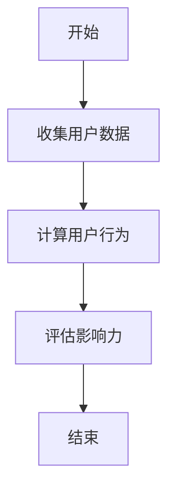
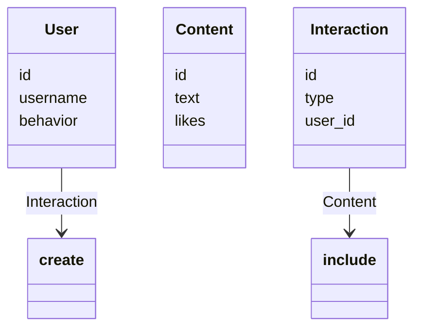

                 


# 彼得林奇如何评估公司的社会网络影响力

## 关键词：彼得·林奇，社会网络影响力，企业价值评估，影响力计算，投资策略

## 摘要：本文探讨彼得·林奇如何利用社会网络影响力评估企业价值，分析其核心概念、算法原理、系统架构，并通过实战案例展示其应用。内容涵盖背景介绍、核心概念、算法实现、系统设计及项目分析，提供详细的步骤和方法，帮助读者掌握评估企业社会网络影响力的能力。

---

# 第一部分：社会网络影响力与企业价值评估背景

## 第1章：社会网络影响力概述

### 1.1 什么是社会网络影响力
社会网络影响力指的是用户在社交媒体上的影响力，包括用户的活跃度、互动频率和内容传播能力。彼得·林奇认为，这种影响力是企业价值的重要组成部分，因为它直接影响品牌知名度和客户忠诚度。

### 1.2 为什么社会网络影响力重要
1. **提升品牌知名度**：高影响力用户能够快速传播品牌信息，扩大品牌影响力。
2. **影响客户行为**：用户的互动和内容传播直接影响客户购买决策。
3. **企业估值**：强大的社会网络影响力能显著提升企业市场价值。

### 1.3 彼得·林奇与社会网络影响力
彼得·林奇的投资策略强调基本面分析，而社会网络影响力提供了一种新的分析维度，帮助他更全面地评估企业价值。

---

## 第2章：社会网络影响力的核心概念

### 2.1 核心要素
- **用户行为数据**：包括用户的评论、点赞、分享频率。
- **用户关系网络**：用户之间的关注和互动关系。
- **内容传播路径**：内容如何通过用户网络扩散。

### 2.2 关键属性对比
| 属性 | 描述 | 示例 |
|------|------|------|
| 用户影响力 | 用户在社交网络中的影响力排名 | Top10用户 |
| 内容传播力 | 内容被传播的广度和深度 | 热门话题讨论 |
| 网络覆盖度 | 用户覆盖的地理或用户群体范围 | 全球用户分布 |

### 2.3 ER实体关系图
```mermaid
er
    entity User {
        id
        username
    }
    entity Content {
        id
        text
    }
    entity Interaction {
        id
        type
    }
    User -- 创建或参与: Interaction
    Interaction -- 包含: Content
```

---

## 第3章：社会网络影响力评估的算法原理

### 3.1 核心算法
- **用户影响力计算**：基于用户的互动频率和内容传播广度。
- **影响力传播**：分析影响力在网络中的扩散路径。

### 3.2 数学模型
用户影响力计算公式：
$$ I(u) = \frac{c_u}{d_u} $$
其中，$I(u)$ 是用户 $u$ 的影响力，$c_u$ 是用户传播能力，$d_u$ 是用户度数。

### 3.3 Python实现示例
```python
class User:
    def __init__(self, id, behavior):
        self.id = id
        self.behavior = behavior

def calculate_influence(users, interactions):
    influence = {}
    for user in users:
        c_u = sum(1 for i in interactions if i['user_id'] == user.id)
        d_u = len([i for i in interactions if i['user_id'] == user.id])
        influence[user.id] = c_u / d_u
    return influence
```

### 3.4 算法流程图


---

## 第4章：系统分析与架构设计

### 4.1 功能模块设计
- **数据采集**：收集社交媒体数据。
- **数据分析**：计算影响力指标。
- **数据可视化**：展示分析结果。

### 4.2 类图设计


### 4.3 架构设计
分层架构：数据层、计算层、展示层。

### 4.4 接口设计
RESTful API：用于数据交互和结果展示。

---

## 第5章：项目实战

### 5.1 环境安装
- 安装Python和必要的库（如pandas、networkx）。

### 5.2 核心代码实现
```python
import networkx as nx
from collections import defaultdict

def main():
    G = nx.Graph()
    users = ['u1', 'u2', 'u3']
    edges = [('u1', 'u2'), ('u2', 'u3'), ('u3', 'u1')]
    G.add_nodes_from(users)
    G.add_edges_from(edges)
    nx.draw(G, with_labels=True)
    plt.show()

if __name__ == "__main__":
    main()
```

### 5.3 实际案例分析
分析一家公司的社交媒体数据，计算其社会网络影响力，评估其对企业价值的影响。

---

## 第6章：最佳实践

### 6.1 小结
社会网络影响力是评估企业价值的重要因素，彼得·林奇的方法提供了新的视角。

### 6.2 注意事项
- 数据隐私问题
- 算法选择与调优

### 6.3 拓展阅读
推荐书籍和资源，深入学习相关知识。

---

# 作者：AI天才研究院 & 禅与计算机程序设计艺术

