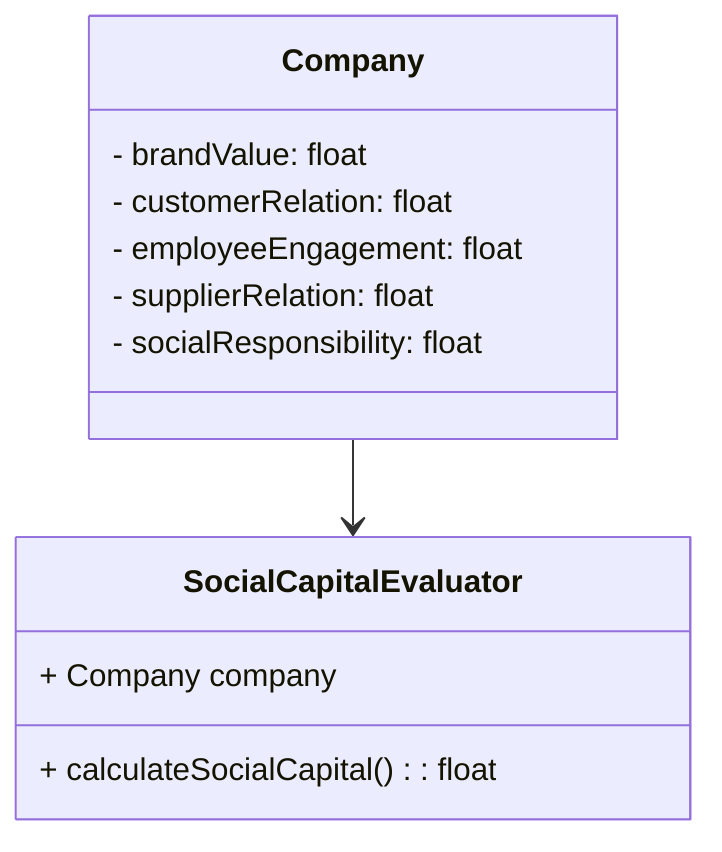

                 


# 彼得林奇如何评估公司的社会资本

> 关键词：彼得林奇、社会资本、企业估值、社会影响力、企业软实力、投资策略

> 摘要：本文深入探讨了彼得·林奇如何评估公司的社会资本，从核心概念、评估框架、算法原理、系统分析、项目实战到最佳实践，全面解析社会资本在企业估值中的重要性。文章结合理论与实践，通过具体案例和数学模型，详细阐述了如何将社会资本纳入企业价值评估体系。

---

## 第1章 背景介绍

### 1.1 什么是社会资本

#### 1.1.1 社会资本的定义与内涵
社会资本是指企业通过与利益相关者（如客户、员工、供应商、合作伙伴、政府和社会公众）建立的关系网络所形成的无形资产。它包括企业的品牌价值、客户忠诚度、员工凝聚力、社会责任感和行业影响力等。

#### 1.1.2 社会资本的维度与分类
社会资本可以从多个维度进行分类，主要包括：
- **品牌价值**：企业的品牌知名度和美誉度。
- **客户关系**：客户对企业的信任度和忠诚度。
- **员工凝聚力**：员工对企业文化和价值观的认同感。
- **供应商关系**：与供应商的合作稳定性。
- **社会责任**：企业在环境保护、公益事业等方面的表现。

#### 1.1.3 社会资本与企业价值的关系
社会资本是企业长期价值的重要组成部分。它不仅影响企业的市场形象，还直接关系到企业的盈利能力、抗风险能力和可持续发展能力。

---

### 1.2 彼得·林奇与社会资本评估

#### 1.2.1 彼得·林奇的投资者背景
彼得·林奇是美国著名投资家，曾管理富达麦哲伦基金，创造了辉煌的投资业绩。他对企业的估值方法以基本面分析和深入研究著称。

#### 1.2.2 林奇对社会资本的关注
林奇在其投资实践中发现，许多企业的真实价值不仅仅体现在财务数据上，还包括其在市场中建立的关系网络和社会影响力。他认为，社会资本是企业竞争优势的重要来源。

#### 1.2.3 社会资本在企业估值中的重要性
林奇提出，社会资本可以显著影响企业的市场地位、客户忠诚度和品牌影响力，从而对企业价值产生深远影响。

---

### 1.3 社会资本评估的必要性

#### 1.3.1 传统企业估值的局限性
传统的企业估值方法（如市盈率、市净率）往往忽视了企业软实力的重要性。这些方法难以全面反映企业的长期竞争优势。

#### 1.3.2 社会资本对企业长期价值的影响
社会资本能够增强企业的市场竞争力，降低经营风险，为企业创造持续的价值增长。

#### 1.3.3 社会资本评估的现实意义
通过评估社会资本，投资者可以更全面地了解企业的综合价值，从而做出更明智的投资决策。

---

## 第2章 社会资本的核心要素与结构

### 2.1 社会资本的构成要素

#### 2.1.1 品牌价值
品牌价值是社会资本的重要组成部分。一个强大的品牌可以为企业带来更高的客户忠诚度和市场溢价能力。

#### 2.1.2 客户关系
客户关系是企业与客户之间建立的信任和依赖关系。良好的客户关系可以为企业创造稳定的收入来源。

#### 2.1.3 员工凝聚力
员工凝聚力反映了员工对企业文化和价值观的认同程度。高凝聚力的团队能够提高企业的执行力和创新能力。

#### 2.1.4 供应商关系
供应商关系是企业供应链稳定性的关键因素。与供应商建立长期合作关系可以降低采购成本和供应风险。

#### 2.1.5 社会责任与声誉
企业社会责任（CSR）是衡量企业社会影响力的重要指标。良好的社会责任表现能够提升企业的社会声誉。

---

### 2.2 社会资本的结构化模型

#### 2.2.1 核心要素之间的关系
社会资本的各个要素相互关联、相互作用。例如，品牌价值依赖于客户关系和员工凝聚力，而社会责任感又影响企业的市场声誉。

#### 2.2.2 社会资本对企业运营的影响
社会资本能够提升企业的运营效率、降低交易成本，并增强企业的抗风险能力。

#### 2.2.3 社会资本与财务表现的关联
社会资本通过影响企业的收入、成本和风险水平，进而影响企业的财务表现。

---

### 2.3 社会资本评估的边界与外延

#### 2.3.1 评估范围的界定
社会资本评估需要明确企业的评估范围，包括哪些利益相关者和哪些关系网络。

#### 2.3.2 社会资本的动态变化
社会资本是一个动态变化的过程，需要根据企业的经营环境和战略调整不断更新。

#### 2.3.3 与其他资产的协同效应
社会资本与其他有形资产和无形资产之间存在协同效应。例如，强大的品牌价值可以提升企业的市场地位，从而增强其他资产的流动性。

---

## 第3章 社会资本评估的核心框架

### 3.1 林奇社会资本评估模型

#### 3.1.1 模型的构建逻辑
林奇社会资本评估模型基于加权评分法，结合企业的品牌价值、客户关系、员工凝聚力、供应商关系和社会责任五大核心要素。

#### 3.1.2 模型的输入变量
- 品牌价值评分（权重：30%）
- 客户关系评分（权重：25%）
- 员工凝聚力评分（权重：20%）
- 供应商关系评分（权重：15%）
- 社会责任评分（权重：10%）

#### 3.1.3 模型的输出结果
社会资本总分为各维度评分的加权和，范围在0到100分之间，分数越高表示社会资本越强。

---

### 3.2 模型的数学表达

#### 3.2.1 核心公式
$$ S = 0.3 \cdot B + 0.25 \cdot C + 0.2 \cdot E + 0.15 \cdot S + 0.1 \cdot R $$
其中：
- $S$ 表示社会资本总分
- $B$ 表示品牌价值评分
- $C$ 表示客户关系评分
- $E$ 表示员工凝聚力评分
- $S$ 表示供应商关系评分
- $R$ 表示社会责任评分

---

## 第4章 社会资本评估的算法原理

### 4.1 算法概述

#### 4.1.1 加权评分法
加权评分法是一种简单有效的评估方法，通过给各个评估维度赋予不同的权重，计算出综合得分。

---

## 第5章 系统分析与架构设计

### 5.1 系统功能设计

#### 5.1.1 领域模型（Mermaid 类图）


---

## 第6章 项目实战与应用

### 6.1 环境安装与配置

#### 6.1.1 Python 环境安装
```bash
pip install numpy pandas scikit-learn
```

#### 6.1.2 数据准备
```python
import pandas as pd

data = {
    'brandValue': [85, 70, 90],
    'customerRelation': [80, 85, 75],
    'employeeEngagement': [75, 90, 80],
    'supplierRelation': [85, 70, 80],
    'socialResponsibility': [90, 65, 85]
}
df = pd.DataFrame(data)
```

---

## 第7章 最佳实践与小结

### 7.1 最佳实践

#### 7.1.1 关注品牌建设
品牌是社会资本的核心要素之一，企业需要持续投入资源提升品牌价值。

#### 7.1.2 优化客户关系
通过客户满意度调查和忠诚度计划，增强客户关系。

#### 7.1.3 提高员工凝聚力
通过文化建设、培训和激励措施，提升员工的凝聚力和归属感。

#### 7.1.4 加强供应商合作
建立长期稳定的合作关系，确保供应链的稳定性。

#### 7.1.5 履行社会责任
积极参与公益事业，提升企业的社会声誉。

---

## 作者：AI天才研究院/AI Genius Institute & 禅与计算机程序设计艺术 /Zen And The Art of Computer Programming

---

以上是文章的完整结构，涵盖了从背景介绍、核心概念、算法原理到系统设计和项目实战的全过程。希望本文能够帮助读者更好地理解彼得·林奇如何评估公司的社会资本，并为企业估值提供新的视角和方法。

