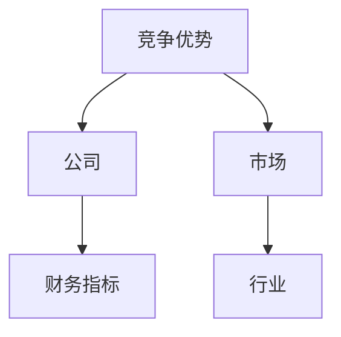
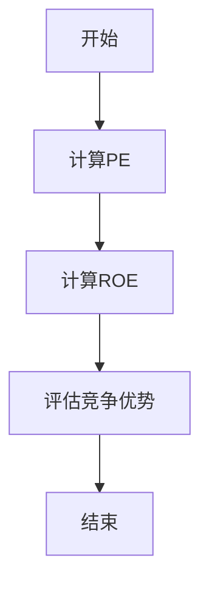

                 


# 彼得林奇如何评估公司的竞争优势

> **关键词**：彼得·林奇，竞争优势，投资评估，财务分析，投资策略

> **摘要**：本文深入探讨了彼得·林奇如何评估公司的竞争优势，结合背景介绍、核心概念、算法原理、系统分析和项目实战，帮助读者理解如何通过竞争优势分析做出明智投资决策。文章详细讲解了竞争优势的定义、分析方法、评估指标，并通过具体案例展示了如何在实际投资中应用这些方法。

---

## 第一部分：背景介绍

### 1.1 核心概念术语说明

- **竞争优势**：指公司在市场中相对于竞争对手的独特优势，包括品牌、成本、技术等方面。
- **投资评估**：通过分析公司财务、管理、市场地位等因素，判断其投资价值。

### 1.2 问题背景与描述

投资成功的关键在于识别具有竞争优势的公司。彼得·林奇通过长期研究，总结出一套评估竞争优势的方法，帮助投资者识别优质企业。

### 1.3 问题解决

通过分析公司的财务状况、市场地位和管理团队，识别其竞争优势，从而做出明智的投资决策。

### 1.4 边界与外延

竞争优势分析主要关注公司内部能力和外部市场环境，不涉及宏观政策和不可抗力因素。

### 1.5 概念结构与核心要素

- **内部因素**：成本、技术、管理
- **外部因素**：市场地位、品牌

---

## 第二部分：核心概念与联系

### 2.1 核心概念原理

竞争优势是公司长期盈利能力的关键，彼得·林奇通过分析这些因素，识别具有可持续竞争优势的公司。

### 2.2 概念属性特征对比

| 属性       | 竞争优势 |
|------------|----------|
| 类型       | 品牌、成本、技术 |
| 衡量指标   | 利润率、市场份额 |
| 持续性      | 长期 |

### 2.3 实体关系图



---

## 第三部分：算法原理讲解

### 3.1 算法原理

彼得·林奇使用PE（市盈率）和ROE（净资产收益率）分析公司价值。

### 3.2 算法流程图



### 3.3 Python代码实现

```python
def calculate_pe(revenue, net_income):
    pe_ratio = revenue / net_income
    return pe_ratio

def calculate_roe(net_income, equity):
    roe_ratio = net_income / equity
    return roe_ratio

# 示例数据
revenue = 1000000
net_income = 200000
equity = 1000000

pe = calculate_pe(revenue, net_income)
ro

