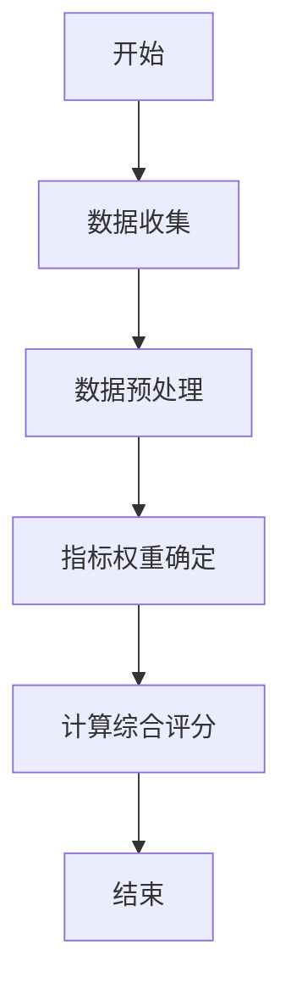
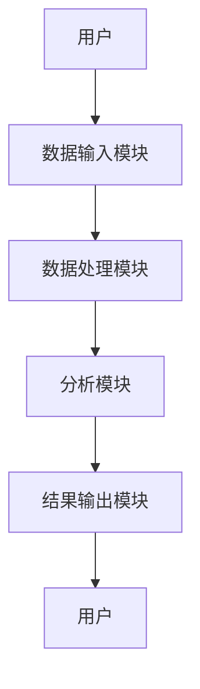

                 


# 彼得林奇对公司专利组合质量的评估

## 关键词：公司专利、彼得林奇、专利组合、质量评估、技术分析、法律稳定性、市场价值

## 摘要：  
本文从投资者的视角出发，结合彼得·林奇的投资理念，系统地探讨了公司专利组合质量的评估方法。通过技术分析、法律稳定性评估和市场价值评估三个维度，构建了一个全面的评估框架，并通过实际案例分析，展示了如何将这些评估方法应用于实践。文章还提供了具体的算法和系统架构设计，帮助读者更好地理解和实施专利组合质量的评估。

---

## 第一部分: 专利与公司价值的关联性

### 第1章: 专利与公司价值的关联性

#### 1.1 专利的基本概念与重要性

##### 1.1.1 专利的定义与基本特征
专利是保护发明创造的法律工具，具有独占性、地域性和时间性。它不仅是技术保护的手段，也是公司核心竞争力的体现。

##### 1.1.2 专利在公司价值中的作用
专利是公司技术实力的象征，能够提升市场竞争力、防止竞争对手侵权，并为公司创造长期经济价值。

##### 1.1.3 专利组合的定义与特点
专利组合是指一组相互关联的专利，通过协同作用形成更强的技术壁垒和市场优势。

#### 1.2 彼得林奇投资理念与专利评估

##### 1.2.1 彼得林奇投资策略概述
彼得·林奇以长期投资和价值发现著称，他注重基本面分析和公司内在价值的挖掘。

##### 1.2.2 专利在投资决策中的地位
在林奇的投资框架中，专利被视为公司技术创新能力的体现，是评估公司长期价值的重要指标。

##### 1.2.3 专利组合质量评估的必要性
通过评估专利组合的质量，投资者可以更好地判断公司的技术储备和市场竞争力。

---

## 第二部分: 专利组合质量评估的核心要素

### 第2章: 核心概念与联系

#### 2.1 技术先进性评估

##### 2.1.1 技术领域的选择标准
选择具有高增长潜力的技术领域，评估其技术创新性和市场应用前景。

##### 2.1.2 技术创新性的衡量指标
包括技术的独特性、领先性和可扩展性。

##### 2.1.3 技术生命周期的影响
技术生命周期的阶段（导入期、成长期、成熟期、衰退期）会影响专利的市场价值。

#### 2.2 法律稳定性分析

##### 2.2.1 专利申请与审查流程
评估专利的申请过程是否规范，审查是否严格。

##### 2.2.2 专利无效风险评估
分析专利的法律风险，包括是否符合专利法的基本要求。

##### 2.2.3 专利侵权风险分析
评估专利是否容易被竞争对手规避或挑战。

#### 2.3 市场价值评估

##### 2.3.1 专利的市场应用前景
评估专利在市场中的应用潜力和市场需求。

##### 2.3.2 专利的经济收益预测
通过市场分析和财务模型，预测专利带来的经济收益。

##### 2.3.3 专利的市场竞争地位
评估专利在市场中的竞争优势和潜在威胁。

---

### 第3章: 核心概念与属性特征对比

#### 3.1 核心概念的原理分析

##### 3.1.1 技术先进性的数学模型
通过量化指标（如技术领域的创新指数）评估技术先进性。

##### 3.1.2 法律稳定性的评估框架
基于法律审查标准和风险因素构建评估框架。

##### 3.1.3 市场价值的评估方法
结合市场需求和竞争环境分析市场价值。

#### 3.2 概念属性特征对比表格

| 概念       | 技术先进性 | 法律稳定性 | 市场价值 |
|------------|------------|-----------|----------|
| 标准       | 技术创新性 | 专利有效性 | 市场需求 |
| 指标       | 技术领域 | 专利寿命 | 产品竞争力 |

#### 3.3 ER实体关系图

```mermaid
erd
    Company -- 拥有 --> Patent
    Patent -- 依赖 --> Technology
    Technology -- 影响 --> MarketValue
```

---

## 第三部分: 专利组合质量评估的算法原理

### 第4章: 评估算法的原理与流程

#### 4.1 评估模型的选择与设计

##### 4.1.1 数据收集与预处理
收集专利数据，包括技术领域、法律状态和市场应用信息，并进行清洗和整理。

##### 4.1.2 指标权重的确定
根据各维度的重要性，确定技术、法律和市场的权重分配。

##### 4.1.3 综合评分的计算
通过加权平均法计算综合评分，公式如下：

$$
\text{综合评分} = \sum_{i=1}^{n} w_i \times s_i
$$

其中，\( w_i \) 是第i个指标的权重，\( s_i \) 是第i个指标的评分。

#### 4.2 算法流程图



---

## 第四部分: 系统分析与架构设计方案

### 第5章: 系统架构设计

#### 5.1 问题场景介绍

##### 5.1.1 项目介绍
构建一个专利组合质量评估系统，帮助投资者快速评估公司专利的价值。

##### 5.1.2 系统功能设计
- 数据输入模块：收集专利数据
- 分析模块：进行技术、法律和市场分析
- 结果输出模块：生成评估报告

#### 5.2 系统架构设计



---

## 第五部分: 项目实战与案例分析

### 第6章: 项目实战

#### 6.1 案例分析

##### 6.1.1 案例背景
以某科技公司为例，分析其专利组合的质量。

##### 6.1.2 数据收集与处理
收集该公司的专利数据，包括技术领域、法律状态和市场应用信息。

##### 6.1.3 评估指标计算
计算技术、法律和市场维度的评分，结合权重计算综合评分。

##### 6.1.4 结果分析
根据评估结果，提出优化建议。

#### 6.2 代码实现

##### 6.2.1 数据处理代码
```python
import pandas as pd

# 数据加载
patent_data = pd.read_csv('patent.csv')

# 数据清洗
patent_data.dropna(inplace=True)
```

##### 6.2.2 评估模型实现
```python
def calculate_score(data, weights):
    scores = []
    for index, row in data.iterrows():
        score = sum(row[i] * weights[i] for i in range(len(weights)))
        scores.append(score)
    return scores

# 示例权重
weights = [0.4, 0.3, 0.3]

# 计算评分
scores = calculate_score(patent_data, weights)
```

---

## 第六部分: 最佳实践与总结

### 第7章: 最佳实践

#### 7.1 小结
通过本文的分析，读者可以全面理解彼得·林奇的专利评估方法，并将其应用于实际投资决策中。

#### 7.2 注意事项
- 数据来源的可靠性
- 指标权重的合理性
- 评估模型的适用性

#### 7.3 拓展阅读
推荐阅读相关书籍和文献，深入了解专利评估的更多细节。

---

## 作者：AI天才研究院/AI Genius Institute & 禅与计算机程序设计艺术 /Zen And The Art of Computer Programming

---

以上是《彼得林奇对公司专利组合质量的评估》的完整目录和内容框架，涵盖了从理论到实践的各个方面，帮助读者全面理解和应用专利组合质量的评估方法。

