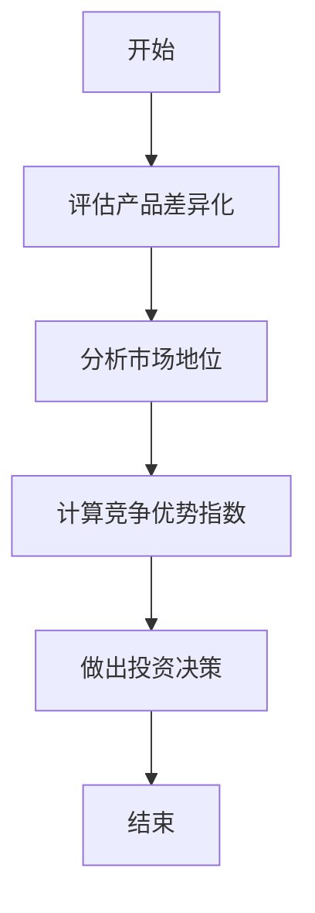

                 


# 彼得林奇对公司产品差异化的看法

## 关键词：
- 彼得林奇
- 产品差异化
- 投资策略
- 竞争优势
- 企业战略

## 摘要：
本文深入探讨了彼得·林奇对产品差异化在企业投资和战略中的看法。通过分析产品差异化的竞争优势、算法模型、系统架构设计和实际案例，本文揭示了产品差异化如何影响企业的市场地位和投资价值。彼得·林奇的投资策略强调了产品差异化的重要性，本文通过详细的技术分析和实际案例，为读者提供了实用的见解和最佳实践。

---

## 第一部分：背景介绍

### 第1章：产品差异化的基本概念

#### 1.1 产品差异化的定义与特征
- **产品差异化**是指企业通过提供独特的功能、质量或服务，使其产品在市场中区别于竞争对手的策略。
- **特征对比**：
  | 特征       | 产品差异化         | 非差异化产品       |
  |------------|--------------------|--------------------|
  | 独特性     | 高                | 低                |
  | 市场定位    | 针对特定客户群体    | 面向大众市场       |
  | 竞争优势   | 明显              | 无明显优势        |
  - 通过表格可以看出，产品差异化能够帮助企业建立独特的市场定位和竞争优势。

#### 1.2 彼得·林奇的背景与投资理念
- **彼得·林奇**是美国著名的投资专家，曾管理富达麦哲伦基金，创造了卓越的投资业绩。
- **投资理念**：林奇强调基本面分析和长期投资，认为企业的竞争优势是决定投资价值的关键因素。

#### 1.3 产品差异化与投资的关系
- **重要性**：产品差异化直接影响企业的市场占有率和盈利能力，是投资者评估企业价值的重要指标。
- **林奇的观点**：林奇认为，具有独特产品的企业更可能在市场中占据优势地位，从而为投资者带来更高的回报。

---

## 第二部分：核心概念与联系

### 第2章：产品差异化的竞争优势分析

#### 2.1 产品差异化的竞争优势
- **竞争优势分析**：产品差异化通过提供独特的价值主张，帮助企业吸引特定客户群体，从而在竞争中占据优势。
- **ER实体关系图**：
  ```mermaid
  erDiagram
    customer <--- order : orders
    product <--- order : includes
    product {
      id
      name
      description
      price
    }
    customer {
      id
      name
      email
    }
    order {
      id
      order_date
      total_price
    }
  ```
  - 该图展示了产品与客户、订单之间的关系，突出了产品差异化在企业系统中的核心地位。

#### 2.2 产品差异化的ER实体关系图
- **ER图**展示了产品与客户、订单之间的关系，强调了产品差异化在企业系统中的重要性。

---

## 第三部分：算法原理讲解

### 第3章：彼得·林奇投资模型的算法原理

#### 3.1 投资模型的数学模型与公式
- **数学模型**：林奇的投资模型基于企业的竞争优势和产品差异化。
  - 竞争优势指数 = (产品差异化程度 × 市场地位) / 市场增长率
  - 其中，产品差异化程度用0到1之间的分数表示，市场地位和增长率用百分比表示。

#### 3.2 投资模型的Mermaid流程图


#### 3.3 Python代码实现
```python
def calculate_competitive_edge(differentiation, market_position, growth_rate):
    competitive_edge = (differentiation * market_position) / growth_rate
    return competitive_edge

# 示例数据
differentiation = 0.8  # 产品差异化程度
market_position = 70    # 市场地位（%）
growth_rate = 15        # 市场增长率（%）

result = calculate_competitive_edge(differentiation, market_position, growth_rate)
print(f"竞争优势指数：{result}")
```

---

## 第四部分：系统分析与架构设计

### 第4章：企业产品差异化系统的架构设计

#### 4.1 系统功能设计
- **领域模型Mermaid类图**：
  ```mermaid
  classDiagram
    class Product {
      id
      name
      description
      price
    }
    class Customer {
      id
      name
      email
    }
    class Order {
      id
      order_date
      total_price
    }
    Product <|-- Order
    Customer <|-- Order
  ```

- **系统架构设计Mermaid架构图**：
  ```mermaid
  architecture
    frontend --> backend
    backend --> database
    frontend --> database
  ```

- **系统接口设计**：
  - API接口：提供产品信息查询、订单管理等功能。

- **系统交互Mermaid序列图**：
  ```mermaid
  sequenceDiagram
    Customer -> frontend: 请求产品信息
    frontend -> backend: 获取产品详情
    backend -> database: 查询产品数据
    database --> backend: 返回产品数据
    backend --> frontend: 返回产品详情
    frontend -> Customer: 显示产品信息
  ```

---

## 第五部分：项目实战

### 第5章：产品差异化策略的实施案例

#### 5.1 项目环境与工具安装
- **环境配置**：Python 3.8以上，Jupyter Notebook，Mermaid工具。

#### 5.2 代码实现
```python
# 示例代码：产品差异化评估
def assess_differentiation(product, competitors):
    differentiation_score = 0
    for feature in product.features:
        found = False
        for competitor in competitors:
            if feature in competitor.features:
                found = True
                break
        if not found:
            differentiation_score += 1
    return differentiation_score

product = {
    'name': 'SmartPhone Pro',
    'features': ['5G', 'AI camera', '120Hz display']
}
competitors = [
    {
        'name': 'Phone X',
        'features': ['5G', '48MP camera', '60Hz display']
    },
    {
        'name': 'Phone Y',
        'features': ['5G', 'AI camera', '90Hz display']
    }
]

score = assess_differentiation(product, competitors)
print(f"产品差异化评分：{score}")
```

#### 5.3 案例分析
- **分析公司**：假设一家科技公司推出新产品，差异化评分结果显示其产品在AI相机和120Hz显示方面具有独特优势。
- **结论**：该产品在市场中具有竞争力，符合林奇的投资模型，具有较高的投资价值。

---

## 第六部分：最佳实践

### 第6章：总结与建议

#### 6.1 总结
- 产品差异化是企业竞争优势的核心，直接影响投资价值。
- 彼得·林奇的投资模型为企业评估产品差异化提供了有效方法。

#### 6.2 注意事项
- **数据准确性**：确保评估数据的准确性和完整性。
- **模型适用性**：根据实际情况调整模型参数，确保其适用性。

#### 6.3 拓展阅读
- 推荐书籍：《彼得·林奇的成功投资》
- 在线资源：相关投资策略和产品差异化分析的文章。

---

## 作者信息

作者：AI天才研究院/AI Genius Institute & 禅与计算机程序设计艺术/Zen And The Art of Computer Programming

---

这篇文章通过详细分析产品差异化的核心概念、算法模型、系统架构设计和实际案例，全面解读了彼得·林奇对产品差异化的看法，为读者提供了深入的见解和实用的指导。

