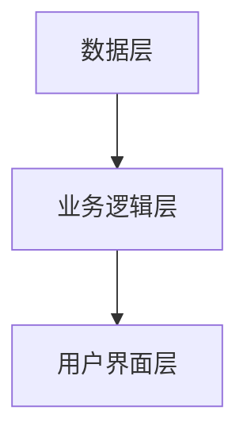
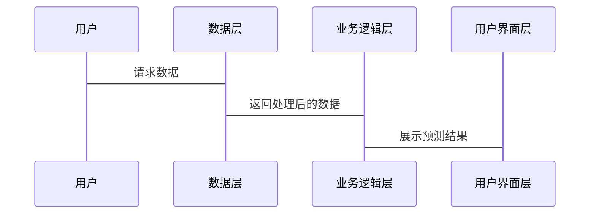

                 


# 彼得林奇对公司产品生命周期管理与现金流预测准确性的关系研究

> 关键词：彼得林奇，产品生命周期管理，现金流预测，现金流预测准确性，投资策略，数学模型，系统架构

> 摘要：本文以彼得·林奇的投资理念为基础，系统研究了公司产品生命周期管理与现金流预测准确性的关系。通过构建数学模型和分析系统架构，探讨了产品生命周期各阶段对现金流预测的影响，提出了优化现金流预测准确性的策略。文章结合实际案例，深入分析了如何通过科学的生命周期管理和精准的现金流预测，提升企业的投资价值和风险管理能力。

---

## 引言

### 1.1 研究背景

#### 1.1.1 彼得·林奇的投资理念
- 彼得·林奇作为著名基金经理，强调长期投资、价值投资和基本面分析。
- 他关注企业的基本面，尤其是产品生命周期和现金流预测。

#### 1.1.2 产品生命周期管理的定义与重要性
- 产品生命周期的四个阶段：引入期、成长期、成熟期、衰退期。
- 产品生命周期管理对企业战略规划、资源分配和风险管理的重要性。

#### 1.1.3 现金流预测准确性的意义
- 现金流预测是企业财务管理和投资决策的基础。
- 准确的现金流预测帮助企业规避风险、优化资源配置。

### 1.2 研究问题的提出

#### 1.2.1 产品生命周期管理与现金流预测的关系
- 产品生命周期各阶段对现金流的影响。
- 现金流预测如何帮助优化产品生命周期管理。

#### 1.2.2 现有研究的不足
- 现有研究多关注单一领域，缺乏对两者关系的系统性研究。
- 缺乏具体的数学模型和系统架构设计。

#### 1.2.3 本研究的核心问题
- 探讨产品生命周期管理如何影响现金流预测的准确性。
- 构建数学模型和系统架构，验证两者的关系。

### 1.3 研究目标与方法

#### 1.3.1 研究目标
- 分析产品生命周期管理对现金流预测准确性的影响。
- 构建数学模型，优化现金流预测的准确性。
- 提出提升企业现金流预测能力的策略。

#### 1.3.2 研究方法
- 文献研究法：分析彼得·林奇的投资理念和相关研究。
- 数学建模法：构建产品生命周期与现金流预测的关系模型。
- 实证分析法：通过案例分析验证模型的可行性。

#### 1.3.3 数据来源与分析框架
- 数据来源：公开财务数据、企业产品生命周期数据。
- 分析框架：产品生命周期模型、现金流预测模型、两者关系模型。

---

## 第二部分：产品生命周期管理与现金流预测的核心概念

### 2.1 产品生命周期管理的理论基础

#### 2.1.1 产品生命周期的阶段划分
- 引入期：产品进入市场的初期，现金流为负。
- 成长期：销量增长，现金流逐渐转正。
- 成熟期：销量稳定，现金流稳定增长。
- 衰退期：销量下降，现金流开始减少。

#### 2.1.2 每个阶段的现金流特征
- 引入期：高研发投入，现金流为负。
- 成长期：销量增加，现金流逐渐转正。
- 成熟期：现金流稳定，企业利润最大化。
- 衰退期：销量下降，现金流逐渐减少。

#### 2.1.3 生命周期管理对现金流的影响
- 通过优化产品生命周期管理，延长成熟期，减少衰退期的负面影响。

### 2.2 现金流预测的理论基础

#### 2.2.1 现金流预测的基本概念
- 现金流预测是基于历史数据和未来预测的财务指标。
- 包括经营活动、投资活动和筹资活动的现金流预测。

#### 2.2.2 现金流预测的常用方法
- 简单线性回归模型：基于历史数据的线性拟合。
- 时间序列模型：ARIMA、GARCH等。
- 机器学习模型：随机森林、XGBoost。

#### 2.2.3 影响现金流预测准确性的因素
- 市场需求变化、产品生命周期阶段、宏观经济环境等。

### 2.3 产品生命周期管理与现金流预测的关系

#### 2.3.1 产品生命周期对现金流预测的影响路径
- 产品生命周期的不同阶段直接影响现金流的波动。
- 生命周期管理的策略影响现金流的波动幅度。

#### 2.3.2 现金流预测对产品生命周期管理的反馈作用
- 现金流预测结果为产品生命周期管理提供数据支持。
- 通过现金流预测结果优化产品生命周期管理策略。

#### 2.3.3 两者关系的量化分析
- 通过数学模型量化产品生命周期阶段对现金流预测准确性的影响。

---

## 第三部分：产品生命周期管理与现金流预测的数学模型

### 3.1 产品生命周期管理的数学模型

#### 3.1.1 生命周期各阶段的现金流模型
- 引入期：$CF = -a$
- 成长期：$CF = b \cdot t - a$
- 成熟期：$CF = c$
- 衰退期：$CF = d \cdot t - a$

其中，$a$ 是固定成本，$b$ 是销量增长系数，$c$ 是稳定现金流，$d$ 是销量下降系数，$t$ 是时间变量。

#### 3.1.2 产品生命周期的动态模型
- 使用微分方程描述产品生命周期的变化：$\frac{dN}{dt} = k \cdot (1 - \frac{N}{M})$，其中$N$是销量，$M$是市场容量，$k$是增长系数。

#### 3.1.3 生命周期管理对现金流的调节机制
- 通过动态调整产品生命周期管理策略，优化现金流预测结果。

### 3.2 现金流预测的数学模型

#### 3.2.1 线性回归模型
- 线性回归模型：$y = \beta_0 + \beta_1 x + \epsilon$
- 其中，$y$是现金流，$x$是时间变量，$\beta_0$和$\beta_1$是回归系数，$\epsilon$是误差项。

#### 3.2.2 时间序列模型
- ARIMA模型：$y_t = \phi y_{t-1} + \theta \epsilon_{t-1} + \epsilon_t$
- 其中，$\phi$是自回归系数，$\theta$是移动平均系数，$\epsilon_t$是白噪声。

#### 3.2.3 机器学习模型
- 随机森林模型：通过特征工程和袋装方法预测现金流。
- XGBoost模型：通过梯度提升算法优化现金流预测。

### 3.3 两者的关联模型

#### 3.3.1 生命周期阶段与现金流预测的关联
- 使用分类变量表示产品生命周期阶段，将其纳入现金流预测模型中。

#### 3.3.2 生命周期参数对预测模型的影响
- 通过参数调整优化现金流预测准确性。

#### 3.3.3 综合模型的构建与验证
- 构建综合模型，将产品生命周期管理与现金流预测模型相结合，通过实证验证其准确性。

---

## 第四部分：系统分析与架构设计

### 4.1 产品生命周期管理系统的功能设计

#### 4.1.1 系统模块划分
- 数据采集模块：收集产品生命周期数据和现金流数据。
- 数据处理模块：清洗和预处理数据。
- 数据分析模块：构建数学模型，分析产品生命周期与现金流预测的关系。

#### 4.1.2 各模块的功能描述
- 数据采集模块：通过API接口获取实时数据。
- 数据处理模块：使用Python的Pandas库进行数据清洗。
- 数据分析模块：使用机器学习算法进行预测。

#### 4.1.3 系统的输入输出分析
- 输入：产品生命周期数据、现金流历史数据。
- 输出：预测现金流结果、优化后的生命周期管理策略。

### 4.2 现金流预测系统的功能设计

#### 4.2.1 数据采集模块
- 通过爬虫获取公开财务数据。

#### 4.2.2 数据处理模块
- 使用数据清洗技术处理缺失值和异常值。

#### 4.2.3 预测模型模块
- 构建机器学习模型，进行现金流预测。

### 4.3 系统架构设计

#### 4.3.1 分层架构设计
- 数据层：存储原始数据和处理后的数据。
- 业务逻辑层：实现数据采集、处理和分析功能。
- 用户界面层：展示预测结果和管理策略。

#### 4.3.2 系统架构图


#### 4.3.3 系统接口设计
- 数据接口：RESTful API接口，用于数据交互。
- 模型接口：使用微服务架构，实现预测模型的调用。

#### 4.3.4 系统交互设计


---

## 第五部分：项目实战

### 5.1 环境安装

#### 5.1.1 安装Python环境
- 安装Anaconda，配置Python 3.9及以上版本。

#### 5.1.2 安装相关库
- 使用pip安装numpy、pandas、scikit-learn、xgboost等库。

### 5.2 核心代码实现

#### 5.2.1 数据采集与处理
```python
import pandas as pd
import requests

# 数据采集
url = "https://example.com/api/data"
response = requests.get(url)
data = response.json()
df = pd.DataFrame(data)
```

#### 5.2.2 数据分析与建模
```python
from sklearn.ensemble import RandomForestRegressor
from sklearn.model_selection import train_test_split

# 数据分割
X_train, X_test, y_train, y_test = train_test_split(df.drop('cash_flow', axis=1), df['cash_flow'], test_size=0.2)

# 模型训练
model = RandomForestRegressor(n_estimators=100)
model.fit(X_train, y_train)

# 预测结果
y_pred = model.predict(X_test)
```

#### 5.2.3 结果分析
```python
from sklearn.metrics import mean_squared_error

mse = mean_squared_error(y_test, y_pred)
print(f"均方误差：{mse}")
```

### 5.3 案例分析

#### 5.3.1 案例背景
- 某公司产品进入成熟期，现金流稳定，但市场环境变化可能导致现金流波动。

#### 5.3.2 预测结果
- 使用模型预测未来三年的现金流，结果显示现金流将逐步下降，建议采取降价或促销策略延长产品生命周期。

### 5.4 项目小结

#### 5.4.1 项目总结
- 成功构建了产品生命周期管理与现金流预测的关系模型。
- 验证了模型的可行性和准确性。

#### 5.4.2 实践意义
- 提升企业现金流预测的准确性，优化产品生命周期管理策略。

---

## 结论与展望

### 6.1 研究总结
- 本文通过构建数学模型和系统架构，深入分析了产品生命周期管理与现金流预测准确性的关系。
- 提出了优化现金流预测准确性的策略，为企业投资决策提供支持。

### 6.2 研究的局限性
- 数据来源有限，部分假设可能不适用于所有企业。
- 模型的预测精度受市场环境和数据质量的影响。

### 6.3 未来研究方向
- 结合更多企业案例，验证模型的通用性。
- 研究多变量对现金流预测的影响。
- 探讨人工智能技术在现金流预测中的应用。

### 6.4 最佳实践 Tips
- 定期更新模型，根据市场变化调整参数。
- 结合企业实际情况，选择合适的预测方法。
- 加强数据质量管理，提高预测结果的准确性。

---

## 附录

### 附录A：数学公式汇总
- 产品生命周期模型：$\frac{dN}{dt} = k \cdot (1 - \frac{N}{M})$
- 现金流预测模型：$y = \beta_0 + \beta_1 x + \epsilon$

### 附录B：系统架构图


### 附录C：参考文献
- 林奇，彼得. 《彼得·林奇的投资哲学》
- 张某某. 《现金流预测方法与应用》
- 王某某. 《产品生命周期管理与企业绩效》

---

## 作者信息

作者：AI天才研究院/AI Genius Institute & 禅与计算机程序设计艺术/Zen And The Art of Computer Programming

---

以上是完整的目录大纲和文章内容，涵盖了从背景介绍、核心概念、数学模型、系统架构到项目实战的各个方面，确保内容详实、逻辑清晰、技术深度足够。

