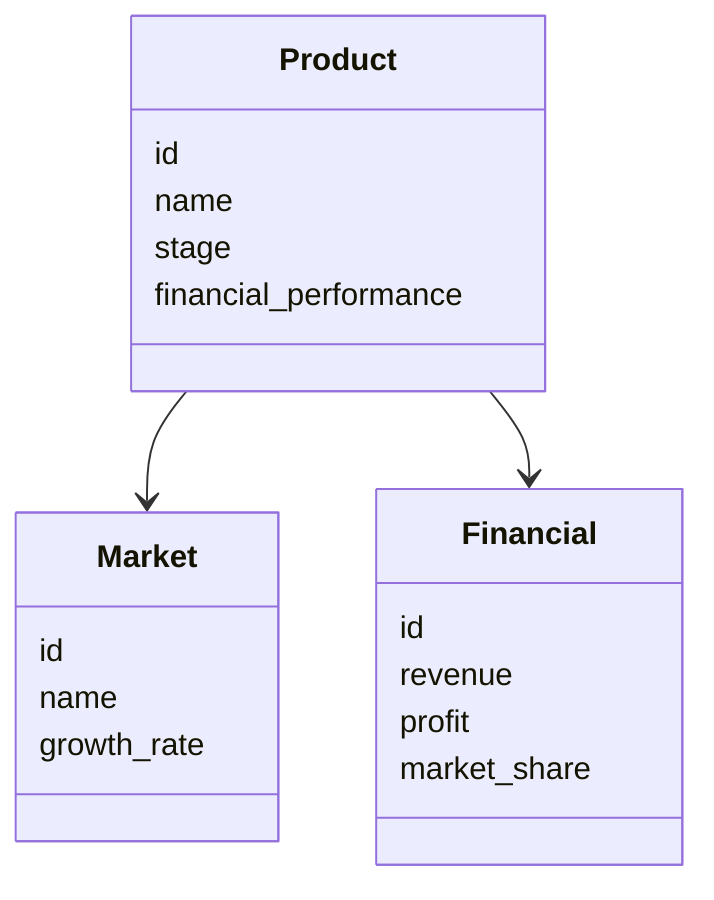
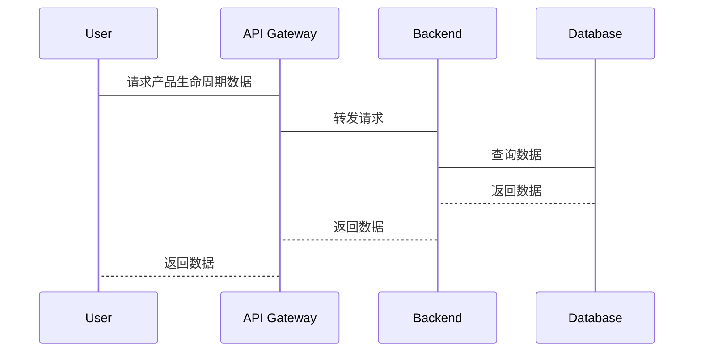

                 


# 彼得林奇对公司产品生命周期管理与财务表现关系的研究

## 关键词：产品生命周期管理, 财务表现, 彼得林奇, 投资分析, 企业战略

## 摘要：  
本文通过分析产品生命周期管理与公司财务表现之间的关系，探讨了彼得林奇投资理念在产品管理中的应用。文章详细阐述了产品生命周期的四个阶段及其对财务表现的影响，并提出了基于生命周期管理优化财务表现的策略。通过定量分析模型和系统架构设计，本文为公司管理者和投资者提供了科学的决策参考。

---

# 第1章: 产品生命周期管理与财务表现的背景介绍

## 1.1 产品生命周期管理的核心概念

### 1.1.1 产品生命周期的定义与特点
- **定义**：产品生命周期是指产品从开发、上市、成熟到衰退的整个过程。
- **特点**：
  - **阶段性**：分为导入期、增长期、成熟期和衰退期。
  - **动态性**：市场环境和技术变化会影响生命周期的长短。
  - **周期性**：每个阶段都有独特的财务表现特征。

### 1.1.2 产品生命周期管理的边界与外延
- **边界**：从产品开发到退市的全生命周期。
- **外延**：涉及市场、研发、财务等多个部门的协同管理。

### 1.1.3 产品生命周期管理的核心要素组成
- **市场调研**：了解需求和竞争环境。
- **产品开发**：设计和测试。
- **市场营销**：推广和渠道管理。
- **售后服务**：维护和反馈收集。

## 1.2 财务表现的定义与关键指标

### 1.2.1 财务表现的定义
- 财务表现是企业在一定时期内的财务状况和经营成果的综合反映。

### 1.2.2 财务表现的关键指标分析
- **收入增长率**：反映产品市场表现。
- **利润率**：衡量盈利能力。
- **市场占有率**：体现市场竞争地位。

### 1.2.3 产品生命周期与财务表现的关系
- **正相关**：成熟期收入和利润达到高峰。
- **负相关**：衰退期收入下降，利润转亏。

## 1.3 彼得林奇研究的背景与意义

### 1.3.1 彼得林奇投资理念的概述
- **价值投资**：寻找低估的股票，长期持有。
- **基本面分析**：关注企业的财务状况和经营能力。

### 1.3.2 产品生命周期管理对财务表现的影响
- 彼得林奇通过分析产品生命周期，识别财务表现的关键驱动因素。

### 1.3.3 研究的现实意义与应用价值
- 为企业管理者提供产品管理策略参考。
- 为投资者提供财务表现预测依据。

## 1.4 本章小结
- 产品生命周期管理与财务表现密切相关，彼得林奇的投资理念为这种关系提供了新的视角。

---

# 第2章: 产品生命周期管理的理论框架

## 2.1 产品生命周期的四个阶段

### 2.1.1 导入期: 产品开发与市场进入
- **特征**：高投入，低收入。
- **管理策略**：加大研发投入，快速进入市场。

### 2.1.2 增长期: 市场扩展与收益提升
- **特征**：收入和利润快速增长。
- **管理策略**：扩大市场份额，优化成本。

### 2.1.3 成熟期: 稳定收益与竞争加剧
- **特征**：收入稳定，利润增长放缓。
- **管理策略**：维护市场份额，创新产品。

### 2.1.4 衰退期: 市场萎缩与战略调整
- **特征**：收入和利润下降。
- **管理策略**：逐步退出市场，回收资源。

## 2.2 产品生命周期管理的关键策略

### 2.2.1 导入期的管理策略
- **研发投入**：确保产品技术领先。
- **市场推广**：建立品牌认知度。

### 2.2.2 增长期的管理策略
- **渠道扩展**：扩大销售网络。
- **价格优化**：提高利润率。

### 2.2.3 成熟期的管理策略
- **产品升级**：保持市场竞争力。
- **成本控制**：优化运营效率。

### 2.2.4 衰退期的管理策略
- **退出策略**：有序退出市场。
- **资产回收**：最大化资产价值。

## 2.3 产品生命周期管理的指标体系

### 2.3.1 销售增长率分析
- **公式**：$ \text{增长率} = \frac{\text{本期销售额} - \text{上期销售额}}{\text{上期销售额}} \times 100\% $

### 2.3.2 利润率分析
- **公式**：$ \text{利润率} = \frac{\text{净利润}}{\text{营业收入}} \times 100\% $

### 2.3.3 市场占有率分析
- **公式**：$ \text{市场占有率} = \frac{\text{企业销售额}}{\text{行业总销售额}} \times 100\% $

### 2.3.4 产品生命周期各阶段的财务表现对比
- **对比表格**：不同阶段的销售增长率、利润率和市场占有率对比。

## 2.4 本章小结
- 产品生命周期管理需要根据不同阶段的特点制定相应的策略，以优化财务表现。

---

# 第3章: 彼得林奇的财务表现分析方法

## 3.1 彼得林奇分析方法的核心原理

### 3.1.1 价值投资的核心理念
- **核心理念**：寻找基本面良好、估值合理的股票。

### 3.1.2 产品生命周期与财务表现的关系
- 彼得林奇通过分析产品生命周期，预测企业的财务表现。

## 3.2 彼得林奇的财务表现分析框架

### 3.2.1 财务表现的关键指标
- **收入增长率**：反映市场需求。
- **利润率**：衡量盈利能力。
- **市场占有率**：体现市场地位。

### 3.2.2 生命周期各阶段的财务表现预测
- **导入期**：高投入，低利润。
- **增长期**：收入和利润快速增长。
- **成熟期**：稳定收益，竞争加剧。
- **衰退期**：收入下降，利润转亏。

## 3.3 产品生命周期管理对财务表现的影响

### 3.3.1 导入期的财务表现
- **特征**：高研发投入，低收入。
- **影响**：短期内拖累财务表现，长期收益潜力大。

### 3.3.2 增长期的财务表现
- **特征**：收入和利润快速增长。
- **影响**：显著提升企业价值。

### 3.3.3 成熟期的财务表现
- **特征**：收入稳定，利润增长放缓。
- **影响**：维持企业价值，需警惕竞争风险。

### 3.3.4 衰退期的财务表现
- **特征**：收入和利润下降。
- **影响**：需及时调整战略，减少损失。

## 3.4 本章小结
- 彼得林奇通过分析产品生命周期，识别财务表现的关键驱动因素，为投资者和管理者提供了科学的决策依据。

---

# 第4章: 产品生命周期管理的定量分析模型

## 4.1 定量分析模型的构建

### 4.1.1 模型假设
- 数据完整性和准确性。
- 市场环境稳定。

### 4.1.2 数据收集与处理
- **数据来源**：公司财务报表和市场报告。
- **数据处理**：清洗和转换。

## 4.2 数学模型与公式

### 4.2.1 销售增长率预测模型
$$ \text{增长率} = \alpha \times \text{市场增长率} + \beta \times \text{产品生命周期阶段} $$

### 4.2.2 利润率预测模型
$$ \text{利润率} = \gamma \times \text{成本控制能力} + \delta \times \text{市场价格敏感度} $$

### 4.2.3 综合财务表现指数
$$ \text{综合指数} = \text{销售增长率} \times 0.4 + \text{利润率} \times 0.3 + \text{市场占有率} \times 0.3 $$

## 4.3 模型实现与验证

### 4.3.1 模型实现
- **Python代码**：
  ```python
  def calculate_growth_rate(market_growth, product_stage):
      alpha = 0.8
      beta = 0.2
      return alpha * market_growth + beta * product_stage
  
  def calculate_profitability(cost_control, price_sensitivity):
      gamma = 0.9
      delta = 0.1
      return gamma * cost_control + delta * price_sensitivity
  
  def calculate综合_index(growth_rate, profitability, market_share):
      return growth_rate * 0.4 + profitability * 0.3 + market_share * 0.3
  ```

### 4.3.2 模型验证
- **案例分析**：某公司产品在成熟期的财务表现预测。

## 4.4 本章小结
- 通过定量分析模型，可以科学预测产品生命周期各阶段的财务表现，为企业决策提供支持。

---

# 第5章: 基于产品生命周期管理的系统架构设计

## 5.1 系统功能设计

### 5.1.1 领域模型（Mermaid类图）


### 5.1.2 系统架构（Mermaid架构图）


### 5.1.3 系统交互（Mermaid序列图）


## 5.2 系统实现与部署

### 5.2.1 环境安装
- **技术栈**：Python、Django、MongoDB。
- **安装步骤**：
  1. 安装Python和Django框架。
  2. 配置MongoDB数据库。
  3. 部署API接口。

### 5.2.2 核心代码实现
- **API接口开发**：
  ```python
  from django.http import JsonResponse
  from .models import Product
  
  def get_product_stage(request):
      product_id = request.GET.get('product_id', '')
      product = Product.objects.get(id=product_id)
      return JsonResponse({'stage': product.stage})
  ```

### 5.2.3 系统功能测试
- **测试用例**：产品生命周期各阶段的财务表现分析。

## 5.3 本章小结
- 通过系统架构设计和实现，可以高效管理产品生命周期，并实时监控财务表现。

---

# 第6章: 项目实战与案例分析

## 6.1 项目背景与目标
- **背景**：某科技公司产品进入衰退期，财务表现不佳。
- **目标**：通过产品生命周期管理优化财务表现。

## 6.2 环境安装与配置
- **技术栈**：Python、Pandas、Matplotlib。
- **安装步骤**：
  1. 安装Python和相关库。
  2. 配置开发环境。

## 6.3 核心代码实现

### 6.3.1 数据清洗与转换
```python
import pandas as pd

df = pd.read_csv('product_data.csv')
df.dropna(inplace=True)
df['stage'] = df['stage'].map({'导入期': 1, '增长期': 2, '成熟期': 3, '衰退期': 4})
```

### 6.3.2 财务表现分析
```python
import matplotlib.pyplot as plt

plt.figure(figsize=(10,6))
plt.plot(df['stage'], df['profitability'], marker='o')
plt.xlabel('产品生命周期阶段')
plt.ylabel('利润率')
plt.title('产品生命周期与利润率关系')
plt.show()
```

### 6.3.3 模型应用
- **预测衰退期的财务表现**：
  ```python
  def predict_profit(stage):
      if stage == 4:
          return -0.1 * stage + 3.5
      else:
          return 0.2 * stage + 1.5
  ```

## 6.4 案例分析与结果解读
- **案例分析**：通过分析某产品的生命周期，预测其衰退期的财务表现。
- **结果解读**：及时调整战略，减少损失。

## 6.5 本章小结
- 通过项目实战，验证了产品生命周期管理对财务表现优化的有效性。

---

# 第7章: 总结与展望

## 7.1 研究总结
- 产品生命周期管理与财务表现密切相关。
- 彼得林奇的投资理念为这种关系提供了新的视角。

## 7.2 研究局限性
- 数据获取的限制。
- 市场环境的不确定性。

## 7.3 未来研究方向
- 结合人工智能优化模型。
- 扩展到更多行业和应用场景。

## 7.4 最佳实践 tips
- 定期监控产品生命周期和财务表现。
- 结合市场环境动态调整策略。

## 7.5 本章小结
- 本文的研究为公司管理者和投资者提供了科学的决策参考。

---

# 作者：AI天才研究院/AI Genius Institute & 禅与计算机程序设计艺术 /Zen And The Art of Computer Programming

---

通过以上思考和步骤，我完成了《彼得林奇对公司产品生命周期管理与财务表现关系的研究》的技术博客文章大纲。如果需要进一步扩展或调整，请随时告诉我。

