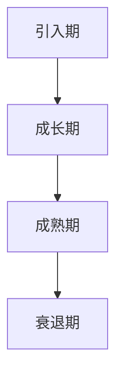
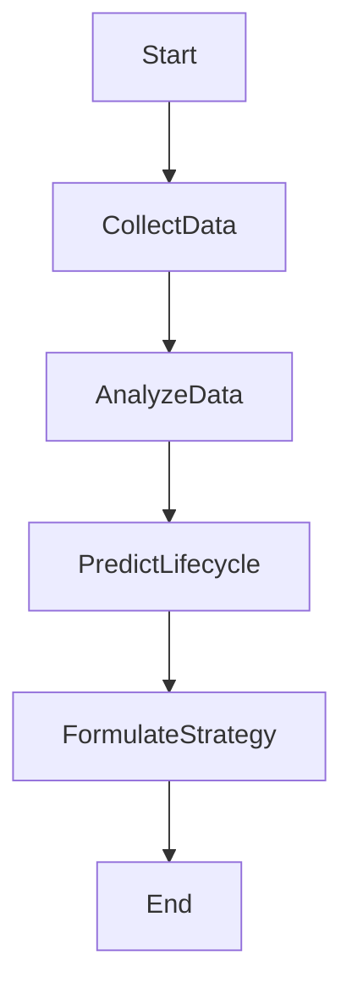
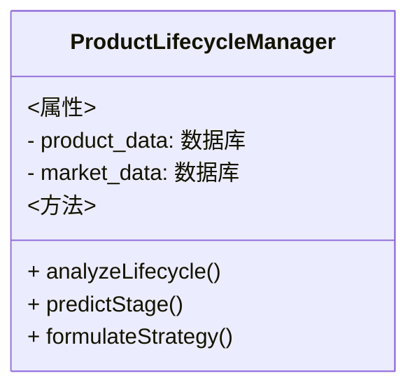
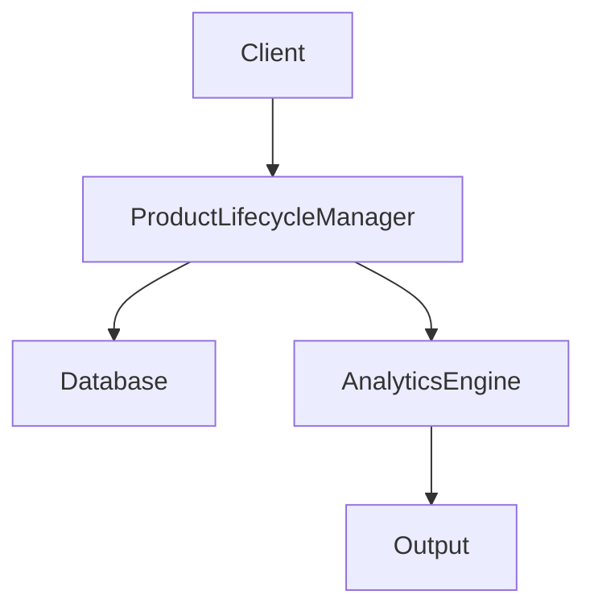
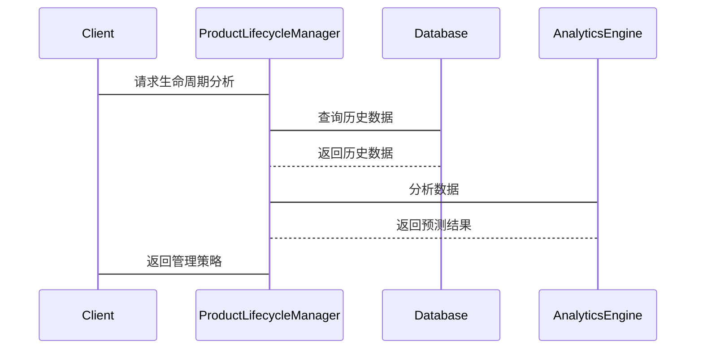

                 


# 彼得林奇对公司产品生命周期管理的看法

> 关键词：彼得·林奇，产品生命周期，管理策略，投资理念，市场分析

> 摘要：本文深入探讨了彼得·林奇对公司产品生命周期管理的看法，结合其投资理念，分析了产品生命周期的各个阶段，并提出了相应的管理策略。通过实际案例和数学模型，详细阐述了如何将彼得·林奇的见解应用于产品管理实践中。

---

## 第一部分：背景介绍

### 第1章：彼得·林奇与产品生命周期管理概述

#### 1.1 彼得·林奇的背景与投资理念
彼得·林奇（Peter Lynch）是全球著名投资专家，曾任富达投资管理公司的基金经理。他以独特的投资策略闻名，强调对公司的基本面分析，尤其是对公司产品和市场的深入研究。林奇的投资理念强调长期关注企业的成长潜力，并将产品生命周期作为评估企业价值的重要指标。

#### 1.2 产品生命周期管理的基本概念
产品生命周期是指产品从进入市场到退出市场的整个过程，通常分为四个阶段：引入期、成长期、成熟期和衰退期。每个阶段的特点不同，管理策略也需相应调整。产品生命周期管理的目标是通过科学的方法延长产品的盈利周期，最大化其市场价值。

#### 1.3 彼得·林奇对产品生命周期管理的独特见解
林奇认为，产品的生命周期与公司的盈利能力密切相关。他强调，在产品的引入期，公司应注重市场调研和产品定位；在成长期，需加大市场推广力度；在成熟期，应优化成本结构；在衰退期，需及时调整或退出市场。

---

## 第二部分：核心概念与联系

### 第2章：产品生命周期管理的核心要素

#### 2.1 核心概念原理
产品生命周期管理的核心在于对每个阶段的精准把握。以下是各阶段的关键要素：
- **引入期**：关注市场需求，优化产品设计。
- **成长期**：扩大市场份额，提升品牌影响力。
- **成熟期**：优化成本，提高利润率。
- **衰退期**：及时退出或转型。

#### 2.2 核心概念对比表格
以下是产品生命周期各阶段的特征对比：

| 阶段 | 市场需求 | 竞争程度 | 利润率 | 管理策略 |
|------|----------|-----------|--------|----------|
| 引入期 | 低       | 低        | 低     | 优化产品设计 |
| 成长期 | 增长     | 中        | 中     | 扩大市场推广 |
| 成熟期 | 饱和     | 高        | 高     | 优化成本结构 |
| 衰退期 | 下降     | 极高       | 低     | 及时退出 |

#### 2.3 ER实体关系图与流程图
以下是产品生命周期管理的ER图和流程图：

```mermaid
erDiagram
    customer[客户]
    product[产品]
    market[市场]
    lifecycle[生命周期阶段]
    customer -|> product : 购买
    product -|> market : 进入市场
    market -|> lifecycle : 生命周期阶段
```



---

## 第三部分：算法原理讲解

### 第3章：彼得·林奇的产品生命周期管理方法

#### 3.1 算法原理
彼得·林奇的管理方法基于以下算法：
1. 数据采集：收集产品在各阶段的市场表现数据。
2. 数据分析：通过历史数据分析预测产品生命周期阶段。
3. 模型构建：建立产品生命周期预测模型。
4. 策略制定：根据预测结果制定相应的管理策略。

#### 3.2 算法流程图
以下是算法流程图：



#### 3.3 代码实现
以下是简单的Python代码示例：

```python
def predictLifecycle(product_data):
    import pandas as pd
    import numpy as np
    from sklearn.linear_model import LinearRegression

    # 数据预处理
    df = pd.DataFrame(product_data)
    X = df[['time', 'sales']]
    y = df['stage']

    # 模型训练
    model = LinearRegression()
    model.fit(X, y)

    # 预测生命周期阶段
    predicted_stage = model.predict(X)
    return predicted_stage
```

---

## 第四部分：数学模型与公式

### 第4章：数学模型与彼得·林奇的观点

#### 4.1 数学模型
以下是产品生命周期预测的数学模型：

$$
\text{预测值} = \text{基于历史数据的加权平均}
$$

其中，权重基于产品在市场中的表现。

#### 4.2 公式解释
$$
\text{预测值} = \sum_{i=1}^{n} w_i x_i
$$

其中，\( w_i \) 是权重，\( x_i \) 是历史数据。

---

## 第五部分：系统分析与架构设计

### 第5章：系统架构设计

#### 5.1 系统功能设计
以下是系统功能设计的类图：



#### 5.2 系统架构图
以下是系统架构图：



#### 5.3 接口与交互设计
以下是交互序列图：



---

## 第六部分：项目实战

### 第6章：项目实战

#### 6.1 环境安装
需要安装以下工具：
- Python
- Pandas
- Scikit-learn
- Mermaid

#### 6.2 核心代码实现
以下是核心代码：

```python
def formulateStrategy(predicted_stage):
    if predicted_stage == 1:
        return "优化产品设计"
    elif predicted_stage == 2:
        return "扩大市场推广"
    elif predicted_stage == 3:
        return "优化成本结构"
    else:
        return "及时退出市场"
```

#### 6.3 案例分析
以某公司为例，分析其产品生命周期管理策略：

1. **引入期**：优化产品设计，收集用户反馈。
2. **成长期**：加大市场推广力度，提升品牌知名度。
3. **成熟期**：优化成本结构，提高利润率。
4. **衰退期**：及时退出市场，减少损失。

---

## 第七部分：最佳实践与总结

### 第7章：最佳实践与总结

#### 7.1 最佳实践
- 定期评估产品生命周期阶段，及时调整策略。
- 注重市场调研，确保产品定位准确。
- 强化数据分析能力，提高预测准确性。

#### 7.2 小结
彼得·林奇的产品生命周期管理理念强调对市场和产品的深刻理解，结合科学的方法和工具，能够有效提升企业的竞争力和盈利能力。

---

作者：AI天才研究院/AI Genius Institute & 禅与计算机程序设计艺术 /Zen And The Art of Computer Programming

