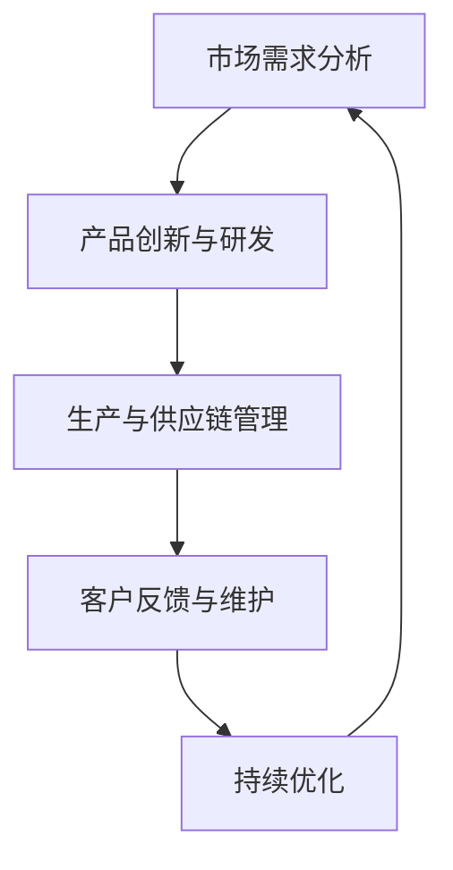
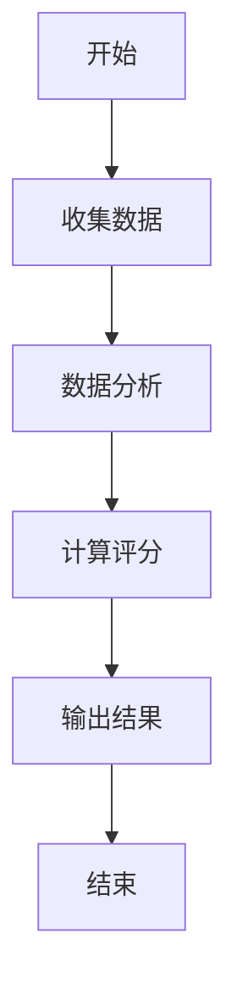
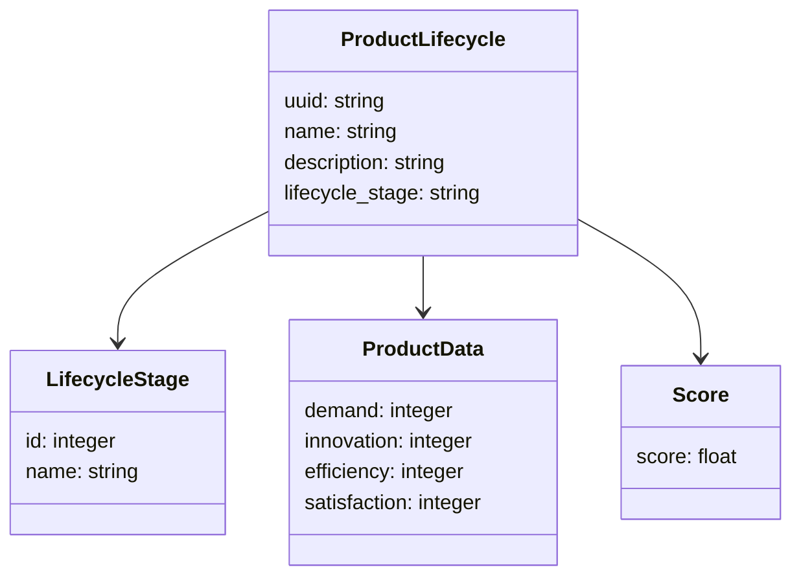
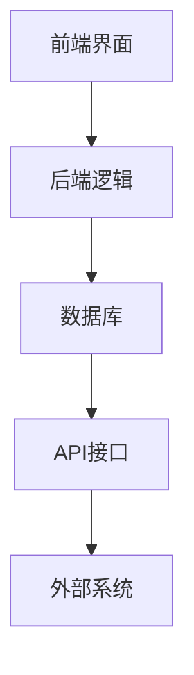
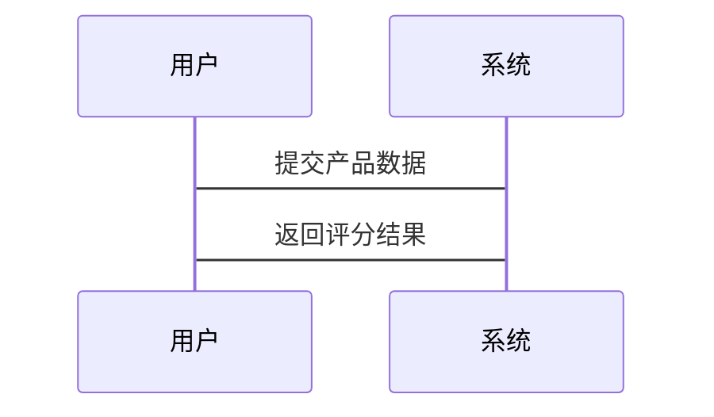

                 


# 彼得林奇对公司产品生命周期管理能力的评估

> 关键词：产品生命周期管理能力、彼得·林奇、评估模型、系统架构、项目实战

> 摘要：本文详细探讨了彼得·林奇对公司产品生命周期管理能力的评估方法，结合了技术背景、核心概念、算法原理、系统架构和项目实战等多方面内容，帮助读者全面理解并掌握这一评估体系。

---

## 第1章: 产品生命周期管理能力的背景介绍

### 1.1 产品生命周期管理能力的定义与重要性

#### 1.1.1 产品生命周期的定义
产品生命周期（Product Life Cycle，PLC）是指一个产品从进入市场到退出市场的整个过程，通常分为四个阶段：引入阶段（Introduction）、成长阶段（Growth）、成熟阶段（Maturity）和衰退阶段（Decline）。每个阶段的特点和策略需求各不相同，企业需要具备灵活的管理能力来应对这些变化。

#### 1.1.2 产品生命周期管理能力的核心要素
产品生命周期管理能力（Product Lifecycle Management，PLM）是指企业在产品全生命周期中，从设计、生产到维护和退市的整个过程中，对资源、流程和信息进行有效管理的能力。其核心要素包括：
- **市场需求分析**：准确识别市场需求，制定符合市场的产品策略。
- **产品创新与研发**：快速迭代和创新，确保产品竞争力。
- **生产与供应链管理**：高效组织生产，确保产品质量和成本控制。
- **客户反馈与维护**：及时收集客户反馈，持续改进产品和服务。

#### 1.1.3 彼得·林奇对产品生命周期管理能力的重视
彼得·林奇（Peter Lynch）是美国著名的投资经理和作家，他强调企业必须具备强大的产品生命周期管理能力，以确保产品能够持续满足市场需求，并在竞争激烈的市场中保持领先地位。他提出，企业的核心竞争力在于对产品生命周期的深度理解和灵活管理。

---

### 1.2 产品生命周期管理能力的背景与问题背景

#### 1.2.1 当前企业面临的市场竞争压力
随着市场竞争的加剧，企业需要在产品生命周期的各个阶段中，快速响应市场变化，优化资源配置，以降低运营成本并提高效率。

#### 1.2.2 产品生命周期缩短对企业的影响
现代市场环境下，产品生命周期越来越短，企业需要更加高效地管理产品，以应对市场变化和客户需求的变化。

#### 1.2.3 产品生命周期管理能力的重要性
企业的产品生命周期管理能力直接影响其市场表现和盈利能力。具备强大的PLM能力的企业能够更好地应对市场变化，提高客户满意度，并在竞争中占据优势地位。

---

## 第2章: 产品生命周期管理能力的核心概念与联系

### 2.1 核心概念原理

#### 2.1.1 产品生命周期管理能力的定义
产品生命周期管理能力是指企业在产品全生命周期中，从设计、生产到维护和退市的整个过程中，对资源、流程和信息进行有效管理的能力。

#### 2.1.2 核心概念的属性特征对比表格

| 属性 | 引入阶段 | 成长阶段 | 成熟阶段 | 衰退阶段 |
|------|----------|----------|----------|----------|
| 特征 | 进入市场，用户认知度低 | 用户认知度提高，市场需求增长 | 市场需求稳定，竞争激烈 | 市场需求下降，替代品增多 |
| 管理重点 | 市场推广和用户教育 | 提高产量和销售网络 | 成本控制和客户维护 | 退市规划和资源调整 |

#### 2.1.3 ER实体关系图架构
以下是产品生命周期管理能力的ER实体关系图：

```mermaid
erDiagram
    product[产品] {
        uuid : string
        name : string
        description : string
        stage : string
        }
    lifecycle_stage[生命周期阶段] {
        id : integer
        name : string
        }
    product.stage --> lifecycle_stage.id
```

---

### 2.2 核心概念的联系与流程图

以下是产品生命周期管理能力的核心概念联系流程图：



---

## 第3章: 产品生命周期管理能力的评估模型

### 3.1 评估模型的算法原理

#### 3.1.1 评估模型的流程图



#### 3.1.2 算法的Python实现代码

```python
def productLifecycleScore(product_data):
    # 产品数据包括：市场需求、产品创新、生产效率、客户满意度
    demand = product_data['demand']
    innovation = product_data['innovation']
    efficiency = product_data['efficiency']
    satisfaction = product_data['satisfaction']

    # 权重分配
    weight_demand = 0.3
    weight_innovation = 0.3
    weight_efficiency = 0.2
    weight_satisfaction = 0.2

    # 计算总评分
    score = (demand * weight_demand +
             innovation * weight_innovation +
             efficiency * weight_efficiency +
             satisfaction * weight_satisfaction)

    return score

# 示例数据
product_data = {
    'demand': 85,
    'innovation': 90,
    'efficiency': 80,
    'satisfaction': 85
}

score = productLifecycleScore(product_data)
print(f"产品生命周期管理能力评分为：{score}")
```

#### 3.1.3 算法的详细讲解与举例说明
上述算法基于加权评分法，根据市场需求、产品创新、生产效率和客户满意度四个维度对产品生命周期管理能力进行评分。权重分配可以根据具体行业和企业需求进行调整。例如，对于一家科技公司，产品创新的权重可以更高，而市场需求的权重可以适当降低。

---

### 3.2 数学模型与公式

#### 3.2.1 评估模型的数学公式

$$ \text{评分} = \sum (\text{指标值} \times \text{权重}) $$

其中，权重之和为1。

#### 3.2.2 算法的详细讲解与举例说明
假设某公司产品的市场需求得分为85分，产品创新得分为90分，生产效率得分为80分，客户满意度得分为85分，权重分别为0.3、0.3、0.2和0.2。根据上述公式，评分计算如下：

$$ \text{评分} = 85 \times 0.3 + 90 \times 0.3 + 80 \times 0.2 + 85 \times 0.2 = 25.5 + 27 + 16 + 17 = 85.5 $$

---

## 第4章: 产品生命周期管理能力的系统分析与架构设计

### 4.1 系统分析与需求分析

#### 4.1.1 问题场景的介绍
企业需要一个系统化的工具来评估和管理产品生命周期管理能力，以提高效率和准确性。

#### 4.1.2 系统功能设计



#### 4.1.3 系统架构设计



#### 4.1.4 系统交互设计



---

## 第5章: 产品生命周期管理能力的项目实战

### 5.1 项目实战环境的安装与配置

#### 5.1.1 开发环境的安装
- 安装Python和相关库（如pandas、numpy、matplotlib）
- 安装Mermaid和系统架构设计工具（如PlantUML）

#### 5.1.2 项目核心代码的实现

```python
import pandas as pd
import numpy as np
import matplotlib.pyplot as plt

def visualizeLifecycleScore(scores):
    plt.bar(scores.index, scores.values)
    plt.title('产品生命周期管理能力评分')
    plt.xlabel('指标')
    plt.ylabel('评分')
    plt.show()

# 示例数据
data = {
    '指标': ['市场需求', '产品创新', '生产效率', '客户满意度'],
    '评分': [85, 90, 80, 85]
}

df = pd.DataFrame(data)
visualizeLifecycleScore(df.set_index('指标'))
```

### 5.2 项目核心代码的实现与解读

#### 5.2.1 核心代码的实现
上述代码使用了Python的pandas和matplotlib库，用于数据可视化和分析。通过绘制柱状图，直观展示各个指标的评分情况。

#### 5.2.2 代码的功能解读与分析
该代码首先定义了一个数据框，包含产品生命周期管理能力的四个指标及其评分。然后调用`visualizeLifecycleScore`函数，将数据可视化为柱状图，便于分析和理解。

---

### 5.3 项目实战案例的分析与解读

#### 5.3.1 实际案例的分析
假设某公司产品在市场需求、产品创新、生产效率和客户满意度四个维度的评分为85、90、80和85。根据上述评估模型，计算得分为85.5分，表明该公司的产品生命周期管理能力处于较高水平。

#### 5.3.2 案例的详细讲解与剖析
通过上述案例，我们可以看到，尽管公司在市场需求和客户满意度方面表现较好，但在生产效率方面存在一定的改进空间。因此，公司需要进一步优化生产流程，以提高整体评分。

---

## 第6章: 产品生命周期管理能力的最佳实践与小结

### 6.1 最佳实践 tips

#### 6.1.1 评估过程中的注意事项
- 确保数据的准确性和完整性
- 根据企业实际情况调整权重
- 定期更新评估模型

#### 6.1.2 提高产品生命周期管理能力的建议
- 加强市场调研和用户反馈的收集
- 提高产品创新能力和研发效率
- 建立高效的生产与供应链管理体系

### 6.2 小结

通过本文的详细讲解，读者可以全面了解彼得·林奇对公司产品生命周期管理能力的评估方法，并掌握如何在实际中应用这些方法来优化企业的产品管理能力。

---

## 第7章: 注意事项与拓展阅读

### 7.1 注意事项

- 评估模型的权重调整需要结合企业实际情况
- 数据可视化工具的选择应根据具体需求
- 系统设计时需考虑数据安全和隐私保护

### 7.2 拓展阅读

- 彼得·林奇的其他相关著作
- 产品生命周期管理的最新研究和趋势
- 数据科学与产品生命周期管理的结合

---

## 作者：AI天才研究院/AI Genius Institute & 禅与计算机程序设计艺术 /Zen And The Art of Computer Programming

--- 

以上是《彼得林奇对公司产品生命周期管理能力的评估》的完整目录和内容框架，希望对您有所帮助！

