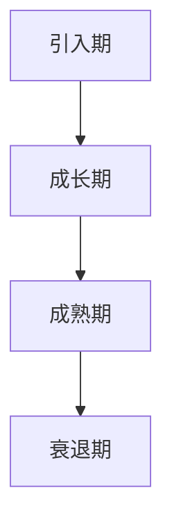
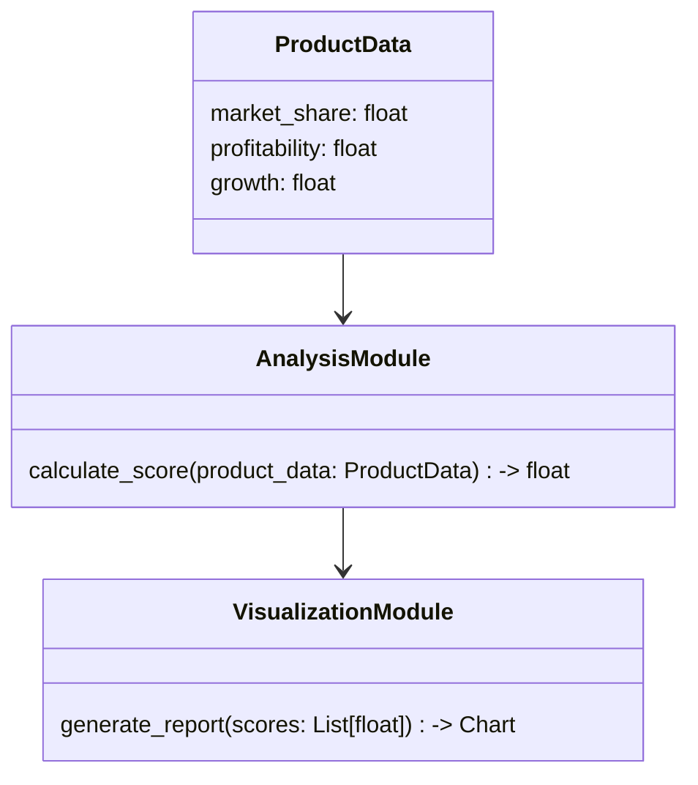
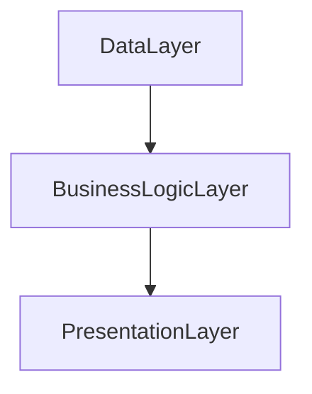

                 


# 彼得林奇对公司产品线的分析

## 关键词：彼得林奇，产品线分析，投资策略，公司分析，行业分析

## 摘要：  
本文详细探讨了彼得林奇对公司产品线的分析方法，结合其投资理念，分析了产品线的核心要素、竞争优势、财务表现及其对公司战略的影响。通过系统化的分析框架、数学模型和实际案例，本文揭示了如何利用产品线分析做出明智的投资决策。

---

# 第1章: 产品线分析的背景与基础

## 1.1 产品线分析的定义与重要性  
产品线分析是对公司产品组合的系统性研究，旨在评估各产品的市场表现、盈利能力及未来发展潜力。彼得·林奇认为，产品线是公司核心竞争力的体现，是投资决策的重要依据。  

---

## 1.2 彼得林奇的投资方法论  
彼得·林奇强调基本面分析，注重对公司产品线的深入了解。他通过分析产品的市场地位、竞争优势和财务数据，识别出具有长期增长潜力的公司。  

---

## 1.3 产品线分析的基本框架  
产品线分析包括以下几个核心步骤：  
1. 收集产品线数据（市场表现、财务指标）。  
2. 分析产品线的竞争优势。  
3. 评估产品线的生命周期阶段。  
4. 综合评分，得出投资结论。  

---

# 第2章: 产品线分析的核心要素

## 2.1 产品线的生命周期  
产品线的生命周期分为四个阶段：  
1. **引入期**：新产品进入市场，销售额逐步增长。  
2. **成长期**：市场需求旺盛，销售额迅速上升。  
3. **成熟期**：市场饱和，销售额趋于稳定。  
4. **衰退期**：市场需求下降，销售额开始下滑。  

### 生命周期分析的图表  


---

## 2.2 产品线的竞争优势分析  
竞争优势是产品线成功的关键。彼得·林奇通过以下指标评估竞争优势：  
- **市场占有率**：产品在市场中的份额占比。  
- **品牌影响力**：品牌知名度和美誉度。  
- **成本优势**：生产成本是否低于竞争对手。  

### 竞争优势对比表格  
| 指标       | 公司A       | 公司B       |
|------------|-------------|-------------|
| 市场占有率  | 30%         | 20%         |
| 品牌影响力  | 高          | 中          |
| 成本优势    | 低          | 高          |

---

## 2.3 产品线的财务表现分析  
财务表现是评估产品线盈利能力的关键。彼得·林奇关注以下指标：  
- **销售收入**：产品线的总收入。  
- **利润率**：净利润率和毛利率。  
- **增长潜力**：未来销售额的预期增长率。  

### 财务表现分析的数学模型  
$$ 利润率 = \frac{净利润}{销售收入} $$  

---

## 2.4 产品线与公司战略的关系  
产品线是公司战略的核心。通过分析产品线，投资者可以评估公司是否具备可持续的增长能力。  

---

# 第3章: 产品线分析的数学模型与算法

## 3.1 产品线评分系统  
彼得·林奇设计了一个评分系统，通过量化指标评估产品线的竞争力。评分系统包括以下步骤：  
1. 收集产品线的市场数据和财务数据。  
2. 根据指标权重计算各产品的得分。  
3. 综合得分，得出最终评分。  

### 评分系统示例代码  
```python
def calculate_score(product_data):
    weights = {'market_share': 0.4, 'profitability': 0.3, 'growth': 0.3}
    scores = []
    for product in product_data:
        score = 0
        for metric, weight in weights.items():
            score += product[metric] * weight
        scores.append(score)
    return scores

# 示例数据
product_data = [
    {'market_share': 0.3, 'profitability': 0.25, 'growth': 0.2},
    {'market_share': 0.2, 'profitability': 0.3, 'growth': 0.3}
]

# 计算评分
scores = calculate_score(product_data)
print(scores)  # 输出：[0.3*0.4 + 0.25*0.3 + 0.2*0.3, 0.2*0.4 + 0.3*0.3 + 0.3*0.3]
```

---

## 3.2 竞争优势的量化分析  
通过数学模型量化竞争优势，帮助投资者做出更精准的决策。  

### 竞争优势分析的公式  
$$ 竞争优势 = \frac{市场占有率 + 品牌影响力}{2} $$  

---

## 3.3 市场地位的数学模型  
市场地位是产品线分析的重要指标。  

### 市场地位分析的公式  
$$ 市场地位 = \frac{销售收入}{行业总销售额} $$  

---

# 第4章: 产品线分析的系统架构

## 4.1 系统功能设计  
系统功能包括：  
1. 数据采集：收集产品线的市场数据和财务数据。  
2. 数据分析：计算各项指标并生成报告。  
3. 可视化展示：以图表形式呈现分析结果。  

### 功能设计类图  


---

## 4.2 系统架构设计  
系统架构包括数据层、业务逻辑层和表示层。  

### 系统架构图  


---

## 4.3 系统接口设计  
系统接口包括数据接口和用户界面。  

### 接口设计示例  
```python
class ProductAnalyzer:
    def __init__(self, data_source):
        self.data_source = data_source

    def analyze_product_line(self):
        # 分析逻辑
        pass
```

---

# 第5章: 项目实战

## 5.1 环境安装与数据准备  
需要安装Python和相关库（如Pandas、Matplotlib）。  

## 5.2 核心实现  
编写代码实现产品线分析功能。  

### 核心代码示例  
```python
import pandas as pd
import matplotlib.pyplot as plt

def analyze_product_line(data):
    # 计算评分
    scores = []
    for product in data:
        score = product['market_share'] * 0.4 + product['profitability'] * 0.3 + product['growth'] * 0.3
        scores.append(score)
    # 可视化
    plt.bar(range(len(data)), scores)
    plt.title('Product Line Scores')
    plt.show()

# 示例数据
data = [
    {'market_share': 0.3, 'profitability': 0.25, 'growth': 0.2},
    {'market_share': 0.2, 'profitability': 0.3, 'growth': 0.3}
]
analyze_product_line(data)
```

---

## 5.3 案例分析  
以某科技公司为例，分析其产品线，并解读结果。  

---

## 5.4 总结与优化  
总结分析结果，并提出优化建议。  

---

# 第6章: 总结与展望

## 6.1 总结  
彼得·林奇的产品线分析方法为投资者提供了系统的分析框架，帮助识别具有投资价值的公司。  

## 6.2 注意事项  
1. 数据来源需可靠。  
2. 分析需结合行业背景。  
3. 投资需谨慎，避免盲目跟风。  

## 6.3 拓展阅读  
推荐相关书籍和资源，进一步学习产品线分析和投资策略。

---

# 作者：AI天才研究院/AI Genius Institute & 禅与计算机程序设计艺术 /Zen And The Art of Computer Programming

