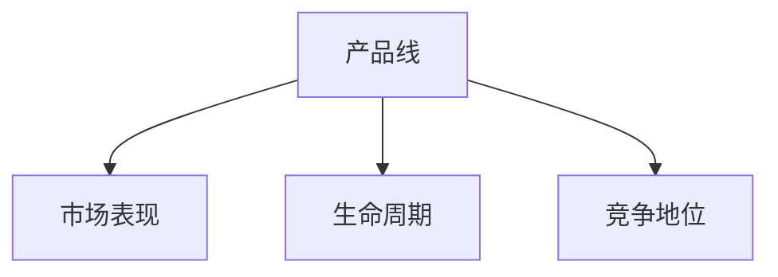
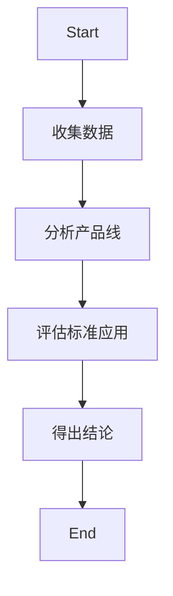
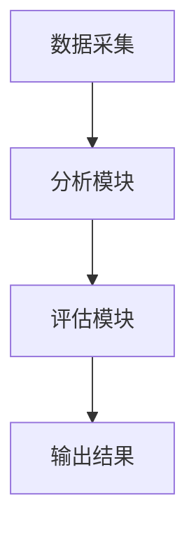

                 


# 彼得林奇对公司产品线的评估标准

> 关键词：彼得林奇、产品线评估、投资标准、企业战略、产品管理、评估模型

> 摘要：本文深入探讨了彼得·林奇对公司产品线的评估标准，分析了其核心概念、评估模型、系统架构设计及实际应用案例。通过详细的分析和实例，阐述了如何将这些标准应用于实际投资决策中，帮助投资者和企业更好地评估和管理产品线。

---

## 第一章: 背景介绍

### 1.1 彼得林奇的背景与投资理念
彼得·林奇是美国著名的投资专家，以其在富达投资集团的长期成功著称。他的投资理念强调对公司基本面的深入分析，尤其是对产品线的评估。他认为，产品线是企业核心竞争力的体现，直接影响企业的市场地位和盈利能力。

### 1.2 产品线评估的重要性
产品线是企业在市场上的产品组合，其健康状况直接关系到企业的生存和发展。通过评估产品线，投资者可以识别企业的优势产品和潜在风险，从而做出更明智的投资决策。

### 1.3 彼得林奇评估标准的核心理论
林奇提出了一套以市场表现、产品生命周期、竞争地位、管理团队、财务状况和创新能力为核心的评估标准。这些标准帮助企业识别出具有长期竞争优势的产品线。

---

## 第二章: 核心概念与联系

### 2.1 核心概念原理
产品线评估的核心在于分析产品的市场表现、生命周期和竞争地位。林奇的评估模型通过量化这些因素，帮助企业识别出具有增长潜力的产品线。

### 2.2 核心概念对比分析
- **市场表现**：产品线的市场份额和增长速度是关键指标。
- **生命周期**：产品所处阶段（导入期、成长期、成熟期、衰退期）决定了其战略调整方向。
- **竞争地位**：产品在市场上的竞争优势和劣势。

### 2.3 实体关系图与流程图


---

## 第三章: 评估标准的算法原理

### 3.1 算法原理概述
林奇的评估模型通过多维度指标对产品线进行评分，综合计算得出最终评估结果。公式如下：
$$ E = \sum_{i=1}^{n} w_i x_i $$
其中，$E$ 是评估结果，$w_i$ 是各维度的权重，$x_i$ 是各维度的评分。

### 3.2 评估流程图


---

## 第四章: 系统架构与设计

### 4.1 问题场景介绍
为了评估产品线，企业需要构建一个集数据采集、分析和评估于一体的系统。

### 4.2 系统功能设计
- **数据采集模块**：收集市场数据和财务数据。
- **分析模块**：计算各维度的评分。
- **评估模块**：生成最终评估结果。

### 4.3 系统架构图


---

## 第五章: 项目实战

### 5.1 环境安装
安装所需工具和库，如Python、Pandas、Scikit-learn。

### 5.2 核心代码实现
```python
import pandas as pd

def calculate_score(data, weights):
    return pd.dot(data, weights)

# 示例数据
data = pd.DataFrame({
    '市场表现': [0.8, 0.6, 0.7],
    '生命周期': [0.6, 0.8, 0.5],
    '竞争地位': [0.5, 0.7, 0.6]
})

weights = pd.Series([0.3, 0.4, 0.3], index=data.columns)

result = calculate_score(data, weights)
print(result)
```

### 5.3 案例分析
以某科技公司为例，分析其产品线的市场表现和竞争地位，计算出最终评分。

---

## 第六章: 总结与展望

### 6.1 总结
彼得·林奇的评估标准为企业提供了科学的评估方法，帮助企业识别出具有增长潜力的产品线。

### 6.2 未来展望
随着市场竞争的加剧，产品线评估将更加依赖于数据和技术。未来的评估标准将更加智能化和个性化。

---

## 作者：AI天才研究院/AI Genius Institute & 禅与计算机程序设计艺术 /Zen And The Art of Computer Programming

