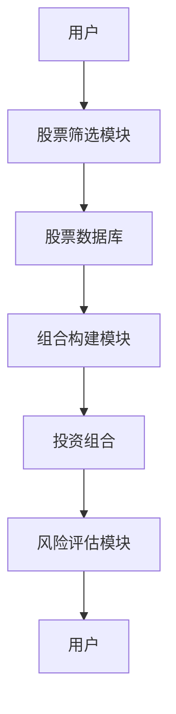
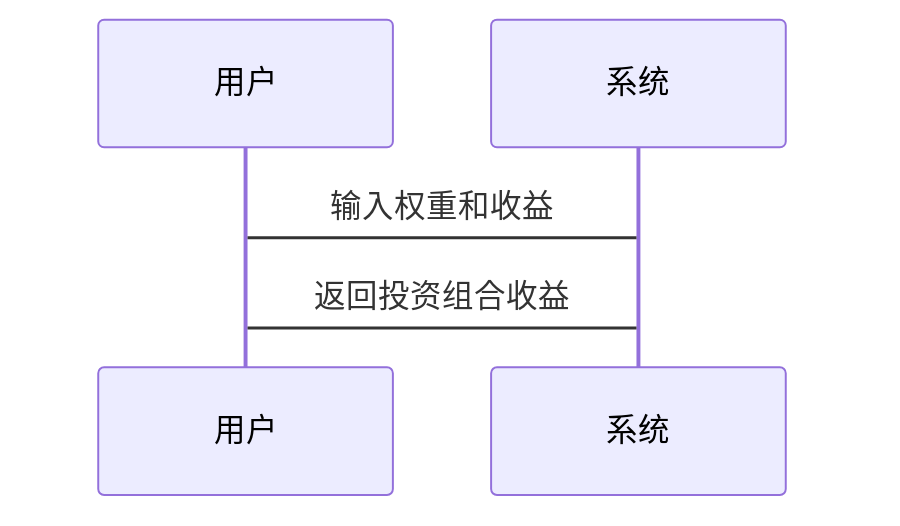

                 


# 彼得林奇对公司产品组合管理的看法

> 关键词：彼得·林奇、产品组合管理、投资策略、风险管理、选股标准、投资哲学

> 摘要：本文深入探讨了彼得·林奇在公司产品组合管理方面的独特见解，从他的投资哲学、选股标准到具体的管理策略，结合实际案例分析，全面解析了林奇的产品组合管理理论与实践。文章还从系统架构、算法原理、项目实战等多个维度，详细阐述了产品组合管理的核心概念与实际应用。

---

## 第一部分: 彼得·林奇与产品组合管理概述

### 第1章: 彼得·林奇的背景与投资理念

#### 1.1 彼得·林奇的生平简介
彼得·林奇（Peter Lynch）是美国著名投资经理人，被誉为“共同基金先生”。他在1970年至1990年间管理富达麦哲伦基金（Fidelity Magellan Fund），期间取得了年均21.8%的超额回报率。林奇的投资风格以长期持有、深入研究和注重基本面著称。

#### 1.2 林奇的投资哲学与风格
林奇的投资哲学可以概括为“买成长，卖波动”。他认为，投资者应该选择那些具有稳定增长潜力、管理良好且估值合理的公司。林奇强调长期投资和分散化，反对短期交易和市场预测。

#### 1.3 林奇与产品组合管理的关联
林奇的产品组合管理策略是其投资哲学的体现。他通过精选个股构建投资组合，并通过定期调整组合来应对市场变化。他的策略强调分散风险、注重个股质量以及长期持有。

### 第2章: 产品组合管理的核心概念

#### 2.1 产品组合管理的定义
产品组合管理是指通过分析和选择不同的投资标的（如股票、债券、基金等），构建一个能够在风险可控的前提下实现最大收益的投资组合。它是投资管理的核心环节。

#### 2.2 产品组合管理的重要性
产品组合管理能够帮助投资者实现风险分散、收益最大化以及目标投资的实现。通过科学的组合管理，投资者可以在不同市场环境下保持稳定的收益。

#### 2.3 产品组合管理的边界与外延
产品组合管理的边界在于投资目标的设定和风险承受能力的限制。外延则包括市场环境的变化、宏观经济的影响以及公司基本面的变化。

### 第3章: 林奇视角下的产品组合管理特点

#### 3.1 林奇的产品组合管理原则
- 长期投资：避免频繁交易，减少交易成本。
- 分散化：通过投资不同类型和行业的股票降低风险。
- 估值导向：选择估值合理、成长性良好的公司。

#### 3.2 林奇的选股标准与筛选流程
林奇的选股标准包括：
- 公司基本面良好：收入和利润稳定增长。
- 估值合理：市盈率、市净率等指标处于合理区间。
- 管理层优秀：公司管理层能力强且值得信赖。

#### 3.3 林奇对产品组合风险的控制方法
- 风险分散：通过投资不同行业的股票降低行业风险。
- 定期评估：定期审查投资组合，剔除表现不佳的个股。
- 仓位控制：根据市场环境调整投资组合的仓位。

---

## 第二部分: 产品组合管理的核心概念与联系

### 第4章: 核心概念原理

#### 4.1 产品组合管理的理论基础
产品组合管理的理论基础包括现代投资组合理论（MPT）和资本资产定价模型（CAPM）。林奇的管理策略在此基础上加入了对个股基本面的深入研究。

#### 4.2 林奇的选股模型
林奇的选股模型以基本面分析为核心，包括对公司财务状况、行业地位和管理能力的全面评估。

#### 4.3 产品组合管理的数学模型
投资组合的预期收益可以通过以下公式计算：
$$ \text{投资组合收益} = \sum_{i=1}^{n} w_i \times r_i $$
其中：
- \( w_i \) 是第 \( i \) 个资产的权重
- \( r_i \) 是第 \( i \) 个资产的预期收益

---

## 第三部分: 系统分析与架构设计

### 第5章: 产品组合管理系统的架构设计

#### 5.1 项目介绍
产品组合管理系统旨在帮助投资者根据林奇的策略构建和管理投资组合。

#### 5.2 系统功能设计
- 股票筛选模块：根据基本面指标筛选个股。
- 组合构建模块：根据权重分配构建投资组合。
- 风险评估模块：计算投资组合的风险和收益。

#### 5.3 系统架构图


### 第6章: 产品组合管理系统实现

#### 6.1 核心代码实现
```python
def calculate_portfolio_return(weights, returns):
    return sum(w * r for w, r in zip(weights, returns))
```

#### 6.2 系统交互流程


---

## 第四部分: 项目实战

### 第7章: 产品组合管理系统实战

#### 7.1 环境安装
- Python 3.8+
- Pandas、NumPy等库

#### 7.2 核心代码实现
```python
import pandas as pd

def calculate_portfolio_return(weights, returns):
    return sum(w * r for w, r in zip(weights, returns))

# 示例数据
returns = [0.1, 0.15, 0.08]
weights = [0.4, 0.4, 0.2]
print(calculate_portfolio_return(weights, returns))  # 输出: 0.12
```

#### 7.3 实际案例分析
假设我们有三只股票，权重分别为40%、40%和20%，预期收益分别为10%、15%和8%。计算投资组合的预期收益为12%。

---

## 第五部分: 最佳实践与总结

### 第8章: 最佳实践与小结

#### 8.1 最佳实践
- 定期审查投资组合，调整权重。
- 选择基本面良好的公司。
- 保持适度的分散化。

#### 8.2 注意事项
- 市场环境的变化会影响投资组合的表现。
- 风险管理是投资组合管理的核心。

### 第9章: 拓展阅读

#### 9.1 推荐书籍
- 《彼得·林奇的投资哲学》
- 《投资组合管理》

---

作者：AI天才研究院 & 禅与计算机程序设计艺术

