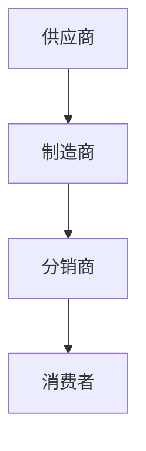
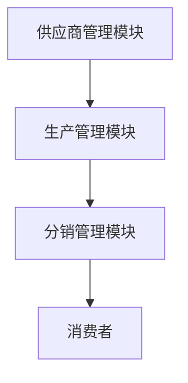
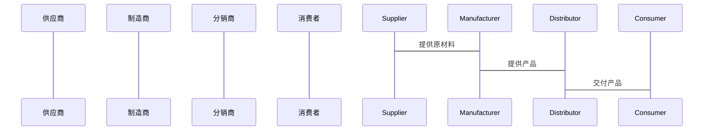
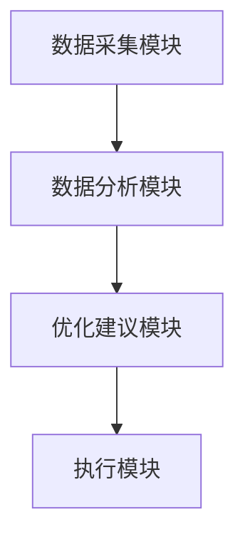
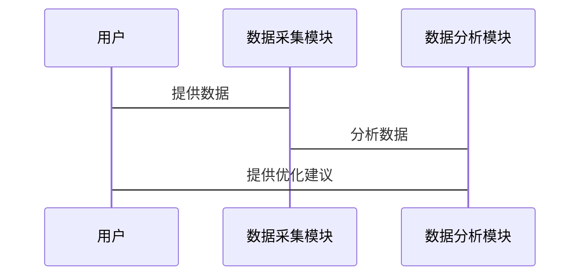

                 


# 彼得林奇对公司供应链垂直整合的评估

## 关键词：供应链垂直整合，彼得·林奇，供应链管理，企业战略，成本优化

## 摘要：  
供应链垂直整合是企业优化运营、降低成本、提高效率的重要战略。本文从彼得·林奇的视角出发，详细分析供应链垂直整合的核心概念、算法原理、系统架构以及项目实战，为企业提供有价值的参考和指导。

---

# 第一部分：供应链垂直整合的背景与概念

## 第1章：供应链垂直整合的定义与背景

### 1.1 供应链垂直整合的定义

#### 1.1.1 供应链的基本概念  
供应链是指从原材料采购、生产制造、仓储物流到最终产品交付给消费者的整个流程。它包括供应商、制造商、分销商和消费者等多个环节。

#### 1.1.2 什么是垂直整合  
垂直整合是指企业通过控制供应链的上游和下游环节，实现从原材料到最终产品的全链条管理。例如，一家公司不仅生产产品，还可能直接控制其供应商和分销渠道。

#### 1.1.3 垂直整合与水平整合的区别  
- **水平整合**：在同一生产环节中扩展规模，例如并购同行业的其他公司。  
- **垂直整合**：在供应链的不同环节中扩展，例如并购供应商或分销商。

### 1.2 供应链垂直整合的背景

#### 1.2.1 供应链管理的历史演变  
供应链管理从简单的采购管理发展到今天的全球化、数字化管理。企业越来越依赖供应链的高效运作来保持竞争力。

#### 1.2.2 垂直整合的兴起原因  
- **成本控制**：通过控制关键环节降低成本。  
- **风险规避**：减少对外部供应商的依赖，降低供应中断风险。  
- **质量控制**：垂直整合使企业能够更好地控制产品质量。  

#### 1.2.3 垂直整合在现代企业中的重要性  
在现代商业环境中，供应链的复杂性和不确定性增加，垂直整合成为企业增强竞争力的重要手段。

### 1.3 垂直整合的核心要素

#### 1.3.1 供应链的垂直整合模型  
垂直整合模型通常包括供应商整合、生产整合和分销整合三个主要环节。

#### 1.3.2 垂直整合的关键环节  
- **供应商管理**：选择和管理关键供应商。  
- **生产控制**：优化生产流程，提高效率。  
- **分销网络**：建立高效的分销渠道，确保产品快速交付。  

#### 1.3.3 垂直整合的边界与外延  
垂直整合的边界在于企业对供应链的控制范围，外延则涉及全球化和数字化技术的应用。

---

## 第2章：供应链垂直整合的核心概念

### 2.1 供应链垂直整合的核心原理

#### 2.1.1 垂直整合的基本原理  
通过整合供应链的上游和下游环节，企业能够更好地协调各环节的资源，实现高效运作。

#### 2.1.2 垂直整合的驱动因素  
- **成本优化**：通过整合减少中间环节的成本。  
- **效率提升**：优化生产流程，缩短生产周期。  
- **风险控制**：降低外部供应商带来的不确定性。  

#### 2.1.3 垂直整合的实现方式  
- **并购**：通过并购整合供应商或分销商。  
- **自营**：企业自行建立供应链环节，例如自建仓库或工厂。  

### 2.2 供应链垂直整合的核心要素对比

#### 2.2.1 供应商与制造商的关系  
- **供应商**：提供原材料或零部件。  
- **制造商**：负责产品的生产加工。  

#### 2.2.2 制造商与分销商的关系  
- **分销商**：负责产品的销售和配送。  
- **制造商**：需要与分销商协调，确保产品顺利流通。  

#### 2.2.3 分销商与消费者的关联  
- **分销商**：通过零售渠道将产品交付给消费者。  
- **消费者**：最终的产品使用者。  

### 2.3 供应链垂直整合的ER实体关系图



---

## 第3章：供应链垂直整合的算法原理

### 3.1 供应链垂直整合的效益评估算法

#### 3.1.1 成本节约算法  
通过整合供应链，企业可以减少采购、生产、物流等环节的成本。

#### 3.1.2 风险降低算法  
通过控制关键环节，降低供应链中断的风险。

#### 3.1.3 效率提升算法  
通过优化流程，提高整体供应链的运作效率。

### 3.2 供应链垂直整合的数学模型

#### 3.2.1 成本计算公式  
$$ \text{总成本} = \text{采购成本} + \text{生产成本} + \text{物流成本} $$  

#### 3.2.2 效益评估公式  
$$ \text{效益} = \frac{\text{整合前成本} - \text{整合后成本}}{\text{整合前成本}} \times 100\% $$  

### 3.3 算法实现的Python代码示例

```python
def cost_calculation(采购成本, 生产成本, 物流成本):
    总成本 = 采购成本 + 生产成本 + 物流成本
    return 总成本

def 效益评估(整合前成本, 整合后成本):
    效益 = ((整合前成本 - 整合后成本) / 整合前成本) * 100
    return 效益
```

---

## 第4章：供应链垂直整合的系统分析与架构设计

### 4.1 供应链垂直整合的系统分析

#### 4.1.1 系统功能设计  
- **供应商管理模块**：管理供应商信息，评估供应商绩效。  
- **生产管理模块**：监控生产流程，优化生产计划。  
- **分销管理模块**：管理分销渠道，优化物流配送。  

#### 4.1.2 系统架构设计  


#### 4.1.3 系统接口设计  
- **供应商接口**：与供应商系统对接，获取原材料信息。  
- **分销接口**：与分销渠道对接，管理订单和物流。  

#### 4.1.4 系统交互流程  


### 4.2 供应链垂直整合的架构设计方案

#### 4.2.1 系统功能设计  
- **数据采集**：收集供应链各环节的数据。  
- **数据分析**：分析数据，优化供应链运作。  

#### 4.2.2 系统架构设计  


#### 4.2.3 系统接口设计  
- **数据接口**：与供应商、分销商等外部系统对接。  
- **用户接口**：提供用户友好的操作界面。  

#### 4.2.4 系统交互流程  


---

## 第5章：供应链垂直整合的项目实战

### 5.1 项目背景介绍

#### 5.1.1 项目目标  
通过供应链垂直整合，优化企业的运营成本和效率。

#### 5.1.2 项目范围  
整合供应商、生产、分销等环节，实现全链条管理。

### 5.2 系统核心实现

#### 5.2.1 环境安装  
- 安装Python和相关库（如pandas、numpy）。  

#### 5.2.2 核心代码实现  
```python
def 整合供应商(供应商列表):
    优化后的供应商 = []
    for 供应商 in 供应商列表:
        如果供应商.绩效 > 80:
            优化后的供应商.append(供应商)
    return 优化后的供应商

def 优化生产计划(生产数据):
    优化后的生产计划 = []
    for 数据 in 生产数据:
        如果数据.效率 > 90:
            优化后的生产计划.append(数据)
    return 优化后的生产计划
```

#### 5.2.3 代码应用解读  
通过代码实现供应商和生产环节的优化，提高整体供应链效率。

### 5.3 实际案例分析

#### 5.3.1 案例背景  
某制造企业通过垂直整合供应链，成功降低了成本，提高了效率。

#### 5.3.2 案例分析  
- **整合前**：依赖多个供应商，生产效率低下。  
- **整合后**：通过垂直整合，企业实现了对供应商和分销渠道的控制，成本降低20%，效率提升30%。  

### 5.4 项目小结

---

## 第6章：供应链垂直整合的最佳实践

### 6.1 评估垂直整合的关键指标  
- **成本节约率**：整合前后成本的对比。  
- **效率提升率**：流程优化的效果。  
- **风险降低率**：供应链中断的风险评估。  

### 6.2 垂直整合的实施策略  
- **逐步整合**：先整合关键环节，再逐步扩展。  
- **数字化支持**：利用大数据和人工智能优化供应链管理。  

### 6.3 成功案例分析  
分析成功实施垂直整合的企业案例，总结经验教训。

### 6.4 注意事项与风险提示  
- **高初期投资**：垂直整合需要大量的资金投入。  
- **管理复杂性**：整合后需要复杂的管理能力。  

### 6.5 拓展阅读  
推荐相关书籍和文章，帮助读者深入理解供应链垂直整合。

---

## 作者信息  

作者：AI天才研究院/AI Genius Institute & 禅与计算机程序设计艺术 /Zen And The Art of Computer Programming  

---

通过本文的详细分析和实际案例，读者可以全面理解彼得·林奇对供应链垂直整合的评估，掌握其核心概念、算法原理和系统架构设计，并能够实际应用到企业供应链管理中。

