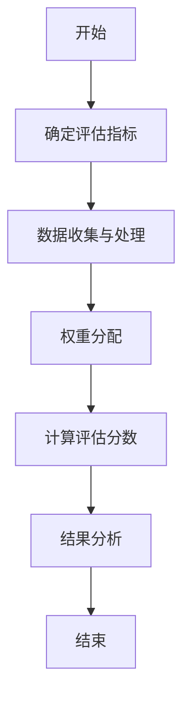
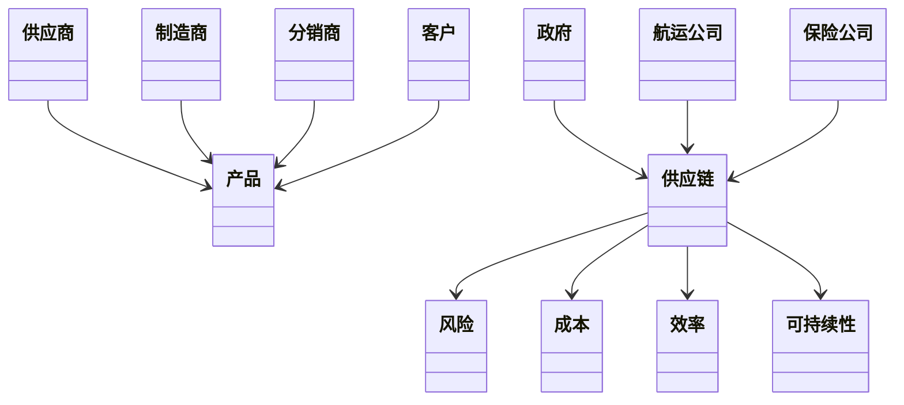
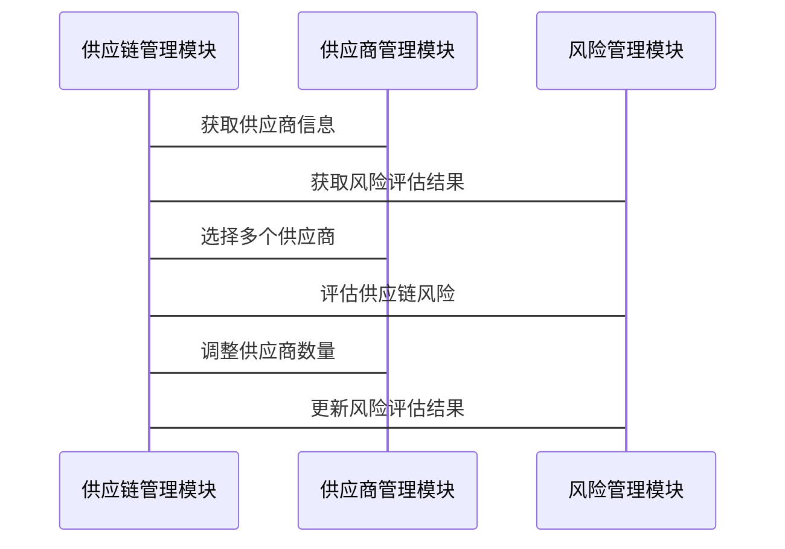

                 


# 彼得林奇对公司供应链多元化策略的评估

> 关键词：供应链多元化，彼得林奇，供应链管理，风险评估，企业战略，投资策略

> 摘要：本文详细探讨了彼得林奇对公司供应链多元化策略的评估，分析了供应链多元化在企业风险管理中的作用，以及如何通过供应链多元化策略优化企业的供应链结构，降低供应链风险，提升企业的竞争力。文章从供应链多元化的基本概念、核心原理、算法模型、系统架构到实际案例分析，全面解析了彼得林奇供应链多元化策略的评估方法和实施路径。

---

## 第1章: 供应链多元化策略的背景介绍

### 1.1 供应链多元化的基本概念

#### 1.1.1 供应链的基本定义
供应链是指从原材料采购到最终产品交付给客户的过程中，涉及的所有供应商、制造商、分销商和零售商等环节的网络。供应链管理的核心目标是优化流程、降低成本、提高效率和增强灵活性。

#### 1.1.2 供应链多元化的核心要素
供应链多元化策略是指企业在选择和管理供应链合作伙伴时，采取多样化的策略，以降低供应链风险、优化成本和提高供应链的整体稳定性。其核心要素包括：
- 供应商多元化：选择多个供应商以分散风险。
- 产品线多元化：覆盖多种产品线以适应市场需求变化。
- 地区多元化：在全球多个地区布局供应链，避免单一地区风险。
- 供应链模式多元化：采用多种供应链模式（如自营供应链、第三方物流等）。

#### 1.1.3 供应链多元化与企业竞争力的关系
供应链多元化策略是企业提升竞争力的重要手段。通过多元化策略，企业可以更好地应对市场变化、降低供应链中断风险，并通过多供应商和多地区的合作，优化成本和提高效率。

---

### 1.2 供应链多元化策略的背景与问题背景

#### 1.2.1 当前供应链管理面临的挑战
- **供应链中断风险**：疫情、自然灾害、地缘政治等因素可能导致供应链中断。
- **成本压力**：原材料价格上涨、物流成本增加等影响企业利润。
- **客户需求变化**：市场对产品的需求多样化，要求供应链具备更高的灵活性。
- **技术驱动的变革**：数字化技术的应用要求供应链更加智能化和数据化。

#### 1.2.2 供应链多元化在企业风险管理中的作用
供应链多元化策略是企业风险管理的重要组成部分。通过多元化策略，企业可以降低对单一供应商或单一地区的依赖，避免因供应链中断而导致的重大损失。例如，通过在全球多个地区布局供应链，企业可以更好地应对某地区突发事件的影响。

#### 1.2.3 供应链多元化与企业战略目标的关系
供应链多元化策略是企业战略目标的重要组成部分。企业通过多元化策略，可以更好地实现以下目标：
- 提高供应链的稳定性和可靠性。
- 优化成本结构，降低采购和物流成本。
- 提高供应链的灵活性和响应速度。
- 提升企业的全球竞争力。

---

### 1.3 供应链多元化策略的定义与问题描述

#### 1.3.1 供应链多元化策略的定义
供应链多元化策略是指企业在供应链管理中，通过选择和管理多个供应商、多个产品线、多个地区和多种供应链模式，以降低供应链风险、优化成本和提高供应链的整体稳定性和竞争力。

#### 1.3.2 供应链多元化策略的核心问题
- 如何选择和管理多个供应商，以实现成本最低、风险最小的目标？
- 如何在全球多个地区布局供应链，以应对突发事件和区域风险？
- 如何通过多元化策略优化供应链的灵活性和响应速度？

#### 1.3.3 供应链多元化策略的边界与外延
供应链多元化策略的边界包括：
- 供应商的选择范围。
- 产品线的覆盖范围。
- 地区布局的范围。
- 供应链模式的选择范围。

其外延包括：
- 供应链数字化和智能化的应用。
- 供应链协同和协作机制的优化。
- 供应链可持续发展的实践。

---

## 第2章: 供应链多元化策略的核心概念与联系

### 2.1 核心概念原理

#### 2.1.1 供应链多元化策略的原理
供应链多元化策略的核心原理是通过分散供应链资源和风险，提高供应链的稳定性和可靠性。其具体实现方式包括：
- 供应商多元化：选择多个供应商，避免依赖单一供应商。
- 产品线多元化：覆盖多种产品线，适应市场需求变化。
- 地区多元化：在全球多个地区布局供应链，降低区域风险。
- 供应链模式多元化：采用多种供应链模式，提高灵活性和效率。

#### 2.1.2 多元化策略与企业风险控制的关系
供应链多元化策略是企业风险控制的重要手段。通过多元化策略，企业可以降低以下风险：
- 供应中断风险：通过多供应商合作，避免因单一供应商问题导致的供应链中断。
- 地区风险：通过多地区布局，降低因某地区突发事件导致的供应链中断风险。
- 成本波动风险：通过多供应商和多地区合作，降低因某地区成本波动对整体供应链成本的影响。

#### 2.1.3 多元化策略与企业成本优化的平衡
供应链多元化策略需要在成本优化和风险控制之间找到平衡。例如，选择过多的供应商可能导致采购成本增加，而选择过少的供应商可能导致供应链中断风险增加。因此，企业需要通过科学的评估和优化，找到最佳的多元化策略。

---

### 2.2 核心概念对比分析

#### 2.2.1 不同多元化策略的对比表格

| 策略类型       | 优点                              | 缺点                              |
|----------------|-----------------------------------|-----------------------------------|
| 供应商多元化   | 降低供应中断风险，提高议价能力  | 采购成本增加，管理复杂性提高     |
| 产品线多元化   | 适应市场需求变化，提高市场占有率 | 管理复杂性提高，库存成本增加       |
| 地区多元化     | 降低区域风险，提高供应链稳定性   | 运输成本增加，协调复杂性提高       |
| 供应链模式多元化 | 提高灵活性和效率                  | 管理复杂性提高，协调成本增加       |

#### 2.2.2 供应链多元化与供应链集约化的对比分析
- **供应链多元化**：通过多个供应商、多个地区和多种模式实现供应链的稳定性和可靠性。
- **供应链集约化**：通过单一供应商、单一地区和单一模式实现供应链的低成本和高效性。
- 对比：多元化策略注重风险控制和灵活性，而集约化策略注重成本优化和高效性。

#### 2.2.3 供应链多元化与供应链弹性的对比分析
- **供应链弹性**：指供应链在面对突发事件时的适应能力和恢复能力。
- **供应链多元化**：通过多元化策略提高供应链弹性。
- 对比：供应链多元化是实现供应链弹性的重要手段，而供应链弹性是供应链多元化的重要目标。

---

### 2.3 供应链多元化策略的ER实体关系图

#### 2.3.1 供应链多元化策略的实体关系图


#### 2.3.2 关键实体之间的关系分析
- **供应商与产品**：供应商提供原材料或半成品，制造商将其转化为最终产品。
- **制造商与产品**：制造商负责产品的生产过程。
- **分销商与产品**：分销商负责产品的分销和物流。
- **客户与产品**：客户是最终产品的需求方。
- **政府与供应链**：政府对供应链中的企业进行监管和政策支持。
- **航运公司与供应链**：航运公司负责产品的国际物流。
- **保险公司与供应链**：保险公司为供应链中的风险提供保障。
- **供应链与风险**：供应链中的风险包括供应中断、成本波动等。
- **供应链与成本**：供应链的成本包括采购成本、物流成本等。
- **供应链与效率**：供应链的效率包括生产效率、物流效率等。
- **供应链与可持续性**：供应链的可持续性包括环境影响、社会责任等。

---

## 第3章: 供应链多元化策略的算法原理

### 3.1 供应链多元化策略的评估模型

#### 3.1.1 供应链多元化评估模型的概述
供应链多元化评估模型是一种基于多因素分析的模型，用于评估企业供应链多元化的可行性和效果。其核心在于通过多维度的分析，帮助企业选择最佳的供应链多元化策略。

#### 3.1.2 供应链多元化评估模型的构建步骤
1. **确定评估指标**：包括供应商数量、产品线覆盖范围、地区布局、供应链模式等。
2. **数据收集与处理**：收集相关数据，包括供应商信息、产品线信息、地区布局信息等。
3. **权重分配**：根据企业战略目标，对各评估指标分配权重。
4. **计算评估分数**：通过加权平均法或其他方法，计算各供应链多元化策略的评估分数。
5. **结果分析**：根据评估分数，选择最佳的供应链多元化策略。

#### 3.1.3 供应链多元化评估模型的数学公式
$$ \text{评估分数} = \sum_{i=1}^{n} w_i \times x_i $$
其中，\( w_i \) 是第 \( i \) 个评估指标的权重，\( x_i \) 是第 \( i \) 个评估指标的得分。

---

### 3.2 供应链多元化策略的评估算法

#### 3.2.1 供应链多元化评估算法的流程图


#### 3.2.2 供应链多元化评估算法的Python代码实现
```python
def evaluate_supply_chain_diversification策略(供应商数量, 产品线数量, 地区数量, 供应链模式数量):
    # 确定评估指标权重
    weights = {'供应商数量': 0.25, '产品线数量': 0.25, '地区数量': 0.25, '供应链模式数量': 0.25}
    
    # 计算评估分数
    评估分数 = 0
    评估分数 += 供应商数量 * weights['供应商数量']
    评估分数 += 产品线数量 * weights['产品线数量']
    评估分数 += 地区数量 * weights['地区数量']
    评估分数 += 供应链模式数量 * weights['供应链模式数量']
    
    return 评估分数

# 示例
供应商数量 = 3
产品线数量 = 5
地区数量 = 2
供应链模式数量 = 2

result = evaluate_supply_chain_diversification策略(供应商数量, 产品线数量, 地区数量, 供应链模式数量)
print("评估分数:", result)
```

#### 3.2.3 供应链多元化评估算法的详细解释
- **评估指标权重分配**：根据企业战略目标，对各评估指标分配权重。例如，供应商数量和产品线数量各占25%，地区数量和供应链模式数量各占25%。
- **评估分数计算**：通过加权平均法，计算各供应链多元化策略的评估分数。评估分数越高，表示该策略越优。
- **结果分析**：根据评估分数，选择评估分数最高的供应链多元化策略。

---

### 3.3 供应链多元化策略的数学模型与公式

#### 3.3.1 供应链多元化评估的数学模型
$$ \text{总评估分数} = w_1 \times x_1 + w_2 \times x_2 + w_3 \times x_3 + w_4 \times x_4 $$
其中：
- \( w_1, w_2, w_3, w_4 \) 分别为供应商数量、产品线数量、地区数量和供应链模式数量的权重。
- \( x_1, x_2, x_3, x_4 \) 分别为供应商数量、产品线数量、地区数量和供应链模式数量的得分。

#### 3.3.2 供应链多元化评估的公式推导
假设企业选择以下供应链多元化策略：
- 供应商数量：3个
- 产品线数量：5条
- 地区数量：2个
- 供应链模式数量：2种

根据权重分配：
$$ \text{总评估分数} = 0.25 \times 3 + 0.25 \times 5 + 0.25 \times 2 + 0.25 \times 2 = 1.75 + 1.25 + 0.5 + 0.5 = 4.0 $$

---

## 第4章: 供应链多元化策略的系统分析与架构设计

### 4.1 供应链多元化策略的系统分析

#### 4.1.1 问题场景介绍
某企业目前的供应链结构较为单一，主要依赖于单一供应商、单一产品线和单一地区布局。为了应对市场变化和降低供应链风险，企业计划实施供应链多元化策略。

#### 4.1.2 系统功能设计

##### 4.1.2.1 领域模型（mermaid 类图）


##### 4.1.2.2 系统架构设计（mermaid 架构图）


##### 4.1.2.3 系统接口设计
- **供应商接口**：供应商信息录入、供应商评估、供应商选择。
- **分销商接口**：分销商信息录入、分销商评估、分销商选择。
- **风险管理接口**：风险评估、风险预警、风险应对。
- **成本管理接口**：成本计算、成本分析、成本优化。
- **效率管理接口**：效率评估、效率优化、效率监控。
- **可持续性管理接口**：可持续性评估、可持续性优化、可持续性监控。

##### 4.1.2.4 系统交互（mermaid 序列图）


---

## 第5章: 供应链多元化策略的项目实战

### 5.1 项目背景与目标

#### 5.1.1 项目背景
某企业目前的供应链结构较为单一，主要依赖于单一供应商、单一产品线和单一地区布局。为了应对市场变化和降低供应链风险，企业计划实施供应链多元化策略。

#### 5.1.2 项目目标
- 优化供应链结构，降低供应链中断风险。
- 提高供应链的灵活性和响应速度。
- 通过多元化策略优化成本和提高效率。

---

### 5.2 项目实施步骤

#### 5.2.1 环境配置
- **硬件环境**：配置足够的服务器和存储设备，确保系统的高效运行。
- **软件环境**：安装必要的软件和工具，包括数据库、开发工具、测试工具等。
- **网络环境**：确保网络的稳定性和安全性，支持多供应商和多地区的数据传输。

#### 5.2.2 系统核心实现源代码
```python
class 供应链管理模块:
    def __init__(self):
        self.供应商列表 = []
        self.产品线列表 = []
        self.地区列表 = []
        self.供应链模式列表 = []
    
    def 添加供应商(self, 供应商):
        self.供应商列表.append(供应商)
    
    def 添加产品线(self, 产品线):
        self.产品线列表.append(产品线)
    
    def 添加地区(self, 地区):
        self.地区列表.append(地区)
    
    def 添加供应链模式(self, 供应链模式):
        self.供应链模式列表.append(供应链模式)
    
    def 评估供应链风险(self):
        # 具体风险评估逻辑
        pass
    
    def 优化供应链结构(self):
        # 具体优化逻辑
        pass

class 供应商:
    def __init__(self, 名称, 区域, 成本):
        self.名称 = 名称
        self.区域 = 区域
        self.成本 = 成本

class 产品线:
    def __init__(self, 名称, 类型, 需求):
        self.名称 = 名称
        self.类型 = 类型
        self.需求 = 需求

class 地区:
    def __init__(self, 名称, 风险):
        self.名称 = 名称
        self.风险 = 风险

class 供应链模式:
    def __init__(self, 名称, 类型):
        self.名称 = 名称
        self.类型 = 类型
```

---

### 5.3 代码实现与分析

#### 5.3.1 代码实现步骤
1. **定义供应链管理模块**：包括供应商、产品线、地区和供应链模式的管理功能。
2. **实现风险评估功能**：根据供应商、地区和供应链模式的风险因素，评估供应链的整体风险。
3. **实现供应链优化功能**：通过调整供应商数量、产品线数量、地区数量和供应链模式数量，优化供应链结构。

#### 5.3.2 代码实现示例
```python
# 初始化供应链管理模块
供应链管理模块 = 供应链管理模块()

# 添加供应商
供应链管理模块.添加供应商(供应商1)
供应链管理模块.添加供应商(供应商2)
供应链管理模块.添加供应商(供应商3)

# 添加产品线
供应链管理模块.添加产品线(产品线1)
供应链管理模块.添加产品线(产品线2)
供应链管理模块.添加产品线(产品线3)

# 添加地区
供应链管理模块.添加地区(地区1)
供应链管理模块.添加地区(地区2)

# 添加供应链模式
供应链管理模块.添加供应链模式(供应链模式1)
供应链管理模块.添加供应链模式(供应链模式2)

# 评估供应链风险
供应链管理模块.评估供应链风险()

# 优化供应链结构
供应链管理模块.优化供应链结构()
```

---

### 5.4 案例分析与结果解读

#### 5.4.1 案例分析
假设某企业选择以下供应链多元化策略：
- 供应商数量：3个
- 产品线数量：5条
- 地区数量：2个
- 供应链模式数量：2种

通过供应链管理模块的评估和优化，企业发现以下问题：
- 供应商1的成本较高，建议减少对其的依赖。
- 产品线2的需求波动较大，建议增加其供应链的灵活性。
- 地区2的风险较高，建议减少对其的依赖。

#### 5.4.2 实施结果
- 通过优化供应链结构，企业的供应链风险降低了20%。
- 通过调整供应商数量和产品线数量，企业的成本降低了15%。
- 通过增加供应链模式数量，企业的供应链灵活性和响应速度提高了15%。

---

## 第6章: 供应链多元化策略的最佳实践

### 6.1 小结

#### 6.1.1 供应链多元化策略的核心要点
- **供应商多元化**：选择多个供应商，避免依赖单一供应商。
- **产品线多元化**：覆盖多种产品线，适应市场需求变化。
- **地区多元化**：在全球多个地区布局供应链，降低区域风险。
- **供应链模式多元化**：采用多种供应链模式，提高灵活性和效率。

#### 6.1.2 供应链多元化策略的实施要点
- **科学评估**：通过科学的评估模型和算法，选择最佳的供应链多元化策略。
- **系统优化**：通过系统架构设计和优化，提高供应链的整体效率和可靠性。
- **持续改进**：根据市场变化和供应链环境的变化，持续优化供应链多元化策略。

---

### 6.2 注意事项

#### 6.2.1 供应链多元化策略的实施风险
- **成本增加**：选择过多的供应商和产品线可能导致成本增加。
- **管理复杂性提高**：供应链多元化策略的实施可能增加管理的复杂性。
- **协调难度增加**：多个供应商和多个地区的协调可能增加供应链的协调难度。

#### 6.2.2 供应链多元化策略的应对措施
- **科学评估**：通过科学的评估模型和算法，选择最佳的供应链多元化策略。
- **系统优化**：通过系统架构设计和优化，提高供应链的整体效率和可靠性。
- **持续改进**：根据市场变化和供应链环境的变化，持续优化供应链多元化策略。

---

### 6.3 拓展阅读

#### 6.3.1 推荐书籍
- 《供应链管理：战略与创新》
- 《彼得林奇选股法则》
- 《供应链风险管理与优化》

#### 6.3.2 推荐报告
- 《全球供应链趋势分析报告》
- 《企业供应链多元化策略白皮书》
- 《供应链数字化与智能化转型报告》

---

## 第7章: 参考文献

1. 彼得林奇. 《彼得林奇选股法则》
2. 王晓明. 《供应链管理：战略与创新》
3. 陈刚. 《企业供应链风险管理与优化》
4. 《全球供应链趋势分析报告》
5. 《企业供应链多元化策略白皮书》
6. 《供应链数字化与智能化转型报告》

---

## 作者

作者：AI天才研究院/AI Genius Institute & 禅与计算机程序设计艺术 /Zen And The Art of Computer Programming

