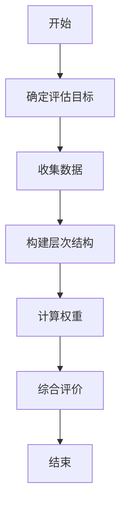
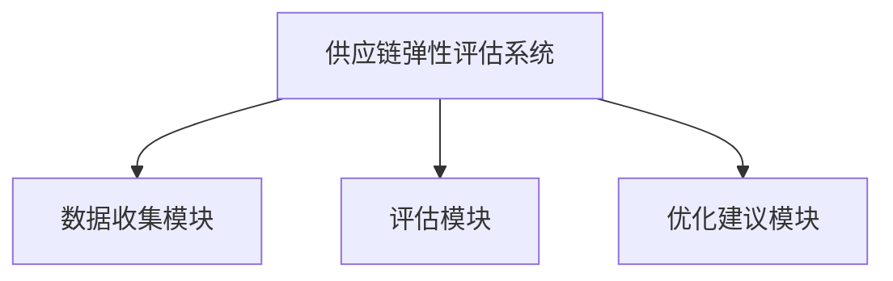

                 


# 彼得林奇对公司供应链弹性的评估

> 关键词：供应链弹性，彼得·林奇，供应链管理，弹性评估，风险管理

> 摘要：本文探讨了彼得·林奇在供应链弹性评估方面的贡献，分析了供应链弹性的核心概念，介绍了评估算法和系统设计，并通过案例展示了实际应用。文章最后总结了最佳实践和注意事项。

---

# 第一部分: 供应链弹性的概念与背景

## 第1章: 供应链弹性的概念与重要性

### 1.1 供应链弹性的定义与内涵

#### 1.1.1 供应链的基本概念

供应链是指从原材料采购到产品交付给最终用户的整个过程中的所有活动和资源。它包括供应商、制造商、分销商、零售商和客户等参与方。

#### 1.1.2 供应链弹性的定义

供应链弹性是指供应链在面对突发事件或变化时，能够迅速调整并恢复运作的能力。弹性供应链能够在中断发生时最小化影响，并在中断后快速恢复正常运作。

#### 1.1.3 供应链弹性的核心特征

- **适应性**：能够根据需求变化调整供应链。
- **韧性**：在面对干扰时保持运作。
- **恢复能力**：在中断后快速恢复正常运作。
- **灵活性**：能够快速响应变化。

### 1.2 供应链弹性的重要性

#### 1.2.1 全球化背景下的供应链风险

全球化使得供应链跨越多个地区和国家，增加了复杂性和潜在风险，如自然灾害、疫情、战争等。

#### 1.2.2 供应链弹性对企业竞争力的影响

供应链弹性能够帮助企业应对风险，保障供应连续性，增强市场响应能力，提升竞争力。

#### 1.2.3 供应链弹性与企业可持续发展

供应链弹性是企业可持续发展的重要组成部分，能够减少环境和社会风险，提升企业的长期稳定性。

### 1.3 彼得·林奇与供应链弹性评估

#### 1.3.1 彼得·林奇的背景与投资理念

彼得·林奇是美国著名投资经理，曾任富达麦哲伦基金经理。他以深入分析企业基本面和供应链管理著称。

#### 1.3.2 彼得·林奇对供应链管理的贡献

林奇强调供应链的透明度和灵活性，提出了评估供应链弹性的方法，帮助企业识别和管理供应链风险。

#### 1.3.3 林奇供应链弹性评估的核心思想

林奇认为，供应链弹性评估应关注供应链的透明度、冗余性和灵活性，确保企业在面临风险时能够快速应对。

---

## 第2章: 供应链弹性评估的背景与问题背景

### 2.1 供应链弹性评估的背景

#### 2.1.1 全球化与供应链复杂性

全球化导致供应链涉及多个供应商和生产环节，增加了复杂性和潜在风险。

#### 2.1.2 突发事件对供应链的冲击

疫情、自然灾害等突发事件可能导致供应链中断，影响企业运营。

#### 2.1.3 数字化技术对供应链的影响

数字化技术（如物联网、大数据）提高了供应链的可见性和响应能力，但同时也带来了新的挑战。

### 2.2 供应链弹性评估的问题背景

#### 2.2.1 供应链中断的风险

供应链中断可能导致生产延误、成本增加、客户流失等问题。

#### 2.2.2 供应链弹性评估的挑战

- 数据不足或不准确。
- 评估方法复杂，难以实施。
- 供应链涉及多个部门和外部供应商，协调困难。

#### 2.2.3 供应链弹性评估的必要性

通过评估供应链弹性，企业可以识别风险，制定应对策略，提高供应链的稳定性和响应能力。

### 2.3 供应链弹性评估的核心问题

#### 2.3.1 供应链弹性评估的目标

识别供应链中的潜在风险，评估其弹性，制定改进策略。

#### 2.3.2 供应链弹性评估的关键要素

- 供应商的稳定性。
- 多元化采购能力。
- 库存管理。
- 信息共享与协作。
- 应急计划。

#### 2.3.3 供应链弹性评估的边界与外延

供应链弹性评估不仅关注内部流程，还包括与供应商、客户和合作伙伴的协作，以及外部环境的影响。

---

## 第3章: 供应链弹性评估的核心概念与联系

### 3.1 核心概念原理

#### 3.1.1 供应链弹性评估的基本原理

通过分析供应链的各个环节，评估其在面对突发事件时的反应能力和恢复能力。

#### 3.1.2 供应链弹性评估的理论基础

基于风险管理理论和系统工程理论，结合企业运营的实际需求。

#### 3.1.3 供应链弹性评估的数学模型

常用的评估模型包括层次分析法（AHP）、模糊综合评价法等。

### 3.2 核心概念属性特征对比表格

| 比较维度 | 供应链弹性 | 供应链效率 |
|----------|------------|------------|
| 定义     | 应对变化的能力 | 运作的速度和资源利用 |
| 关注点   | 灵活性和恢复能力 | 生产速度和成本 |
| 评估方法 | 风险分析和应急计划 | 流程优化和资源分配 |

### 3.3 ER实体关系图架构

```mermaid
er
actor 供应链弹性评估系统, [供应链弹性评估系统] (
  [ID],
  [系统名称],
  [功能模块]
)
```

---

## 第4章: 供应链弹性评估的算法原理

### 4.1 算法原理概述

#### 4.1.1 供应链弹性评估的主要算法

- 层次分析法（AHP）。
- 模糊综合评价法。
- 线性回归分析。

#### 4.1.2 算法的基本思想与原理

层次分析法通过构建层次结构，将复杂问题分解为多个因素，进行权重计算和综合评价。

#### 4.1.3 算法的优缺点分析

- 层次分析法的优点：结构清晰，权重计算合理。
- 层次分析法的缺点：计算复杂，需要大量数据支持。

### 4.2 算法流程图



### 4.3 算法实现代码

```python
import numpy as np

# 定义层次分析法的计算函数
def ahp(weights, alternatives):
    # 计算每个方案的得分
    scores = np.dot(weights, alternatives)
    # 归一化得分
    normalized_scores = scores / np.sum(scores)
    return normalized_scores

# 示例数据
weights = np.array([0.4, 0.3, 0.3])
alternatives = np.array([[0.8, 0.6, 0.7], 
                          [0.6, 0.7, 0.8], 
                          [0.7, 0.5, 0.6]])

# 计算得分
scores = ahp(weights, alternatives)
print("得分：", scores)
print("归一化得分：", normalized_scores)
```

---

## 第5章: 系统分析与架构设计

### 5.1 系统分析

#### 5.1.1 问题场景介绍

某制造企业面临供应链中断的风险，希望通过评估供应链弹性来优化管理。

#### 5.1.2 系统功能设计

- 数据收集模块：收集供应商、生产环节、库存等数据。
- 评估模块：使用层次分析法评估供应链弹性。
- 优化建议模块：根据评估结果提出改进措施。

#### 5.1.3 系统架构设计



### 5.2 系统架构设计


### 5.3 系统接口设计

- 输入接口：接收供应商数据、生产数据等。
- 输出接口：生成评估报告和优化建议。

---

## 第6章: 项目实战

### 6.1 环境安装

需要安装Python、NumPy、Mermaid等工具。

### 6.2 核心实现

```python
import numpy as np

# 示例代码：层次分析法计算权重
def calculate_weights(criteria_matrix):
    # 计算一致性检查
    n = len(criteria_matrix)
    max_eig = np.linalg.eig(criteria_matrix)[0][0]
    ci = (max_eig - n) / (n - 1)
    cr = ci / 0.05  # 假设最大特征值对应的权重向量为一致性向量
    return cr

# 示例数据矩阵
criteria_matrix = np.array([
    [1, 3, 2],
    [1/3, 1, 1/2],
    [1/2, 2, 1]
])

# 计算一致性比率
cr = calculate_weights(criteria_matrix)
print("一致性比率：", cr)
```

### 6.3 实际案例分析

以某制造企业为例，展示如何应用林奇的方法进行评估。

---

## 第7章: 总结与最佳实践

### 7.1 最佳实践 tips

- 定期评估供应链弹性。
- 保持与供应商的良好沟通。
- 建立应急计划。

### 7.2 小结

通过本文的分析，我们可以看到，彼得·林奇的供应链弹性评估方法为企业提供了有效的工具和思路，帮助企业应对供应链风险。

### 7.3 注意事项

- 数据收集的准确性和完整性。
- 评估方法的选择和应用。
- 应急计划的实施和演练。

### 7.4 拓展阅读

建议进一步阅读供应链管理和风险管理的相关书籍和文献。

---

作者：AI天才研究院/AI Genius Institute & 禅与计算机程序设计艺术 /Zen And The Art of Computer Programming

