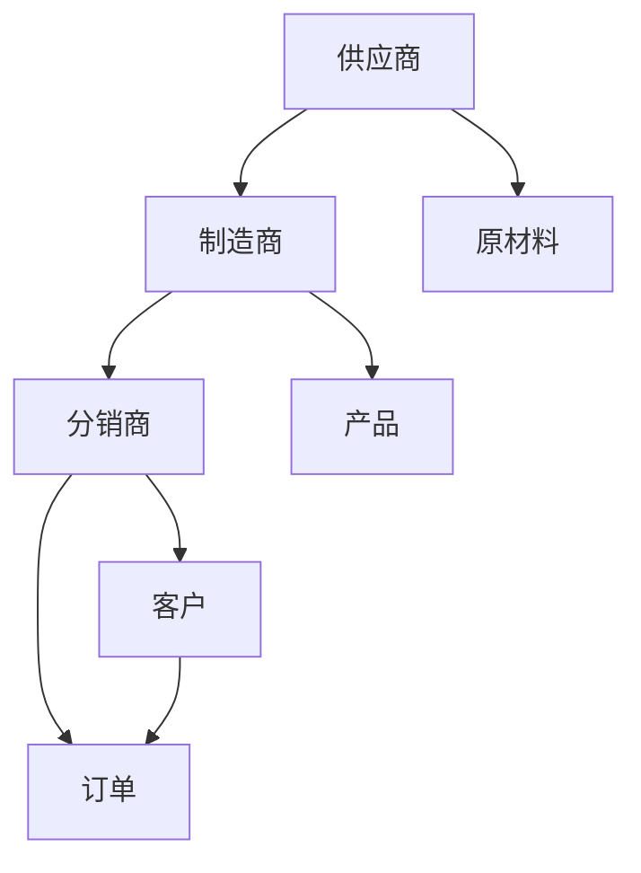
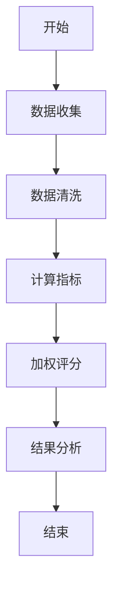
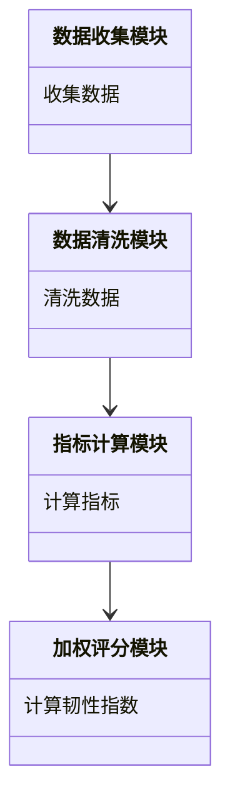

                 


# 彼得林奇对公司供应链韧性的定量评估方法

> 关键词：供应链韧性，彼得林奇，定量评估，数学模型，系统架构，项目实战

> 摘要：本文详细介绍了彼得林奇对公司供应链韧性的定量评估方法，从核心概念、算法原理、系统架构到项目实战，全面解析了供应链韧性的评估过程，包括数学模型、代码实现和实际案例分析，最后给出了最佳实践建议。

## 第一部分: 供应链韧性与定量评估方法概述

### 第1章: 供应链韧性与定量评估的背景

#### 1.1 供应链韧性的重要性
- **1.1.1 供应链在现代经济中的地位**  
供应链是现代企业运营的核心，连接供应商、制造商、分销商和客户，确保产品和服务的顺畅流通。供应链的中断可能导致生产停滞、成本增加和客户满意度下降。

- **1.1.2 供应链中断的风险与影响**  
全球疫情、自然灾害和地缘政治冲突等不可预测事件频发，使得供应链中断的风险急剧上升。中断可能导致企业损失高达数百万美元，影响企业声誉和市场地位。

- **1.1.3 供应链韧性对企业竞争力的作用**  
供应链韧性是企业应对不确定性的关键能力。具备强大供应链韧性的企业能够更快恢复生产，抓住市场机会，增强竞争优势。

#### 1.2 彼得林奇的供应链评估方法
- **1.2.1 彼得林奇的投资理念与供应链分析**  
彼得林奇以其独特的投资策略闻名，他关注企业的基本面，包括供应链的稳定性和效率。他认为，一个稳健的供应链是企业长期成功的关键因素。

- **1.2.2 供应链韧性评估的核心目标**  
评估供应链的弹性和恢复能力，识别潜在风险点，优化供应链结构，降低中断风险。

- **1.2.3 定量评估方法的优势与局限性**  
定量评估方法通过数据和模型提供客观的结果，但可能忽视人为因素和突发事件的影响。

### 第2章: 供应链韧性的核心概念与模型

#### 2.1 供应链韧性评估的关键要素
- **2.1.1 供应链的结构与组成**  
供应链包括供应商、制造商、分销商和客户，每个环节都可能影响整体韧性。

- **2.1.2 供应链弹性与恢复能力**  
弹性指供应链在面对干扰时的适应能力，恢复能力指从中断中快速恢复正常的能力。

- **2.1.3 供应链冗余与优化**  
冗余指供应链中有备用资源，优化指在保证冗余的同时降低成本。

#### 2.2 核心概念的原理与联系
- **2.2.1 供应链韧性评估的理论基础**  
韧性评估基于系统论和运筹学，考虑系统的各个组成部分及其相互作用。

- **2.2.2 关键指标对比分析表**  
以下是关键指标的对比分析：

| 指标 | 描述 | 重要性 | 计算方法 |
|------|------|--------|----------|
| 供应商多样性 | 供应商的数量和地理分布 | 高 | 多样性指数 = (供应商数量 × 地理分布范围) / 最佳供应商数量 |
| 库存水平 | 安全库存量 | 中 | 库存周转率 = 销量 / 平均库存 |
| 交货时间 | 平均交货时间 | 高 | 交货时间 = 订单处理时间 + 运输时间 |
| 成本 | 总成本 | 中 | 总成本 = 采购成本 + 运输成本 + 存储成本 |

- **2.2.3 供应链实体关系图（Mermaid流程图）**  
以下是供应链实体关系图：



### 第3章: 供应链韧性评估的算法原理

#### 3.1 算法原理概述
- **3.1.1 多因素分析模型**  
多因素分析模型考虑多个指标，通过加权评分方法计算供应链韧性指数。

- **3.1.2 加权评分方法**  
每个指标赋予不同的权重，根据企业的实际情况调整权重，确保评估结果的准确性。

- **3.1.3 数据分析与预测**  
通过历史数据和预测模型，分析供应链可能面临的风险，制定应对策略。

#### 3.2 算法流程图
以下是算法流程图：



### 第4章: 数学模型与公式

#### 4.1 供应链韧性指数计算公式
- **4.1.1 综合韧性指数模型**  
综合韧性指数模型将多个指标加权求和，反映供应链的整体韧性。

$$韧性指数 = \sum (权重_i \times 指标_i)$$

- **4.1.2 单项指标权重分配**  
权重分配根据指标的重要性和影响力确定，通常使用层次分析法（AHP）。

$$权重_i = \frac{指标_i的影响程度}{总影响程度}$$

- **4.1.3 组合评估公式**  
组合评估公式将多个指标结合，提供全面的评估结果。

$$指标_i = \frac{实际值}{基准值}$$

#### 4.2 具体公式与解读
- **4.2.1 供应商多样性指数**  
$$多样性指数 = \frac{\text{供应商数量} \times \text{地理分布范围}}{\text{最佳供应商数量}}$$  
供应商数量越多，地理分布越广，多样性指数越高，供应链韧性越强。

- **4.2.2 库存周转率**  
$$库存周转率 = \frac{\text{销量}}{\text{平均库存}}$$  
库存周转率高表示库存管理效率高，供应链韧性增强。

- **4.2.3 交货时间预测**  
$$交货时间 = \text{订单处理时间} + \text{运输时间}$$  
交货时间越短，供应链的响应能力越强，韧性越高。

### 第5章: 系统分析与架构设计

#### 5.1 系统分析
- **5.1.1 问题场景介绍**  
供应链中断可能导致企业运营中断，影响企业声誉和客户满意度。

- **5.1.2 项目目标与范围**  
项目目标是开发一个供应链韧性评估系统，范围包括数据收集、指标计算和结果分析。

- **5.1.3 系统功能设计（Mermaid类图）**  
以下是系统功能设计类图：



#### 5.2 系统架构设计
- **5.2.1 模块划分与交互流程**  
系统分为数据收集模块、数据清洗模块、指标计算模块和加权评分模块，各模块之间通过数据流交互。

- **5.2.2 系统架构图（Mermaid架构图）**  
以下是系统架构图：


- **5.2.3 接口设计与数据流**  
数据从供应商、制造商和分销商收集，经过清洗和计算，最后生成韧性指数报告。

### 第6章: 项目实战

#### 6.1 环境安装与数据准备
- **6.1.1 数据库安装与配置**  
安装MySQL数据库，配置连接参数。

- **6.1.2 数据收集与清洗**  
从企业内部系统收集数据，去除重复和错误数据。

- **6.1.3 工具安装与调试**  
安装Python和相关库（如Pandas、NumPy），调试环境确保代码正常运行。

#### 6.2 核心代码实现
- **6.2.1 指标计算代码示例**  
以下是Python代码示例：

```python
import pandas as pd
import numpy as np

# 数据清洗
data = pd.read_csv('supply_chain.csv')
data_clean = data.dropna().astype(float)

# 计算指标
weights = [0.4, 0.3, 0.2, 0.1]
indicators = ['供应商多样性', '库存周转率', '交货时间', '成本']

# 加权评分
resilience_index = np.dot(weights, data_clean[indicators].values)
```

- **6.2.2 权重分配与综合评估**  
根据企业需求调整权重，计算最终的韧性指数。

- **6.2.3 结果可视化与报告生成**  
使用Matplotlib生成图表，展示评估结果，生成报告。

### 第7章: 总结与最佳实践

#### 7.1 项目总结
- **7.1.1 核心收获与经验**  
通过项目实战，掌握了供应链韧性评估的方法，熟悉了定量分析工具的使用。

- **7.1.2 方法论的优缺点**  
定量评估方法客观准确，但忽视了人为因素和突发事件的影响。

- **7.1.3 实际应用中的注意事项**  
定期更新数据和模型，确保评估结果的准确性。

#### 7.2 最佳实践与小结
- **7.2.1 关键指标的选择与优化**  
根据企业特点选择合适的指标，定期优化权重分配。

- **7.2.2 数据分析的准确性与实时性**  
确保数据准确，实时监控供应链状态，及时发现风险。

- **7.2.3 持续改进与动态调整**  
根据评估结果优化供应链结构，增强韧性。

#### 7.3 拓展阅读与深入学习
- **7.3.1 相关书籍与论文**  
推荐阅读《供应链管理：原理与应用》和《运营风险管理》。

- **7.3.2 在线课程与培训**  
推荐学习Coursera上的供应链管理课程。

- **7.3.3 工具与资源**  
推荐使用Python的Pandas库和机器学习框架进行深入分析。

## 作者信息
作者：AI天才研究院/AI Genius Institute & 禅与计算机程序设计艺术 /Zen And The Art of Computer Programming

---

通过以上内容，您可以系统地学习彼得林奇的供应链韧性评估方法，从理论到实践，全面掌握供应链韧性的定量评估技巧。

