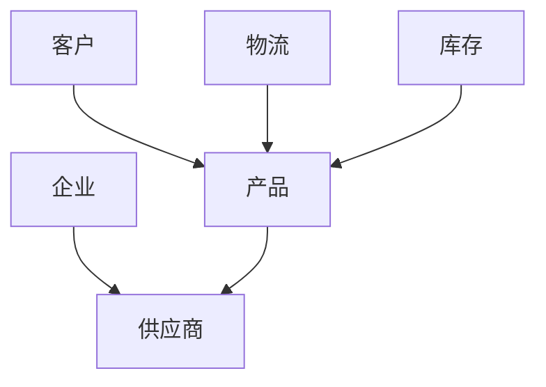

                 


# 彼得林奇对公司供应链韧性的评估

> 关键词：彼得·林奇，供应链韧性，投资评估，风险分析，企业架构

> 摘要：本文从投资专家彼得·林奇的视角，详细分析了供应链韧性的评估方法和其对企业价值的影响。文章通过定义核心概念、构建评估模型、系统分析和实际案例，深入探讨了供应链韧性的关键要素及其在企业战略中的作用。

---

## 第一部分: 供应链韧性的背景与重要性

### 第1章: 供应链韧性的定义与核心概念

#### 1.1 供应链韧性的定义与核心概念

供应链韧性是指企业在面对外部干扰或内部变化时，能够持续稳定地提供产品或服务的能力。它涉及到供应链的多个环节，包括供应商、生产、库存、物流和客户等。

- **1.1.1 供应链的基本概念**  
供应链是将原材料转化为最终产品的过程，包括供应商、制造商、分销商和客户等多个环节。供应链的高效运作对企业竞争力至关重要。

- **1.1.2 供应链韧性的定义**  
供应链韧性是指在面对突发事件（如自然灾害、疫情、供应链中断等）时，企业能够快速恢复并维持正常运作的能力。它强调供应链的弹性和适应性。

- **1.1.3 供应链韧性的核心要素**  
供应链韧性涉及供应商多样性、库存管理、物流网络、信息共享和应急管理等多个方面。这些要素共同确保供应链的稳定性和灵活性。

#### 1.2 供应链韧性的重要性

供应链韧性对企业来说至关重要，尤其是在全球化和疫情的背景下。

- **1.2.1 供应链中断对企业的影响**  
供应链中断可能导致生产停滞、成本增加、客户满意度下降等问题，严重时甚至导致企业倒闭。

- **1.2.2 全球化背景下的供应链风险**  
全球化使得供应链更加复杂，依赖单一供应商或地区的风险增加。疫情等突发事件暴露了供应链的脆弱性。

- **1.2.3 供应链韧性与企业竞争力**  
具备强大供应链韧性的企业能够更快地应对市场变化，抓住机会，提高竞争力。

#### 1.3 彼得·林奇与供应链韧性评估

彼得·林奇作为投资专家，其供应链韧性评估方法从投资角度出发，关注供应链的稳定性和应对风险的能力。

- **1.3.1 彼得·林奇的投资者视角**  
林奇关注企业的基本面，包括供应链的稳定性和弹性，认为这是企业长期成功的关键因素。

- **1.3.2 供应链韧性对企业价值的影响**  
供应链韧性强的企业能够更好地应对风险，提高盈利能力和市场地位，从而提升企业价值。

- **1.3.3 林奇的评估方法与实践**  
林奇通过分析企业的供应链结构、供应商依赖度和应急管理能力，评估供应链韧性，并将其作为投资决策的重要依据。

#### 1.4 供应链韧性评估的边界与外延

供应链韧性评估的边界和外延决定了其在企业战略中的作用。

- **1.4.1 供应链韧性评估的边界**  
评估仅关注供应链本身，不涉及企业内部管理和市场战略。

- **1.4.2 供应链韧性与企业战略的关系**  
供应链韧性是企业战略的重要组成部分，影响企业的风险管理和竞争优势。

- **1.4.3 供应链韧性评估的外延**  
评估不仅关注供应链的稳定性，还涉及其灵活性和创新能力，以应对不断变化的市场环境。

### 第2章: 供应链韧性的核心概念与联系

#### 2.1 核心概念原理

供应链韧性涉及多个核心概念，包括供应链的关键组成部分、核心要素和评估指标。

- **2.1.1 供应链的关键组成部分**  
供应链包括供应商、制造商、分销商和客户等多个环节，每个环节都可能影响供应链的韧性。

- **2.1.2 供应链韧性的核心要素**  
供应链韧性涉及供应商多样性、库存管理、物流网络、信息共享和应急管理等多个方面。这些要素共同确保供应链的稳定性和灵活性。

- **2.1.3 供应链韧性评估的指标体系**  
常见的评估指标包括供应商依赖度、库存周转率、物流响应时间和应急管理能力等。

#### 2.2 核心概念属性特征对比

通过对比供应链韧性与其他相关概念的属性特征，可以更好地理解其独特性。

- **2.2.1 供应链韧性与供应链效率的对比**  
供应链效率关注资源的最优配置和成本最小化，而供应链韧性关注应对风险和保持稳定性的能力。

- **2.2.2 供应链韧性与供应链成本的对比**  
供应链成本关注总成本的最小化，而供应链韧性关注在面对风险时的成本承受能力。

- **2.2.3 供应链韧性与供应链灵活性的对比**  
供应链灵活性关注快速适应市场变化的能力，而供应链韧性关注在面对突发事件时的恢复能力。

#### 2.3 ER实体关系图架构

以下是供应链韧性评估的实体关系图：



---

## 第三部分: 供应链韧性评估的算法原理

### 第3章: 供应链韧性评估的算法与模型

#### 3.1 供应链韧性评估指标体系

供应链韧性评估的指标体系包括以下几个方面：

1. **供应商多样性**：供应商的数量和地理分布，越多样化的供应商组合，供应链的韧性越强。
2. **库存管理**：库存的充足性和分布情况，库存能够缓冲供应链中断的风险。
3. **物流网络**：物流渠道的多样性和响应能力，能够快速调整物流资源以应对突发事件。
4. **信息共享**：供应链各环节的信息透明度和共享能力，能够及时发现和解决问题。
5. **应急管理**：企业是否有完善的应急管理计划和响应机制，能够快速恢复供应链运作。

#### 3.2 供应链韧性评估的数学模型

供应链韧性评估的数学模型可以表示为：

$$
\text{供应链韧性} = \sum_{i=1}^{n} w_i \cdot x_i
$$

其中，\( w_i \) 是第 \( i \) 个指标的权重，\( x_i \) 是第 \( i \) 个指标的评估值。

例如，假设供应商多样性（权重0.4）、库存管理（权重0.3）、物流网络（权重0.2）、信息共享（权重0.1），那么供应链韧性可以计算为：

$$
\text{供应链韧性} = 0.4 \cdot x_1 + 0.3 \cdot x_2 + 0.2 \cdot x_3 + 0.1 \cdot x_4
$$

其中，\( x_1, x_2, x_3, x_4 \) 是各个指标的评估值，通常取值范围为1（最低）到5（最高）。

#### 3.3 基于Python的供应链韧性评估实现

以下是一个基于Python的供应链韧性评估的示例代码：

```python
# 定义评估指标和权重
metrics = {
    '供应商多样性': 0.4,
    '库存管理': 0.3,
    '物流网络': 0.2,
    '信息共享': 0.1
}

# 获取指标评估值
def get_metrics_scores():
    scores = {}
    for metric in metrics:
        scores[metric] = float(input(f"请输入{metric}的评分（1-5）："))
    return scores

# 计算供应链韧性
def calculate_supply_chain_resilience(scores):
    resilience = sum(scores[metric] * metrics[metric] for metric in metrics)
    return resilience

# 主程序
if __name__ == "__main__":
    scores = get_metrics_scores()
    resilience = calculate_supply_chain_resilience(scores)
    print(f"供应链韧性评分为：{resilience:.2f}")
```

---

## 第四部分: 供应链韧性评估的系统分析

### 第4章: 供应链韧性评估的系统架构

#### 4.1 系统功能设计

供应链韧性评估系统需要具备以下功能模块：

1. **数据采集**：收集供应商、库存、物流等数据。
2. **指标计算**：根据权重和评分计算供应链韧性。
3. **风险预警**：当供应链韧性低于某个阈值时，触发预警。

#### 4.2 系统架构设计

以下是供应链韧性评估系统的架构图：


---

## 第五部分: 供应链韧性评估的项目实战

### 第5章: 供应链韧性评估的项目实现

#### 5.1 项目背景

某制造企业希望评估其供应链的韧性，以应对潜在的供应链中断风险。

#### 5.2 项目需求

- 评估供应商多样性。
- 评估库存管理能力。
- 评估物流网络的响应能力。

#### 5.3 项目实现

1. **数据采集**：收集供应商信息、库存数据和物流数据。
2. **指标计算**：使用上述数学模型计算供应链韧性。
3. **风险预警**：设置阈值，当供应链韧性低于60时触发预警。

#### 5.4 实际案例分析

假设某制造企业的供应链评估结果如下：

- 供应商多样性：4
- 库存管理：3
- 物流网络：3
- 信息共享：2

供应链韧性评分为：

$$
0.4 \cdot 4 + 0.3 \cdot 3 + 0.2 \cdot 3 + 0.1 \cdot 2 = 1.6 + 0.9 + 0.6 + 0.2 = 3.3
$$

由于3.3 < 60，系统触发预警，企业需要采取措施提升供应链韧性。

---

## 第六部分: 供应链韧性评估的最佳实践

### 第6章: 供应链韧性评估的注意事项与小结

#### 6.1 注意事项

- **数据准确性**：评估结果依赖于数据的准确性，确保数据采集的可靠。
- **模型适用性**：根据不同行业的特点调整模型和权重。
- **持续监控**：供应链韧性是一个动态过程，需要持续监控和评估。

#### 6.2 小结

供应链韧性是企业应对风险和提高竞争力的关键因素。通过科学的评估方法和系统的优化，企业可以有效提升供应链韧性，降低供应链中断的风险。

---

## 作者：AI天才研究院/AI Genius Institute & 禅与计算机程序设计艺术 /Zen And The Art of Computer Programming

---

**本文为AI天才研究院原创文章，转载请注明出处。**

