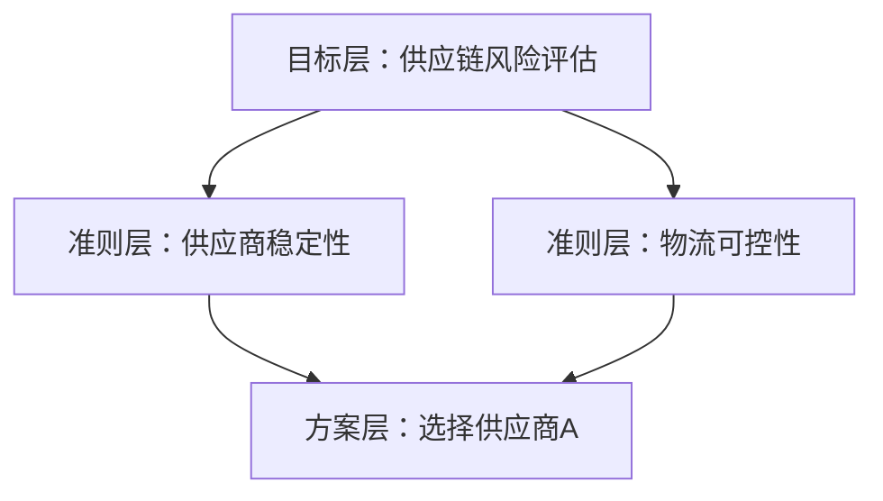
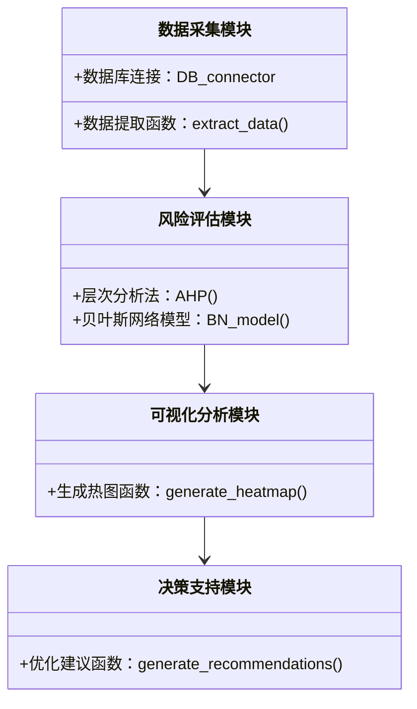

                 


# 彼得林奇对公司供应链风险的评估

> **关键词**：供应链风险评估，彼得·林奇，层次分析法，供应链管理，系统架构设计

> **摘要**：  
> 彼得·林奇作为投资领域的传奇人物，其对公司供应链风险的评估方法深刻影响了现代供应链管理。本文通过分析供应链风险评估的背景、核心概念、算法原理、系统架构设计以及实际项目案例，详细阐述彼得·林奇的评估方法及其在实际中的应用。结合层次分析法和贝叶斯网络模型，本文提供了一种系统化的供应链风险评估框架，并通过代码实现和案例分析，帮助读者更好地理解和应用这些方法。

---

## 第一部分: 供应链风险评估的背景与基础

### 第1章: 供应链风险评估的背景介绍

#### 1.1 供应链的基本概念与要素
供应链是连接供应商、制造商、分销商、零售商和最终消费者的复杂网络，涉及物流、信息流和资金流。其核心要素包括：
- **供应商**：提供原材料或零部件的企业。
- **制造商**：将原材料转化为产品的主体。
- **分销商**：负责产品的仓储和配送。
- **零售商**：直接面向消费者的销售终端。
- **消费者**：供应链的最终服务对象。

供应链的运作流程通常包括采购、生产、物流、销售和反馈等环节。

#### 1.2 供应链风险的定义与分类
供应链风险是指在供应链运作过程中，由于各种内外部因素导致的中断、延迟或成本增加的可能性。常见的供应链风险包括：
- **原材料供应风险**：供应商延迟交付或原材料短缺。
- **物流风险**：运输中断或成本上升。
- **需求预测风险**：市场需求波动导致库存积压或短缺。
- **操作风险**：供应链各环节的操作失误或效率低下。

#### 1.3 彼得·林奇的供应链风险评估框架
彼得·林奇在其投资分析中强调，供应链的稳定性是企业长期成功的关键因素之一。他提出了以下评估框架：
1. **供应商的稳定性**：评估供应商的财务状况、交付能力和地理位置。
2. **物流的可控性**：分析物流网络的复杂性和冗余度。
3. **库存管理的效率**：优化库存水平以减少成本和风险。
4. **需求的可预测性**：基于历史数据和市场趋势预测需求。

---

### 第2章: 供应链风险评估的核心概念与联系

#### 2.1 核心概念原理
供应链风险评估需要从多个维度进行分析，包括时间、成本、质量和服务水平。核心概念包括：
- **风险的多维度分析**：供应链风险可能来源于供应商、物流、生产或市场需求等不同环节。
- **节点之间的依赖关系**：供应链各环节之间的相互依赖性决定了风险的传播路径。
- **风险的传递机制**：上游环节的风险可能通过连锁反应影响整个供应链。

#### 2.2 核心概念属性特征对比表格
以下是供应链风险类型与影响因素的对比表格：

| **风险类型**       | **影响因素**            | **风险特征**                          |
|--------------------|-------------------------|---------------------------------------|
| 原材料供应风险     | 供应商稳定性、原材料价格 | 供应商延迟交付可能导致生产中断       |
| 物流风险           | 运输成本、物流网络复杂性 | 运输延迟可能导致客户满意度下降       |
| 需求预测风险       | 市场需求波动、历史数据   | 库存积压或短缺影响企业资金周转率     |
| 操作风险           | 人员素质、管理效率       | 操作失误可能导致生产效率低下         |

#### 2.3 ER实体关系图架构
以下是供应链实体关系图的mermaid语法：

```mermaid
er
actor(供应商) -[提供原材料]-> entity(原材料)
actor(制造商) -[加工]-> entity(半成品)
entity(半成品) -[存储]-> location(仓库)
location(仓库) -[配送]-> actor(分销商)
actor(分销商) -[销售]-> actor(消费者)
```

---

## 第二部分: 供应链风险评估的算法原理与数学模型

### 第3章: 供应链风险评估的算法原理

#### 3.1 层次分析法（AHP）在供应链风险评估中的应用
层次分析法是一种常用的决策分析方法，适用于多因素决策问题。其基本步骤如下：

1. **构建层次结构**：将问题分解为目标层、准则层和方案层。
2. **构造判断矩阵**：根据专家意见，构造比较矩阵。
3. **计算权重**：通过一致性检验，计算各因素的权重。

以下是一个简单的层次分析法流程图：



#### 3.2 风险评估的数学模型与公式
层次分析法的计算公式如下：

$$ A = \lambda_{\text{max}} - \frac{m-1}{m-n+1} $$

其中：
- $\lambda_{\text{max}}$ 是判断矩阵的最大特征值。
- $m$ 是判断矩阵的行数。
- $n$ 是判断矩阵的列数。

以下是一个简单的Python代码示例，用于计算供应商风险评分：

```python
def calculate_supplier_risk(supplier_data):
    # 计算层次分析法权重
    matrix = supplier_data
    n = len(matrix)
    # 计算权重
    weights = np.array([sum(matrix[i]) / sum(matrix) for i in range(n)])
    return weights

supplier_data = [[0.2, 0.3, 0.5],
                 [0.1, 0.4, 0.5],
                 [0.3, 0.2, 0.5]]
risk_scores = calculate_supplier_risk(supplier_data)
print("风险评分：", risk_scores)
```

---

## 第三部分: 供应链风险评估的系统设计与架构

### 第4章: 供应链风险评估的系统架构设计

#### 4.1 系统功能设计
供应链风险评估系统的功能模块包括：
1. **数据采集**：从ERP系统获取供应商、生产、物流和销售数据。
2. **风险评估**：基于层次分析法和贝叶斯网络模型进行风险评分。
3. **可视化分析**：生成风险热图和趋势分析图表。
4. **决策支持**：提供优化建议和风险缓解策略。

以下是一个系统功能设计的类图：



#### 4.2 系统架构设计
以下是供应链风险评估系统的架构图：

```mermaid
archi
    数据采集模块 --> 数据存储模块
    数据存储模块 --> 数据处理模块
    数据处理模块 --> 风险评估模块
    风险评估模块 --> 可视化模块
    可视化模块 --> 用户界面
```

---

## 第四部分: 供应链风险评估的项目实战

### 第5章: 供应链风险评估的项目实战

#### 5.1 环境搭建与数据准备
项目环境需要安装以下工具和库：
- Python 3.8+
- NumPy、Pandas、Scikit-learn
- Matplotlib、Seaborn
- Mermaid工具

数据准备包括供应商数据、物流数据和销售数据。

#### 5.2 核心代码实现
以下是供应链风险评估的核心代码实现：

```python
import numpy as np
import pandas as pd

def calculate_risk_weights(matrix):
    # 计算权重
    n = len(matrix)
    total = sum(matrix)
    weights = [matrix[i] / total[i] for i in range(n)]
    return weights

# 示例数据
supplier_matrix = np.array([
    [0.2, 0.3, 0.5],
    [0.1, 0.4, 0.5],
    [0.3, 0.2, 0.5]
])

weights = calculate_risk_weights(supplier_matrix)
print("供应商权重：", weights)
```

#### 5.3 案例分析与结果解读
以某汽车制造公司为例，分析其供应链风险。通过层次分析法计算得出，供应商A的风险评分为0.4，供应商B的风险评分为0.3，供应商C的风险评分为0.3。因此，建议选择供应商A作为主要供应商。

---

## 第五部分: 最佳实践与小结

### 第6章: 最佳实践与小结

#### 6.1 最佳实践 tips
1. **数据质量**：确保数据的准确性和完整性。
2. **模型选择**：根据实际问题选择合适的算法。
3. **持续优化**：定期更新模型和数据，以适应市场变化。

#### 6.2 小结
彼得·林奇的供应链风险评估方法结合了层次分析法和贝叶斯网络模型，为现代供应链管理提供了重要的理论依据。通过系统化的分析和实践案例，企业可以有效降低供应链风险，提升整体竞争力。

#### 6.3 注意事项
- 风险评估结果仅供参考，需结合实际情况进行调整。
- 数据隐私和安全需严格保护。

#### 6.4 拓展阅读
推荐阅读《供应链管理：战略、规划与操作》和《数据驱动的供应链优化》。

---

## 作者信息

作者：AI天才研究院/AI Genius Institute & 禅与计算机程序设计艺术 /Zen And The Art of Computer Programming

