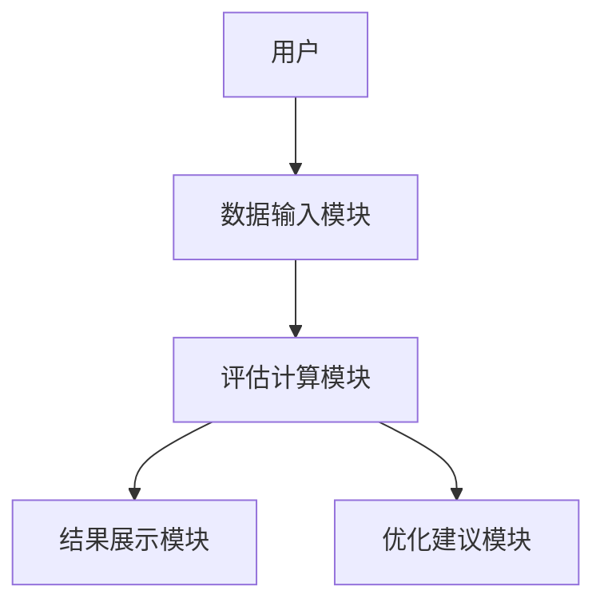
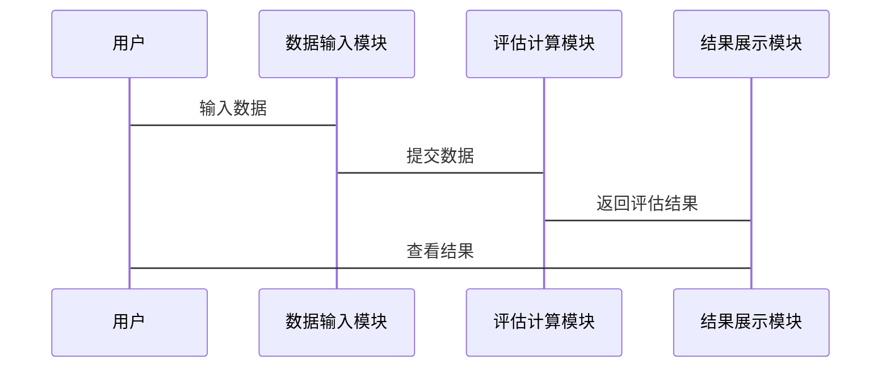

                 


# 彼得林奇对公司全球化战略执行力的评估

> 关键词：彼得·林奇，全球化战略，执行力评估，战略管理，企业分析

> 摘要：本文从彼得·林奇的投资理念出发，探讨如何评估公司全球化战略的执行力。通过分析全球化战略的核心要素、评估模型的设计、系统架构的构建以及实际案例分析，深入解析如何有效评估和优化企业的全球化战略执行过程。

---

## 第一部分：背景介绍

### 第1章：全球化战略与执行力评估的背景

#### 1.1 全球化战略的定义与重要性

全球化战略是指企业在全球范围内配置资源、拓展市场、优化供应链和建立国际化业务的策略。随着经济的全球化，企业必须具备全球化视野，才能在激烈的国际竞争中立于不败之地。全球化战略不仅仅是拓展海外市场，还包括文化整合、风险管理、组织优化等多个方面。

#### 1.2 彼得·林奇与公司评估的独特视角

彼得·林奇是全球著名的投资专家，以其对公司基本面的深入分析而闻名。他认为，一个公司的成功不仅取决于其市场表现，还与其战略执行能力密切相关。在评估公司时，林奇特别关注公司的全球化战略执行情况，认为这直接影响公司的长期发展和投资价值。

#### 1.3 全球化战略执行力评估的背景与意义

在全球化背景下，企业需要面对复杂的国际环境，包括文化差异、政策变化、市场竞争等。如何有效执行全球化战略，成为企业能否在全球市场中获得成功的关键。通过对全球化战略执行力的评估，企业可以识别自身的优劣势，优化资源配置，提升执行效率。

---

## 第二部分：核心概念与联系

### 第2章：全球化战略执行力的核心要素

#### 2.1 全球化战略的执行要素

全球化战略的执行涉及多个关键要素：

1. **战略目标设定**：明确全球市场的目标，包括市场渗透、品牌建设等。
2. **资源配置与整合**：合理分配资金、人才等资源，确保全球化战略的顺利推进。
3. **组织结构与文化适应**：建立适应全球化管理的组织架构，并促进不同文化的融合。
4. **风险管理与应对策略**：识别全球化过程中可能面临的各类风险，并制定应对措施。

#### 2.2 执行力评估的关键指标

评估全球化战略执行力的关键指标包括：

1. **战略目标达成度**：全球市场份额的增长情况。
2. **资源利用效率**：资源投入与实际效果的对比。
3. **组织协调性与文化融合度**：组织内部的协作效率和文化适应能力。
4. **风险管理能力**：应对突发事件和风险的响应速度与效果。

#### 2.3 核心概念的对比分析

| 执行要素                | 特征描述                     |
|-------------------------|------------------------------|
| 战略目标设定            | 长期性、明确性               |
| 资源配置与整合          | 跨界性、协调性               |
| 组织结构与文化适应      | 复杂性、动态性               |
| 风险管理与应对策略      | 预见性、灵活性               |

---

## 第三部分：评估模型与算法原理

### 第3章：全球化战略执行力评估模型

#### 3.1 评估模型的设计原理

评估模型基于以下原则：

1. **全面性**：涵盖全球化战略执行的各个要素。
2. **可量化性**：通过量化指标进行评估。
3. **动态性**：适应全球化环境的变化。

#### 3.2 指标权重的计算方法

指标权重可以通过以下步骤计算：

1. **确定评估指标**：列出关键评估指标。
2. **分配权重**：根据指标的重要性进行权重分配，通常采用线性加权模型。

示例：假设全球化战略执行力评估的指标包括市场份额（权重40%）、利润率（权重30%）、组织协调性（权重20%）和风险管理能力（权重10%）。

$$
\text{总得分} = 0.4 \times \text{市场份额} + 0.3 \times \text{利润率} + 0.2 \times \text{组织协调性} + 0.1 \times \text{风险管理能力}
$$

#### 3.3 执行力评分系统的实现

通过构建评分系统，企业可以量化其全球化战略的执行效果。评分系统包括以下几个步骤：

1. **数据收集**：收集市场份额、利润率等数据。
2. **评分计算**：根据权重计算总得分。
3. **结果分析**：根据得分评估执行效果，并提出改进建议。

---

## 第四部分：系统分析与架构设计

### 第4章：全球化战略执行力评估系统

#### 4.1 系统功能设计

全球化战略执行力评估系统包括以下功能模块：

1. **数据输入模块**：用户输入市场份额、利润率等数据。
2. **评估计算模块**：根据权重计算总得分。
3. **结果展示模块**：以图表形式展示评估结果。
4. **优化建议模块**：基于评估结果提出改进建议。

#### 4.2 系统架构设计

以下是系统架构的mermaid图：



#### 4.3 系统接口设计

系统接口包括：

1. **数据接口**：与企业数据系统对接，获取相关数据。
2. **用户接口**：供用户输入数据和查看结果的界面。

#### 4.4 系统交互流程图

以下是系统交互的mermaid图：



---

## 第五部分：项目实战

### 第5章：全球化战略执行力评估的项目实战

#### 5.1 案例分析

假设某公司计划进入新兴市场，以下是其全球化战略执行评估过程：

1. **环境安装**：安装评估系统软件，连接企业数据系统。
2. **核心代码实现**：实现评估计算模块，包括数据处理和计算逻辑。
3. **代码应用解读**：分析市场份额、利润率等数据，计算总得分。

#### 5.2 核心代码实现

以下是一个评估计算模块的Python代码示例：

```python
def calculate_global_strategy_score(shareholders, profitability, coordination, risk_management):
    weight_shareholders = 0.4
    weight_profitability = 0.3
    weight_coordination = 0.2
    weight_risk_management = 0.1
    
    total_score = (weight_shareholders * shareholders +
                   weight_profitability * profitability +
                   weight_coordination * coordination +
                   weight_risk_management * risk_management)
    return total_score

# 示例数据
shareholders = 0.7
profitability = 0.6
coordination = 0.8
risk_management = 0.5

score = calculate_global_strategy_score(shareholders, profitability, coordination, risk_management)
print(f"全球化战略执行力得分为：{score}")
```

#### 5.3 项目小结

通过实际案例分析，可以发现评估系统能够有效量化全球化战略的执行效果，为企业提供数据支持和改进建议。

---

## 第六部分：最佳实践

### 第6章：全球化战略执行力评估的最佳实践

#### 6.1 小结

全球化战略执行力评估是企业在国际市场中取得成功的关键。通过科学的评估模型和系统的实施，企业可以优化资源配置，提升执行效率。

#### 6.2 注意事项

1. **数据准确性**：确保输入数据的准确性和完整性。
2. **模型适用性**：根据企业的实际情况调整评估模型和权重。
3. **持续优化**：定期评估并优化全球化战略执行过程。

#### 6.3 拓展阅读

推荐阅读彼得·林奇的《投资之道》和《选股的艺术》，深入了解其投资理念和公司评估方法。

---

## 作者：AI天才研究院/AI Genius Institute & 禅与计算机程序设计艺术 /Zen And The Art of Computer Programming

---

通过以上内容，您可以系统地了解彼得·林奇的全球化战略执行力评估方法，并将其应用于实际的企业管理中。

