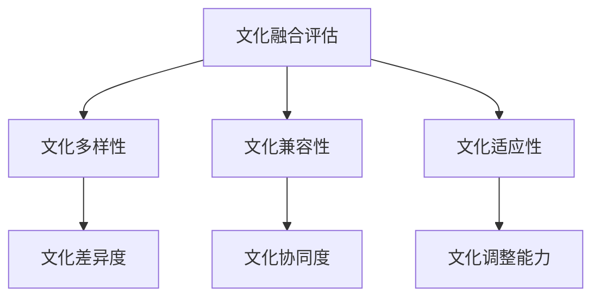
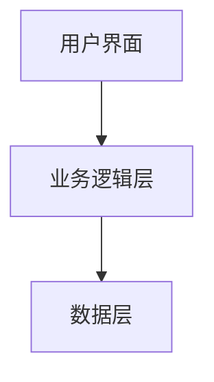

                 


# 彼得林奇对公司全球化战略的文化融合评估

> 关键词：全球化战略，文化融合，彼得林奇，评估模型，系统架构

> 摘要：本文以彼得·林奇的投资理念为基础，分析了全球化战略中文化融合的重要性，并提出了文化融合评估模型。文章从全球化战略的背景出发，详细阐述了文化融合的核心概念、算法原理、系统架构设计、项目实战及最佳实践。

---

## 第1章: 全球化战略的背景与重要性

### 1.1 全球化战略的定义与特点

全球化战略是指企业在全球范围内进行资源配置、市场拓展和价值创造的战略。其核心特点包括：

1. **全球性**：企业在全球范围内布局，突破地域限制。
2. **多样性**：涉及不同国家和地区的市场、法规和文化。
3. **协同性**：通过资源整合实现全球化协同效应。
4. **动态性**：全球化战略需要不断调整以应对变化。

### 1.2 文化融合的重要性

文化融合是全球化战略成功的关键因素之一。文化融合不仅能够减少跨文化冲突，还能提升团队协作效率和企业创新能力。彼得·林奇认为，文化融合是企业在全球化过程中实现长期成功的重要基石。

---

## 第2章: 彼得·林奇的全球化战略评估方法

### 2.1 彼得·林奇的投资者背景

彼得·林奇是全球著名投资经理人，以其独特的投资理念闻名。他的全球化视野和对文化融合的重视，为企业的全球化战略提供了重要启示。

### 2.2 彼得·林奇的全球化战略评估框架

彼得·林奇提出了一个文化融合评估框架，包括以下核心维度：

1. **文化多样性**：评估企业在全球范围内是否能够适应不同文化的差异。
2. **文化兼容性**：评估不同文化之间的互补性和协同性。
3. **文化适应性**：评估企业能否在不同文化环境中灵活调整策略。

---

## 第3章: 全球化战略的文化融合核心概念

### 3.1 文化融合的定义与特点

文化融合是指企业在全球化过程中，通过吸收和整合不同文化元素，形成新的文化形态。其特点包括：

1. **多样性**：融合多种文化元素。
2. **互补性**：不同文化之间的相互补充。
3. **动态性**：文化融合是一个持续的过程。

### 3.2 文化融合与全球化战略的关系

文化融合是全球化战略的重要组成部分，它不仅影响企业的市场表现，还影响企业的组织结构和管理模式。彼得·林奇认为，文化融合是全球化战略成功的关键。

---

## 第4章: 文化融合评估的核心算法原理

### 4.1 文化融合评估的算法原理

文化融合评估模型基于层次分析法（AHP）构建，其核心步骤如下：

1. **目标层**：文化融合评估。
2. **准则层**：文化多样性、文化兼容性、文化适应性。
3. **指标层**：具体评估指标。

**算法流程图：**



### 4.2 文化融合评估的数学模型

文化融合评估模型的数学表达式如下：

$$
C = \alpha D + \beta C + \gamma A
$$

其中：
- \( C \) 表示文化融合指数。
- \( D \) 表示文化多样性。
- \( C \) 表示文化兼容性。
- \( A \) 表示文化适应性。
- \(\alpha\), \(\beta\), \(\gamma\) 表示权重系数。

---

## 第5章: 全球化战略的文化融合评估系统分析

### 5.1 系统分析与架构设计

#### 5.1.1 问题场景介绍

企业在全球化过程中，需要评估不同文化环境下的融合能力。通过构建文化融合评估系统，企业可以量化文化融合的水平，并制定相应的战略。

#### 5.1.2 系统功能设计

系统功能包括：
1. **数据输入**：收集文化多样性、兼容性和适应性数据。
2. **模型计算**：使用文化融合评估模型计算融合指数。
3. **结果输出**：生成文化融合报告。

#### 5.1.3 系统架构设计

系统架构包括：
1. **数据层**：数据存储和管理。
2. **业务逻辑层**：模型计算和逻辑处理。
3. **用户界面层**：数据输入和结果展示。

**系统架构图：**



### 5.2 系统实现与案例

#### 5.2.1 环境安装

需要安装Python和相关库（如numpy和pandas）。

#### 5.2.2 核心代码实现

```python
import numpy as np
import pandas as pd

def cultural_integration_score(diversity, compatibility, adaptability):
    alpha = 0.4
    beta = 0.3
    gamma = 0.3
    return alpha * diversity + beta * compatibility + gamma * adaptability

# 示例数据
diversity = 0.8
compatibility = 0.7
adaptability = 0.9

score = cultural_integration_score(diversity, compatibility, adaptability)
print("文化融合指数:", score)
```

---

## 第6章: 项目实战与最佳实践

### 6.1 环境安装与代码实现

安装Python和相关库，运行上述代码，输出文化融合指数。

### 6.2 案例分析

以某跨国公司为例，计算其文化融合指数，并提出改进建议。

### 6.3 最佳实践

1. **文化培训**：定期进行跨文化培训，提升员工的文化敏感性。
2. **文化适应**：在不同文化环境中灵活调整策略。
3. **持续评估**：定期评估文化融合指数，及时优化。

---

## 第7章: 总结与展望

### 7.1 总结

彼得·林奇的全球化战略文化融合评估方法为我们提供了重要的启示。通过构建文化融合评估模型和系统，企业可以更好地应对全球化挑战。

### 7.2 展望

未来，随着全球化深入发展，文化融合评估将变得更加重要。建议企业进一步优化评估模型，并结合人工智能技术提升评估效率。

---

## 作者

作者：AI天才研究院/AI Genius Institute & 禅与计算机程序设计艺术 /Zen And The Art of Computer Programming

